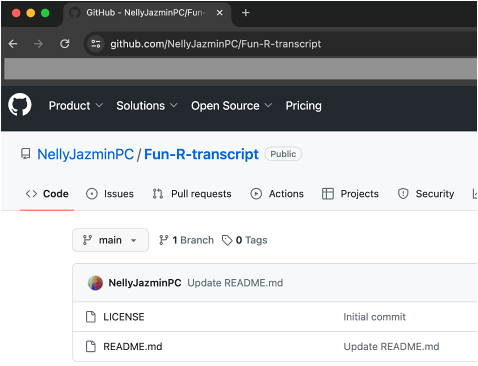

# CURSO: Fundamentos de Programación en R para análisis transcriptómicos

### INSTRUCTORES:
- Dr. Jorge E. Campos Contreras
    - jorge.campos@iztacala.unam.mx
- Dr. Hector Salgado Ortiz
    - bio.h.salgado@gmail.com
- M. en C. Olga Andrea Hernández Miranda
    - andii.manch@gmail.com
- M. en C. Nelly Jazmín Pacheco Cruz
    - nelly.pacheco.cruz@iztacala.unam.mx
  
----- 
### OBJETIVO GENERAL 

El participante conocerá los fundamentos de programación en R para su aplicación en análisis transcriptómicos. 

---- 
### OBJETIVOS ESPECÍFICOS

Comprender los fundamentos de programación en R para el análisis de datos biológicos.
Conocer los fundamentos teóricos del campo de estudio de la transcriptómica y sus principales análisis desde el lenguaje de programación R.  

----

**ENCUADRE**    

El curso se ofrecerá en la modalidad presencial con cuatro horas de lunes a viernes durante dos semanas (40h).

---
### TEMARIO 

- **FUNDAMENTOS DE PROGRAMACIÓN EN R**
  - **Unidad 1** *(Lunes 17 de Junio)*
    - Introducción a R
    - Uso R Studio
    - Funciones
    - Estructuras de datos: Vectores, matrices, arreglos, marcos de datos y listas
    - Lectura y guardado de datos

  - **Unidad 2** *(Martes 18 de Junio)*
    - Manipulación y arreo de datos en R
    - Indicación y subconjuntos
    - Unión de dataframes
    - Paso de formato largo a formato ancho
    - Uso de tidyverse: tidyr, dplyr, magrittr y forcats

  - **Unidad 3** *(Miércoles 19 de Junio)*
    - Gráficos en R
    - Generación de gráficos sencillos
    - Generación de gráficos complejos
    - Modificando las características de los gráficos
    - Múltiples figuras en un mismo gráfico. librería ggplot

  - **Unidad 4** *(Jueves 20 de Junio)*
    - Limpieza de datos
    - Estadística inferencial 

  - **Unidad 5** *(Viernes 21 de Junio)*
    - Estadística multivariada: LM, GLMs y GLMMs librería tidy, librería broom 

  - **Unidad 6** *(Lunes 24 de Junio)*
    - Análisis de agrupamiento
    - Componentes principales
    - Presentación de resultados en Rmarkdown 

- **ENFOQUE EN TRANSCRIPTÓMICA**

  - **Unidad 7** *(Martes 25 de Junio)*
    - Secuenciación masiva
    - RNA-seq 

  - **Unidad 8** *(Miércoles 26 de Junio)*
    - Flujo de trabajo
    - Expresión diferencial

  - **Unidad 9** *(Jueves 27 de Junio)*
    - Gráficos y visualización de resultados
    - Material: Se propone realizarlo en fundación UNAM con apoyo de un cañón para proyectar los scripts.

  - **Unidad 10** *(Viernes 28 de Junio)*
    - Exposiciones de sus proyectos finales
    - Aplicaciones reales y dudas 2 horas
   
-----

### DINÁMICA DEL CURSO:

- Curso teórico y práctico
- Horario: 9:00-13:00. Receso intermedio.
- Proyecto final: equipos de 4-5 personas. Presentación el viernes 28 de junio

- Todos los materiales de la clase estarán disponibles en este repositorio de Github https://github.com/NellyJazminPC/Fun-R-transcript

---
### Antes de empezar

- **¿Qué es [Github](https://github.com/)?**  

GitHub es una **plataforma en línea** que facilita el desarrollo colaborativo de software.  
Permite a los desarrolladores **trabajar juntos** en proyectos de software al **alojar y compartir código fuente**, realizar seguimiento de problemas, proponer y revisar cambios, y colaborar en el desarrollo de aplicaciones y proyectos.

En resumen es una **plataforma de desarrollo colaborativo** y de **acceso gratuito** (con límite de acciones y repositorios privados)

- **¿Por qué usar Github?**

1. **Transparencia y reproducibilidad:** Al alojar el código y los datos en GitHub, los estudiantes pueden crear un registro transparente de su trabajo bioinformático. Esto facilita la revisión y la reproducción de los análisis realizados, lo que contribuye a la transparencia y la reproducibilidad de los resultados.
1. **Colaboración y trabajo en equipo:** GitHub facilita la colaboración, permitiendo que múltiples personas trabajen juntas en proyectos de bioinformática. Por ejemplo, los estudiantes pueden compartir código, datos y documentos de manera eficiente, lo que fomenta el trabajo en equipo y la colaboración.
3. **Comentarios y retroalimentación:** GitHub proporciona herramientas para que los estudiantes y el profesor comenten y revisen el código y los documentos compartidos. Esto facilita la comunicación y la retroalimentación, lo que puede mejorar la comprensión y la calidad del trabajo realizado.
4. **Gestión de proyectos:** GitHub ofrece funciones de gestión de proyectos, como tableros Kanban y seguimiento de problemas, que pueden ser útiles para organizar las tareas y el progreso del trabajo bioinformático. Por ejemplo, los estudiantes pueden utilizar estas herramientas para administrar sus proyectos y seguir el estado de las actividades asignadas.
5. **Control de versiones:** GitHub utiliza Git como sistema de control de versiones, lo que permite realizar un seguimiento de los cambios en el código y los archivos de datos a lo largo del tiempo. Esto facilita la gestión de proyectos y la reversión a versiones anteriores en caso de errores o cambios no deseados.

En resumen, GitHub proporciona una plataforma robusta y colaborativa que puede mejorar significativamente la experiencia de aprendizaje al facilitar la colaboración, el control de versiones, la transparencia, la retroalimentación y la gestión de proyectos.

---
- **¿Qué necesitamos?**
  - Computadora personal
  - Windows 10. 4GB RAM
  - MacOS  > x10.11
  - Linux - Ubuntu
- Espacio libre en disco duro, mínimo 30 GB.
- Tener instalado R y Rstudio. _Puedes descargarlo desde_ https://posit.co/download/rstudio-desktop/

Puedes avanzar con la instalación de los siguientes paquetes que utlizaremos a lo largo del curso: (en progreso)
- ggplot2
- tidyr

---
### Fuentes de información recomendadas:
- [Para instalación de R y Rstudio](https://swcarpentry.github.io/r-novice-gapminder-es/index.html) 
- [Documentación en la página oficial de GitHub](https://docs.github.com/es)

- [Aprende Git y GitHub - Curso desde Cero (Youtube)](https://www.youtube.com/watch?v=mBYSUUnMt9M)
