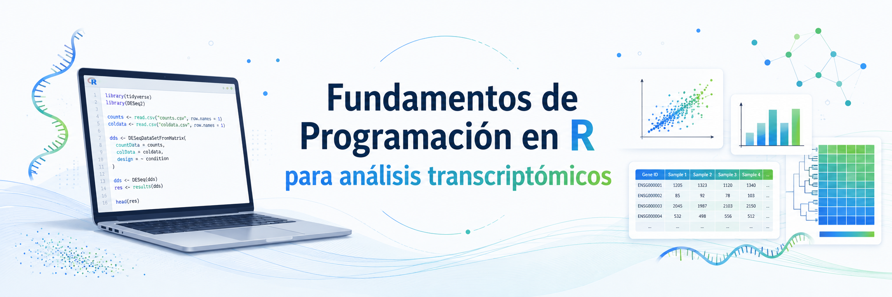
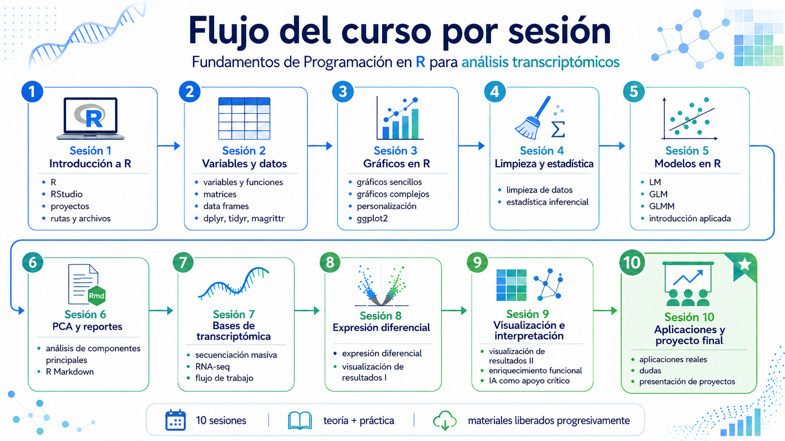
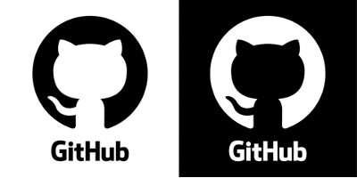
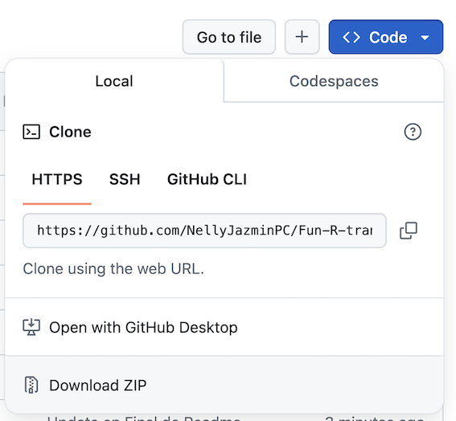
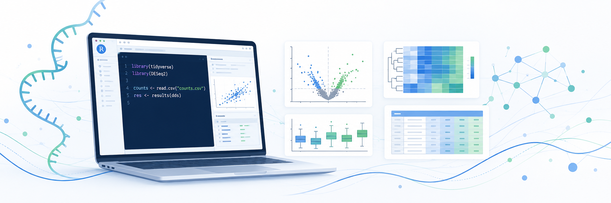

# Fundamentos de Programación en R para análisis transcriptómicos



Curso presencial teórico-práctico orientado al uso de **R** y **RStudio** para el análisis, visualización e interpretación de datos biológicos, con énfasis en aplicaciones introductorias al análisis transcriptómico.

Este repositorio contiene los materiales del curso: documentos de apoyo, scripts, datos de ejemplo, prácticas y recursos complementarios.

---

## Instructores

- **Dr. Jorge E. Campos Contreras**  
  jorge.campos@iztacala.unam.mx

- **Dr. Héctor Salgado Ortiz**  
  bio.h.salgado@gmail.com

- **Dra. María Teresa Ortiz Melo**  
  teresaortiz@iztacala.unam.mx

- **M. en C. Nelly Jazmín Pacheco Cruz**  
  nelly.pacheco.cruz@iztacala.unam.mx

---

## Objetivo general

El participante conocerá los fundamentos de programación en R para su aplicación en análisis transcriptómicos.

---

## Objetivos específicos

- Comprender los fundamentos de programación en R para el análisis de datos biológicos.
- Aplicar herramientas básicas de R para importar, organizar, limpiar, analizar y visualizar datos.
- Conocer los fundamentos generales de la transcriptómica y algunos de sus principales flujos de análisis desde R.
- Desarrollar criterios básicos para interpretar resultados, revisar código y comunicar análisis de manera reproducible.

---

## Modalidad, duración y horario

- **Modalidad:** presencial.
- **Duración:** 40 horas.
- **Periodo:** dos semanas, de lunes a viernes, del 15 al 26 de junio.
- **Horario:** 10:00 a 14:00 h.
- **Receso:** intermedio.

El curso combina explicaciones breves, demostraciones guiadas, ejercicios prácticos en R y discusión de resultados.

---

## ¿Cómo usaremos este repositorio?

Este repositorio será el espacio principal para organizar y compartir los materiales del curso.

Para facilitar el seguimiento, los materiales se liberarán de manera progresiva. Al inicio de cada sesión se indicará qué carpeta, archivo o enlace deberán utilizar los participantes. No es necesario descargar ni revisar todo el repositorio desde el primer día.

Durante el curso usaremos GitHub principalmente para:

- consultar materiales de cada sesión;
- descargar scripts y datos de ejemplo;
- mantener una estructura ordenada de trabajo;
- favorecer la reproducibilidad de los análisis.

No es necesario tener experiencia previa con GitHub. En cada sesión se indicará qué archivos abrir o descargar.

---

## Estructura general del curso

El curso está organizado en dos bloques:

1. **Fundamentos de programación en R**  
   Introducción a R, RStudio, proyectos, rutas, estructuras de datos, manipulación, visualización, limpieza de datos, análisis estadísticos básicos, PCA y reportes reproducibles.

2. **Enfoque en transcriptómica**  
   Introducción a RNA-seq, flujo general de análisis, expresión diferencial, visualización de resultados, enriquecimiento funcional y reflexión crítica sobre el uso de IA en R y bioinformática.

---

## Temario por sesión

Los materiales se liberarán progresivamente. Al inicio de cada sesión se indicará qué archivos deberán abrirse o descargarse.

### Semana 1. Fundamentos de programación en R

| Unidad | Fecha                 | Tema general                                               | Materiales de apoyo                                                                                                                                                                                                                                                          |
| :----: | --------------------- | ---------------------------------------------------------- | ---------------------------------------------------------------------------------------------------------------------------------------------------------------------------------------------------------------------------------------------------------------------------- |
|    1   | Lunes 15 de junio     | Introducción a R y RStudio                                 | [1.1 Introducción a R](doc/Unidad_01/U1_1_Intro_R.md)<br>[1.2 Uso de RStudio](doc/Unidad_01/U1_2_Rstudio.md)<br>[1.3 Generación de proyectos](doc/Unidad_01/U1_3_Gestion_proyectos.md)<br>[1.4 Rutas, abrir y guardar archivos](doc/Unidad_01/U1_4_Leer_guardar_archivos.md) |
|    2   | Martes 16 de junio    | Variables, funciones y estructuras de datos                | Materiales por liberar                                                                                                                                                                                                                                                       |
|    3   | Miércoles 17 de junio | Gráficos en R                                              | Materiales por liberar                                                                                                                                                                                                                                                       |
|    4   | Jueves 18 de junio    | Limpieza de datos e introducción a estadística inferencial | Materiales por liberar                                                                                                                                                                                                                                                       |
|    5   | Viernes 19 de junio   | Modelos estadísticos en R: LM, GLMs y GLMMs                                  | Materiales por liberar                                                                                                                                                                                                                                                       |

### Semana 2. Análisis, reportes y enfoque transcriptómico

| Unidad | Fecha                 | Tema general                                  | Materiales de apoyo    |
| :----: | --------------------- | --------------------------------------------- | ---------------------- |
|    6   | Lunes 22 de junio     | PCA y reportes reproducibles                  | Materiales por liberar |
|    7   | Martes 23 de junio    | Introducción a transcriptómica                | Materiales por liberar |
|    8   | Miércoles 24 de junio | Expresión diferencial                         | Materiales por liberar |
|    9   | Jueves 25 de junio    | Visualización, enriquecimiento funcional e IA | Materiales por liberar |
|   10   | Viernes 26 de junio   | Aplicaciones reales y cierre                  | Materiales por liberar |

---



---
## Uso breve y crítico de IA

En algunas sesiones se podrá cerrar con un **mini prompt de IA** de máximo 20 minutos.

La dinámica será:

1. Primero se trabajará el script en clase sin IA.
2. Después se usará IA para una tarea pequeña y verificable.
3. Finalmente se revisará si la respuesta tiene sentido con el código, los datos y la documentación.

**La IA se usará como apoyo para explorar y revisar, no como sustituto de la práctica en R ni de la interpretación biológica**.

---

## Proyecto final

El proyecto final se realizará en **equipos de 4 a 5 personas** y se presentará el **viernes 26 de junio**.

Cada equipo podrá elegir una de las siguientes opciones:

- elaborar un tutorial con datos del curso;
- elaborar un tutorial con datos propios;
- proponer una adaptación de alguno de los análisis realizados durante el curso usando datos propios.

Para el cierre de la primera semana, cada equipo deberá tener definido:

- integrantes del equipo;
- tema general del proyecto;
- tipo de datos que utilizarán;
- análisis o flujo de trabajo que desean presentar.

La **rúbrica del proyecto final** estará disponible [aquí](https://docs.google.com/presentation/d/e/2PACX-1vSerGawHdg5XaqcxUnH-8HjjCqR9_ecevd2sKj1tHlLcfkTSCv-1QYXZktQLBQMdQ/pub?start=false&loop=false&delayms=60000) en el repositorio.

---

## Antes de empezar

### ¿Qué es GitHub?



GitHub es una plataforma en línea que permite alojar, compartir y organizar archivos de proyectos de programación, análisis de datos y documentación.

En este curso lo usaremos como un repositorio de materiales. Un repositorio es un espacio donde se guardan archivos relacionados con un proyecto.

### ¿Cómo descargar materiales?

Cuando se indique en clase, podrán descargar los archivos necesarios desde este repositorio.

Una forma sencilla de hacerlo es:

1. Entrar al repositorio del curso.
2. Hacer clic en el botón **Code**.
3. Seleccionar **Download ZIP**.
4. Descomprimir el archivo en una carpeta local de su computadora.



También se podrán descargar archivos específicos conforme se vayan liberando en cada sesión.

---

## Requisitos técnicos

Para participar en el curso se recomienda contar con:

- computadora personal;
- sistema operativo Windows, macOS o Linux;
- al menos 4 GB de RAM;
- al menos 30 GB de espacio libre en disco;
- conexión a internet;
- R instalado;
- RStudio instalado.

Pueden descargar R y RStudio desde:

<https://posit.co/download/rstudio-desktop/>

---

## Instalación de paquetes

Durante el curso utilizaremos distintos paquetes de R. La instalación se organizará por unidad para evitar instalar paquetes innecesarios desde el primer día.

La instalación podrá realizarse de forma guiada durante las sesiones, pero se recomienda revisar con anticipación que R y RStudio abran correctamente.

> **Nota:** Los bloques de código se irán actualizando conforme se liberen los materiales de cada unidad.

### Unidad 1. Introducción a R y RStudio

Para la Unidad 1 se utilizarán principalmente funciones básicas de R. No se requiere instalar paquetes adicionales.

```r
# Unidad 1
# No se requiere instalación adicional.
```

### Unidad 2. Variables, funciones y estructuras de datos

```r
# Unidad 2
# Código de instalación por liberar.
```

### Unidad 3. Gráficos en R

```r
# Unidad 3
# Código de instalación por liberar.
```

### Unidades 4 y 5. Limpieza de datos, estadística inferencial y modelos en R

```r
# Unidades 4 y 5 
install.packages(c( "tidyverse", "magrittr", "dslabs", "ggrepel", "psych", "broom", "readxl", "lme4", "car", "nlme", "patchwork", "marginaleffects", "MPV" ))
```

### Unidad 6. PCA y reportes reproducibles

```r
# Unidad 6
# Código de instalación por liberar.
```

### Unidad 7. Introducción a transcriptómica

```r
# Unidad 7
# Código de instalación por liberar.
```

### Unidad 8. Expresión diferencial

Algunos paquetes especializados podrán instalarse desde Bioconductor durante esta unidad.

```r
# Unidad 8
# Código de instalación por liberar.
```

### Unidad 9. Visualización, enriquecimiento funcional e IA

```r
# Unidad 9
# Código de instalación por liberar.
```

### Unidad 10. Aplicaciones reales y cierre

No se espera instalar paquetes nuevos, salvo que el proyecto de cada equipo lo requiera.

```r
# Unidad 10
# No se espera instalación adicional.
```

### Paquetes de Bioconductor

Para instalar paquetes de Bioconductor, primero se requiere instalar `BiocManager`:

```r
install.packages("BiocManager")
```

Después se podrán instalar los paquetes especializados indicados por los instructores en la unidad correspondiente. Por ejemplo:

```r
BiocManager::install(c(
  "DESeq2",
  "EnhancedVolcano"
))
```

---

## Fuentes de información recomendadas

- Instalación e introducción a R:  
  <https://swcarpentry.github.io/r-novice-gapminder-es/index.html>

- Documentación oficial de GitHub:  
  <https://docs.github.com/es>

- Aprende Git y GitHub. Curso desde cero:  
  <https://www.youtube.com/watch?v=mBYSUUnMt9M>

- RNASeq Workshop R-Bioconductor:  
  <http://biocluster.ucr.edu/~rkaundal/workshops/R_mar2016/RNAseq.html>

---

## Recomendación final

Antes de la primera sesión, se recomienda:

- instalar R y RStudio;
- abrir RStudio para verificar que funcione;
- crear una carpeta local para guardar los materiales del curso;
- revisar este repositorio al inicio de cada sesión para identificar los archivos indicados por los instructores.

