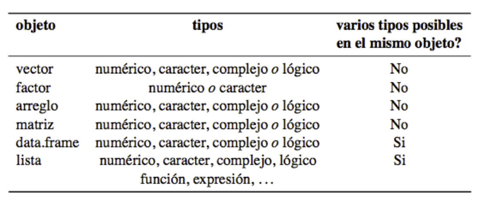

Try executing this chunk by clicking the *Run* button within the chunk or by placing your cursor inside it and pressing *Cmd+Shift+Enter*.

When you save the notebook, an HTML file containing the code and output will be saved alongside it (click the *Preview* button or press *Cmd+Shift+K* to preview the HTML file).

# Estructuras de datos y su manipulación

-   Tipos de Estructuras de Datos

    -   Aspectos Básicos

    -   Vectores

    -   Factores

    -   Matrices

    -   Marcos de Datos

    -   Listas

-   Manipulación de Datos

    -   Aspectos Básicos

    -   reshape2

    -   tidyr

    -   dplyr

    -   magrittr

    -   Leer y guardar archivos

    -   Referencias

## Estructura de Datos: Vectores

**Definición**

La estructura más sencilla de R, contiene una fila de valores del mismo tipo (numérico o cadena de texto)

Se construye con `c()`

Los elementos en el vector se referencian con corchetes `[i]`

**Ejemplo:**

```{r}
v <- c(5,10,15,20) 
v+1
v+v
v <- c("a","b","c","d") 
v[1]
v[1:3]
v[c(1,4)]
```

**Usos**

Los vectores numéricos son útiles para cálculos sencillos:

`mean ()` `sd()` `max()` `min()` `length ()`

**Ejercicio** Considera los vectores x y y:

```{r}
x <- c(4,6,5,7,10,9,4,15) 
y <- c(0,10,1,8,2,3,4,1)
```

Que pasa con:

```{r}
x+y 
x >7
c(x,y)
length(x)
```

## Estructuras de Datos: Factores

**Definición**

-   Un vector cuyos valores están organizados en categorías

-   Las categorías se llaman ***levels*** y son valores de texto

-   Esta nueva capa de información es útil para calcular estadísticos descriptivos

**Ejemplo**

```{r}
meses_mix <- c("Enero","Febrero","Marzo","Marzo",
          "Abril","Enero","Abril","Mayo",
          "Junio","Agosto","Julio","Julio",
          "Noviembre","Febrero","May","Agosto",
          "Julio","Diciembre","Enero","Agosto","Septiembre",
          "Noviembre","Febrero","Abril")
fmeses_mix <- factor(meses_mix) 
table(fmeses_mix)
```

**Usos**

```{r}
pesos <- rnorm(n=100,mean=50,sd=10) 
fpesos <- cut(pesos,breaks=3)
table(fpesos)
fpesos <- cut(round(pesos), breaks=quantile(pesos, probs = seq(0, 1, 0.25)), labels=c("1stQ","2ndQ","3rdQ","4thQ"))
# advertencia: produce valores NA para los outliers 
table(fpesos)

```

**Ejercicio**

Considera el factor:

```{r}
x <- factor(c("bajo", "alto", "medio", "alto", "alto" , "bajo", "medio"))

```

**Ejercicio**

Obtén la frecuencia de cada valor

Agrega un valor "muy alto" y haz que aparezca como nivel (tip: append(); de que tipo es levels()?)

Cambia los valores de "bajo" por "no satisfactorio" (tip: levels())

Nota extra: Evitemos los espacios en blanco en los nombres de las variables. Podemos usar guiones bajos "muy_alto" o separar usando mayúsculas "muyAlto". Evitemos usar acentos y caracteres especiales y la ñ.

<https://platzi.com/blog/buena-practica-codigo-nombrar-elementos/>

**Soluciones**

Agrega un valor "muy alto":

```{r}
#levels(x)
append(x=levels(x),values="muy_alto",after=length(x))
#x
```

Cambia los valores de "bajo" por "no satisfactorio":

```{r}
levels(x)[2] <- "no_satisfactorio"
levels(x)
#x
```

## Estructuras de Datos: Matrices

**Definición**

Son estructuras que pueden contener información del mismo tipo (numérica o cadena de texto) en dos o más dimensiones (arreglos) Se construyen con: `matrix ( )`

```{r}
?matrix
```

Elementos en la matriz se referencian usando corchetes y comas: `[i,j]`

**Ejemplo**

```{r}
m <- matrix (1:12 , ncol =3)
m <- matrix(1:12,ncol=3,byrow=TRUE)
# m[3,4] # qué pasa? intentar ejecutar sin el # 
m #para ver la matriz completa
dim(m) # para saber sus dimensiones, concuerda?
m[4,3] #elemento de la fila 4, columna 3
m[,3] #todos los elementos de la columna 3
m[4,] #todos los elementos de la fila 4
m
m+1 
m+m
m
```

Arreglos (*Arrays*): matrices de n dimensiones `[i,j,k]`

[](http://venus.ifca.unican.es/Rintro/dataStruct.html)

**Usos**

```{r}
m * m #multiplicacion por elemento
m %*% t(m) #multiplicacion de matrices > diag(m) #crea vector de una matriz
diag(m[3,]) #crea matriz de un vector > rowSums(m)
colMeans(m)

```

**Ejercicio**

-   Crea un vector con 12 enteros

-   Conviértelo en una matriz de 43 usando `matrix()`

-   Cambia los nombres de las columnas a `x, y, z` y las filas a `a, b, c, d`

    *tip:* `colnames()` *y* `rownames()`

-   Obtén una matriz de 3x3 a partir de la matriz previa

-   Revisa las dimensiones de `m` con `dim()`

**Soluciones**

```{r}
#Crea un vector con 12 enteros y conviértelo en una matriz de 4*3
m <- matrix (1:12 , nrow =4)
m
#Cambia los nombres de las columnas y filas
colnames(m) <- c("x","y","z")
rownames(m) <- c("a","b","c","d")
m

#Obtén una matriz de 3*3
m[1:3,1:3]

#Dimensiones de m
dim(m) 

```

## Estructuras de Datos: Marco de Datos

**Definición:**

Estructuras que pueden combinar argumentos numéricos y de cadena de texto dentro de la misma entidad.

Se construyen con: `data.frame()`

Se pueden referir las columnas (o componentes) usando corchetes o con el operador compacto `$`

**Ejemplo:**

```{r}
df <- data.frame(distance=c(4,4,4,7,8,5), condition=c("a","a","a","b","b","b"))
df
df[1]
df["distance"]
df["distance"][1,1] 
df$condition
df$condition[1]
head(df)
tail(df)

```

**Usos:**

-   Muy similar a una hoja de cálculo estándar

-   Uso de cabeceras (headers) significativos =\> componentes del dataframe `df`

-   Se pueden modificar los nombres de filas y columnas

-   Se pueden unir dfs con: `cbind ()` y `rbind ()`

**Ejercicio:**

-   Crea un df con los siguientes datos

```{r}
edad <- c(22, 25, 18, 20)
edad
nombres <- c("Jaime", "Mateo", "Olivia", "Sandra") 
nombres
genero <- c("M", "M", "F", "F")
genero
```

-   Ordena los valores por edad\
    *tip:* `order()`

**Soluciones:**

-   Crea un df

```{r}
df <- data.frame(edades=edad,names_df=nombres,genero=genero)
df
```

-   Ordena los valores por edad (age)\
    *tip:* `order()`

```{r}
df[order(df$edades),]
```

## Estructuras de Datos: Listas

**Definición:**

-   Una estructura de datos que puede contener todos los demás tipos

-   Se construye con `list ()`

-   Cada componente se encuentra usando

    -   `$` si los componentes tienen nombre

    -   `[i]` para accesar al componente como elemento de lista

    -   `[[i]]` para accesar al componente como vector

**Ejemplo:**

```{r}
vec <- 1:5
vec
df <- data.frame(y = c(1:3), x = c("m", "m", "f")) 
df
char <- "Hola!"
char
```

```{r}
a.list <- list(vec, df, char)
a.list
# a.list[1] + 1 # no funciona! porque?
a.list[[1]] + 1
str(a.list) # ver estructura de la lista
```

**Usos:**

Guardar elementos de distinto tamaño, por ejemplo, varias hojas de cálculo en distintos formatos.

Los componentes pueden ser fácilmente agregados o removidos de la lista:

```{r}
a.list
a.list[[length(a.list) + 1]] <- "Adios..." 
a.list

a.list[length(a.list)] <- NULL
a.list
```

En la siguiente lista:

```{r}
w <- c(2, 7, 8)
v <- c("A", "B", "C") 
x <- list(w, v)
```

-   Reemplaza el valor de "A" con "Z"

-   Agrega un elemento al final de la lista:

```{r}
y <- c("M", "M", "F")
```

**Soluciones:**

Reemplaza el valor de "A" con "Z"

```{r}
x
x[[2]][1] <- "Z"
x
```

Agrega un elemento al final de la lista:

```{r}
x
y
x[length(x)+1] <- y
x
x[length(x)] <- y
```

## Estructuras de Datos: Resumen



## Manipulación de Datos: Aspectos Básicos

Información de estructuras y conversión

-   Para averiguar con qué tipo de estructura estamos trabajando:

is.\*(): is.vector(), is.list(): TRUE/FALSE

-   Para convertir una estructura de un tipo a otro:

as.\*(): as.vector(), as.matrix()

-   Remover la clase a una estructura:

mode(), class(), unclass()

## Manipulación de Datos: Transposicionar

Rotamos matrices de manera que las columnas se vuelven filas o viceversa

```{r}
matriz <- matrix(1:12, nrow = 4)
matriz
t(matriz)
```

## Manipulación de Datos: `apply( )`

Operaciones rápidas con `lapply()` y `sapply()`

-   `lapply()`, aplica una FUN a cada elemento de la lista, regresa una lista:

```{r}
a.list <- list(c(1:4), c(10:25), c(35:40))
a.list
lapply(a.list,mean)
lapply(a.list,sum)
lapply(a.list,function(x) x/2-round(x/2) == 0)
```

-   `sapply()` aplica una FUN a cada elemento de la lista, regresa un vector:

```{r}
sapply(a.list,mean) 
sapply(a.list,sum)
```


