# Fundamentos de programación en R

## Unidad 1

---

## 1.2 Uso de Rstudio

---

### R - el lenguaje de programación

Podemos entrar a la consola de R desde la terminal de la computadora. Si ya lo tienes instalado solo necesitas teclear `R` y dar `Enter`.

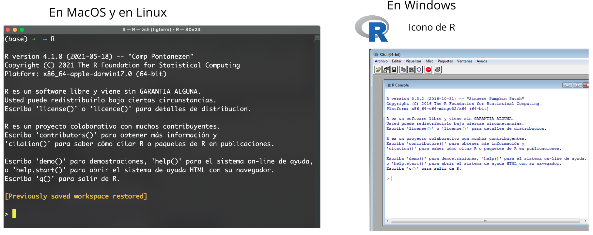


#### Tips:

- **Cancelar comandos**: si usas R desde la línea de comandos, desde la consola o terminal en lugar de estar en el editor de RStudio y quieres cancelar el proceso, debes usar `Ctrl` + `C` en lugar de **Esc** para detener todo. 

R es un lenguaje de programación y su entorno puede llegar a ser dificil manejar desde la terminal o en su ambiente de consola.

## Aquí es donde surge Rstudio


[RStudio](https://posit.co/download/rstudio-desktop/) es un entorno de desarrollo integrado y gratuito de código abierto, proporciona un **editor incorporado**, funciona **en todas las plataformas** (incluso en servidores) y ofrece muchas ventajas, como la integración de control de versiones y gestión de proyectos.

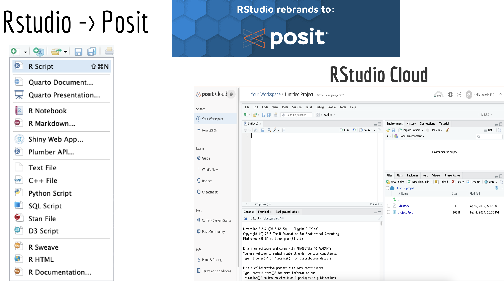

R, el lenguaje de programación es la base.
RStudio, es una interfaz gráfica que nos ayuda a trabajar con R pero desde un ambiente amigable para el usuario.
RStudio Cloud, es RStudio en línea donde la principal ventaja es que no necesitas instalar nada en tu computadora personal, aunque necesitarás una buena conexión de internet.

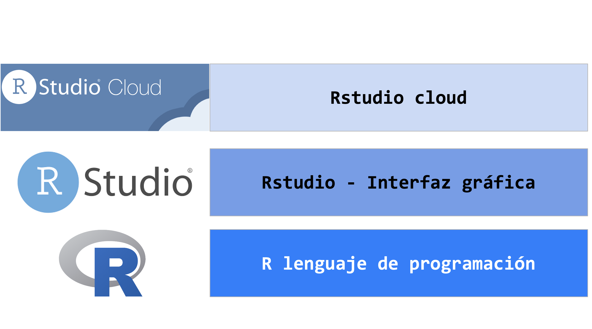

En resumen: la principal ventaja de usar RStudio es el **Editor** pero además sus otras ventanas permiten trabajar con **R** (el lenguaje de programación) desde una **interfaz gráfica** más **amigable** con el usuario.

### Empecemos explorando la interfaz y como cambiar su apariencia a gusto personal

**Estética del editor.** Podemos elegir el resaltado de la sintaxis, el tipo y tamaño de la letra, el fondo, etc.

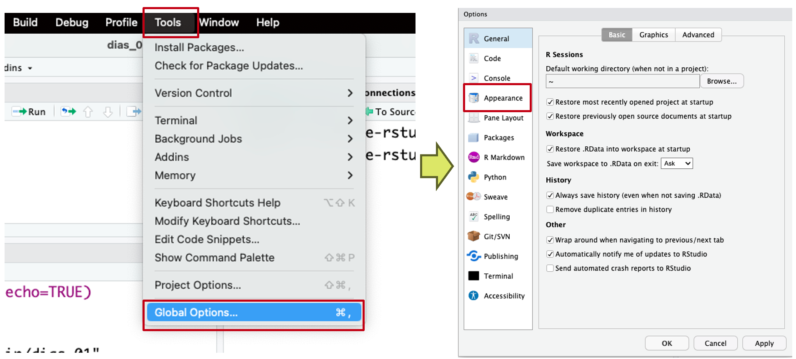

En **Appearance** podemos cambiar varias características de la estética de la interfaz.

Para ver los cambios da click en **Apply** y si te convencen, da click en **OK**.


### ¿Cuáles son las ventanas de trabajo en RStudio?

Es una interfaz gráfica estándar con cuatro ventanas principales:

1. **Consola**
2. **Directorio de trabajo/Visualizador de gráficas/Paquetes/Ayuda**
3. **Ambiente de trabajo (Environment)**
4. **Editor de los scripts**

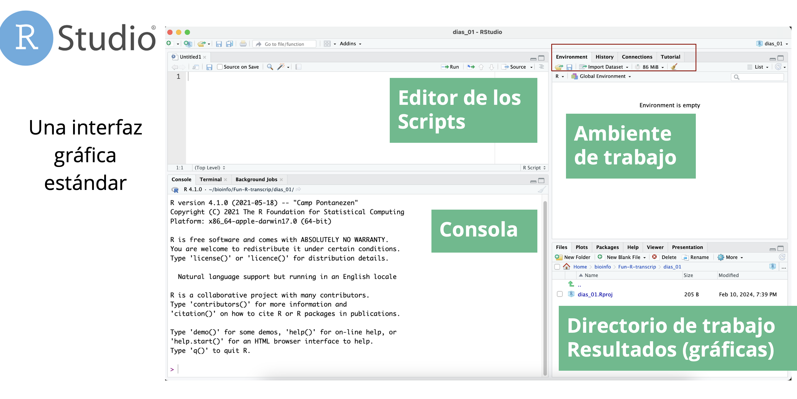

1. **Consola:**

- La línea de comando es una gran y compleja calculadora.
- En Rstudio ya tenemos el panel de la Consola listo.

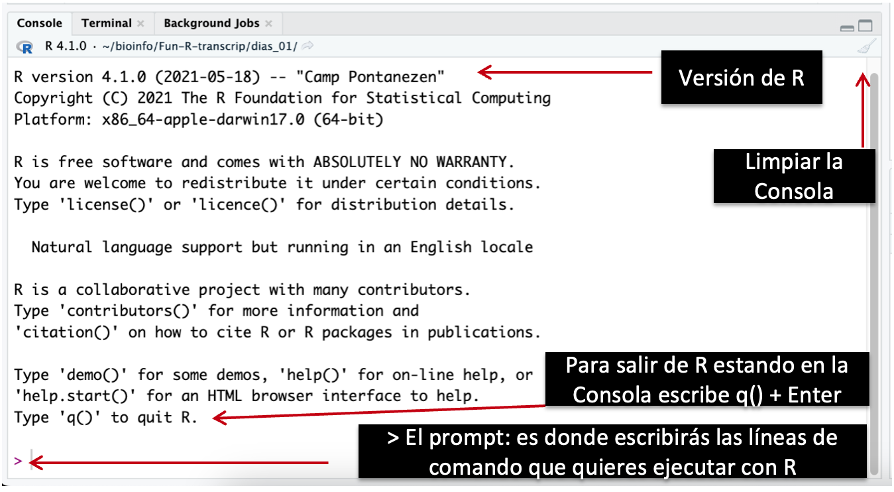

2. **Directorio de trabajo/Visualizador de gráficas/Paquetes/Ayuda**

En esta ventana tenemos múltiples pestañas.

- La primera nos muestra la ruta de nuestro **directorio de trabajo** (en dónde estamos), así como los archivos que se encuentran ahí. 

- La segunda ventana nos muestra los **gráficos** que se generan en R después de ejecutar líneas de código, desde ahí podemos exportar imágenes. 

- En la tercera pestaña se enlistan los **paquetes** instalados en R, si quieres activar alguno desde esta pestaña solo necesitar dar click en el recuadro a la izquierda de su nombre y aparecerá una palomita.

- La cuarta pestaña es la de **Ayuda**. Al ingresar el comando, función o paquete, buscará información en toda la documentación de R.

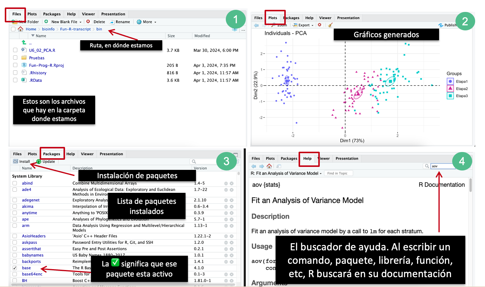

3. **Ambiente de trabajo (Environment)**

Hay varias pestañas pero vamos a centrarnos en las dos más utilizadas, el **ambiente o environment** (1) y el **historial** (2).

- En el ambiente se enlistan las variables creadas. Podemos visualizarlas al darl click en su nombre o desglosar sus características al dar click en la figura azul a la izquierda de su nombre.

- En el historial podemos ver el registro de todos los comandos que hemos ejecutado para esa sesión en R. Otra forma para navegar por el historial es desde la **consola** usando las **teclas arriba y abajo**.


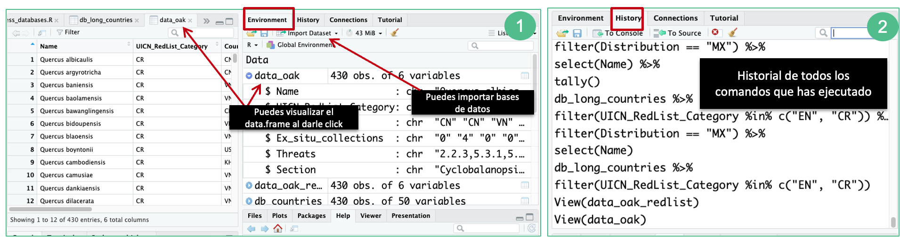

4. **Editor de los scripts**

Aquí es donde escribiremos nuestro código.

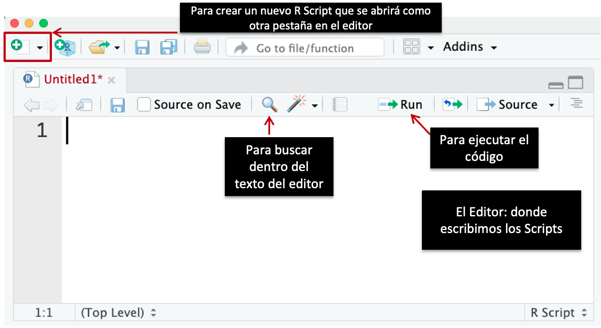

Podemos enviar ejecutar todo el código (_el script_) seleccionando todas las lineas que quiera y das click en `Run` o si solo quieres ejecutar una línea de comando debes poner el cursor en esa línea y dar click en `Run` o con el teclado presiona  `Ctrl` + `Enter` (Windows y Linux) en MacOs presionas `Command` + `Enter`.

> Tip importante: Para documentar tus scripts usa # para escribir tus comentarios.


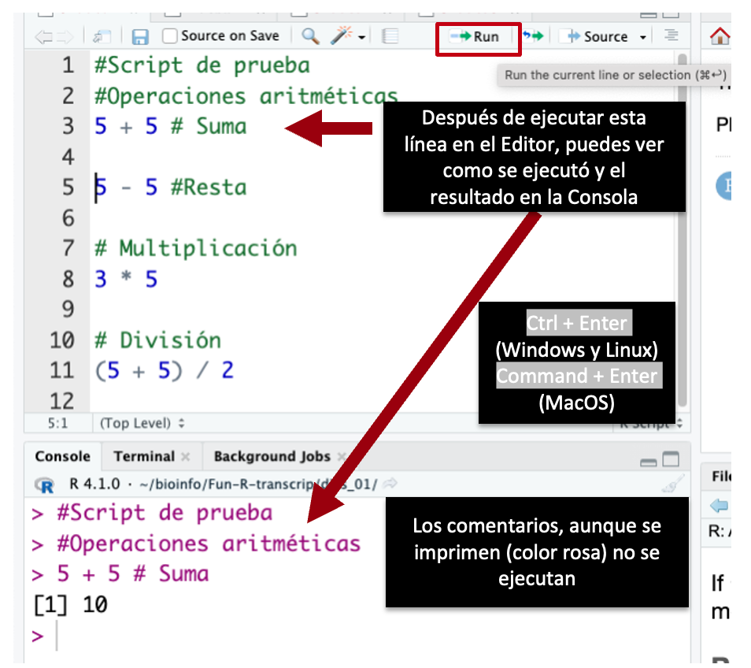


El texto después de cada línea de código se llama **“comentario”**. Todo lo que sigue después del símbolo **hash** (o numeral) **#** es ignorado por R cuando se ejecuta el código.

La documentación es muy importante para la **reproducibilidad** de los análisis y de hecho en varias revistas, para publicar tu trabajo pediran que compartas tus scripts, sin embargo, antes de publicar tu script recuerda revisarlo nuevamente.


Otra ventaja de usar el editor es que puede ayudarnos a **auto-completar** los comandos.

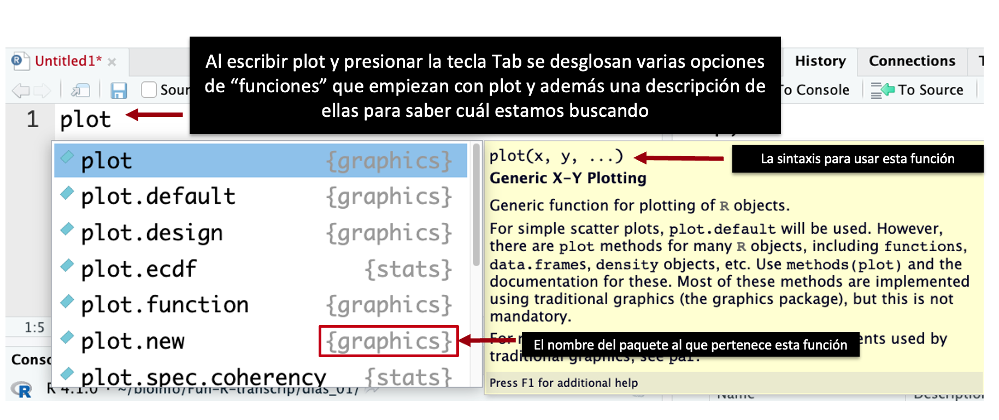

En la imagen vemos conceptos como paquetes y funciones que veremos con mayor detalle más adelante pero por ahora, es importante saber que acceder a sus descripciones es una buena manera de tener documentación resumida que nos ayudará a la hora de escribir y ejecutar nuestros scripts, y podemos acceder a esto desde el Editor.

### Ejercicio

Empecemos usando R como si lo hicieramos con una calculadora.

El orden de las operaciones es el mismo que has aprendido en la escuela.

```R
# Operaciones básicas

3 + 5   #   Suma
8 - 3   #   Resta
7 * 5   #   Multiplicación
1/2     #   División
4 ^ 4   #   Exponencial
4 ** 4  #   Exponencial
5 %% 3  #   Módulo
5 %/% 3 #   División entera

# Otros operadores:
# %*%	Multiplicación matricial
# %o%	Producto exterior
# %x%	Producto Kronecker
````
¿Qué obtienes al ejecutar cada línea de código?

>Recuerda que puedes usar `Run` o las teclas `Ctrl` + `Enter`


Los números pequeños o grandes tienen una notación científica:

```R
2/10000 
# Resultado: 2e-04
# es la abreviatura de “multiplicado por 10 ^ XX” 
# Entonces 2e-4 es la abreviatura de 2 * 10^(-4)
# También puedes escribir números en notación científica:
5e3  # nota la falta del signo menos aquí, ¿cuál fue el resultado?
5e-3 # ¿Qué obuviste al agregar el signo - ?
````

Podemos ir aumentando los términos en las operaciones matemáticas:

```R
5 + 5
10*8 + 3*(6 - 2/4)^10
````

### Fuentes de información:

- [Descargar RStudio](https://posit.co/downloads/)
- [RStudio is now Posit!](https://www.youtube.com/watch?v=0_UNtwEh7kY)
- [RStudio Cloud](https://posit.cloud/plans)
- [Instalación de R y RStudio](https://bookdown.org/daniel_dauber_io/r4np_book/setting-up-r-and-rstudio.html)

## Gestionar proyectos

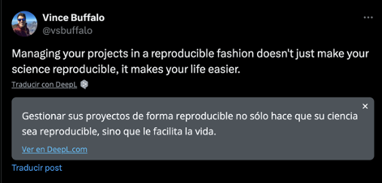


[Good Enough Practices for Scientific Computing](https://journals.plos.org/ploscompbiol/article?id=10.1371/journal.pcbi.1005510) brinda las siguientes recomendaciones para la organización de proyectos:

- Coloque cada proyecto en su propio directorio, el cual lleva el nombre del proyecto.
- Coloque documentos de texto asociados con proyecto en el directorio doc.
- Coloque los datos sin procesar y los metadatos en el directorio data, y archivos generados durante la limpieza y análisis en el directorio results.
- Coloque los scripts fuente del proyecto y los programas en el directorio src o bin (si tienes programas traídos de otra parte o compilados localmente, en el directorio bin).
- Nombre todos archivos de tal manera que reflejen su contenido o función.


### ¿Cómo crear un proyecto nuevo en RStudio?

A continuación veremos  dos formas para crear un proyecto en RStudio, la primera es cuando no tenemos ningún directorio o carpeta ya creado, y la segunda es cuando queremos enlazar nuestro proyecto a un directorio o carpeta ya existente.

En el primer caso:

- Haz clic en el menú “File”, luego en “New Project”
- Haz clic en “New Directory”
- Haz clic en “New Project”
- Introduce el nombre del directorio para guardar tu proyecto, por ejemplo: “Curso_R_2024”. Puedes seleccionar una ubicación específica donde se creara la carpeta del Nuevo proyecto con “Browse”
    -  Si quieres conectarlo a una cuenta en Github, selecciona la casilla de verificación “Create a git repository”

- Haz clic en el botón “Create Project”

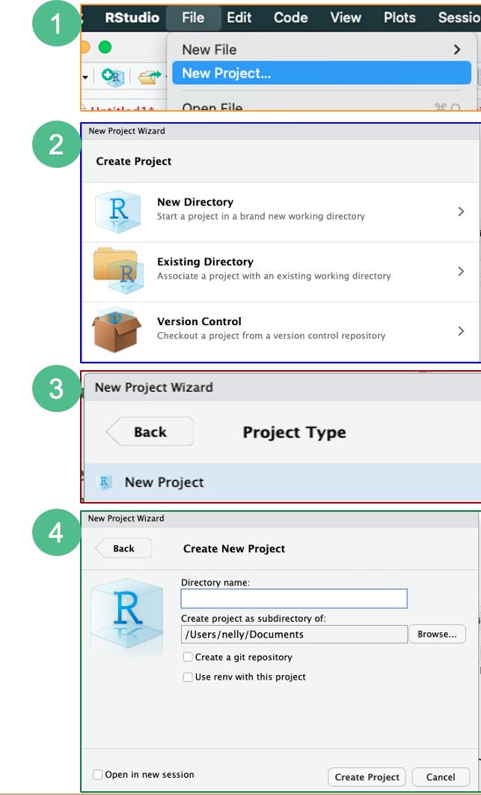


### Fuentes de información:

- [GitHub: good-enough-practices-in-scientific-computing](https://github.com/swcarpentry/good-enough-practices-in-scientific-computing/tree/gh-pages)

- [Good enough practices in scientific computing](https://journals.plos.org/ploscompbiol/article?id=10.1371/journal.pcbi.1005510)
