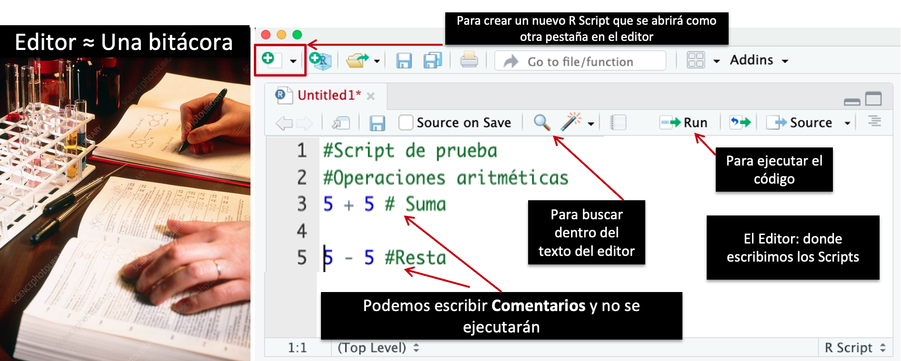

# Fundamentos de programación en R

## Unidad 1

---

## 1.2 Uso de Rstudio

---

### R - el lenguaje de programación

Podemos entrar a la consola de R desde la terminal de la computadora. Si ya lo tienes instalado solo necesitas teclear `R` y dar `Enter`.

#### Tips:

- **Cancelar comandos**: si usas R desde la línea de comandos, desde la consola o terminal en lugar de estar en el editor de RStudio y quieres cancelar el proceso, debes usar `Ctrl` + `C` en lugar de **Esc** para detener todo. 

R es un lenguaje de programación y su entorno puede llegar a ser dificil manejar desde la terminal o en su ambiente de consola.

## Aquí es donde surge Rstudio

[RStudio](https://posit.co/download/rstudio-desktop/) es un entorno de desarrollo integrado y gratuito de código abierto, proporciona un **editor incorporado**, funciona **en todas las plataformas** (incluso en servidores) y ofrece muchas ventajas, como la integración de control de versiones y gestión de proyectos.

R, el lenguaje de programación es la base.
RStudio, es una interfaz gráfica que nos ayuda a trabajar con R pero desde un ambiente amigable para el usuario.
RStudio Cloud, es RStudio en línea donde la principal ventaja es que no necesitas instalar nada en tu computadora personal, aunque necesitarás una buena conexión de internet.

En resumen: la principal ventaja de usar RStudio es el **Editor** pero además sus otras ventanas permiten trabajar con **R** (el lenguaje de programación) desde una **interfaz gráfica** más **amigable** con el usuario.

### Empecemos explorando la interfaz y como cambiar su apariencia a gusto personal

**Estética del editor.** Podemos elegir el resaltado de la sintaxis, el tipo y tamaño de la letra, el fondo, etc.

En **Appearance** podemos cambiar varias características de la estética de la interfaz.

Para ver los cambios da click en **Apply** y si te convencen, da click en **OK**.

### ¿Cuáles son las ventanas de trabajo en RStudio?

Es una interfaz gráfica estándar con cuatro ventanas principales:

1. **Consola**
2. **Directorio de trabajo/Visualizador de gráficas/Paquetes/Ayuda**
3. **Ambiente de trabajo (Environment)**
4. **Editor de los scripts**

1. **Consola:**

- La línea de comando es una gran y compleja calculadora.
- En Rstudio ya tenemos el panel de la Consola listo.

2. **Directorio de trabajo/Visualizador de gráficas/Paquetes/Ayuda**

En esta ventana tenemos múltiples pestañas.

- La primera nos muestra la ruta de nuestro **directorio de trabajo** (en dónde estamos), así como los archivos que se encuentran ahí. 

- La segunda ventana nos muestra los **gráficos** que se generan en R después de ejecutar líneas de código, desde ahí podemos exportar imágenes. 

- En la tercera pestaña se enlistan los **paquetes** instalados en R, si quieres activar alguno desde esta pestaña solo necesitar dar click en el recuadro a la izquierda de su nombre y aparecerá una palomita.

- La cuarta pestaña es la de **Ayuda**. Al ingresar el comando, función o paquete, buscará información en toda la documentación de R.

3. **Ambiente de trabajo (Environment)**

Hay varias pestañas pero vamos a centrarnos en las dos más utilizadas, el **ambiente o environment** (1) y el **historial** (2).

- En el ambiente se enlistan las variables creadas. Podemos visualizarlas al darl click en su nombre o desglosar sus características al dar click en la figura azul a la izquierda de su nombre.

- En el historial podemos ver el registro de todos los comandos que hemos ejecutado para esa sesión en R.

4. **Editor de los scripts**

Aquí es donde escribiremos nuestro código.

### Fuentes de información:

- [Descargar RStudio](https://posit.co/downloads/
)
- [RStudio is now Posit!](https://www.youtube.com/watch?v=0_UNtwEh7kY
)
- [RStudio Cloud](https://posit.cloud/plans
)
- [Instalación de R y RStudio](https://bookdown.org/daniel_dauber_io/r4np_book/setting-up-r-and-rstudio.html
)