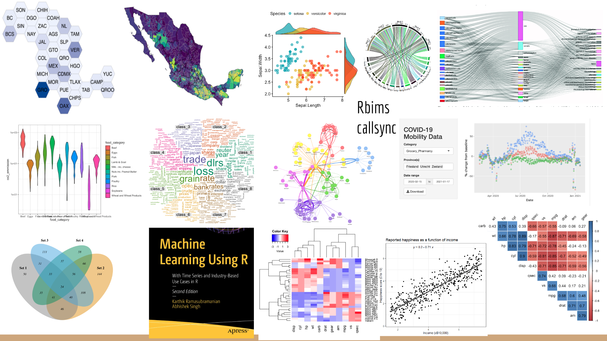

# Fundamentos de programación en R

## Unidad 1

---

## 1.1 Introducción a R

* [Presentación](https://docs.google.com/presentation/d/e/2PACX-1vR7evjJrmd9C0bvguWb_lu2rUQGmL3vg-fk-ateV_JAF10BhSoGgr9W01wXbrDXyQ/pub?start=false&loop=false&delayms=10000)

---

## Objetivo de esta sección

Al finalizar esta sección, reconocerás qué es R, por qué se utiliza en análisis de datos biológicos y qué ventajas ofrece para construir flujos de trabajo reproducibles.

Esta primera parte no busca que memorices todos los detalles técnicos de R, sino que tengas una idea general de la herramienta que usaremos durante el curso y de su importancia en el análisis de datos científicos.

---

## ¿Qué es R?

R es un lenguaje de programación y un entorno de software ampliamente utilizado en estadística, análisis de datos y visualización.

En términos sencillos, R permite escribir instrucciones para importar datos, modificarlos, analizarlos, graficarlos y guardar resultados. A diferencia de otros programas donde muchas acciones se hacen mediante botones o menús, en R gran parte del trabajo se realiza escribiendo código.

Esto puede parecer desafiante al inicio, pero tiene una ventaja muy importante: cada paso del análisis queda registrado y puede revisarse, corregirse, compartirse y repetirse.

Algunas características importantes de R son:

1. **Está diseñado para análisis estadístico y visualización de datos.**
   R incluye funciones básicas para realizar análisis estadísticos y generar gráficos. Además, puede ampliarse mediante paquetes especializados.

2. **Es software libre y de código abierto.**
   R puede instalarse y utilizarse gratuitamente. También cuenta con una comunidad activa que desarrolla paquetes, materiales de aprendizaje, tutoriales y documentación.

3. **Permite crear gráficos de alta calidad.**
   R es ampliamente utilizado para visualizar datos mediante gráficos simples y complejos. Paquetes como `ggplot2` permiten generar figuras claras, personalizables y útiles para la interpretación de resultados.

4. **Favorece la reproducibilidad.**
   Al trabajar con scripts, es posible documentar cada paso del análisis. Esto facilita repetir el flujo de trabajo, detectar errores y compartir el procedimiento con otras personas.

5. **Cuenta con una comunidad amplia.**
   Existen foros, libros, cursos, documentación y comunidades de usuarios que facilitan el aprendizaje y la resolución de problemas.

6. **Se integra con otras herramientas.**
   R puede conectarse con bases de datos, otros lenguajes de programación, sistemas de control de versiones, herramientas para reportes dinámicos y plataformas de análisis bioinformático.

---

## ¿Por qué usaremos R en este curso?

En este curso usaremos R porque es una herramienta muy útil para trabajar con datos biológicos y, en particular, para construir flujos de análisis reproducibles.

A lo largo del curso, R nos permitirá:

* importar y explorar tablas de datos;
* modificar, filtrar y organizar información;
* crear gráficos para interpretar resultados;
* utilizar paquetes especializados;
* documentar el análisis mediante scripts;
* guardar resultados de forma ordenada;
* avanzar hacia flujos de trabajo aplicados al análisis transcriptómico.

La idea central es que R no se use solo para “obtener un resultado”, sino para construir un proceso claro, revisable y reproducible.

---

## Dificultades normales al empezar con R

Aprender R puede ser desafiante al inicio, especialmente si no se tiene experiencia previa en programación. Esto es completamente normal.

Algunas dificultades frecuentes son:

1. **Errores de sintaxis.**
   Un paréntesis sin cerrar, una coma fuera de lugar o una letra mal escrita pueden generar errores. Parte del aprendizaje consiste en leer esos mensajes y aprender a corregirlos.

2. **Rutas de archivos.**
   R necesita saber en qué carpeta estamos trabajando y dónde se encuentran los archivos que queremos leer o guardar. Este será uno de los temas importantes de la Unidad 1.

3. **Uso de scripts.**
   Al principio puede parecer más lento escribir instrucciones en lugar de usar botones. Sin embargo, los scripts permiten guardar el procedimiento completo del análisis.

4. **Instalación y carga de paquetes.**
   Muchos análisis requieren paquetes adicionales. Aprenderemos poco a poco cuándo instalarlos, cómo cargarlos y cómo consultar su documentación.

5. **Documentación en inglés.**
   Gran parte de la documentación de R está en inglés. Sin embargo, también existen materiales en español y comunidades que han hecho esfuerzos importantes para traducir recursos.

Estas dificultades no significan que R sea inaccesible. Más bien, forman parte del proceso de aprender a comunicarnos con una herramienta nueva.

---

## Datos curiosos sobre R

R fue desarrollado inicialmente por Ross Ihaka y Robert Gentleman en 1993.

Una pregunta frecuente sobre R es:

> ¿Por qué las versiones de R tienen nombres raros?

Los nombres de las versiones de R suelen hacer referencia a tiras o películas de *Peanuts*. Por eso, algunas versiones tienen nombres curiosos, como “Trophy Case”, “Puppy Cup” o “Great Truth”.

Puedes consultar más ejemplos en el recurso [R Release Names](https://bookdown.org/martin_monkman/DataScienceResources_book/r-release-names.html).

---

## ¿Qué se puede hacer con R?

R puede utilizarse en muchas áreas del análisis de datos. En ciencias biológicas, puede apoyar tareas como:

* análisis estadísticos;
* visualización de datos;
* análisis de expresión génica;
* exploración de datos ecológicos;
* análisis de diversidad;
* construcción de reportes reproducibles;
* integración con herramientas bioinformáticas;
* automatización de flujos de trabajo.

La siguiente imagen reúne algunos ejemplos de gráficos, aplicaciones y recursos relacionados con R.

Además de los análisis estadísticos básicos, R permite trabajar con herramientas más especializadas. Por ejemplo:

* realizar análisis de regresión y modelos estadísticos;
* generar reportes en HTML, PDF, Word o presentaciones mediante R Markdown;
* conectarse a bases de datos mediante paquetes como `dbplyr`;
* crear aplicaciones web interactivas con herramientas como `shiny` o `flexdashboard`;
* integrar funciones de R en otros flujos de trabajo mediante APIs.

No veremos todo esto en el curso, pero es útil reconocer que R es una herramienta amplia. En este curso nos enfocaremos en construir bases sólidas para usar R en análisis de datos y transcriptómica.

---

## R y la reproducibilidad

Una de las principales razones para usar R en investigación científica es que permite trabajar de manera reproducible.

Un análisis reproducible es aquel en el que otras personas, o tú misma/o en el futuro, pueden revisar qué datos se usaron, qué pasos se siguieron y cómo se obtuvieron los resultados.

Para lograrlo, es importante:

* escribir scripts claros;
* comentar el código;
* organizar los archivos en carpetas;
* separar datos originales de resultados generados;
* guardar los pasos importantes del análisis;
* evitar modificar manualmente los datos sin dejar registro.

Durante el curso regresaremos varias veces a esta idea. La reproducibilidad no depende solo de saber programar, sino también de mantener buenas prácticas de organización.

---

## Recursos recomendados para profundizar

Los siguientes recursos pueden ayudarte a repasar o ampliar lo visto en esta sección.

### Introducción a R

* [Data Carpentry: Introduction to R for Genomics](https://datacarpentry.org/genomics-r-intro/00-introduction.html)
* [Introduction to R for Biologists](https://melbournebioinformatics.github.io/r-intro-biologists/intro_r_biologists.html)

### R en ciencias biológicas y bioinformática

* [The Use of R and R Packages in Biodiversity Conservation Research](https://www.mdpi.com/1424-2818/15/12/1202)
* [Ten simple rules for teaching yourself R](https://journals.plos.org/ploscompbiol/article?id=10.1371/journal.pcbi.1010372)
* [The R Language: An Engine for Bioinformatics and Data Science](https://www.ncbi.nlm.nih.gov/pmc/articles/PMC9148156/)

### R en español

* Traducción al español del libro [R for Data Science](https://es.r4ds.hadley.nz/), de Hadley Wickham, Mine Çetinkaya-Rundel y Garrett Grolemund.

### Otros ejemplos de uso de R

* [R en el mundo: comunidades de usuarios](https://benubah.github.io/r-community-explorer/rugs.html)
* [Creando APIs en R con Plumber](https://www.youtube.com/watch?v=QIWISjRKzKM)
* [Ejemplos de flexdashboard](https://rstudio.github.io/flexdashboard/articles/examples.html)
* [dbplyr: trabajo con bases de datos desde R](https://dbplyr.tidyverse.org/)

---

## Para recordar

R es una herramienta poderosa para analizar datos, pero su valor no está solo en los resultados que produce. Su principal fortaleza es que permite construir análisis claros, documentados y reproducibles.

En esta unidad comenzaremos con lo básico: conocer el entorno de trabajo, escribir nuestras primeras líneas de código, organizar un proyecto, leer archivos y guardar resultados.

---

### Siguiente tema

[1.2 Uso de RStudio](../Unidad_01/U1_2_Rstudio.md)
