# Fundamentos de programación en R

## Unidad 1

---

## 1.2 Uso de RStudio

* [Presentación](https://docs.google.com/presentation/d/e/2PACX-1vRQn4PwMC5CyrPGtwgxQZ0dGVmloxjsOtPEmkiYLwbI8fVpj6QaDE0OJl_r8Uq-pA/pub?start=false&loop=false&delayms=60000)

---

## Objetivo de esta sección

Al finalizar esta sección, reconocerás las principales partes de la interfaz de RStudio y podrás escribir, ejecutar, comentar y guardar tus primeras líneas de código en un script de R.

Esta sección está pensada como una guía visual y práctica. No necesitas memorizar todos los botones de RStudio desde el inicio. Lo más importante es identificar dónde escribir código, cómo ejecutarlo y dónde observar los resultados.

---

## R y RStudio no son lo mismo

Antes de empezar, conviene distinguir entre **R** y **RStudio**.

* **R** es el lenguaje de programación y el entorno que ejecuta las instrucciones.
* **RStudio** es una interfaz gráfica que facilita trabajar con R.
* **Posit Cloud**, antes conocido como RStudio Cloud, permite usar RStudio desde un navegador web, sin instalarlo localmente.

Podemos usar R directamente desde una terminal o consola. Si R ya está instalado, en macOS o Linux puedes abrir una terminal, escribir `R` y presionar `Enter`.

En Windows, también puedes abrir R desde su ícono o desde la terminal, dependiendo de cómo esté configurada la instalación.

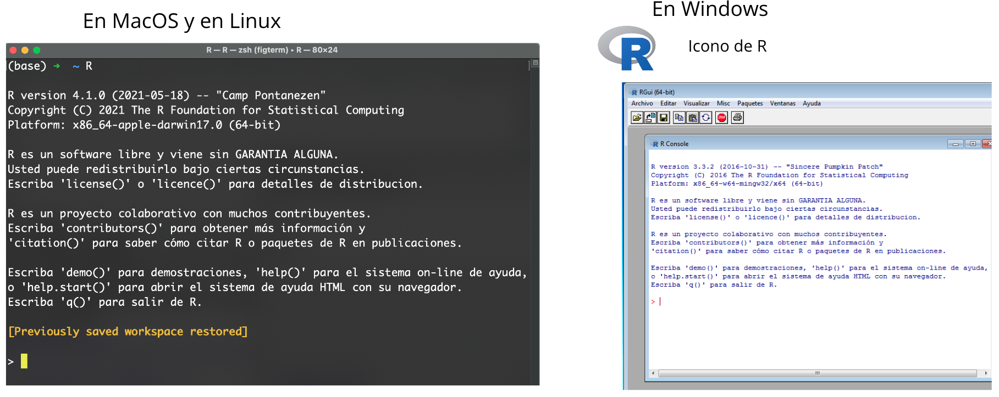

### Tip: cancelar comandos

Si estás usando R desde una terminal o desde la consola y quieres detener un proceso, puedes usar:

```r
Ctrl + C
```

Esto es útil cuando ejecutas una instrucción que tarda demasiado o que no responde.

---

## ¿Para qué sirve RStudio?

R puede utilizarse desde una consola, pero al inicio esto puede ser poco amigable. Aquí es donde RStudio se vuelve muy útil.


[RStudio](https://posit.co/download/rstudio-desktop/) es un entorno de desarrollo integrado. Esto significa que reúne en una misma interfaz varias herramientas que facilitan escribir código, ejecutarlo, revisar resultados, explorar archivos, consultar ayuda y organizar proyectos.

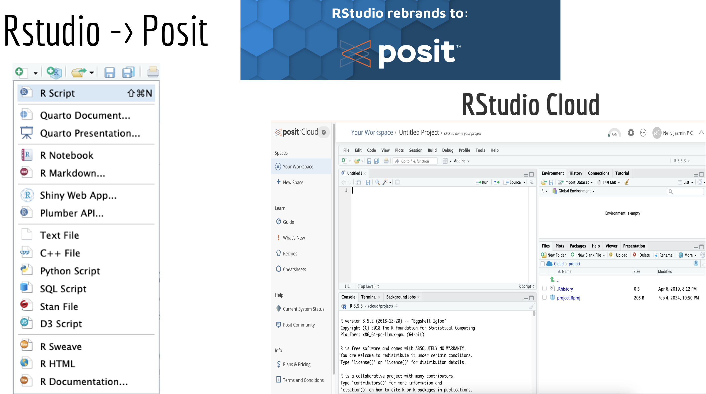

En resumen:

* **R** es el lenguaje de programación.
* **RStudio** es una interfaz gráfica para trabajar con R.
* **Posit Cloud** permite trabajar con RStudio en línea.

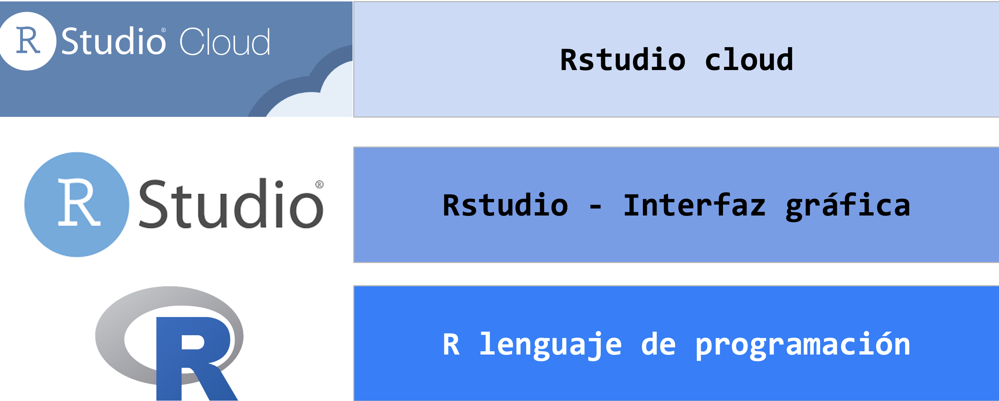

La principal ventaja de usar RStudio es que nos permite trabajar de forma más ordenada. En particular, el **editor de scripts** nos ayuda a escribir y guardar el código que usamos durante un análisis.

---

## Exploración inicial de la interfaz

RStudio tiene varias ventanas o paneles. La ubicación puede variar según la configuración de cada computadora, pero generalmente veremos cuatro zonas principales:

1. **Consola**
2. **Editor de scripts**
3. **Ambiente de trabajo**
4. **Archivos, gráficas, paquetes y ayuda**

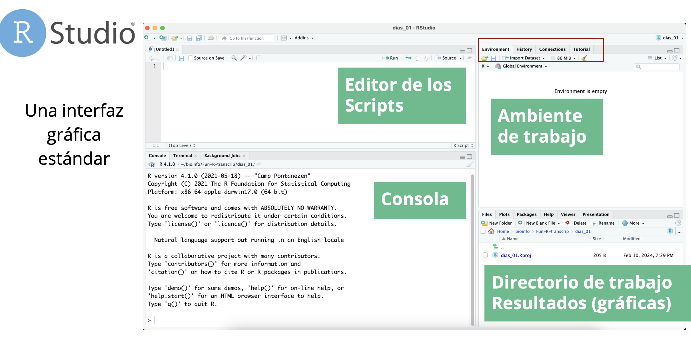

No te preocupes si al inicio parece mucha información. La interfaz de RStudio se vuelve más familiar conforme la usamos. Por ahora, pensemos en RStudio como un escritorio de trabajo:

* en el **editor** escribimos nuestra bitácora de código;
* en la **consola** vemos lo que R ejecuta;
* en el **ambiente de trabajo** aparecen los objetos que vamos creando;
* en el panel de **archivos, gráficas, paquetes y ayuda** consultamos recursos y resultados.

---

## Cambiar la apariencia de RStudio

RStudio permite modificar su apariencia. Por ejemplo, puedes cambiar el tamaño de letra, el tema del editor o los colores de resaltado del código.

Para hacerlo:

1. Ve al menú **Tools**.
2. Selecciona **Global Options**.
3. Entra a la sección **Appearance**.
4. Modifica el tema, fuente o tamaño de letra.
5. Haz clic en **Apply** para probar los cambios.
6. Haz clic en **OK** si quieres conservarlos.

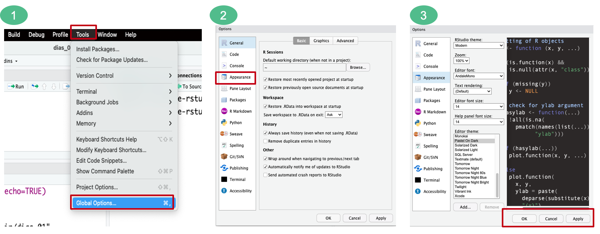

Este paso es opcional, pero puede ser útil si necesitas aumentar el tamaño de la letra o elegir un tema que te resulte más cómodo para trabajar.

---

## 1. Consola

La **consola** es el lugar donde R ejecuta instrucciones directamente. Podemos pensar en ella como una calculadora muy potente.

En la consola puedes escribir una instrucción, presionar `Enter` y ver el resultado inmediatamente.

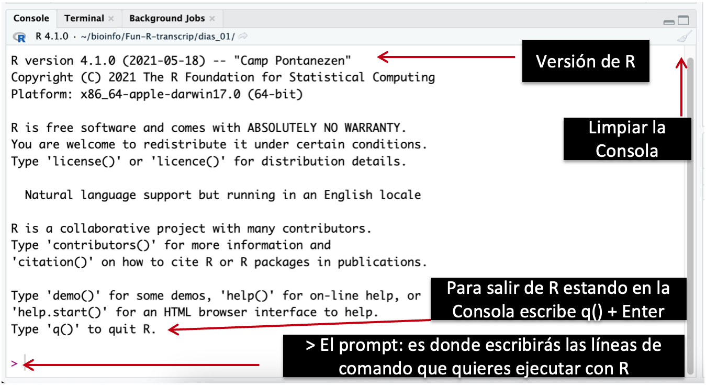

Algunos elementos importantes de la consola son:

* la versión de R que estás usando;
* el símbolo `>`, llamado **prompt**, donde puedes escribir instrucciones;
* el espacio donde aparecen los resultados;
* la opción para limpiar la consola.

Para salir de R desde la consola se puede usar:

```r
q()
```

Sin embargo, durante el curso normalmente no necesitaremos cerrar R desde la consola. Bastará con cerrar RStudio al terminar la sesión.

---

## 2. Panel de archivos, gráficas, paquetes y ayuda

En una de las zonas de RStudio encontrarás varias pestañas. Las más importantes al inicio son:

* **Files**
* **Plots**
* **Packages**
* **Help**

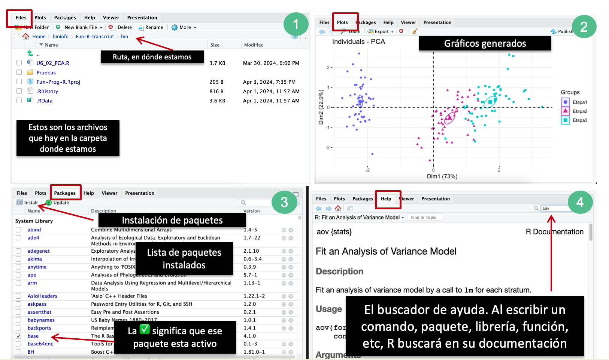

### Files

La pestaña **Files** muestra los archivos y carpetas del directorio de trabajo. Esta pestaña nos ayuda a ubicarnos y a revisar qué archivos están disponibles en la carpeta donde estamos trabajando.

### Plots

La pestaña **Plots** muestra las gráficas generadas con R. Desde ahí también es posible exportarlas como imágenes.

### Packages

La pestaña **Packages** muestra los paquetes instalados. Si un paquete tiene una marca de selección, significa que está cargado en la sesión actual.

Más adelante veremos con más detalle qué son los paquetes, cómo instalarlos y cómo cargarlos.

### Help

La pestaña **Help** permite consultar documentación sobre funciones, paquetes y otros elementos de R.

Por ejemplo, para consultar la ayuda de la función `plot()` podemos escribir en la consola:

```r
?plot
```

---

## 3. Ambiente de trabajo e historial

Otra zona importante de RStudio contiene pestañas como **Environment** e **History**.

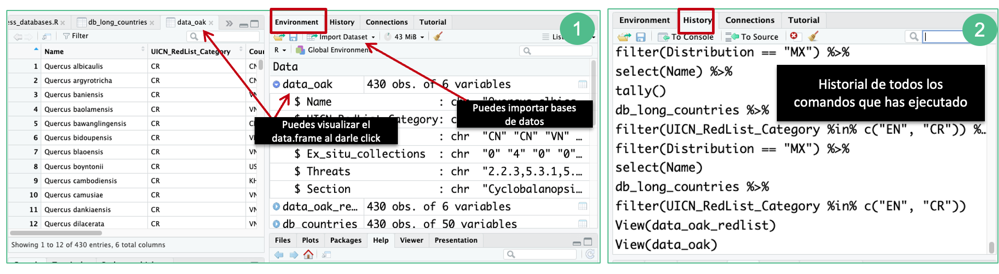

### Environment

La pestaña **Environment** muestra los objetos creados durante la sesión de trabajo. Por ejemplo, si importamos una tabla o creamos una variable, aparecerá ahí.

Cuando trabajemos con bases de datos, podremos hacer clic sobre el nombre del objeto para visualizarlo como una tabla.

### History

La pestaña **History** muestra el historial de comandos que hemos ejecutado durante la sesión.

También puedes navegar por comandos previos desde la consola usando las teclas de flecha hacia arriba y hacia abajo.

---

## 4. Editor de scripts

El **editor de scripts** es una de las partes más importantes de RStudio.

Aquí escribiremos el código que queremos guardar y reutilizar. A diferencia de la consola, el editor permite conservar una bitácora completa del análisis.

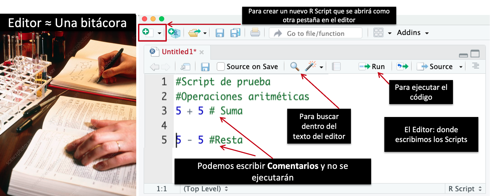

Un archivo de script de R suele guardarse con la extensión:

```text
.R
```

Por ejemplo:

```text
U1_2_primer_script.R
```

En el editor podemos:

* escribir varias líneas de código;
* agregar comentarios;
* ejecutar una línea o varias líneas;
* guardar el archivo;
* corregir y volver a ejecutar instrucciones.

---

## Ejecutar código desde el editor

Para ejecutar código desde el editor, coloca el cursor sobre la línea que quieres correr y usa alguno de estos métodos:

* haz clic en **Run**;
* presiona `Ctrl + Enter` en Windows o Linux;
* presiona `Command + Enter` en macOS.

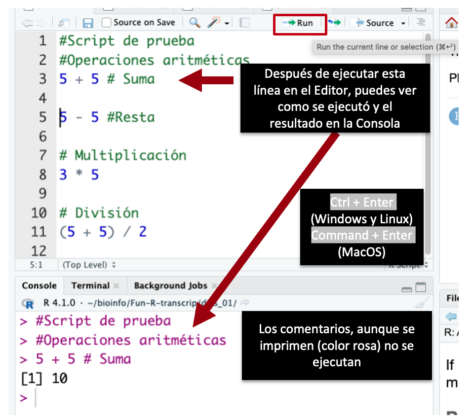

Cuando ejecutas una línea desde el editor, R la envía a la consola. Ahí podrás ver la instrucción y su resultado.

---

## Comentarios en un script

En R, los comentarios se escriben usando el símbolo `#`.

Todo lo que aparece después de `#` en una línea será ignorado por R al ejecutar el código.

Por ejemplo:

```r
5 + 5  # Suma
```

En esta línea, R ejecuta solamente:

```r
5 + 5
```

El texto `# Suma` sirve como anotación para las personas que leen el script.

Los comentarios son importantes porque ayudan a documentar el análisis. Un buen script no solo debe funcionar, también debe poder entenderse después.

---

## Autocompletado y ayuda rápida

RStudio también ayuda a escribir código mediante autocompletado.

Por ejemplo, si escribes `plot` y presionas la tecla `Tab`, RStudio mostrará funciones que comienzan con ese texto. También puede mostrar una descripción breve, la sintaxis de la función y el paquete al que pertenece.

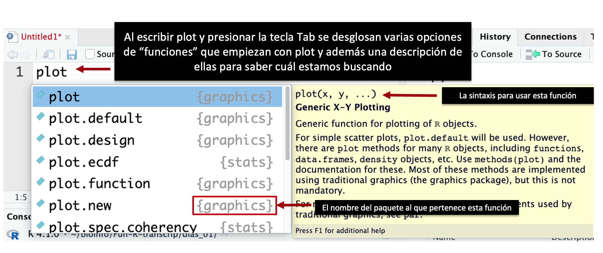

Aunque todavía no veremos funciones y paquetes con detalle, es útil saber que RStudio puede ayudarnos a explorar opciones y consultar documentación mientras escribimos código.

---

## Ejercicio: primeras líneas de código en RStudio

En este ejercicio usaremos R como una calculadora. El objetivo no es aprender matemáticas, sino practicar cómo escribir, ejecutar y comentar código desde el editor de scripts.

### Instrucciones

1. Abre RStudio.
2. Crea un nuevo script:

   * **File > New File > R Script**
3. Copia las siguientes líneas en el editor.
4. Ejecuta cada línea usando **Run** o el atajo de teclado correspondiente.
5. Observa el resultado en la consola.
6. Agrega comentarios para describir qué hace cada línea.

```r
5 + 5
10 * 8 + 3 * (6 - 2/4)^10
10 - 5
8 * 8
8 / 8
```

### Preguntas

* ¿Qué resultado obtienes al ejecutar cada línea?
* ¿Dónde aparece el resultado?
* ¿Qué diferencia notas entre escribir el código en la consola y escribirlo en el editor?
* ¿Qué ventaja tiene guardar estas instrucciones en un script?

---

## Guardar el script

Guarda tu archivo de script con un nombre claro. Por ejemplo:

```text
U1_2_primer_script.R
```

Si ya descargaste el repositorio del curso, guárdalo dentro de la carpeta correspondiente para scripts. Por ejemplo:

```text
bin/
```

Más adelante hablaremos con más detalle de la estructura del proyecto y de cómo organizar archivos en carpetas como `doc`, `data`, `bin` y `results`.

---

## Ejercicios extra

Estos ejercicios son opcionales. Puedes realizarlos si terminas antes o si quieres practicar un poco más.

### Operaciones básicas

```r
3 + 5    # Suma
8 - 3    # Resta
7 * 5    # Multiplicación
1 / 2    # División
4 ^ 4    # Exponente
4 ** 4   # Exponente
5 %% 3   # Módulo
5 %/% 3  # División entera
```

### Otros operadores

Los siguientes operadores existen en R, pero no es necesario dominarlos ahora:

```r
# %*%  Multiplicación matricial
# %o%  Producto exterior
# %x%  Producto Kronecker
```

### Notación científica

R puede mostrar números muy pequeños o muy grandes usando notación científica.

```r
2 / 10000
```

El resultado será:

```r
2e-04
```

Esto significa:

```r
2 * 10^(-4)
```

También puedes escribir números directamente en notación científica:

```r
5e3
5e-3
```

Preguntas:

* ¿Qué resultado obtienes con `5e3`?
* ¿Qué cambia al escribir `5e-3`?

---

## Material de apoyo en la carpeta `bin`

En la carpeta `bin` encontrarás el script:

```text
U1_practica_general.R
```

Este script reúne el código principal de la Unidad 1 y sirve como material de apoyo. No es necesario ejecutarlo completo desde el inicio; durante la clase trabajaremos paso a paso.

Puedes revisarlo al final de la sesión para repasar, o consultarlo si te atrasas, tienes algún error o quieres comparar tu código con una versión verificada.

Para que funcione correctamente, asegúrate de trabajar desde la carpeta raíz del proyecto y de tener las carpetas `data` y `results` en el lugar indicado.

---

## Para recordar

RStudio es una interfaz que facilita trabajar con R. Durante el curso usaremos principalmente:

* el **editor**, para escribir y guardar scripts;
* la **consola**, para ejecutar instrucciones y ver resultados;
* el **ambiente de trabajo**, para revisar objetos creados;
* el panel de **archivos, gráficas, paquetes y ayuda**, para consultar recursos y resultados.

El hábito más importante desde esta primera sesión es escribir el código en un script, comentarlo y guardarlo. Así comenzamos a construir análisis reproducibles desde el inicio.

---

## Fuentes de información

* [Descargar RStudio Desktop](https://posit.co/downloads/)
* [RStudio is now Posit!](https://www.youtube.com/watch?v=0_UNtwEh7kY)
* [Posit Cloud](https://posit.cloud/plans)
* [Instalación de R y RStudio](https://bookdown.org/daniel_dauber_io/r4np_book/setting-up-r-and-rstudio.html)
* [Software Carpentry: Introduction to R and RStudio](https://swcarpentry.github.io/r-novice-gapminder/01-rstudio-intro.html)

---

## Siguiente tema

[1.3 Gestión de proyectos](../Unidad_01/U1_3_Gestion_proyectos.md)
