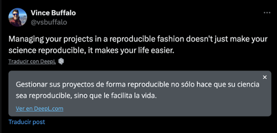
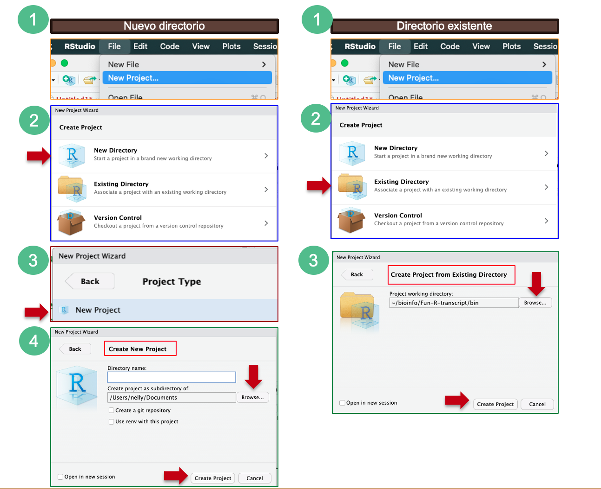
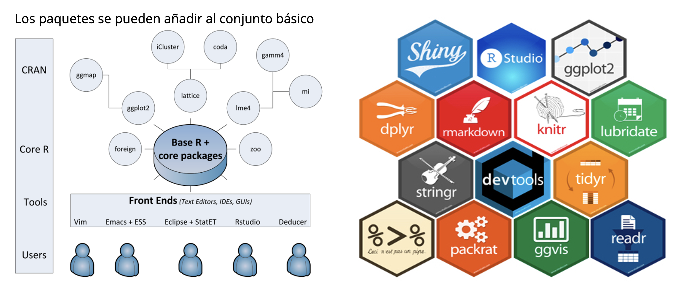
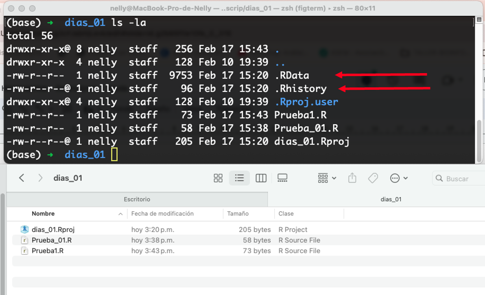

# Fundamentos de programación en R

## Unidad 1

---

## 1.3 Gestión de proyectos

---

### Creación de un proyecto en R




[Good Enough Practices for Scientific Computing](https://journals.plos.org/ploscompbiol/article?id=10.1371/journal.pcbi.1005510) brinda las siguientes recomendaciones para la organización de proyectos:

- Coloque cada proyecto en su propio directorio, el cual lleva el nombre del proyecto.
- Coloque documentos de texto asociados con proyecto en el directorio doc.
- Coloque los datos sin procesar y los metadatos en el directorio data, y archivos generados durante la limpieza y análisis en el directorio results.
- Coloque los scripts fuente del proyecto y los programas en el directorio src o bin (si tienes programas traídos de otra parte o compilados localmente, en el directorio bin).
- Nombre todos archivos de tal manera que reflejen su contenido o función.


#### ¿Cómo crear un proyecto en RStudio?

A continuación veremos  dos formas para crear un proyecto en RStudio, la primera es cuando no tenemos ningún directorio o carpeta ya creado, y la segunda es cuando queremos enlazar nuestro proyecto a un directorio o carpeta ya existente.

**En el primer caso - Nuevo directorio:**

- Haz clic en el menú “File”, luego en “New Project”
- Haz clic en “New Directory”
- Haz clic en “New Project”
- Introduce el nombre del directorio para guardar tu proyecto, por ejemplo: “Curso_R_2024”. Puedes seleccionar una ubicación específica donde se creara la carpeta del Nuevo proyecto con “Browse”
    -  Si quieres conectarlo a una cuenta en Github, selecciona la casilla de verificación “Create a git repository”

- Haz clic en el botón “Create Project”

**En el segundo caso -  Directorio existente:**

- Haz clic en el menú “File”, luego en “New Project”
- Haz clic en “Existing Directory”
- Haz clic en “Browse” y selecciona la carpeta con la que quieres enlazar tu proyecto
- Haz clic en el botón “Create Project”




**Ejercicio**

- Crea tu proyecto de R enlazándolo a la carpeta del curso que descargaste desde Github.

Tip: [Descarga la carpeta desde Github como un archivo Zip](../../README.md)

### Conceptos básicos: carpetas

Podemos movernos entre carpetas y archivos por medio de comandos.

```R
# ¿Cuál es el directorio de trabajo en el que estas?

getwd()

# ¿Para que funciona setwd()?
?setwd() #Este comando cumple la misma función que Session > Set working directory 
# ¿Qué nos muestra el comando dir() ?
dir() # muestra los archivos que están en la carpeta donde te encuentras

```

### Conceptos básicos: packages

En R, un paquete (package) se define como una **unidad organizada** de **código**, **funciones**, **datos** y **documentación** que extiende las capacidades de R y proporciona herramientas adicionales para realizar análisis de datos y tareas relacionadas.

Aspectos claves que definen un paquete en R:

- **Estructura organizada:** sigue una estructura de directorios organizada que incluye subdirectorios específicos para almacenar código fuente, datos, documentación y otros archivos relacionados con el paquete.

- **Código y funciones:** contiene código fuente que define nuevas funciones y métodos para realizar tareas específicas de análisis de datos, modelado estadístico, visualización y más. Estas funciones están diseñadas para ser reutilizables y pueden ser llamadas por los usuarios en sus propios scripts y análisis.

- **Datos y conjuntos de datos:** los paquetes pueden incluir conjuntos de datos de ejemplo, archivos de datos o bases de datos que son utilizados por las funciones del paquete para ejemplificar su uso o para realizar análisis demostrativos.

- **Documentación:** incluyen documentación detallada que describe el propósito del paquete, cómo instalarlo, cómo usar sus funciones y métodos, ejemplos de uso y más. Se puede acceder a esta documentación a través de funciones de ayuda integradas en R.

- **Compilación y distribución:** Los paquetes de R se distribuyen en archivos comprimidos con una extensión ".tar.gz" para sistemas operativos del tipo Unix y ".zip" para sistemas Windows. Estos archivos contienen todos los componentes del paquete, incluido el código fuente, la documentación y los datos, y se pueden instalar fácilmente en R utilizando la función `install.packages()`.



Actualmente, el repositorio de paquetes CRAN (The Comprehensive R Archive Network) cuenta con 20,420 paquetes disponibles, ha sido un gran incremento desde el 2017 cuando tenía aproximadamente 10,000 paquetes.

**¿Cómo se instalan los paquetes en RStudio?**

Hay tres formas para instalar paquetes:

1. Desde la barra de Menús de Rstudio: en _Tools_ > _Install packages..._
2. Desde la venta de Directorio de Trabajo/Gráficos/Paquetes: como vimos previamente en la ventana de _Paquetes_ y dando click en _Instalar_. 
3. Desde el Editor/Consola: con el comando `install.packages()`

**Ejercicio**

Instala el paquete de `ggplot2` desde cualquier de las tres opciones anteriores.

Tip:

```R
#Desde el editor en RStudio puedes averiguar más acerca de la función install.packages
?install.packages()

#Después de revisar su sintaxis encontrarás que debemos poner el nombre del paquete que quieras instalar dentro de los paréntesis:

install.packages(ggplot2)

# Cuidado: si te aparece un error puede ser por la versión de R, en algunas versiones previas necesitas poner entre comillas el nombre del paquete: install.packages("ggplot2") 
```

### Conceptos básicos: salir

Para salir de R desde la interfaz de Rstudio:

- _File_ > _Quit Session_. Pueden guardar la sesión para que cuando vuelvan a abrir Rstudio se abra el editor y el script de inmediato.

- Cerrar la venta de Rstudio
Los archivos de R se guardan con la extensión **.r** o **.R**

- Para guardar tu script ve al Menú de RStudio, _File_ > _Save_

### Conceptos básicos: archivos generados por default

Cada sesión guarda o carga dos archivos ocultos:

**.RData** y **.RHistory**

Ejemplo: 

En la imagen se muestra que al acceder a la carpeta no puedes ver los archivos ocultos, pero al entrar desde la terminal y con el comando `ls -la`puedes ver estos archivos ocultos.



### Extra: administrar tu entorno


```R
#ls() mostrara una lista de todas las variables y funciones almacenadas en el entorno global, es decir, en tu sesión de trabajo en R:

ls() #Prueba este comando y ve que obtienes.

#Para listar todos los objetos, escribe 
ls(all.names = TRUE)

#Puedes usar rm para eliminar objetos que ya no necesitas:

rm(x)

# Si tienes muchas cosas en tu entorno y deseas borrarlas todas, puedes pasar los resultados de ls y mandarlos a la función rm:

rm(list = ls())

```

### Fuentes de información

- [Controversia con rm(list = ls())](https://www.tidyverse.org/blog/2017/12/workflow-vs-script/
)
- [swcarpentry - rstudio-intro](https://swcarpentry.github.io/r-novice-gapminder-es/01-rstudio-intro.html)

- [swcarpentry - project-intro](https://swcarpentry.github.io/r-novice-gapminder-es/02-project-intro.html)


### Extra: source

La función `source` básicamente lee y ejecuta el código contenido en un archivo (extensión **.R**) y lo incorpora al espacio de trabajo de RStudio como si hubiera sido escrito directamente en la consola o en el Editor.

La sintaxis básica de la función "source" es la siguiente:

```R
source("ruta/del/archivo.R")
```

Donde "ruta/del/archivo.R" es la ubicación del archivo que contiene el código R que deseas ejecutar.

La función "source" es útil en el análisis de datos por varias razones:

1. **Reutilización de código:** Permite reutilizar fragmentos de código R almacenados en archivos externos en lugar de tener que volver a escribirlos manualmente en cada sesión. Esto facilita la gestión y mantenimiento del código, especialmente cuando se trabaja con análisis complejos que requieren múltiples pasos.

2. **Organización del código:** Al dividir el código en archivos separados, puedes organizar y estructurar tu análisis de datos de manera más ordenada y modular. Esto facilita la comprensión y la colaboración con otros usuarios, ya que pueden revisar y ejecutar cada parte del análisis por separado.

3. **Automatización de tareas:** Puedes usar la función "source" en scripts de R para automatizar tareas recurrentes. Esto te permite ahorrar tiempo y minimizar errores al evitar la necesidad de ejecutar manualmente cada paso del análisis.

En resumen, la función "source" en R es una herramienta poderosa que permite cargar y ejecutar código R desde archivos externos, lo que facilita la reutilización, organización y automatización del análisis de datos.

**Ejemplo:**
Podemos enviar la totalidad de nuestro archivo a la línea de comando con **Source**.

O seleccionando todas las líneas del **Editor** y presionar **Run** o presionar `Ctrl` + `Enter`

```R
#Desde tu sesión en RStudio, abre un nuevo archivo de R Script y desde tu Editor ejecuta la siguiente línea de código:

source("U1_1_IntroRstudio.R")

# ¿Qué paso?
```

### Fuentes de información:

- [The Comprehensive R Archive Network](https://cran.r-project.org/)
- [8. Introduction to R Packages by Ken Rice
Timothy Thornotn](https://faculty.washington.edu/kenrice/rintro/sess08.pdf)

- [Contributed Packages. CRAN](https://cran.r-project.org/web/packages/
)
- [Tutorial de programación en R orientado al estudiante de Bioquímica](https://ucodemy.github.io/rbioq/RStudio/
)

### Fuentes de información:

- [GitHub: good-enough-practices-in-scientific-computing](https://github.com/swcarpentry/good-enough-practices-in-scientific-computing/tree/gh-pages)

- [Good enough practices in scientific computing](https://journals.plos.org/ploscompbiol/article?id=10.1371/journal.pcbi.1005510)

