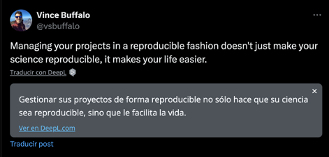
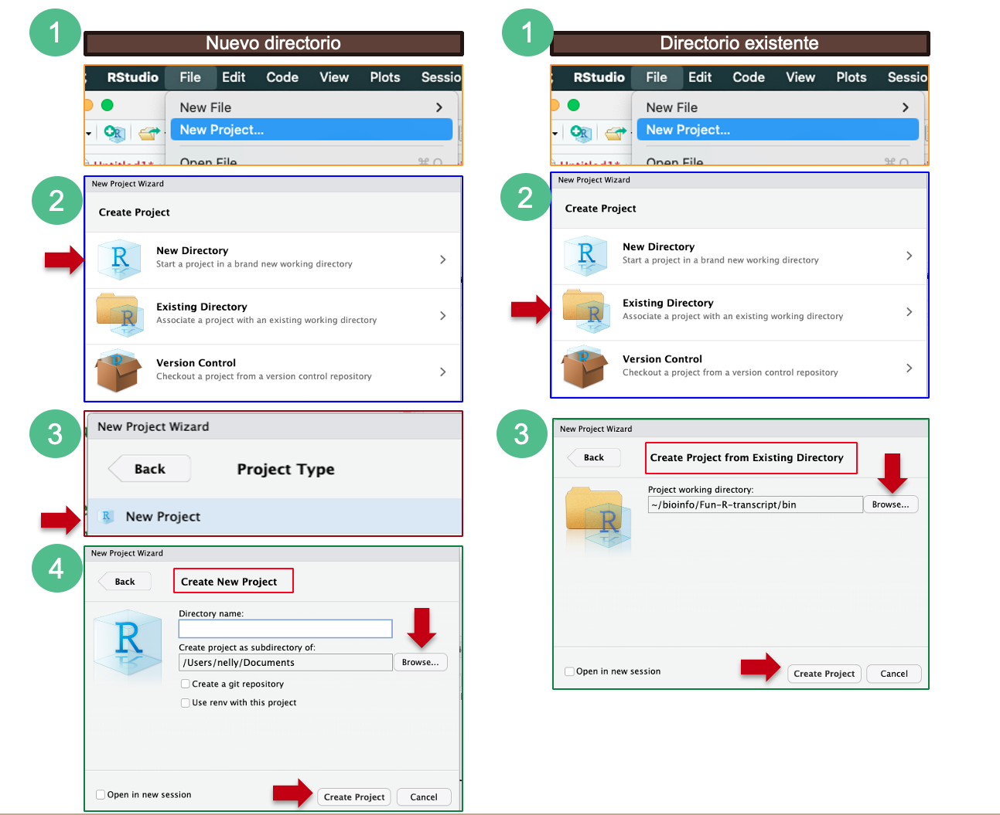
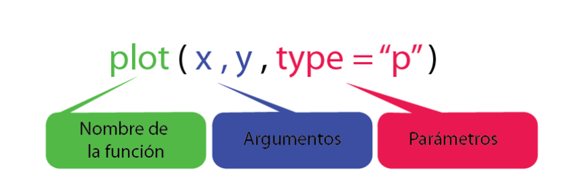
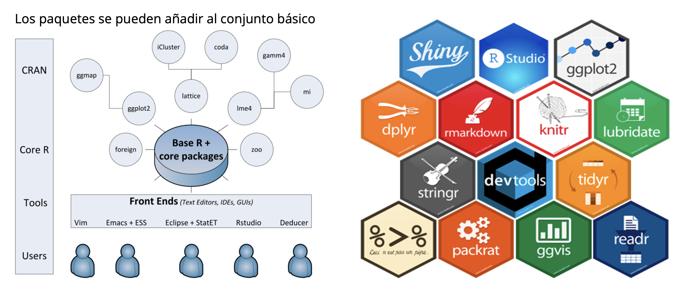
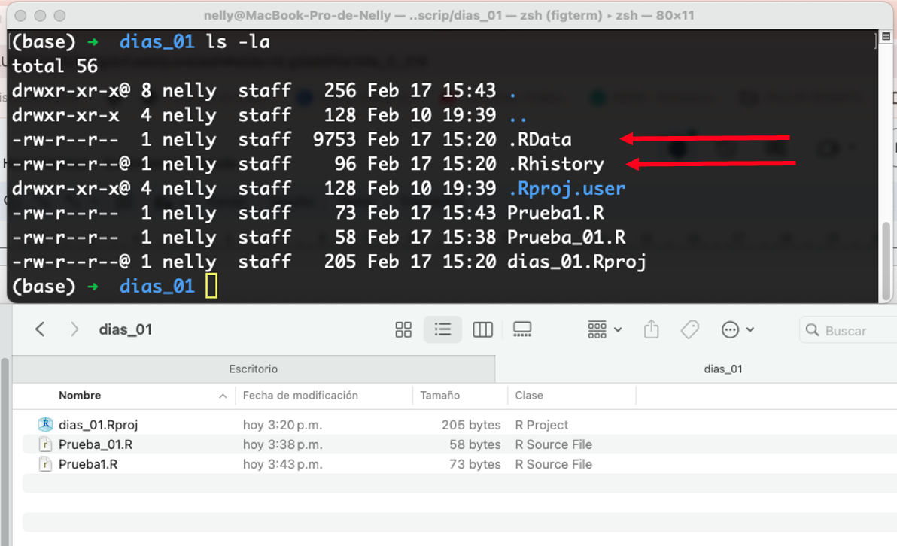

# Fundamentos de programación en R

## Unidad 1

---

## 1.3 Gestión de proyectos

* [Presentación](https://docs.google.com/presentation/d/e/2PACX-1vRQn4PwMC5CyrPGtwgxQZ0dGVmloxjsOtPEmkiYLwbI8fVpj6QaDE0OJl_r8Uq-pA/pub?start=false&loop=false&delayms=60000)

---

## Objetivo de esta sección

Al finalizar esta sección, reconocerás la importancia de organizar un proyecto de análisis en RStudio, identificarás la estructura básica del repositorio del curso y crearás un proyecto de RStudio desde la carpeta raíz del repositorio.

También tendrás un primer acercamiento a tres conceptos que usaremos constantemente durante el curso: **funciones**, **paquetes** y **ayuda en RStudio**.

---

## ¿Por qué organizar un proyecto?

Cuando trabajamos con datos, scripts, imágenes, resultados y documentos, es fácil perder archivos o no recordar qué versión usamos para obtener un resultado. Organizar un proyecto desde el inicio ayuda a evitar ese tipo de problemas.



Organizar un proyecto no solo hace que el análisis sea más ordenado. También facilita que otras personas puedan revisar, ejecutar o adaptar nuestro trabajo.

La idea central es que cada proyecto tenga una carpeta principal y, dentro de ella, subcarpetas con funciones claras.

[Good Enough Practices for Scientific Computing](https://journals.plos.org/ploscompbiol/article?id=10.1371/journal.pcbi.1005510) recomienda, entre otras cosas:

* colocar cada proyecto en su propio directorio;
* guardar documentos de texto en una carpeta como `doc`;
* guardar datos originales y metadatos en una carpeta como `data`;
* guardar resultados generados durante la limpieza o el análisis en una carpeta como `results`;
* guardar scripts en una carpeta como `src` o `bin`;
* nombrar los archivos de forma clara, de acuerdo con su contenido o función.

En este curso seguiremos una estructura sencilla basada en estas recomendaciones.

---

## La carpeta raíz del proyecto

La **carpeta raíz** es la carpeta principal del proyecto. Es el punto de partida desde el cual se organizan las demás carpetas.

En este curso, la carpeta raíz será la carpeta del repositorio descargado desde GitHub. Dentro de ella encontraremos carpetas como `doc`, `bin`, `data` y `results`.

Una forma sencilla de imaginarlo es como un árbol:

```text
Fun-R-transcript/
├── doc/
├── bin/
├── data/
└── results/
```

La carpeta raíz es `Fun-R-transcript/`. Desde ahí se ramifican las demás carpetas.


Esta organización será importante cuando trabajemos con rutas para leer y guardar archivos. Por ejemplo, si un archivo está dentro de la carpeta `data`, podremos referirnos a él desde R usando una ruta como:

```r
"data/U1_datos_expresion.csv"
```

Esto es más práctico que escribir la ruta completa de la computadora, porque cada participante puede tener el repositorio guardado en una ubicación diferente.

---

## Estructura del repositorio del curso

El repositorio del curso tendrá una estructura similar a esta:

```text
Fun-R-transcript/
├── README.md
├── doc/
│   ├── U1_1_Intro_R.md
│   ├── U1_2_Rstudio.md
│   ├── U1_3_Gestion_proyectos.md
│   └── U1_4_Leer_guardar_archivos.md
├── bin/
│   └── U1_practica_general.R
├── data/
│   ├── U1_datos_expresion.csv
│   └── U1_datos_expresion.xlsx
└── results/
```

Cada carpeta cumple una función:

* `doc/`: contiene guías, instrucciones y materiales escritos.
* `bin/`: contiene scripts de R.
* `data/`: contiene datos originales o datos de entrada.
* `results/`: contiene archivos generados durante los ejercicios o análisis.
* `README.md`: contiene información general del repositorio y del curso.

> Nota: si la carpeta `results/` no aparece al descargar el repositorio, la crearemos durante esta sección.

---

## Revisión del repositorio descargado

Antes de crear el proyecto de RStudio, revisa la carpeta del curso que descargaste desde GitHub.

Busca la carpeta principal del repositorio. Esa será la **carpeta raíz**.

Dentro de ella, identifica las carpetas disponibles:

```text
doc/
bin/
data/
```

Después revisa si existe la carpeta:

```text
results/
```

Si no existe, créala manualmente dentro de la carpeta raíz del repositorio.

### Ejercicio breve

1. Abre la carpeta del repositorio en el explorador de archivos o Finder.
2. Identifica la carpeta raíz.
3. Revisa si existen las carpetas `doc`, `bin`, `data` y `results`.
4. Si no existe `results`, créala.
5. Guarda el script que trabajaste en la sección 1.2 dentro de la carpeta `bin`.

El script puede llamarse, por ejemplo:

```text
U1_2_primer_script.R
```

Además, en la carpeta `bin` encontrarás el script de apoyo:

```text
U1_practica_general.R
```

Este script reúne el código principal de la Unidad 1 y puede servirte para repasar o comparar tu avance.

---

## ¿Cómo crear un proyecto en RStudio?

RStudio permite crear proyectos de distintas formas. Aquí veremos dos opciones generales, pero para este curso usaremos principalmente la segunda.

### Opción 1: crear un proyecto en un directorio nuevo

Esta opción se usa cuando todavía no tenemos una carpeta creada para el proyecto.

Pasos generales:

1. Haz clic en **File**.
2. Selecciona **New Project**.
3. Elige **New Directory**.
4. Selecciona **New Project**.
5. Escribe el nombre de la carpeta del proyecto.
6. Haz clic en **Create Project**.

### Opción 2: crear un proyecto desde un directorio existente

Esta opción se usa cuando ya tenemos una carpeta creada y queremos convertirla en un proyecto de RStudio.

En este curso usaremos esta opción, porque ya descargaste el repositorio desde GitHub.

Pasos:

1. Haz clic en **File**.
2. Selecciona **New Project**.
3. Elige **Existing Directory**.
4. Haz clic en **Browse**.
5. Selecciona la **carpeta raíz del repositorio**.
6. Haz clic en **Create Project**.



> Importante: selecciona la carpeta raíz del repositorio, no las carpetas internas `doc`, `bin`, `data` o `results`.

Después de crear el proyecto, RStudio generará un archivo con extensión `.Rproj`. Ese archivo nos permitirá volver a abrir el proyecto en futuras sesiones.

---

## Verificar el directorio de trabajo

Una vez creado el proyecto, podemos verificar desde R en qué carpeta estamos trabajando.

Para ello usaremos la función:

```r
getwd()
```

La función `getwd()` muestra el directorio de trabajo actual.

Ejecuta en la consola o en el editor:

```r
getwd()
```

Si el proyecto se creó correctamente, la ruta debe terminar en el nombre de la carpeta raíz del repositorio.

También podemos revisar qué archivos y carpetas hay en el directorio actual con:

```r
dir()
```

Ejecuta:

```r
dir()
```

Deberías ver algunos de los archivos y carpetas principales del repositorio, por ejemplo:

```text
README.md
doc
bin
data
results
```

---

## Revisar carpetas desde los menús de RStudio

Además de usar código, también puedes revisar tu ubicación desde la interfaz de RStudio.

En el panel **Files** puedes ver la carpeta actual y los archivos disponibles.

Durante el curso recomendamos trabajar con proyectos de RStudio, porque al abrir el archivo `.Rproj`, RStudio se ubica automáticamente en la carpeta raíz del proyecto.

---

## Nota sobre `setwd()`

La función `setwd()` permite cambiar manualmente el directorio de trabajo.

Por ejemplo:

```r
setwd("ruta/a/una/carpeta")
```

También se puede hacer algo similar desde los menús de RStudio:

```text
Session > Set Working Directory > Choose Directory...
```

Sin embargo, en este curso evitaremos usar `setwd()` dentro de los scripts.

¿Por qué?

Porque `setwd()` suele usar rutas absolutas, es decir, rutas completas que dependen de cada computadora. Por ejemplo:

```r
"/Users/nombre_usuario/Documents/Curso_R/Fun-R-transcript"
```

Ese tipo de ruta puede funcionar en una computadora, pero fallar en otra.

En cambio, si abrimos el proyecto desde el archivo `.Rproj`, RStudio se coloca automáticamente en la carpeta raíz. Así podemos usar rutas relativas como:

```r
"data/U1_datos_expresion.csv"
```

o:

```r
"results/U1_datos_Etapa1.txt"
```

Esto facilita compartir el proyecto sin tener que modificar todas las rutas.

---

## Primer saludo a funciones, paquetes y ayuda

En esta sección ya usamos algunas instrucciones de R, como:

```r
getwd()
dir()
setwd()
```

Estas instrucciones tienen algo en común: son **funciones**.

### ¿Qué es una función?

Una función es una instrucción que le pide a R realizar una tarea.

Por ejemplo:

```r
dir()
```

le pide a R que muestre los archivos y carpetas del directorio actual.

Algunas funciones necesitan información adicional para funcionar. Esa información se escribe dentro de los paréntesis.

Por ejemplo:

```r
plot(x, y, type = "p")
```



En esta imagen podemos reconocer:

* el **nombre de la función**: `plot`;
* los **argumentos**: `x`, `y`;
* un parámetro o argumento con valor asignado: `type = "p"`.

No necesitas memorizar todavía estos términos. En la Unidad 2 los revisaremos con más detalle.

---

## ¿Qué es un paquete?

Un paquete es una colección organizada de funciones, datos y documentación que amplía lo que R puede hacer.

R ya trae funciones básicas instaladas, pero muchas tareas requieren paquetes adicionales.

Por ejemplo:

* `ggplot2` permite crear gráficos más flexibles y personalizados;
* `readxl` permite leer archivos de Excel;
* `writexl` permite guardar archivos en formato Excel;
* `dplyr` permite manipular tablas de datos.



Podemos imaginar los paquetes como cajas de herramientas. R trae una caja básica, pero podemos agregar otras cajas especializadas según el análisis que queramos hacer.

---

## ¿Cómo se instalan los paquetes?

Hay varias formas de instalar paquetes en RStudio.

### Desde el menú

Puedes ir a:

```text
Tools > Install Packages...
```

### Desde la pestaña Packages

En el panel correspondiente puedes entrar a la pestaña **Packages** y usar el botón **Install**.

### Desde la consola o el editor

También puedes usar la función:

```r
install.packages()
```

Por ejemplo, para instalar `ggplot2`:

```r
install.packages("ggplot2")
```

> Nota: el nombre del paquete debe ir entre comillas.

Después de instalar un paquete, normalmente se carga con `library()`:

```r
library(ggplot2)
```

Instalar un paquete y cargar un paquete no son lo mismo:

* `install.packages()` instala el paquete en la computadora.
* `library()` carga el paquete en la sesión actual de R.

---

## Ayuda en RStudio

RStudio también permite consultar documentación desde el panel **Help**.

Podemos pedir ayuda sobre una función usando `?`.

Por ejemplo:

```r
?dir
```

o:

```r
?plot
```

También podemos usar la función `help()`:

```r
help("plot")
```

La documentación suele incluir:

* descripción de la función;
* forma de uso;
* argumentos;
* detalles;
* ejemplos;
* funciones relacionadas.

### Ejercicio breve

Consulta la ayuda de alguna de estas funciones:

```r
?getwd
?dir
?plot
?boxplot
```

Explora la sección de ejemplos y revisa si puedes identificar qué argumentos recibe la función.

---

## ¿En qué otros lugares puedo buscar ayuda?

Además de la ayuda interna de RStudio, puedes consultar otros recursos:

1. **Documentación oficial de R o de los paquetes.**
2. **Stack Overflow**, para dudas de programación.
3. **Biostars**, para dudas relacionadas con bioinformática.
4. **RStudio Community / Posit Community**, para dudas sobre R y RStudio.
5. **GitHub**, para revisar documentación, ejemplos o reportar problemas en paquetes.
6. **Libros y tutoriales en línea**, como *R for Data Science*.
7. **Herramientas de IA**, siempre verificando las respuestas con documentación, código y discusión con instructores.

Cuando consultes ayuda externa, intenta incluir:

* qué querías hacer;
* qué código usaste;
* qué error apareció;
* qué versión de R o paquete estás usando, si es relevante.

---

## Para explorar más

Esta sección no es obligatoria para la práctica principal, pero puede ayudarte a entender otros elementos que aparecen al trabajar con RStudio.

---

### Archivos ocultos: `.RData` y `.RHistory`

En algunas sesiones, RStudio puede guardar o cargar archivos ocultos como:

```text
.RData
.RHistory
```

* `.RData` puede guardar objetos del ambiente de trabajo.
* `.RHistory` puede guardar el historial de comandos ejecutados.

En algunos sistemas estos archivos no se ven desde el explorador de archivos, pero pueden aparecer desde la terminal o desde configuraciones que muestren archivos ocultos.



Aunque estos archivos pueden ser útiles en algunos contextos, durante el curso será más importante guardar el código en scripts claros y reproducibles.

---

### Revisar objetos del ambiente

La función `ls()` muestra los objetos que existen en el ambiente de trabajo.

```r
ls()
```

También puedes listar objetos ocultos con:

```r
ls(all.names = TRUE)
```

---

### Eliminar objetos del ambiente

La función `rm()` permite eliminar objetos del ambiente.

Por ejemplo, si existe un objeto llamado `x`, podrías eliminarlo con:

```r
rm(x)
```

También existe una instrucción para eliminar todos los objetos del ambiente:

```r
rm(list = ls())
```

> Cuidado: `rm(list = ls())` borra todos los objetos del ambiente de trabajo. No la ejecutes durante la práctica a menos que tengas claro qué hace y que no necesitas conservar esos objetos.

En general, para mantener un análisis reproducible es mejor poder reconstruir los objetos ejecutando el script desde el inicio, en lugar de depender de objetos guardados manualmente en el ambiente.

---

### Ejecutar scripts con `source()`

La función `source()` permite ejecutar un script completo desde otro script o desde la consola.

Su estructura general es:

```r
source("ruta/del/archivo.R")
```

Por ejemplo:

```r
source("bin/U1_practica_general.R")
```

Esto puede ser útil cuando quieres reutilizar código guardado en otro archivo.

Sin embargo, al inicio del curso trabajaremos línea por línea para entender qué hace cada instrucción. Por eso, no es necesario usar `source()` durante la primera práctica.

---

## Para recordar

En esta sección vimos que organizar un proyecto desde el inicio ayuda a trabajar de forma más clara y reproducible.

Ideas clave:

* La **carpeta raíz** es la carpeta principal del proyecto.
* El proyecto de RStudio debe crearse desde la carpeta raíz del repositorio.
* `doc/` guarda materiales escritos.
* `bin/` guarda scripts.
* `data/` guarda datos originales.
* `results/` guarda archivos generados.
* `getwd()` muestra dónde estamos trabajando.
* `dir()` muestra qué archivos y carpetas hay en el directorio actual.
* Usar proyectos de RStudio ayuda a evitar problemas con rutas absolutas.
* Las funciones, paquetes y ayuda de RStudio serán herramientas constantes durante el curso.

---

## Fuentes de información

* [Good Enough Practices in Scientific Computing](https://journals.plos.org/ploscompbiol/article?id=10.1371/journal.pcbi.1005510)
* [GitHub: good-enough-practices-in-scientific-computing](https://github.com/swcarpentry/good-enough-practices-in-scientific-computing/tree/gh-pages)
* [Software Carpentry: Project Management With RStudio](https://swcarpentry.github.io/r-novice-gapminder-es/02-project-intro.html)
* [Software Carpentry: Introduction to R and RStudio](https://swcarpentry.github.io/r-novice-gapminder-es/01-rstudio-intro.html)
* [The Comprehensive R Archive Network](https://cran.r-project.org/)
* [Contributed Packages. CRAN](https://cran.r-project.org/web/packages/)
* [Introduction to R Packages](https://faculty.washington.edu/kenrice/rintro/sess08.pdf)
* [Tutorial de programación en R orientado al estudiante de Bioquímica](https://ucodemy.github.io/rbioq/RStudio/)
* [Workflow vs. script](https://www.tidyverse.org/blog/2017/12/workflow-vs-script/)

---

## Siguiente tema

[1.4 Rutas; abrir y guardar archivos](U1_4_Leer_guardar_archivos.md)


