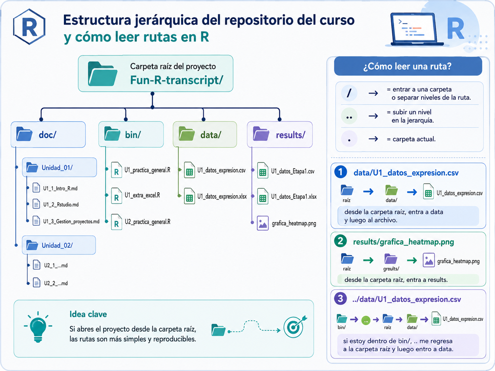
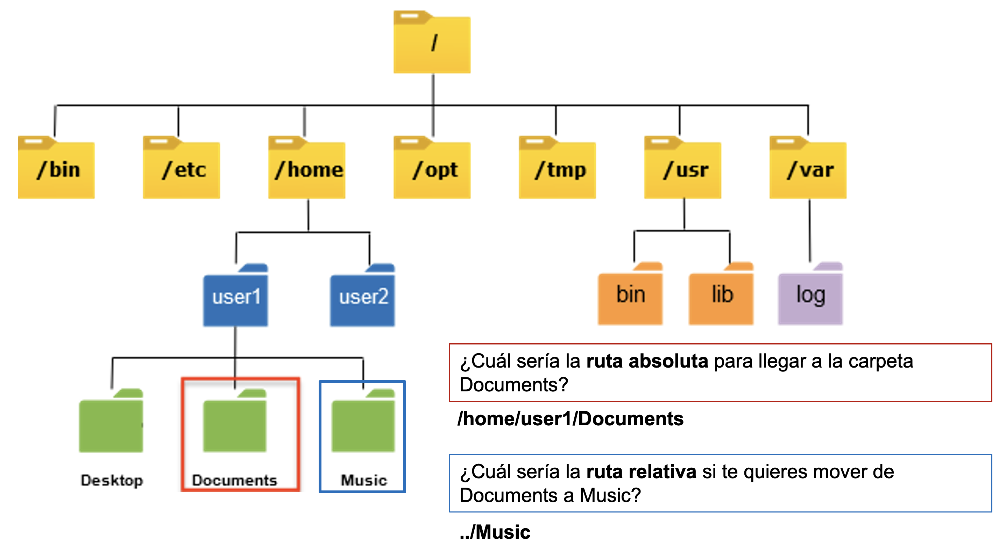
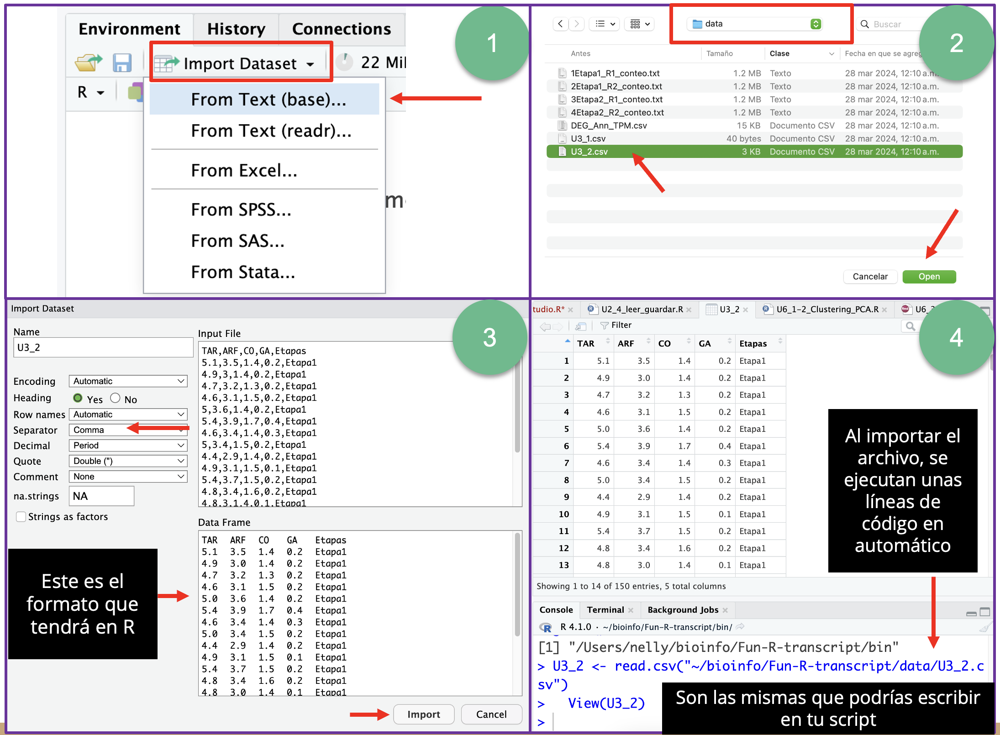

# Fundamentos de programación en R

## Unidad 1

---

## 1.4 Rutas; abrir y guardar archivos

* [Presentación](https://docs.google.com/presentation/d/e/2PACX-1vRQn4PwMC5CyrPGtwgxQZ0dGVmloxjsOtPEmkiYLwbI8fVpj6QaDE0OJl_r8Uq-pA/pub?start=false&loop=false&delayms=60000)

* [Script U1_practica_general.R](../../bin/U1_practica_general.R) de esta unidad en la carpeta `bin`.

---

## Objetivo de esta sección

Al finalizar esta sección, podrás identificar rutas dentro del proyecto, leer un archivo `.csv` desde la carpeta `data/`, guardar un archivo generado en la carpeta `results/` y reconocer por qué registrar estos pasos en un script mejora la reproducibilidad del análisis.

---

## Aspectos básicos

Saber cómo leer y guardar archivos en RStudio es una habilidad esencial porque permite:

* acceder y preparar datos para análisis;
* documentar de dónde vienen los archivos utilizados;
* conservar un registro reproducible del flujo de trabajo;
* facilitar la colaboración y el intercambio de datos;
* trabajar con diferentes formatos, como `.csv`, `.txt`, `.xls` o `.xlsx`.

En esta sección trabajaremos principalmente con archivos `.csv`, porque pueden leerse usando funciones de R base, sin instalar paquetes adicionales.

---

## Funciones comunes para leer y guardar archivos

En RStudio, puedes leer y guardar archivos utilizando varias funciones. Algunas pertenecen a R base y otras requieren paquetes adicionales.

| Para...          | Paquete   | Función         | Tipo de archivos       |
| ---------------- | --------- | --------------- | ---------------------- |
| Leer archivos    | base      | `read.csv()`    | `.csv`                 |
| Leer archivos    | `readr`   | `read_csv()`    | `.csv`                 |
| Leer archivos    | `readxl`  | `read_excel()`  | `.xls`, `.xlsx`        |
| Leer archivos    | base      | `read.table()`  | `.txt`, `.tsv`, `.dat` |
| Leer archivos    | `readr`   | `read_tsv()`    | `.tsv`, `.txt`         |
| Guardar archivos | base      | `write.csv()`   | `.csv`                 |
| Guardar archivos | `readr`   | `write_csv()`   | `.csv`                 |
| Guardar archivos | `writexl` | `write_xlsx()`  | `.xlsx`                |
| Guardar archivos | base      | `write.table()` | `.txt`, `.tsv`, `.dat` |
| Guardar archivos | `readr`   | `write_tsv()`   | `.tsv`, `.txt`         |

> En la práctica principal usaremos funciones de R base: `read.csv()` y `write.table()`.

---

## Primero, ¿en dónde estás?

Antes de leer o guardar archivos, necesitamos saber desde dónde está trabajando R.

Para revisar el directorio de trabajo actual, usa:

```r
getwd()
```

Si abriste el proyecto desde la carpeta raíz del repositorio, `getwd()` debería mostrar una ruta que termina en el nombre de la carpeta principal del curso.

También puedes revisar qué archivos y carpetas hay en el directorio actual con:

```r
dir()
```

---

## Recordatorio: estructura del proyecto y rutas

Recuerda que estamos trabajando desde la **carpeta raíz** del proyecto. Desde ahí podemos entrar a carpetas como `data/`, `bin/` o `results/` usando rutas relativas.



En este curso usaremos una estructura como esta:

```text
Fun-R-transcript/
├── doc/
├── bin/
├── data/
└── results/
```

La carpeta `data/` contiene los datos originales o de entrada.
La carpeta `results/` contiene los archivos generados durante los ejercicios o análisis.

Por ejemplo, si queremos leer un archivo que está dentro de `data/`, podemos escribir:

```r
"data/U1_datos_expresion.csv"
```

Si queremos guardar un resultado dentro de `results/`, podemos escribir:

```r
"results/U1_datos_Etapa1.txt"
```

---

## Rutas absolutas y rutas relativas

Una **ruta absoluta** indica la ubicación completa de un archivo en una computadora. Por ejemplo:

```text
/Users/nombre_usuario/Documents/Fun-R-transcript/data/U1_datos_expresion.csv
```

El problema de las rutas absolutas es que dependen de cada computadora. Si compartes tu script con otra persona, esa ruta probablemente no funcionará.

Una **ruta relativa** indica la ubicación de un archivo tomando como referencia el directorio de trabajo actual. Si abrimos el proyecto desde la carpeta raíz, podemos usar rutas más simples:

```r
"data/U1_datos_expresion.csv"
```

o:

```r
"results/U1_datos_Etapa1.txt"
```

Esto hace que el proyecto sea más fácil de compartir y reproducir.



---

## ¿Qué significan `/`, `..` y `.` en una ruta?

Al trabajar con rutas, verás algunos símbolos importantes:

| Símbolo | Significado                                                    |
| ------- | -------------------------------------------------------------- |
| `/`     | Separa niveles de carpetas o indica que entramos a una carpeta |
| `..`    | Sube un nivel en la jerarquía de carpetas                      |
| `.`     | Representa la carpeta actual                                   |

Por ejemplo:

```r
"data/U1_datos_expresion.csv"
```

significa: desde la carpeta raíz, entra a `data/` y busca el archivo `U1_datos_expresion.csv`.

En cambio:

```r
"../data/U1_datos_expresion.csv"
```

significa: sube un nivel con `..`, luego entra a `data/` y busca el archivo.

En este curso, como abriremos el proyecto desde la carpeta raíz, usaremos rutas como:

```r
"data/U1_datos_expresion.csv"
```

sin necesidad de escribir `../` en la práctica principal.

---

## Tip: usar `Tab` para escribir rutas

Cuando escribas una ruta dentro de comillas, puedes presionar la tecla `Tab` para que RStudio te ayude a completar nombres de carpetas o archivos.

Por ejemplo, si escribes:

```r
read.csv("data/
```

y presionas `Tab`, RStudio puede mostrarte los archivos disponibles dentro de la carpeta `data`.

Esto ayuda a evitar errores de escritura en las rutas y a verificar que el archivo realmente está en la carpeta indicada.

También puedes usar `Tab` después de escribir parte del nombre de un archivo:

```r
read.csv("data/U1_
```

RStudio mostrará opciones que coincidan con ese inicio, como:

```text
U1_datos_expresion.csv
```

Este recurso es muy útil cuando trabajamos con archivos dentro de carpetas como `data/`, `bin/` o `results/`.

---

## Con línea de código

La forma más recomendable de leer y guardar archivos durante un análisis es usando código dentro de un script. Así queda registrado qué archivo se usó, dónde estaba y cómo fue importado.

---

## Leer archivos CSV

Para leer archivos `.csv`, podemos usar la función `read.csv()` de R base.

La estructura general es:

```r
objeto <- read.csv("ruta/al/archivo.csv", header = TRUE, sep = ",")
```

Donde:

* `objeto` es el nombre que tendrá la tabla dentro de R;
* `read.csv()` es la función que lee el archivo;
* `"ruta/al/archivo.csv"` indica dónde está el archivo;
* `header = TRUE` indica que la primera fila contiene nombres de columnas;
* `sep = ","` indica que las columnas están separadas por comas.

---

## Ejercicio: leer un archivo CSV

En este ejercicio leeremos el archivo:

```text
data/U1_datos_expresion.csv
```

Este archivo se encuentra dentro de la carpeta `data/`.

Ejecuta:

```r
data_expresion <- read.csv(
  "data/U1_datos_expresion.csv",
  header = TRUE,
  sep = ","
)
```

Con esta línea estamos leyendo el archivo `U1_datos_expresion.csv` y guardándolo dentro de R como un objeto llamado `data_expresion`.

---

## Explorar el objeto importado

Después de importar los datos, podemos revisar el objeto de varias formas.

Para imprimirlo en la consola:

```r
data_expresion
```

Para ver las primeras filas:

```r
head(data_expresion)
```

Para revisar los nombres de las columnas:

```r
names(data_expresion)
```

Para conocer su estructura general:

```r
str(data_expresion)
```

Estas funciones ayudan a verificar que el archivo se importó correctamente.

---

## Modificar los datos sin alterar el archivo original

Cuando leemos un archivo en R, el archivo original no se modifica automáticamente. R crea una copia en memoria con el nombre del objeto que asignamos.

Por ejemplo, el archivo original sigue estando en:

```text
data/U1_datos_expresion.csv
```

y dentro de R trabajamos con el objeto:

```r
data_expresion
```

Esto permite explorar, filtrar o modificar datos sin alterar el archivo original.

---

## Filtrar datos

Ahora filtraremos solo las filas correspondientes a `Etapa1`.

```r
filtered_data_etapa1 <- subset(data_expresion, Etapas == "Etapa1")
```

Con esta línea creamos un nuevo objeto llamado `filtered_data_etapa1`.

Para revisarlo:

```r
filtered_data_etapa1
```

También puedes usar:

```r
head(filtered_data_etapa1)
```

---

## Guardar archivos generados

Después de modificar o filtrar datos, podemos guardar el resultado como un nuevo archivo.

En este curso seguiremos esta regla:

* los datos originales o de entrada se guardan en `data/`;
* los archivos generados durante los ejercicios se guardan en `results/`.

Esto nos ayuda a no mezclar los datos originales con los resultados producidos durante el análisis.

---

## Guardar el resultado como archivo `.txt`

Para guardar el objeto `filtered_data_etapa1` como archivo `.txt`, usaremos `write.table()`:

```r
write.table(
  filtered_data_etapa1,
  "results/U1_datos_Etapa1.txt",
  sep = "\t",
  row.names = FALSE
)
```

En esta línea:

* `filtered_data_etapa1` es el objeto que queremos guardar;
* `"results/U1_datos_Etapa1.txt"` indica dónde se guardará el archivo;
* `sep = "\t"` indica que las columnas estarán separadas por tabulaciones;
* `row.names = FALSE` evita guardar una columna extra con los nombres o números de fila.

### Nota sobre el formato del código

En R, una misma instrucción puede escribirse en una sola línea o en varias líneas.

Por ejemplo, esta instrucción:

```r
write.table(filtered_data_etapa1, "results/U1_datos_Etapa1.txt", sep = "\t", row.names = FALSE)
```

hace exactamente lo mismo que esta otra:

```r
write.table(
  filtered_data_etapa1,
  "results/U1_datos_Etapa1.txt",
  sep = "\t",
  row.names = FALSE
)
```

La diferencia está en la forma de escribir el código, no en el resultado.

R entiende que la instrucción continúa mientras los paréntesis no se hayan cerrado. Por eso podemos separar los argumentos en varias líneas.

Ambos estilos son válidos. Lo importante es que la instrucción esté completa y que los paréntesis, comillas y comas estén correctamente escritos.

---

Después de ejecutar esta línea, revisa la carpeta `results/`. Debería aparecer el archivo:

```text
U1_datos_Etapa1.txt
```

---

## Guardar el resultado como archivo `.csv`

También podríamos guardar el resultado como un archivo `.csv`:

```r
write.csv(
  filtered_data_etapa1,
  "results/U1_datos_Etapa1.csv",
  row.names = FALSE
)
```

Este archivo también se guardará dentro de la carpeta `results/`.

---

## Flujo completo de la práctica

El flujo básico de esta sección es:

```r
# 1. Revisar dónde estamos
getwd()
dir()

# 2. Leer el archivo CSV desde data/
data_expresion <- read.csv(
  "data/U1_datos_expresion.csv",
  header = TRUE,
  sep = ","
)

# 3. Explorar el objeto
head(data_expresion)
names(data_expresion)

# 4. Filtrar datos de Etapa1
filtered_data_etapa1 <- subset(data_expresion, Etapas == "Etapa1")

# 5. Guardar el resultado en results/
write.table(
  filtered_data_etapa1,
  "results/U1_datos_Etapa1.txt",
  sep = "\t",
  row.names = FALSE
)
```

Este mismo flujo se encuentra integrado en el script de apoyo:

```text
bin/U1_practica_general.R
```

---

## Desde la interfaz de RStudio

También puedes cargar archivos desde la interfaz gráfica de RStudio:

1. En el panel **Environment**, haz clic en **Import Dataset**.
2. Selecciona el tipo de archivo que deseas importar, por ejemplo `.csv`, `.txt` o `.xlsx`.
3. Busca el archivo en el Explorador de archivos o Finder.
4. Revisa que el formato de entrada sea correcto. Por ejemplo, en un archivo `.csv`, verifica que el separador sea una coma `,`.
5. Haz clic en **Import**.



Al importar el archivo, RStudio ejecuta automáticamente algunas líneas de código en la consola. Si observas la consola, verás que esas instrucciones son similares a las que podrías escribir en tu script.

Sin embargo, hay un detalle importante: **ese código no se guarda automáticamente en tu script**.

Esto significa que, aunque el archivo se haya cargado correctamente, si abres tu proyecto semanas o meses después, puede ser difícil recordar qué archivo importaste, dónde estaba guardado o qué instrucciones se usaron para cargarlo.

Por eso, usar la interfaz puede ser útil para explorar al inicio, pero para un análisis reproducible es mejor escribir y guardar el código en un script. Así queda registrado el nombre del archivo, su ruta y la forma en que fue importado.

En resumen:

* la interfaz ayuda a explorar;
* la consola muestra el código que se ejecutó;
* el script conserva el registro del análisis.

---

## Para explorar más

En la carpeta `bin` encontrarás el script:

```text
U1_extra_excel.R
```

Este script incluye una práctica adicional para leer y guardar archivos de Excel usando los paquetes `readxl` y `writexl`.

No es una actividad obligatoria de la sesión. Puedes revisarla después de clase si quieres practicar con otros formatos de archivo o explorar cómo usar paquetes adicionales para importar y exportar datos.

Para trabajar con Excel desde R, primero es necesario instalar y cargar los paquetes correspondientes.

```r
# Instalar paquetes, solo si no los tienes instalados
install.packages("readxl")
install.packages("writexl")
```

Después, se pueden cargar con:

```r
library(readxl)
library(writexl)
```

Para leer el archivo Excel:

```r
datos_excel <- read_excel("data/U1_datos_expresion.xlsx")
```

Para filtrar los datos de `Etapa1`:

```r
filtered_data_excel <- subset(datos_excel, Etapas == "Etapa1")
```

Para guardar el resultado como archivo Excel:

```r
write_xlsx(
  filtered_data_excel,
  "results/U1_datos_Etapa1.xlsx"
)
```

Recuerda que este flujo está en el script extra:

```text
bin/U1_extra_excel.R
```

---

## Para recordar

En esta sección practicamos cómo leer y guardar archivos desde RStudio.

Ideas clave:

* R necesita conocer la ruta del archivo que queremos leer o guardar.
* Si abrimos el proyecto desde la carpeta raíz, podemos usar rutas relativas simples.
* `data/` debe contener datos originales o de entrada.
* `results/` debe contener archivos generados durante los ejercicios.
* `read.csv()` permite leer archivos `.csv`.
* `write.table()` y `write.csv()` permiten guardar resultados.
* La tecla `Tab` ayuda a autocompletar rutas y nombres de archivos.
* La interfaz gráfica puede ayudar a importar datos, pero el script conserva el registro reproducible del análisis.

---

## Fuentes de información

* [Lectura de bases de datos](https://fhernanb.github.io/Manual-de-R/read.html)
* [Exportar datos](https://bookdown.org/jboscomendoza/r-principiantes4/exportar-datos.html)
* [R for Data Science: Importación de datos](https://es.r4ds.hadley.nz/import.html)
* [Data Carpentry: Introduction to R for Genomics](https://datacarpentry.org/genomics-r-intro/00-introduction.html)

---

## Siguiente tema

[Unidad 2.1 Introducción a las variables y funciones](../Unidad_02/U2_1_Intro_var_funciones.md)
