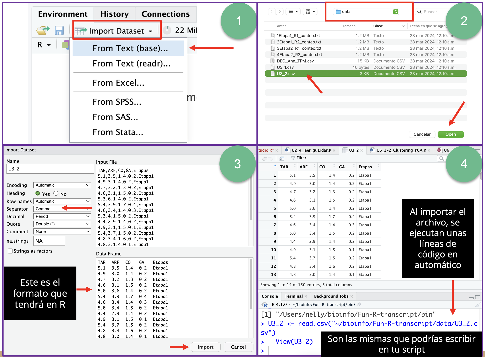

# Fundamentos de programación en R

## Unidad 1

---

## 1.4 Rutas; abrir y guardar archivos

---

### Aspectos básicos

Saber cómo leer y guardar archivos en RStudio es una habilidad esencial que te permite:

- Acceder y preparar datos para análisis.
- Asegurar la reproducibilidad y documentación de tus proyectos.
- Facilitar la colaboración y el intercambio de datos.
- Integrar datos de múltiples fuentes y trabajar con diferentes formatos (.txt, .csv, .xls, etc).

---

En RStudio, puedes leer y guardar archivos utilizando varias funciones. Aquí hay algunos ejemplos comunes para leer/importar y guardar/exportar archivos en diversos formatos como **CSV**, **Excel**, y **archivos de texto** (.txt).

A continuación, observa el siguiente **Cuadro comparativo** que resume las funciones, sus paquetes, el tipo de archivo que manejan y si es para importar/leer o exportar/guardar archivos en RStudio.

| Para ... | Paquete   | Función           | Tipo de archivos que maneja (extensión) |
|------------------------------|-----------|-------------------|-----------------------------------------|
| Leer archivos                | base      | `read.csv()`      | .csv                                    |
| Leer archivos                | **readr**     | `read_csv()`      | .csv                                    |
| Leer archivos                | `readxl`    | `read_excel()`    | .xls, .xlsx                             |
| Leer archivos                | base      | `read.table()`    | .txt, .tsv, .dat                        |
| Leer archivos                | **readr**     | `read_tsv()`      | .tsv, .txt                              |
| Guardar archivos             | base      | `write.csv()`     | .csv                                    |
| Guardar archivos             | **readr**     | `write_csv()`     | .csv                                    |
| Guardar archivos             | _writexl_   | `write_xlsx()`    | .xlsx                                   |
| Guardar archivos             | base      | `write.table()`   | .txt, .tsv, .dat                        |
| Guardar archivos             | **readr**     | `write_tsv()`     | .tsv, .txt                              |

---

### Primero, ¿en donde estás?

Recordemos algunas funciones básicas para saber en que ruta/directorio estas, prueba con `getwd()`. 

Al obtener la ruta, notaras que tiene una estructura especial, la podemos resumir como "ruta/al/archivo.csv" donde cada nivel del directorio general esta separado por diagonales **/**. Aquí una imagen para ilustrar los niveles de los directorios.


Si quieres saber más información de las [rutas](https://www.educatica.es/sistemas-operativos/principios-basicos/sistemas-de-ficheros/rutas-de-ficheros-y-directorios/), puedes buscar información sobre las [rutas absolutas](https://docs.oracle.com/cd/E19253-01/816-3938/filemanager-8/index.html) y las [rutas relativas](https://docs.oracle.com/cd/E19253-01/816-3938/filemanager-9/index.html).

## Con línea de código

### Leer archivos en R

#### Leer archivos CSV

Para leer archivos CSV, puedes usar la función `read.csv()` del paquete base de R o la función `read_csv()` del paquete `readr`:

```r
# Usando la función base de R
data <- read.csv("ruta/al/archivo.csv")

# Usando el paquete readr
library(readr)
data <- read_csv("ruta/al/archivo.csv")
```

#### Leer archivos Excel

Para leer archivos Excel, puedes usar el paquete `readxl`:

```r
library(readxl)
data <- read_excel("ruta/al/archivo.xlsx", sheet = "nombre_hoja")
```

#### Leer archivos de texto

Para leer archivos de texto, puedes usar la función `read.table()` del paquete base o `read_tsv()` del paquete `readr` para archivos delimitados por tabulaciones:

```r
# Usando la función base de R
data <- read.table("ruta/al/archivo.txt", header = TRUE, sep = "\t")

# Usando el paquete readr
library(readr)
data <- read_tsv("ruta/al/archivo.txt")
```

### Guardar archivos en R

#### Guardar archivos CSV
Para guardar archivos en formato CSV, puedes usar la función `write.csv()` del paquete base o la función `write_csv()` del paquete `readr`:

```r
# Usando la función base de R
write.csv(data, "ruta/al/archivo.csv", row.names = FALSE)

# Usando el paquete readr
library(readr)
write_csv(data, "ruta/al/archivo.csv")
```

#### Guardar archivos Excel

Para guardar archivos Excel, puedes usar el paquete `writexl`:

```r
library(writexl)
write_xlsx(data, "ruta/al/archivo.xlsx")
```

#### Guardar archivos de texto

Para guardar archivos de texto, puedes usar la función `write.table()` del paquete base o la función `write_tsv()` del paquete `readr`:

```r
# Usando la función base de R
write.table(data, "ruta/al/archivo.txt", sep = "\t", row.names = FALSE)

# Usando el paquete readr
library(readr)
write_tsv(data, "ruta/al/archivo.txt")
```

---

### Ejemplo

Este es un ejemplo desde como importar un archivo CSV. Esta base de datos se puede cambiar en R sin que altere el archivo original. A continuación, modifica el archivo importando en R con una operación simple y ahora hay que guarda/exportar el resultado en un nuevo archivo CSV:

```r
# Leer el archivo CSV
data <- read.csv("ruta/al/archivo.csv")

# Realizar una operación simple (por ejemplo, filtrar filas)
filtered_data <- subset(data, columna > valor)

# Guardar el archivo CSV resultante
write.csv(filtered_data, "ruta/al/nuevo_archivo.csv", row.names = FALSE)
```

### Ejercicio

Siguiendo el ejemplo, ahora has una prueba importando los datos del archivo U3_2.csv que se encuentran en la carpeta data. Recuerda asignar esa base de datos a un nuevo objeto o variable en R.

Después, exportar el archivo a un formato .txt con otro nombre.

```R
# Ejercicio. Con los datos U3_2.csv dentro de la carpeta data.
# Conserva los encabezados de las columnas 
# Este archivo esta delimitado por ","

data_expresion <- read.csv("../data/U3_2.csv", header = T, sep = ",") 

#Explora el objeto
data_expresion

# Realizar una operación simple (por ejemplo, filtrar solo los datos de Etapa1)
filtered_data_etapa1 <- subset(data_expresion, Etapas == "Etapa1")

#Guardar el archivo en formato .txt
#Usando la función base de R
write.table(filtered_data_etapa1, "../data/filtered_data_Etapa1.txt", sep = "\t", row.names = T)

# Guardar el archivo CSV resultante
#write.csv(filtered_data, "ruta/al/nuevo_archivo.csv", row.names = FALSE)

```

Este flujo básico te permitirá manejar archivos en RStudio desde el panel de Editor de manera efectiva, además de llevar un registro de la ruta del archivo original. 

Por otro lado, si aún no te sientes muy cómodo puedes ir practicando a través de la interfaz gráfica de RStudio.

## Desde la interfaz de RStudio

1. Puedes leer/cargar archivos desde el panel de "Environment", haciendo click en "Import Data set". Desde ahí selecciona el tipo de archivo que desees importar, csv, excel, txt, etc.
2. Busca el archivo en el Explorador de Archivos/Finder.
3. Aparecerá un panel donde veras el formato del archivo de entrada y el formato del archivo de salida que en este caso será un **data.frame**. Revisa que el tipo de *Separador* coincida con el archivo original, en el ejemplo se trata de un archivo **csv**, por lo que el separador es por "comma" (,). Da click en **Import** al final.
4. Inmediatamente después la interfaz ejecutara una líneas de código para importar el archivo, si lo observas detalladamente notarás que son las mismas que vimos en la sección anterior. El nombre del objeto en R que ahora guarda la base de datos recibe el mismo nombre del archivo original por default.



Esta forma de importar archivos puede ser la más facil al principio, pero conforme avances y necesites llevar un registro de los archivos originales que ocupas y sus rutas para poder encontrarlos nuevamente, notarás que será mejor usar las líneas de código desde el Editor y añadir tus anotaciones/comentarios. Además, la forma de exportar los archivos es a través de líneas de código.

### Fuentes de información

- [Lectura de bases de datos](https://fhernanb.github.io/Manual-de-R/read.html)
- [Exportar datos](https://bookdown.org/jboscomendoza/r-principiantes4/exportar-datos.html)


### Siguiente tema: [Unidad 2.1 Introducción a las variables y funciones](../Unidad_02/U2_1_Intro_var_funciones.md)
