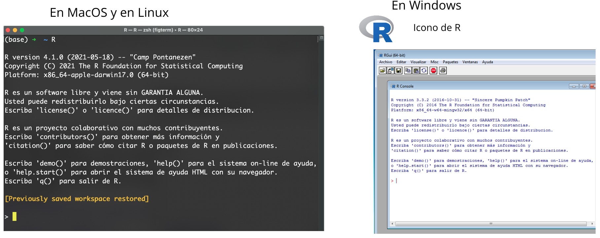
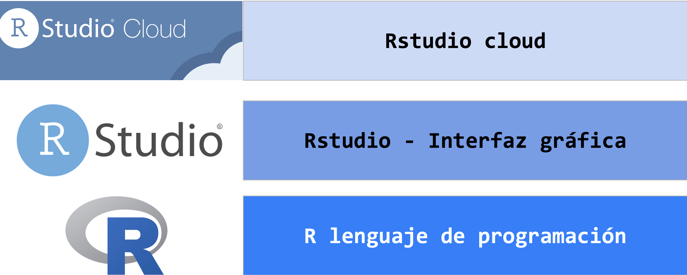
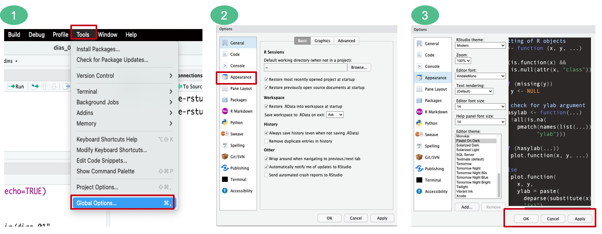
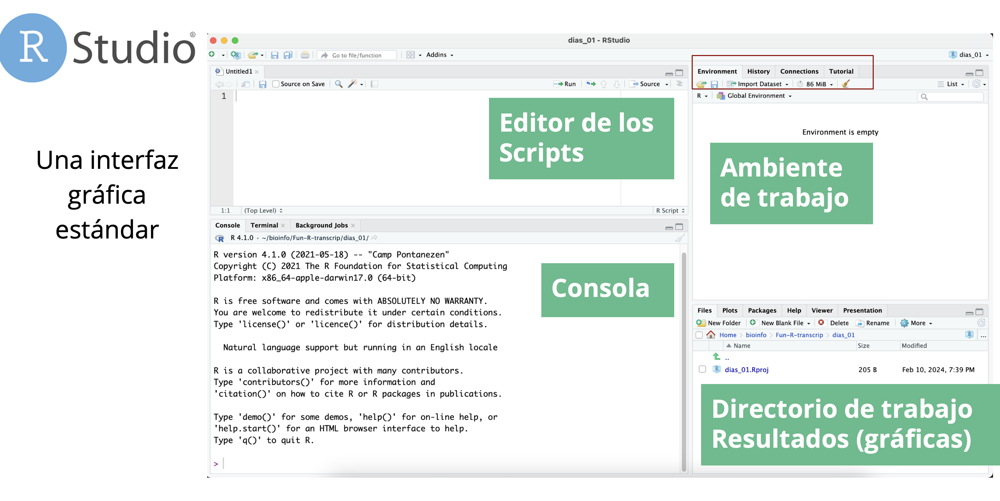
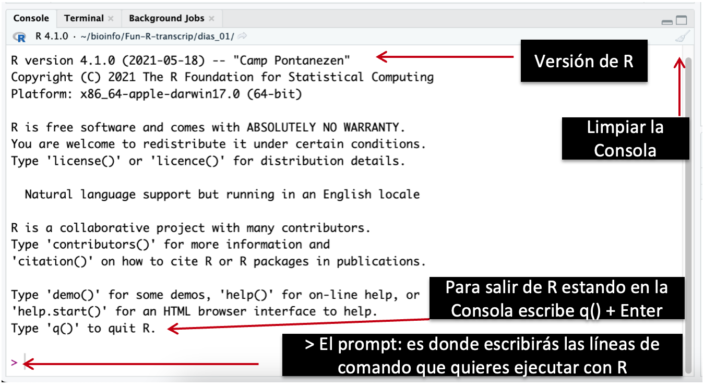
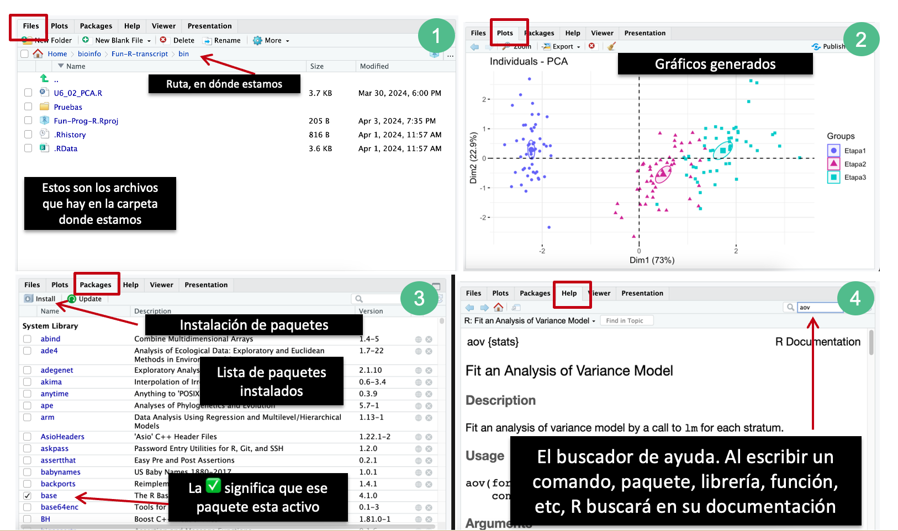
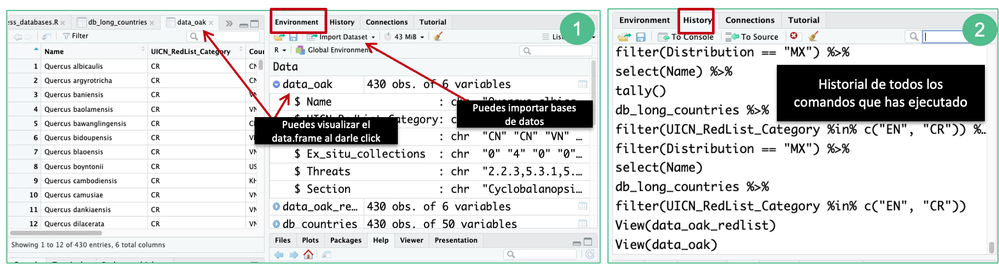
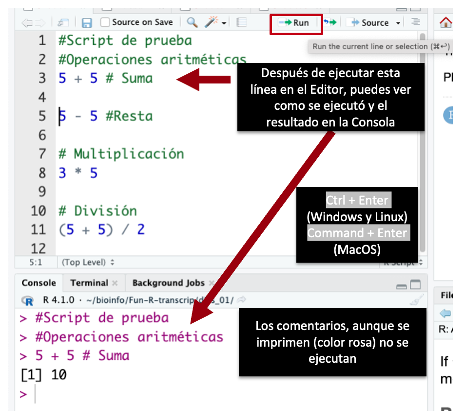
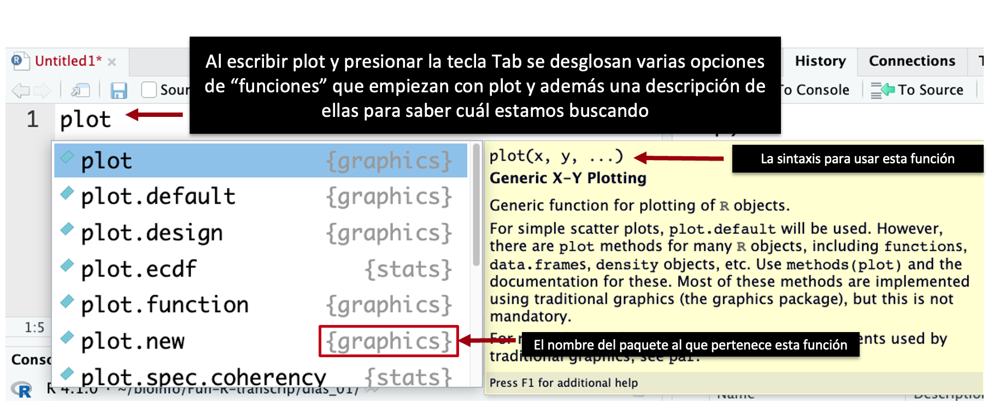
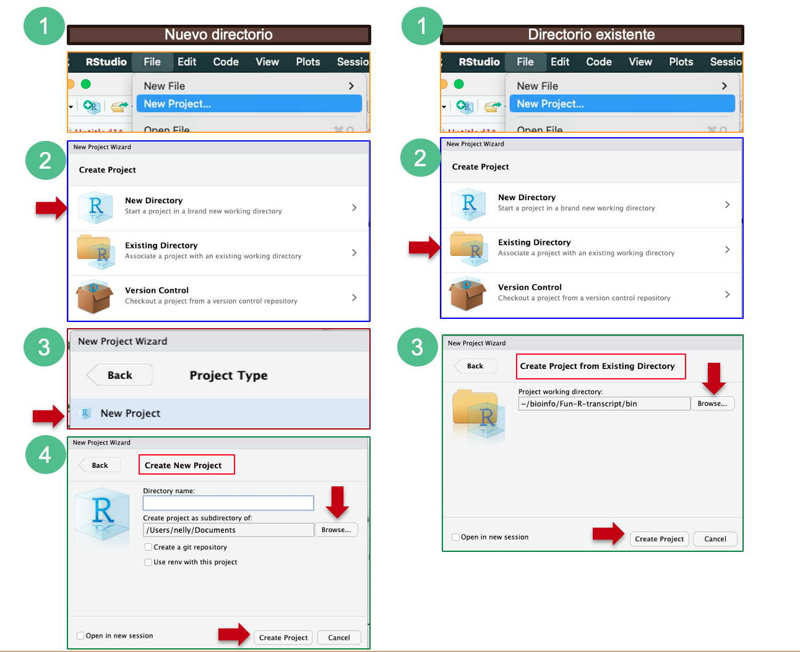

# Fundamentos de programación en R

## Unidad 1

---

## 1.2 Uso de Rstudio

---

### R - el lenguaje de programación

Podemos entrar a la consola de R desde la terminal de la computadora. Si ya lo tienes instalado solo necesitas teclear `R` y dar `Enter`.




#### Tips:

- **Cancelar comandos**: si usas R desde la línea de comandos, desde la consola o terminal en lugar de estar en el editor de RStudio y quieres cancelar el proceso, debes usar `Ctrl` + `C` en lugar de **Esc** para detener todo. 

R es un lenguaje de programación y su entorno puede llegar a ser dificil manejar desde la terminal o en su ambiente de consola.

## Aquí es donde surge Rstudio


[RStudio](https://posit.co/download/rstudio-desktop/) es un entorno de desarrollo integrado y gratuito de código abierto, proporciona un **editor incorporado**, funciona **en todas las plataformas** (incluso en servidores) y ofrece muchas ventajas, como la integración de control de versiones y gestión de proyectos.


R, el lenguaje de programación es la base.
RStudio, es una interfaz gráfica que nos ayuda a trabajar con R pero desde un ambiente amigable para el usuario.
RStudio Cloud, es RStudio en línea donde la principal ventaja es que no necesitas instalar nada en tu computadora personal, aunque necesitarás una buena conexión de internet.



En resumen: la principal ventaja de usar RStudio es el **Editor** pero además sus otras ventanas permiten trabajar con **R** (el lenguaje de programación) desde una **interfaz gráfica** más **amigable** con el usuario.

### Empecemos explorando la interfaz y como cambiar su apariencia a gusto personal

**Estética del editor.** Podemos elegir el resaltado de la sintaxis, el tipo y tamaño de la letra, el fondo, etc.



En **Appearance** podemos cambiar varias características de la estética de la interfaz.

Para ver los cambios da click en **Apply** y si te convencen, da click en **OK**.


### ¿Cuáles son las ventanas de trabajo en RStudio?

Es una interfaz gráfica estándar con cuatro ventanas principales:

1. **Consola**
2. **Directorio de trabajo/Visualizador de gráficas/Paquetes/Ayuda**
3. **Ambiente de trabajo (Environment)**
4. **Editor de los scripts**



1. **Consola:**

- La línea de comando es una gran y compleja calculadora.
- En Rstudio ya tenemos el panel de la Consola listo.



2. **Directorio de trabajo/Visualizador de gráficas/Paquetes/Ayuda**

En esta ventana tenemos múltiples pestañas.

- La primera nos muestra la ruta de nuestro **directorio de trabajo** (en dónde estamos), así como los archivos que se encuentran ahí. 

- La segunda ventana nos muestra los **gráficos** que se generan en R después de ejecutar líneas de código, desde ahí podemos exportar imágenes. 

- En la tercera pestaña se enlistan los **paquetes** instalados en R, si quieres activar alguno desde esta pestaña solo necesitar dar click en el recuadro a la izquierda de su nombre y aparecerá una palomita.

- La cuarta pestaña es la de **Ayuda**. Al ingresar el comando, función o paquete, buscará información en toda la documentación de R.



3. **Ambiente de trabajo (Environment)**

Hay varias pestañas pero vamos a centrarnos en las dos más utilizadas, el **ambiente o environment** (1) y el **historial** (2).

- En el ambiente se enlistan las variables creadas. Podemos visualizarlas al darl click en su nombre o desglosar sus características al dar click en la figura azul a la izquierda de su nombre.

- En el historial podemos ver el registro de todos los comandos que hemos ejecutado para esa sesión en R. Otra forma para navegar por el historial es desde la **consola** usando las **teclas arriba y abajo**.




4. **Editor de los scripts**

Aquí es donde escribiremos nuestro código.


Podemos enviar ejecutar todo el código (_el script_) seleccionando todas las lineas que quiera y das click en `Run` o si solo quieres ejecutar una línea de comando debes poner el cursor en esa línea y dar click en `Run` o con el teclado presiona  `Ctrl` + `Enter` (Windows y Linux) en MacOs presionas `Command` + `Enter`.

> Tip importante: Para documentar tus scripts usa # para escribir tus comentarios.





El texto después de cada línea de código se llama **“comentario”**. Todo lo que sigue después del símbolo **hash** (o numeral) **#** es ignorado por R cuando se ejecuta el código.

La documentación es muy importante para la **reproducibilidad** de los análisis y de hecho en varias revistas, para publicar tu trabajo pediran que compartas tus scripts, sin embargo, antes de publicar tu script recuerda revisarlo nuevamente.


Otra ventaja de usar el editor es que puede ayudarnos a **auto-completar** los comandos.



En la imagen vemos conceptos como paquetes y funciones que veremos con mayor detalle más adelante pero por ahora, es importante saber que acceder a sus descripciones es una buena manera de tener documentación resumida que nos ayudará a la hora de escribir y ejecutar nuestros scripts, y podemos acceder a esto desde el Editor.

### Ejercicio

Empecemos usando R como si lo hicieramos con una calculadora.

El orden de las operaciones es el mismo que has aprendido en la escuela.

```R
# Operaciones básicas

3 + 5   #   Suma
8 - 3   #   Resta
7 * 5   #   Multiplicación
1/2     #   División
4 ^ 4   #   Exponencial
4 ** 4  #   Exponencial
5 %% 3  #   Módulo
5 %/% 3 #   División entera

# Otros operadores:
# %*%	Multiplicación matricial
# %o%	Producto exterior
# %x%	Producto Kronecker
````
¿Qué obtienes al ejecutar cada línea de código?

>Recuerda que puedes usar `Run` o las teclas `Ctrl` + `Enter`


Los números pequeños o grandes tienen una notación científica:

```R
2/10000 
# Resultado: 2e-04
# es la abreviatura de “multiplicado por 10 ^ XX” 
# Entonces 2e-4 es la abreviatura de 2 * 10^(-4)
# También puedes escribir números en notación científica:
5e3  # nota la falta del signo menos aquí, ¿cuál fue el resultado?
5e-3 # ¿Qué obuviste al agregar el signo - ?
````

Podemos ir aumentando los términos en las operaciones matemáticas:

```R
5 + 5
10*8 + 3*(6 - 2/4)^10
````

### Fuentes de información:

- [Descargar RStudio](https://posit.co/downloads/)
- [RStudio is now Posit!](https://www.youtube.com/watch?v=0_UNtwEh7kY)
- [RStudio Cloud](https://posit.cloud/plans)
- [Instalación de R y RStudio](https://bookdown.org/daniel_dauber_io/r4np_book/setting-up-r-and-rstudio.html)

## Gestionar proyectos


[Good Enough Practices for Scientific Computing](https://journals.plos.org/ploscompbiol/article?id=10.1371/journal.pcbi.1005510) brinda las siguientes recomendaciones para la organización de proyectos:

- Coloque cada proyecto en su propio directorio, el cual lleva el nombre del proyecto.
- Coloque documentos de texto asociados con proyecto en el directorio doc.
- Coloque los datos sin procesar y los metadatos en el directorio data, y archivos generados durante la limpieza y análisis en el directorio results.
- Coloque los scripts fuente del proyecto y los programas en el directorio src o bin (si tienes programas traídos de otra parte o compilados localmente, en el directorio bin).
- Nombre todos archivos de tal manera que reflejen su contenido o función.


### ¿Cómo crear un proyecto en RStudio?

A continuación veremos  dos formas para crear un proyecto en RStudio, la primera es cuando no tenemos ningún directorio o carpeta ya creado, y la segunda es cuando queremos enlazar nuestro proyecto a un directorio o carpeta ya existente.

**En el primer caso - Nuevo directorio:**

- Haz clic en el menú “File”, luego en “New Project”
- Haz clic en “New Directory”
- Haz clic en “New Project”
- Introduce el nombre del directorio para guardar tu proyecto, por ejemplo: “Curso_R_2024”. Puedes seleccionar una ubicación específica donde se creara la carpeta del Nuevo proyecto con “Browse”
    -  Si quieres conectarlo a una cuenta en Github, selecciona la casilla de verificación “Create a git repository”

- Haz clic en el botón “Create Project”

**En el segundo caso -  Directorio existente:**

- Haz clic en el menú “File”, luego en “New Project”
- Haz clic en “Existing Directory”
- Haz clic en “Browse” y selecciona la carpeta con la que quieres enlazar tu proyecto
- Haz clic en el botón “Create Project”




**Ejercicio**

- Crea tu proyecto de R enlazándolo a la carpeta del curso que descargaste desde Github.

Tip: [Descarga la carpeta desde Github como un archivo Zip](../../README.md)

### Conceptos básicos: carpetas

Podemos movernos entre carpetas y archivos por medio de comandos.

```R
# ¿Cuál es el directorio de trabajo en el que estas?

getwd()

# ¿Para que funciona setwd()?
?setwd() #Este comando cumple la misma función que Session > Set working directory 
# ¿Qué nos muestra el comando dir() ?
dir() # muestra los archivos que están en la carpeta donde te encuentras

```

### Conceptos básicos: packages

En R, un paquete (package) se define como una **unidad organizada** de **código**, **funciones**, **datos** y **documentación** que extiende las capacidades de R y proporciona herramientas adicionales para realizar análisis de datos y tareas relacionadas.

Aspectos claves que definen un paquete en R:

- **Estructura organizada:** sigue una estructura de directorios organizada que incluye subdirectorios específicos para almacenar código fuente, datos, documentación y otros archivos relacionados con el paquete.

- **Código y funciones:** contiene código fuente que define nuevas funciones y métodos para realizar tareas específicas de análisis de datos, modelado estadístico, visualización y más. Estas funciones están diseñadas para ser reutilizables y pueden ser llamadas por los usuarios en sus propios scripts y análisis.

- **Datos y conjuntos de datos:** los paquetes pueden incluir conjuntos de datos de ejemplo, archivos de datos o bases de datos que son utilizados por las funciones del paquete para ejemplificar su uso o para realizar análisis demostrativos.

- **Documentación:** incluyen documentación detallada que describe el propósito del paquete, cómo instalarlo, cómo usar sus funciones y métodos, ejemplos de uso y más. Se puede acceder a esta documentación a través de funciones de ayuda integradas en R.

- **Compilación y distribución:** Los paquetes de R se distribuyen en archivos comprimidos con una extensión ".tar.gz" para sistemas operativos del tipo Unix y ".zip" para sistemas Windows. Estos archivos contienen todos los componentes del paquete, incluido el código fuente, la documentación y los datos, y se pueden instalar fácilmente en R utilizando la función `install.packages()`.


Actualmente, el repositorio de paquetes CRAN (The Comprehensive R Archive Network) cuenta con 20,420 paquetes disponibles, ha sido un gran incremento desde el 2017 cuando tenía aproximadamente 10,000 paquetes.

**¿Cómo se instalan los paquetes en RStudio?**

Hay tres formas para instalar paquetes:

1. Desde la barra de Menús de Rstudio: en _Tools_ > _Install packages..._
2. Desde la venta de Directorio de Trabajo/Gráficos/Paquetes: como vimos previamente en la ventana de _Paquetes_ y dando click en _Instalar_. 
3. Desde el Editor/Consola: con el comando `install.packages()`

**Ejercicio**
Instala el paquete de `ggplot2` desde cualquier de las tres opciones anteriores.

Tip:

```R
#Desde el editor en RStudio puedes averiguar más acerca de la función install.packages
?install.packages()

#Después de revisar su sintaxis encontrarás que debemos poner el nombre del paquete que quieras instalar dentro de los paréntesis:

install.packages(ggplot2)

# Cuidado: si te aparece un error puede ser por la versión de R, en algunas versiones previas necesitas poner entre comillas el nombre del paquete: install.packages("ggplot2") 
```

### Conceptos básicos: salir

Para salir de R desde la interfaz de Rstudio:

- _File_ > _Quit Session_. Pueden guardar la sesión para que cuando vuelvan a abrir Rstudio se abra el editor y el script de inmediato.

- Cerrar la venta de Rstudio

Los archivos de R se guardan con la extensión **.r** o **.R**


### Extra: source

La función `source` básicamente lee y ejecuta el código contenido en un archivo (extensión **.R**) y lo incorpora al espacio de trabajo de RStudio como si hubiera sido escrito directamente en la consola o en el Editor.

La sintaxis básica de la función "source" es la siguiente:

```R
source("ruta/del/archivo.R")
```

Donde "ruta/del/archivo.R" es la ubicación del archivo que contiene el código R que deseas ejecutar.

La función "source" es útil en el análisis de datos por varias razones:

1. **Reutilización de código:** Permite reutilizar fragmentos de código R almacenados en archivos externos en lugar de tener que volver a escribirlos manualmente en cada sesión. Esto facilita la gestión y mantenimiento del código, especialmente cuando se trabaja con análisis complejos que requieren múltiples pasos.

2. **Organización del código:** Al dividir el código en archivos separados, puedes organizar y estructurar tu análisis de datos de manera más ordenada y modular. Esto facilita la comprensión y la colaboración con otros usuarios, ya que pueden revisar y ejecutar cada parte del análisis por separado.

3. **Automatización de tareas:** Puedes usar la función "source" en scripts de R para automatizar tareas recurrentes. Esto te permite ahorrar tiempo y minimizar errores al evitar la necesidad de ejecutar manualmente cada paso del análisis.

En resumen, la función "source" en R es una herramienta poderosa que permite cargar y ejecutar código R desde archivos externos, lo que facilita la reutilización, organización y automatización del análisis de datos.

**Ejemplo:**
Podemos enviar la totalidad de nuestro archivo a la línea de comando con **Source**.

O seleccionando todas las líneas del **Editor** y presionar **Run** o presionar `Ctrl` + `Enter`

```R
#Desde tu sesión en RStudio, abre un nuevo archivo de R Script y desde tu Editor ejecuta la siguiente línea de código:

source("U1_1_IntroRstudio.R")

# ¿Qué paso?
```

### Fuentes de información:

- [The Comprehensive R Archive Network](https://cran.r-project.org/)
- [8. Introduction to R Packages by Ken Rice
Timothy Thornotn](https://faculty.washington.edu/kenrice/rintro/sess08.pdf)

- [Contributed Packages. CRAN](https://cran.r-project.org/web/packages/
)
- [Tutorial de programación en R orientado al estudiante de Bioquímica](https://ucodemy.github.io/rbioq/RStudio/
)

### Fuentes de información:

- [GitHub: good-enough-practices-in-scientific-computing](https://github.com/swcarpentry/good-enough-practices-in-scientific-computing/tree/gh-pages)

- [Good enough practices in scientific computing](https://journals.plos.org/ploscompbiol/article?id=10.1371/journal.pcbi.1005510)
