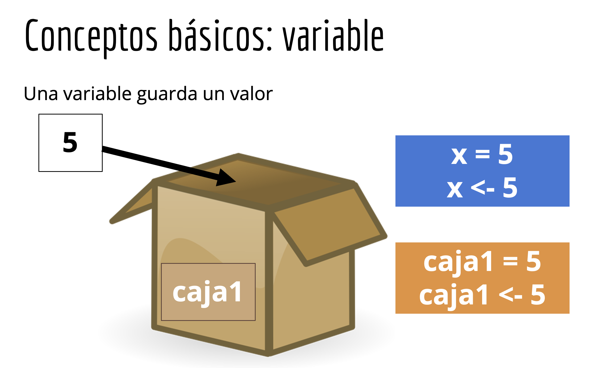

# Fundamentos de programación en R

## Unidad 2

---

## 2.1 Introducción a las variables y funciones

---

### ¿Qué es una variable?

En R, una variables es un contenedor donde podemos almacenar datos.

En R, una variable es un contenedor donde se pueden almacenar y manipular datos. Para reconocer "algo" como una variable hay que asignarle un nombre único. Puede almacenar diferentes tipos de datos (i.e., números, caractéres, matrices, vectores, data frames, listas)
Al definir una variable en R, estás creando un espacio en la memoria donde puedes almacenar valores y referenciarlos mediante el nombre asignado a esa variable.

Una analogía para entender una variable en R podría ser pensar en un contenedor físico, como una caja o un recipiente, donde puedes colocar diferentes objetos. Cada contenedor tiene un nombre único que te permite identificarlo y acceder a su contenido cuando lo necesites. 



Del mismo modo, una variable en R es como un contenedor virtual donde puedes guardar datos y referenciarlos mediante un nombre único, como **caja1** en el ejemplo.

Así como puedes guardar **diferentes tipos de objetos en diferentes contenedores físicos**, en R puedes almacenar **diferentes tipos de datos en diferentes variables**.

## ¿Variable es igual a objeto?

En el contexto de programación en R, los términos "variable" y "objeto" tienen significados específicos y relacionados, pero **no son completamente intercambiables**. 

1. **Variable:**
   - Una variable es un nombre simbólico que se utiliza para almacenar un valor o una referencia a un objeto. En otras palabras, una variable es un contenedor que puede contener diferentes tipos de datos a lo largo de su ciclo de vida.
   - En R, una variable se define mediante el operador de asignación `<-` o `=`.
   - Ejemplo:
     ```R
     x <- 42        # x es una variable que almacena el valor 42
     nombre <- "Juan" # nombre es una variable que almacena el string "Juan"
     ```

2. **Objeto:**
   - Un objeto es una instancia de una clase que puede almacenar datos y métodos para manipular esos datos. En R, casi todo es un objeto, incluyendo vectores, matrices, data.frames, listas, funciones, etc.
   - Los objetos en R tienen atributos y pueden ser manipulados mediante funciones.
   - Ejemplo:
     ```R
     vector <- c(1, 2, 3)          # vector es un objeto de clase "numeric"
     matriz <- matrix(1:9, nrow=3) # matriz es un objeto de clase "matrix"
     df <- data.frame(a = 1:3, b = c("x", "y", "z")) # df es un objeto de clase "data.frame"
     ```

### Relación entre Variables y Objetos

- En R, las variables actúan como etiquetas o nombres que apuntan a objetos almacenados en la memoria. Cuando asignas un valor a una variable, estás creando un objeto y asignándolo a esa variable.
- Una variable puede cambiar el objeto al que apunta, pero el objeto en sí puede mantenerse igual si no se modifica explícitamente.

### Ejemplo para ilustrar la diferencia:

```R
# Crear un objeto (vector) y asignarlo a una variable
mi_vector <- c(1, 2, 3, 4)

# Aquí, mi_vector es una variable que referencia un objeto de tipo vector

# Modificar el objeto
mi_vector <- mi_vector * 2

# La variable mi_vector ahora referencia un nuevo objeto, que es el resultado de multiplicar el original por 2
```

En resumen, una variable es una referencia o un nombre simbólico que apunta a un objeto, mientras que un objeto es una entidad en la memoria que puede contener datos y métodos para manipular esos datos. En R, casi todo es considerado un objeto, y las variables se utilizan para acceder y manipular estos objetos.