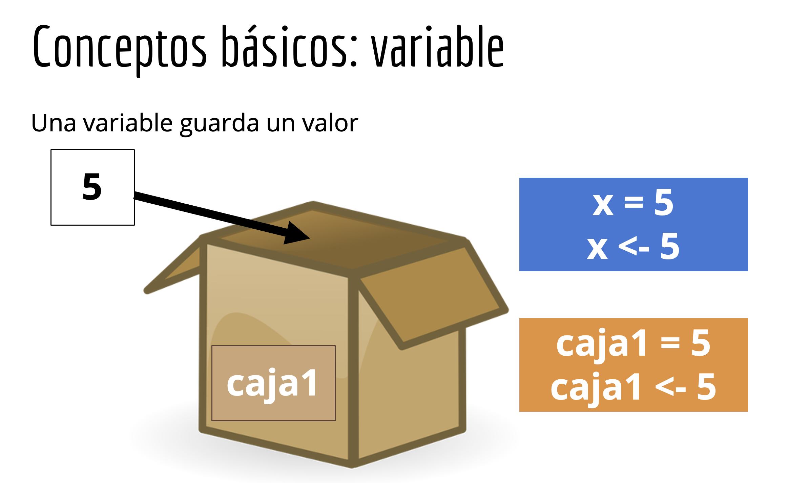
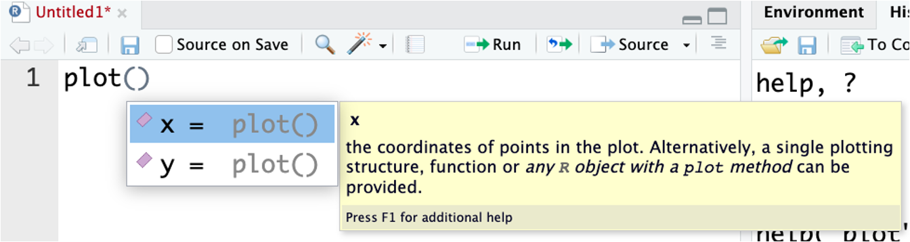

# Fundamentos de programación en R

## Unidad 2

---

#### [Versión extendida](../Unidad_02/U2_1_Intro_var_funciones_version_ext.md)

---

## 2.1 Introducción a las variables y funciones

## Objetivo

Reconocer qué son las variables y las funciones en R, practicar la asignación de valores con `<-` y distinguir entre ejecutar una operación y guardar su resultado.

* [Presentación](https://docs.google.com/presentation/d/e/2PACX-1vQw4Yy6iZP5lUw238gcODPyiUBbpRDzETNL1PAGfx9LvtF3ad_WR3fm68RBUeUuHA/pub?start=false&loop=false&delayms=60000)

* [Script de práctica general Unidad 2](../../bin/U2_practica_general.R)

---

## 1. ¿Qué es una variable?

En R, una **variable** es un nombre que usamos para guardar un valor u objeto.

Podemos imaginarla como una caja etiquetada: la etiqueta es el nombre de la variable y el contenido es el valor que guardamos.

Por ejemplo, si escribimos:

```r
caja1 <- 5
```

estamos guardando el valor `5` en una variable llamada `caja1`.



Así como podemos guardar distintos tipos de objetos en contenedores físicos, en R podemos guardar distintos tipos de datos en variables: números, texto, vectores, tablas, listas, resultados de funciones, entre otros.

> **Nota breve: variable y objeto**
> En R también es común hablar de **objetos**. Para esta sesión, podemos pensar que una variable es el **nombre** que usamos para guardar algo, y el objeto es **lo que queda guardado** con ese nombre. En la práctica, muchas veces diremos “variable” u “objeto” para referirnos a elementos que hemos creado en R.

---

## 2. Asignar valores con `<-`

Para crear una variable en R usamos el operador de asignación `<-`.

La flecha debe apuntar hacia el nombre de la variable:

```r
x <- 5
```

Esto significa: guarda el valor `5` en una variable llamada `x`.

### Ejercicio

Escribe lo siguiente en tu editor de RStudio:

> Recuerda que para ejecutar cada línea puedes dar clic en **Run** o usar **Ctrl + Enter** en Windows / **Command + Enter** en macOS.

```r
# Guardar el valor 5 en una variable llamada x
x <- 5

# Revisar qué contiene x
x
```

Ahora prueba lo siguiente:

```r
# También es posible asignar de derecha a izquierda
10 -> x

# Revisa qué contiene x
x
```

Aunque R permite usar la flecha en ambas direcciones, durante el curso usaremos principalmente `<-`, porque es la convención más común y facilita la lectura del código.

Ahora intenta ejecutar esta línea:

```r
10 <- x
```

¿Qué ocurrió?

---

## 3. Ejecutar una operación no siempre guarda el resultado

Una idea muy importante en R es distinguir entre **mostrar un resultado** y **guardar un resultado**.

Vamos a verlo con un ejemplo:

```r
# Si aún no has creado x, ejecuta esta línea
x <- 5

# Imprime lo que contiene x
x 

# Suma 1 a x
x + 1 

# Revisa si se guardó el valor de 6 en x
x
```

¿Qué sucedió?

Si no volvemos a asignar el resultado con `<-`, R solo imprime el resultado de la operación, pero no modifica el valor guardado en la variable.

Para guardar el nuevo valor tenemos dos opciones.

### Opción 1. Sobrescribir la variable

```r
# A x le sumamos 1 y guardamos el resultado nuevamente en x
x <- x + 1

# Revisamos el nuevo valor de x
x
```

### Opción 2. Guardar el resultado en una nueva variable

```r
# y será el valor de x multiplicado por 2
y <- x * 2 

# Verifica qué valores tienen x y y
x
y
```

> **Precaución:** sobrescribir variables puede ser útil, pero también puede hacer que perdamos información previa si no tenemos cuidado. En este curso buscaremos un equilibrio entre crear variables nuevas y sobrescribir variables cuando sea necesario.

---

## 4. Recomendaciones para nombrar variables

Al nombrar variables, procura:

* usar nombres claros y descriptivos;
* evitar espacios, acentos y caracteres especiales;
* no iniciar el nombre con un número;
* evitar nombres de funciones existentes, como `mean`, `plot`, `data` o `c`;
* usar una convención consistente, por ejemplo `snake_case`.

### Ejemplo

De la siguiente lista, ¿cuáles nombres conviene evitar?

| Nombre           | ¿Conviene usarlo?                                  |
| ---------------- | -------------------------------------------------- |
| `min_height`     | Sí                                                 |
| `max.height`     | Sí, aunque en este curso preferiremos `max_height` |
| `_age`           | No                                                 |
| `.mass`          | No para este curso                                 |
| `MaxLength`      | Sí, aunque en este curso preferiremos `max_length` |
| `min-length`     | No                                                 |
| `2widths`        | No                                                 |
| `celsius2kelvin` | Sí                                                 |

---

## 5. ¿Qué es una función?

Una **función** es una instrucción que le damos a R para realizar una tarea.

Muchas funciones reciben información de entrada, hacen una operación y devuelven un resultado.

Por ejemplo:

```r
sqrt(25)
mean(c(10, 15, 20))
```

En una función podemos reconocer:

* el **nombre** de la función;
* los **paréntesis**;
* los **argumentos**, es decir, la información que colocamos dentro de los paréntesis.

La siguiente imagen muestra cómo usamos la función `plot()` para generar un gráfico.


En R, podemos pensar en una función como una caja que recibe entradas, las procesa y devuelve una salida.

---

## 6. Crear una función sencilla

Además de usar funciones que ya existen en R, también podemos crear nuestras propias funciones.

Por ahora no necesitamos dominar esto, solo reconocer su estructura general.

```r
duplicar <- function(x) {
  x * 2
}

duplicar(5)
```

En este ejemplo:

* `duplicar` es el nombre de la función;
* `x` es el argumento;
* lo que está entre `{ }` es la operación que realiza la función;
* `duplicar(5)` ejecuta la función usando el valor `5`.

Prueba ahora con otros valores:

```r
duplicar(10)
duplicar(25)
```

---

## 7. Pedir ayuda sobre una función

Para consultar la ayuda de una función puedes usar:

```r
help(mean)
?mean
```

También puedes consultar ayuda sobre otras funciones:

```r
help(plot)
?plot
```

En RStudio, la tecla **Tab** permite ver sugerencias y autocompletar nombres de objetos o funciones.



---

## 8. Ejercicio integrador breve

Vamos a crear algunas variables y usar funciones sencillas.

```r
# Crear variables
muestra <- "S01"
tratamiento <- "control"
lecturas <- 15000

# Revisar su contenido
muestra
tratamiento
lecturas
```

Ahora usa una función para contar cuántos caracteres tiene el nombre de la muestra:

```r
nchar(muestra)
```

Realiza una operación con la variable `lecturas`:

```r
lecturas / 1000
```

¿El resultado anterior se guardó en una nueva variable?

Ahora guarda el resultado:

```r
lecturas_miles <- lecturas / 1000

lecturas_miles
```

### Preguntas

* ¿Qué variables creamos?
* ¿Qué valores guardan?
* ¿Qué operación solo se imprimió?
* ¿Qué resultado sí guardamos en una nueva variable?
* ¿Qué función usamos?

---

## Material extra

### ¿Variable es igual a objeto?

En el contexto de programación en R, los términos **variable** y **objeto** están relacionados, pero no son completamente equivalentes.

Una **variable** es el nombre simbólico que usamos para guardar o recuperar un valor. Por ejemplo:

```r
x <- 42
nombre <- "Juan"
```

En estos ejemplos, `x` y `nombre` son variables.

Un **objeto** es aquello que queda guardado en R y que puede tener una estructura específica. En R, casi todo lo que usamos puede considerarse un objeto: números, textos, vectores, matrices, data frames, listas y funciones.

Por ejemplo:

```r
mi_vector <- c(1, 2, 3, 4)
mi_tabla <- data.frame(
  muestra = c("S01", "S02"),
  condicion = c("control", "tratamiento")
)
```

En estos ejemplos, `mi_vector` y `mi_tabla` son nombres de variables que apuntan a objetos creados en R.

De forma sencilla:

* la **variable** es el nombre;
* el **objeto** es lo que queda guardado con ese nombre.

En la práctica del curso, usaremos ambos términos con frecuencia. Lo más importante por ahora es reconocer que cuando asignamos algo con `<-`, estamos creando un elemento que podremos reutilizar después en nuestro código.

### Ver el código interno de una función

Algunas funciones permiten ver parte de su código interno si escribimos su nombre sin paréntesis:

```r
mean
plot.default
lm
```

No necesitas entender todo ese código ahora. La idea es notar que las funciones también están construidas con instrucciones.

---

## Fuentes de información

* [Funciones básicas de R](https://fhernanb.github.io/Manual-de-R/funbas.html)

---

### Siguiente tema: [2.2 Estructuras de datos](../Unidad_02/U2_2_Estructuras_datos.md)
