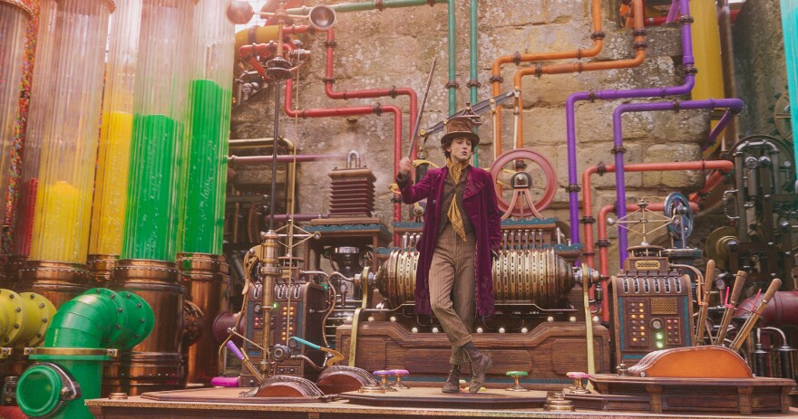
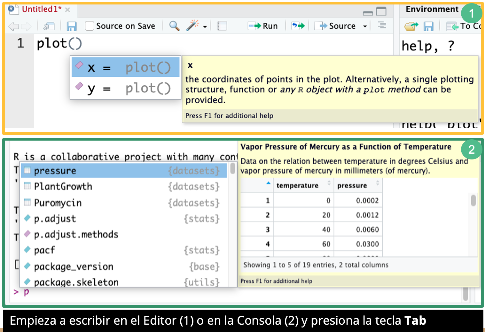

# Fundamentos de programación en R

## Unidad 2

---

#### [Versión extendida](../Unidad_02/U2_1_Intro_var_funciones_version_ext.md)

---

## 2.1 Introducción a las variables y funciones

- [Script U2_1_Intro_Var_Fun.R](../../bin/U2_1_Intro_Var_Fun.R) de esta unidad en la carpeta **bin**

---

### ¿Qué es una variable?

En R, **una variable es un contenedor donde se pueden almacenar y manipular datos**. Para reconocer "algo" como una variable hay que **asignarle un nombre único**. Puede almacenar **diferentes tipos de datos** (i.e., números, caractéres, matrices, vectores, data frames, listas).

Al definir una variable en R, estás creando un espacio en la memoria donde puedes almacenar valores y referenciarlos mediante el nombre asignado a esa variable.

Una analogía para entender qué es una variable en R es pensar en ella como un contenedor físico, por ejemplo, una caja o un recipiente, donde puedes colocar diferentes objetos. Cada contenedor tiene un nombre único que te permite identificarlo y acceder a su contenido cuando lo necesites.


Una variable en R es como un contenedor virtual donde puedes **guardar datos** y **referenciarlos** mediante un nombre único, como **caja1** en el ejemplo.

Así como puedes guardar **diferentes tipos de objetos en diferentes contenedores físicos**, en R puedes almacenar **diferentes tipos de datos en diferentes variables**.

---

#### EXTRA: ¿Variable es igual a objeto?

En el contexto de programación en R, los términos "variable" y "objeto" tienen significados específicos y relacionados, pero **no son completamente intercambiables**. 

- En R, una **variable es una referencia o un nombre simbólico** que apunta a un objeto, mientras que **un objeto es una entidad** en la memoria **que puede contener datos y métodos para manipular esos datos**. En R, casi todo es considerado un objeto, y las variables se utilizan para acceder y manipular estos objetos.

---

### Repaso: ¿qué es una variable?

- Una variable es un caracter o palabra que guarda un valor/objeto

- Operador flecha (**<-**), **debe apuntar hacia la variable**:

#### Ejercicio

Escribe los siguiente en tu editor en RStudio 

> Recuerda que para ejecutar cada operación hay que dar click en **Run** o **Ctrl + Enter** (Windows) o **Command + Enter** (MacOs).

```R
# Recordando el ejemplo de la caja, la caja en donde guardarás el valor 5, se llamará x
 x <- 5
# Ahora revisa lo que tiene tu variable x
x
```

La dirección de la flecha, ¿funciona en ambas direcciones? Haz la prueba y dinos que pasa.

```R
# La caja, es decir la variable se llama x y el valor u objeto que estamos asignado es 10
10 -> x
#Imprime x
x
# ¿Qué pasa en este caso?
10 <- x
```

---

### Tips para escoger los nombres de las variables

Aquí estan algunas recomendaciones al elegir como nombrarás a una nueva variable:

- Usa nombres descriptivos.
- Sigue una convención de nombres consistente.
- Si vas a publicar tu script, usa nombres en inglés.

Por otro lado, aquí está lo que debes evitar al nombrar una nueva variable:

- Evita palabras reservadas (por ejemplo, nombres de funciones en R).
- Evita nombres confusos o ambiguos
- Evita repetir nombres.
- Evita nombres de una sola letra, excepto en contextos muy específicos (como en una prueba rápida).
- No empieces los nombres de variables con un número.
- Evita caracteres especiales en los nombres de variables (por ejemplo, $%/"¨*).

#### Ejemplo

De la siguiente lista, ¿cuáles son los nombres de variables que debemos evitar?

| Nombres        | Válido |
|----------------|--------|
| min_height     | ✓      |
| max.height     | ✓      |
| _age           | ✗      |
| .mass          | ✗      |
| MaxLength      | ✓      |
| min-length     | ✗      |
| 2widths        | ✗      |
| celsius2kelvin | ✓      |

---

#### Ejercicio: reescribir el valor de una variable o asignarlo a una nueva

Vamos a practicar en R cómo asignar valores a una variable.

```R
#Si aún no creaste la variable x y le has asignado el valor 5, quita el # que esta antes de x <- 5 para que puedas ejecutar esa línea.
# Agregar un valor a la variable
#x <- 5

# Imprime lo que contiene la variable X
x 

# Suma 1 a "x"
x + 1 

# Revisa si se guardó el valor de 6 en "x"
x

#¿Qué sucedió? 
#Si no se guarda el valor, es decir, sino se vuelve a asignar con el operador flecha <-, el resultado de la operación solo se imprime.
#En este caso estamos manipulando los objetos (sumando el objeto de la variable x, que es 5, más 1, que es otro objeto) pero no estamos modificando la variable x.


#Para guardar este valor hay dos opciones:
# 1) podemos reescribir la variable
# A x le sumamos 1:
x <- x + 1
x

# 2) podemos asignar este nuevo valor a otra variable
# y es el valor de x multiplicado por dos
y <- x * 2 

# Verifica que valores tiene "x" y "y"
x
y
```

> PRECAUCIÓN:

Sobrescribir variables es una práctica común en R y puede ser útil en contextos específicos, por ejemplo, ayuda a reducir el uso de memoria de la computadora. Sin embargo, hay que tener cuidado con la potencial pérdida de información al sobrescribir una variable por error, además de que puede ser difícil rastrear los cambios.

Por otro lado, el **crear muchas variables nuevas en tus scripts** también tiene sus propias **ventajas y desventajas** a considerar:

| Ventajas                         | Desventajas                            |
|----------------------------------|----------------------------------------|
| Claridad y legibilidad           | Consumo de memoria                     |
| Trazabilidad y depuración        | Complejidad y mantenimiento            |
| Evitar sobrescritura accidental  | Posibilidad de confusión               |
| Facilitar el reuso de datos      | Dificultad para seguir el flujo de datos|


---

## Conceptos básicos: funciones

Previamente, vimos de manera general que con las funciones damos instrucciones a R para llevar a cabo alguna operación. 


 3.57.40 p.m..png>)

> REPASO: Recordemos cómo se "llama" una función. Empiezan por el nombre de la función (plot), seguido por paréntesis, en donde están los argumentos y parámetros:

La siguiente imagen muestra cómo usamos la función `plot`para realizar una operación, que en este caso es generar un gráfico. 


En R, las funciones pueden compararse con una caja que recibe **entradas** (inputs), las procesa y luego genera **salidas** (outputs).

Imagina que una función es como una maquina a la que agregas diferentes ingredientes y aunque no vez a simple vista lo que pasa dentro de la maquina, el resultado final es una **increible barra de chocolate**.



Esos ejemplos ilustran bien la idea de una caja o dispositivo mágico donde se introducen materiales y se obtiene un resultado final de manera sorprendente, similar a cómo funcionan las funciones en R: introduciendo **parámetros o argumentos (inputs)**, **procesándolos** y obteniendo un **resultado (output)**.


Para ver dentro de estas cajas mágicas, es decir, el cuerpo de la función donde se procesan estos **inputs** para convertirlos en **outputs**, hay que ver *_dentro de llaves_*.

### Ejemplo - función

En tu editor vamos a ver cómo luce por dentro la función `plot`.

```R
#Ejecuta la siguiente línea así como está
plot.default

```

¿Qué obtuviste?

```R
> plot.default
function (x, y = NULL, type = "p", xlim = NULL, ylim = NULL, 
    log = "", main = NULL, sub = NULL, xlab = NULL, ylab = NULL, 
    ann = par("ann"), axes = TRUE, frame.plot = axes, panel.first = NULL, 
    panel.last = NULL, asp = NA, xgap.axis = NA, ygap.axis = NA, 
    ...) 
{
    localAxis <- function(..., col, bg, pch, cex, lty, lwd) Axis(...)
    localBox <- function(..., col, bg, pch, cex, lty, lwd) box(...)
    localWindow <- function(..., col, bg, pch, cex, lty, lwd) plot.window(...)
    localTitle <- function(..., col, bg, pch, cex, lty, lwd) title(...)
    xlabel <- if (!missing(x)) 
        deparse1(substitute(x))
    ylabel <- if (!missing(y)) 
        deparse1(substitute(y))
    xy <- xy.coords(x, y, xlabel, ylabel, log)
    xlab <- if (is.null(xlab)) 
        xy$xlab
    else xlab
    ylab <- if (is.null(ylab)) 
        xy$ylab
    else ylab
    xlim <- if (is.null(xlim)) 
        range(xy$x[is.finite(xy$x)])
    else xlim
    ylim <- if (is.null(ylim)) 
        range(xy$y[is.finite(xy$y)])
    else ylim
    dev.hold()
    on.exit(dev.flush())
    plot.new()
    localWindow(xlim, ylim, log, asp, ...)
    panel.first
    plot.xy(xy, type, ...)
    panel.last
    if (axes) {
        localAxis(if (is.null(y)) 
            xy$x
        else x, side = 1, gap.axis = xgap.axis, ...)
        localAxis(if (is.null(y)) 
            x
        else y, side = 2, gap.axis = ygap.axis, ...)
    }
    if (frame.plot) 
        localBox(...)
    if (ann) 
        localTitle(main = main, sub = sub, xlab = xlab, ylab = ylab, 
            ...)
    invisible()
}
<bytecode: 0x7fa9fadefc68>
<environment: namespace:graphics>
```

Si quieres saber cómo está construida otra función, escribe el nombre de la función sin los paréntesis.

---

### Tips en el editor y en la línea de comandos de la consola

En la [Unidad 1.2 RStudio](../Unidad_01/U1_2_Rstudio.md) mencionamos brevemente la utilidad de **Tab**. Recordémoslo ahora:

- Al presionar 1 vez Tab (tabulador), se muestran sugerencias

- Al presionar 2 veces Tab, se auto-completa en nombre de la función con la primera sugerencia.



### REPASO: Ejemplos de funciones básicas

- Como vimos previamente, para instalar un paquete necesitamos de la función `install.packages()`. En este ejemplo se muestra la línea de comando para instalar el paquete `ggplot2` desde el Editor.

```R
#Para instalar un nuevo paquete necesitas la función install.packages
#Generalmente el nombre del paquete va entre comillas. 
#Versiones más recientes pueden aceptar el nombre sin comillas

install.packages("ggplot2")

## Para saber más acerca de como utilizar una función, usa la función `help()`

help()
# Para buscar un paquete o función en específico. 
# Por ejemplo, para la función "plot" la cual se utiliza para graficar
help(plot)
```

### Fuentes de información

- [Funciones básicas de R](https://fhernanb.github.io/Manual-de-R/funbas.html
)

---

### Siguiente tema: [2.2 Estructuras de datos](../Unidad_02/U2_2_Estructuras_datos.md)