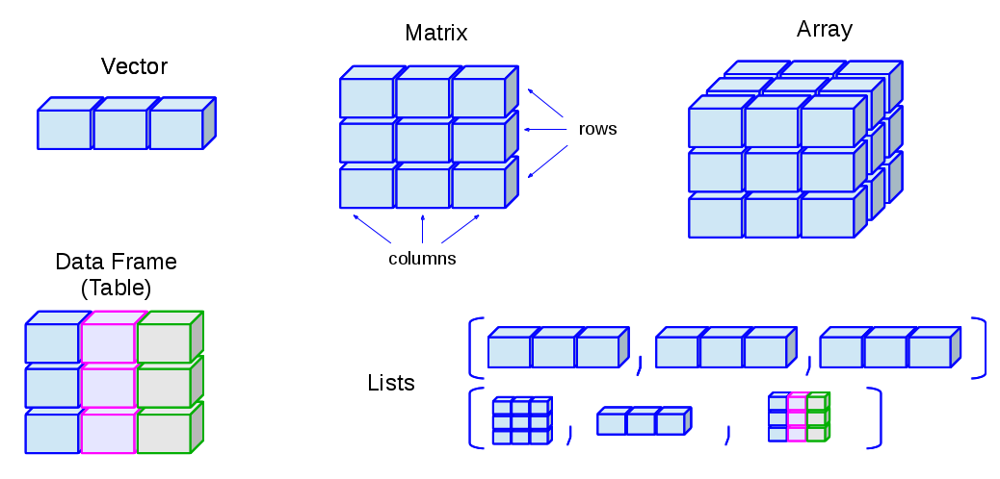

# Fundamentos de programación en R

## Unidad 2

---

## 2.2 Estructuras de datos

---

### Aspectos básicos


Las estructuras de datos en R son fundamentalmente formas de organizar, almacenar y manipular datos. 

Cada tipo de estructura de datos tiene sus propias características y se utiliza en diferentes contextos según las necesidades de análisis y procesamiento de datos.

- **Los Vectores** son estructuras de datos **unidimensionales** que pueden contener elementos del **mismo tipo**, como números, caracteres o valores lógicos. Los vectores pueden ser simples (de longitud uno) o múltiples (de longitud mayor a uno)

    - **Los Factores** son **vectores** que representan datos categóricos, donde cada elemento tiene un nivel específico. Aunque internamente se almacenan como enteros, los factores tienen un **atributo de nivel** que especifica las etiquetas de categoría asociadas.

- **Las Matrices** son arreglos **bidimensionales** que contienen elementos del **mismo tipo**. Tienen **filas y columnas**, lo que significa que son útiles para organizar datos en una tabla de dos dimensiones.

    - **Los _Arrays_** son estructuras de datos **multidimensionales** que pueden contener elementos del mismo tipo. A diferencia de las matrices, los arrays pueden tener **más de dos dimensiones**, lo que los hace útiles para almacenar y manipular datos con múltiples índices.

- **Los _Data frames_** son estructuras de datos **bidimensionales** similares a las matrices, pero cada **columna** puede contener un **tipo diferente** de datos. Se utilizan para representar conjuntos de datos tabulares, donde las **filas** representan **observaciones** y las **columnas** representan **variables**.

- **Las Listas** son **colecciones** ordenadas de **objetos** que pueden ser de **diferentes tipos**. Las listas pueden ser unidimensionales, pero **cada elemento** de la lista puede contener **cualquier estructura de datos**, lo que proporciona flexibilidad en la organización de datos complejos.

A continuación vamos a explorar estas estructuras de datos en R. Aquí algunos tips que usaremos más adelante:

```R
# Información de estructuras y conversión

# Para convertir una estructura de un tipo a otro, usamos la función as.*().

?as.vector

?as.matrix

# Para saber las dimensiones y que clase de objeto (variable) es:

?dim

?class

```

---

## 2.2.1 Vectores y Factores

### Vectores

Son la estructura más sencilla de R, contiene una fila de valores del mismo tipo (numérico o cadena de texto)

Se construye con la función `c()`, que va a combinar valores en un vector o lista.

```R
# Construye un vector con los valores 5,10,15 y 20:
mi_vector <- c(5,10,15,20) 
#Revisa que elementos contiene "mi_vector"
mi_vector

# ¿Puedes hacer operaciones con este vector?
mi_vector + 1

mi_vector + mi_vector

#Crea un nuevo vector y guarda elementos de tipo caracter, es decir, letras
letras <- c("a","b","c","d") 

```

Los elementos en el vector se referencian con corchetes `[i]`

```R
#Veamos el primer elemento del vector "letras"
letras[1]

#Veamos los elementos 1, 2 y 3
letras[1:3]

#Veamos los elementos 1 y 4
letras[c(1,4)]
```

#### Usos

Los vectores numéricos son útiles para cálculos sencillos:

- `mean()`: Calcula el valor medio (promedio) de un vector numérico.
- `sd()`: Calcula la desviación estándar de un vector numérico, que indica la dispersión de los datos con respecto a la media.
- `max()`: Devuelve el valor máximo de un vector numérico.
- `min()`: Devuelve el valor mínimo de un vector numérico.
- `length()`: Devuelve la longitud (cantidad de elementos) de un vector o lista en R.

#### Ejercicio

Considera los vectores x y y:

```R
x <- c(4,6,5,7,10,9,4,15) 
y <- c(0,10,1,8,2,3,4,1)
```

Realiza algunas operaciones con estos vectores. Por ejemplo:

```R
#Suma los dos vectores
x+y

# ¿Puedes saber si el vector x es mayor a 7?
x >7

#¿Puedes unir ambos vectores en uno solo?

c(x,y)

# Crea un nuevo vector que guarde los valores de ambos vectores, "x" y "y"

z <- c(x,y)

# Averigua cuántos elementos contienen los vectores creados

length(x)
length(y)
length(z)
```

#### Extra:

```R
##### Extra: ¿Qué pasa si los vectores tienen tamaños diferentes?
# Crea dos vectores con un número distinto de elementos
x_long <- c(4, 6, 5, 7, 10, 9, 4, 15)
y_short <- c(0, 10, 1, 8)
#Suma los dos vectores,¿qué paso?
x_long + y_short
# el vector "y_short" se recicló para que tuviera la misma longitud que "x_long"


# ¿Qué pasa si uno de los vectores tiene datos faltantes? NA
# Vectores con valores NA
x_na <- c(4, 6, NA, 7, 10, 9, 4, 15)
y_na <- c(0, 10, 1, 8, NA, 3, 4, 1)

# Suma de vectores con NA
x_na + y_na

# Dónde hay un NA el resultado también es NA
```

---

### Factores

- Son vectores cuyos valores están organizados en categorías.

- Las categorías se llaman **levels** y son valores de texto.

- Esta nueva capa de información es útil para calcular estadísticos descriptivos.

#### Ejemplo

```R
#Crea un vector con elementos de tipo caracter
#Puedes separar la lista dando Enter después de una "," 
meses_mix <- c("Enero","Febrero","Marzo","Marzo",
               "Abril","Enero","Abril","Mayo",
               "Junio","Agosto","Julio","Julio",
               "Noviembre","Febrero","May","Agosto", 
               "Julio","Diciembre","Enero","Agosto",
               "Septiembre","Noviembre","Febrero",
               "Abril")
#Revisa el vector creado:
meses_mix

#Convierte un vector de datos categóricos o de texto en un factor
fmeses_mix <- factor(meses_mix) 

#Revisa el factor creado:
fmeses_mix
# Puedes notar que la parte inferior indica el número de niveles y cuáles son.

```

Otra forma de visualizar este factor y ver cuantos elementos hay en cada nivel es con una **tabla de frecuencias**, con la función `table()`

```R
table(fmeses_mix)
```

#### Usos

Vamos a ver un ejemplo usando la función `rnomr()`y `cut()`.

```R
# Generar 100 valores de peso simulados con media 50 y desviación estándar 10
pesos <- rnorm(n = 100, mean = 50, sd = 10) 

# Dividir los datos en grupos (categorías) utilizando la función cut()
# En este caso, los datos se dividen en 4 grupos basados en los cuartiles
# También se asignan etiquetas personalizadas a cada grupo ("1stQ", "2ndQ", "3rdQ", "4thQ")
fpesos <- cut(pesos, breaks = quantile(pesos, probs = seq(0, 1, 0.25)), 
              labels = c("1stQ", "2ndQ", "3rdQ", "4thQ"))

# Mostrar la frecuencia de observaciones en cada grupo utilizando la función table()
# Esto mostrará cuántas observaciones caen en cada uno de los grupos definidos por los cuartiles
table(fpesos)

```

#### Diferencias entre factor() y cut()

- **factor()** se utiliza principalmente para convertir **datos categóricos** (como cadenas de texto) **en factores**. Por ejemplo, si tienes un vector de nombres de colores ("rojo", "azul", "verde") y quieres convertirlo en un factor, puedes usar `factor()`.

- **cut()** en cambio, se utiliza para dividir **datos numéricos** en grupos basados en **intervalos**. Por ejemplo, puedes tener un vector de edades y quieres dividirlo en grupos de edad (niños, adolescentes, adultos) o en rangos de edad (0-10, 11-20, 21-30, etc.). `cut()` divide los datos en intervalos y los representa como **factores**.

```R
## Diferencias entre factor() y cut()
#factor() - datos categóricos como cadenas de texto
colores <- c("rojo", "azul", "verde", "rojo")
colores_factor <- factor(colores)
colores_factor
#cut() - datos numéricos
edades <- c(5, 15, 25, 35, 45)
grupos_edad <- cut(edades, breaks = c(0, 18, 30, 50), labels = c("Niños", "Adolescentes", "Adultos"))
grupos_edad
```

#### Ejercicio

Crea el siguiente vector:

```R
# Vector inicial
niveles <- c("bajo", "alto", "medio", "alto", "alto", "bajo", "medio")

```

- Convierte ese vector a factor.
- Obten la frecuencia de cada valor.
- Cambia el nivel "bajo" del factor por "no satisfactorio"
- Vuelve a obtener la frecuencia de cada valor.

#### Respuestas:

```R
# Convertir a factor
niveles_factor <- factor(niveles)
niveles_factor
# Obtener la frecuencia de cada valor antes del cambio
table(niveles_factor)

# Cambiar los niveles del factor
levels(niveles_factor) <- c("no satisfactorio", "alto", "medio")

# Obtener la frecuencia de cada valor después del cambio
table(niveles_factor)
```

**EXTRA:** Si quieres explorar otra forma de cambiar el nombre de los niveles, revisa el siguiente ejercicio.

```R
# Extra: hay otra forma. Por ejemplo, cambia alto por "muy alto"
levels(niveles_factor) # Revisa que elemento es el que quieres cambiar
levels(niveles_factor)[2] # corroboralo
# Asigna el nuevo nombre
levels(niveles_factor)[2] <- "muy alto"
#Comprueba el cambio
levels(niveles_factor)

```

### 2.2.1 Fuentes de información

- [6.1 Vectores](https://bookdown.org/jboscomendoza/r-principiantes4/vectores.html)
- [Estructuras de datos en R: Factores](https://reptantia.com/blogs/r/estructuras-de-datos-en-r-factores)

---

## 2.2.2 Matrices y Arrys (arreglos)

Son estructuras que pueden contener información del mismo tipo (numérica o cadenas de texto) en dos (**matrices**) o más dimensiones (***arrays*** o **arreglos**).

### Matrices

Una matriz es una estructura de datos **bidimensional** que contiene elementos del mismo tipo (por ejemplo, números). 

Se puede pensar en una matriz como una **tabla rectangular** de datos donde cada **fila** representa una **observación** y cada **columna** representa una **variable**.

 Se construyen con la función `matrix ( )`

Puedes acceder a la documentación de la función:

```R
?matrix
```

Elementos en la matriz se referencian usando corchetes y comas: `[i,j]`

**Ejemplo**

Para crear una matriz podemos indicar la forma en que se asignaran los valores

```R
# Creación de una matriz donde los valores se llenan por columnas
# 1:12 indica que habrá valores desde el número 1 hasta el 12
# ncol indica que la matriz tendrá 3 columnas
matriz_columnas <- matrix(1:12, ncol = 3)
matriz_columnas

# Creación de una matriz donde los valores se llenan por filas
# byrow indica que los valores del 1:12 se distribuirán por filas 
matriz_filas <- matrix(1:12, ncol = 3, byrow = TRUE)
matriz_filas
```

Para acceder a un elemento específico de la matriz usamos **[ , ]**.
En **[f,c]** el primer elemento (**f**) indica la **fila**, y el segundo (**c**) la **columna**.

```R
# [1,3] representa el elemento de la fila 1 y columna 3
matriz_filas[1, 3]

# Intenta la siguiente línea:
matriz_filas[3, 4] 
# ¿Qué pasó? 
```

`matriz_filas[3, 4]` intenta acceder al valor en la tercera fila y cuarta columna. Sin embargo, esta línea de código generaría un error porque `matriz_filas` solo tiene 3 columnas (ya que se creó con `ncol = 3`), por lo que **no hay una cuarta columna**.

Para ver **todos los elementos de una columna** se deja **vacío el primer elemento** **[,c]** que indica las **filas** (**f**).
Caso contrario si queremos todos los elementos de una fila **[f,]**

```R
# Todos los elementos de la columna 3
matriz_filas[, 3] 
# Todos los elementos de la fila 4
matriz_filas[4, ] 
```

Podemos hacer operaciones aritméticas sencillas con los valores de la matriz.

```R
# Suma 1 a cada elemento:
matriz_filas + 1 
# Suma a cada elemento su valor correspondiente
matriz_filas + matriz_filas

# Revisa la matriz original:
matriz_filas
```

Y también operaciones estadísticas

```R
# Suma de todos los elementos en la matriz
sum(matriz_filas)  
# Media de todos los elementos en la matriz
mean(matriz_filas)  
# Desviación estándar de todos los elementos en la matriz
sd(matriz_filas)  
```


#### Otras funciones para manejar matrices:

Para revisar las dimensiones de la matriz recuerda utilizar la función `dim()`

```R
# Revisa las dimensiones de las matrices:
dim(matriz_filas)
matriz_filas
``` 

La función `length()` se puede utilizar para obtener el número total de elementos en una matriz. 

```R
# Obtén el número total de elementos en la matriz
length(matriz_filas)  
```

Puedes seleccionar elementos que cumplen cierta condición.

```R
# Selecciona elementos mayores que 5 en la matriz
matriz_filas[matriz_filas > 5]  
```

Para obtener los nombres de las columnas y de las filas puedes usar las funciones `colnames()`y `rownames()`respectivamente. Además, puedes cambiar esos nombres:

```R
# Asigna nombres a las columnas
colnames(matriz_filas) <- c("col1", "col2", "col3")  
#Visualiza la matriz
matriz_filas
# Asigna nombres a las filas
rownames(matriz_filas) <- c("fila1", "fila2", "fila3", "fila4") 
#Visualiza la matriz
matriz_filas
```

También puedes obtener la suma y el promedio por filas o por columnas

```R
# Calcula la suma y promedio de las filas de la matriz
rowSums(matriz_filas) 
rowMeans(matriz_filas)
# Calcula la suma y promedio de las columnas de la matriz
colSums(matriz_filas)
colMeans(matriz_filas) 
```

#### Ejercicio 

- ¿Cómo puedes crear un vector con 12 enteros del 1 al 12 y qué función puedes utilizar para convertir este vector en una matriz de 4 filas y 3 columnas?

- ¿Cuál es la función para cambiar los nombres de las columnas y filas de una matriz en R?

- ¿Cómo puedes obtener una submatriz de 3x3 de una matriz existente?

- ¿Qué función te permite obtener las dimensiones (número de filas y columnas) de una matriz en R?

#### Solución

```R
# Crea un vector con 12 enteros y conviértelo en una matriz de 4*3
m <- matrix(1:12, nrow = 4)
m

# Cambia los nombres de las columnas y filas
colnames(m) <- c("x", "y", "z")
rownames(m) <- c("a", "b", "c", "d")
m

# Obtiene una matriz de 3*3
m_submatriz <- m[1:3, 1:3]
m_submatriz

# Dimensiones de m
dim(m)

```

**Extra**: Podrías generar una matriz de 4x4 a partir de la matriz de 4x3?

```R
# Agrega una nueva columna adicional a la matriz m para obtener una matriz de 4x4
m_4x4 <- cbind(m, c(13, 14, 15, 16))
m_4x4
```

### Arrys

En su forma más común, un array es una generalización de una matriz, donde una **matriz** es un **array bidimensional**. Sin embargo, los **arrays en R** pueden tener **más de dos dimensiones**.

Los **arrays multidimensionales** tienen más de dos dimensiones. Por ejemplo, un array tridimensional tiene tres dimensiones: filas, columnas y profundidad.

En biología, los arrays multidimensionales se utilizan para almacenar y manipular datos que tienen múltiples dimensiones, como datos de imágenes médicas tridimensionales, datos de secuenciación genética con múltiples muestras y múltiples marcadores, o datos de expresión génica en diferentes condiciones y a través de diferentes experimentos.

#### Ejemplo

```R
# Creamos un array tridimensional de 3x3x3
array_3d <- array(1:27, dim = c(3, 3, 3))

# Mostramos el array
array_3d
```



### 2.2.2 Fuentes de información

- [Matrices y arrays](https://bookdown.org/jboscomendoza/r-principiantes4/matrices-y-arrays.html)
- [Data structure types](http://venus.ifca.unican.es/Rintro/dataStruct.html)

---

## 2.2.3 Data.frames (marcos de datos)

Los **Data Frames** o **Marcos de Datos** son estructuras que pueden **combinar argumentos numéricos** y de **cadena de texto** dentro de la misma entidad.

Para construir un **data frame** necesitas la función `data.frame()`

Para obtener solo una columna específica del data frame puedes usar corchetes **[]** como en caso de las matrices, o el operador compacto `$`.


#### Ejemplo

Primero vamos a crear un data frame con dos columnas llamadas "distance" y "condition".


```R
data_frame_dist_cond <- data.frame(distance=c(4,4,4,7,8,5), condition=c("a","a","a","b","b","b"))

#Visualiza el data frame
data_frame_dist_cond
```
> También puedes visualizar el **data frame** desde el panel de **Environment**. Solo da **click** sobre el nombre del data frame creado. Inténtalo!

Para ver un elemento en específico dentro del data frame:

```R
#Para seleccionar la primera columna
data_frame_dist_cond[1]

#Otra forma de seleccionar una columna es por el nombre de la misma:

data_frame_dist_cond["distance"]

#Si queremos el primer elemento de la columna "distance" usando los [ ]
#Primero selecciona la columna como un vector y accesa al primer elemento
data_frame_dist_cond[["distance"]][1]


# Otra forma de seleccionar una columna es con el operador compacto $

data_frame_dist_cond$condition
data_frame_dist_cond$condition[1]

#Puedes explorar las primeras y últimas 3 filas del data frame 
head(data_frame_dist_cond, 3)
tail(data_frame_dist_cond, 3)

```

#### Usos:

- Muy similar a una hoja de cálculo estándar

- Se pueden modificar los nombres de filas y columnas

- Se pueden unir dos o más data frames con: `cbind ()` y `rbind ()`

#### Ejercicio:

Crea un data frame con los siguientes datos:

```R
#Crea los vectores: edad, nombres y genero
edad <- c(22, 25, 18, 15, 20)
edad
nombres <- c("Jaime", "Mateo", "Olivia", "Javier","Sandra") 
nombres
genero <- c("M", "M", "F", "M", "F")
genero

```

- Ordena los valores por edad.

> _tip_: función `order()`


#### Soluciones:

- Crea un data frame (df)

```R
# Puedes asignarle otro nombre a las columnas que aparecerán en tu df
# Renombra las columnas
df_age_name_gen <- data.frame(edades=edad,names_df=nombres,genero=genero)

df_age_name_gen
```

- Para ordena los valores por edad usa la función `order()`

```R
#ordernar por edades
df_age_name_gen[order(df_age_name_gen$edades),]
```

**Pregunta extra:** ¿Cómo los ordenarías por nombres de forma descendente?

```R
#Extra: ordernar por nombres, en forma descendente
df_age_name_gen[order(df_age_name_gen$names_df, decreasing = T),]

#Extra: ordenar múltiples columnas, NOMBRES y EDAD, de forma descendente: 
df_age_name_gen[order(df_age_name_gen$names_df, df_age_name_gen$edades, decreasing = T), ]

```

### Extra:

```R
# Ver la estructura del data frame
str(df)

# Resumen estadístico del data frame
summary(df)

# Cambiar los nombres de las columnas
names(df) <- c("Edad", "Nombre", "Género")

# Cambiar el nombre de una sola columna con la función names()
names(df)[names(df) == "Edad"] <- "age"

# Añadir una nueva columna
df$height <- c(180, 165, 170, 175)

# Eliminar una columna
df$height <- NULL
```

### 2.2.3 Fuentes de información
- [Data frames](https://bookdown.org/jboscomendoza/r-principiantes4/data-frames.html)

- [Función data.frame](https://www.rdocumentation.org/packages/base/versions/3.6.2/topics/data.frame)

---

## 2.2.4 Listas

Las **Listas** son un tipo de estructura de datos que **puede contener todos los demás tipos!**

- Se construye con la función `list ()`

- Cada componente se encuentra usando el operador `$` si los componentes tienen nombre. Parecido como seleccionabamos elementos en los data frames.

Para acceder a un componente en particular puedes usar los corchetes **[ ]**

- `[i]` para accesar al componente como elemento de lista
- `[[i]]` para accesar al componente como vector


#### Ejemplo:

```R
# Crear un vector con datos de cantidad de ADN en diferentes muestras
adn_quantity <- c(20.5, 30.2, 25.7)

# Crear un data frame con datos de calidad de ADN, otras características de las muestras y el nombre de la especie de planta
adn_quality_info <- data.frame(
  sample_id = c(1, 2, 3),
  purity = c(1.8, 2.0, 1.9),
  concentration = c(50, 55, 48),
  species = c("Arabidopsis", "Maize", "Rice")
)

# Crear una cadena de caracteres con notas del estudio
study_notes <- "Experimento de calidad y cantidad de ADN en plantas realizado en 2024"
```

Ahora tenemos dos vectores con diferentes tipos de datos (**adn_quantity** y **study_notes**) y un data frame con datos tanto numéricos como de texto.
¿Podemos poner todos estos distintos tipos de datos y de estructuras en un solo tipo de estructura?

Si, en una **lista**

```R
# Crear la lista con un nombre descriptivo y asigna nuevos nombres para cada estructura agregada
plant_adn_data <- list(quantity = adn_quantity, quality_info = adn_quality_info, notes = study_notes)

# Mostrar la lista
print("Contenido de la lista 'plant_adn_data':")
print(plant_adn_data)

```

Ahora que has creado una **Lista**, accede al primer elemento.

```R
# Acceder al primer elemento (cantidad de ADN) 
# con $
plant_adn_data$quantity 
# con los [ ]
plant_adn_data[1]

# Suma 1 a cada valor de este elemento
plant_adn_data$quantity + 1
# Otra forma con [ ]
# Otra forma con los [ ]
plant_adn_data[[1]] + 1
```

Revisa la estructura de la lista

```R
# Ver la estructura de la lista
str(plant_adn_data)
```


#### Usos:

Guardar elementos de distinto tamaño, por ejemplo, varias hojas de cálculo en distintos formatos.

Los componentes pueden ser fácilmente agregados o removidos de la lista:

```R

# Agrega un nuevo elemento: contenido de metabolitos secundarios
#Crea el vector
secondary_metabolites <- c(3.2, 2.8, 3.5)
secondary_metabolites
#Agrega el vector a la lista de plant_adn_data
plant_adn_data$metabolites <- secondary_metabolites

# Revisa la lista después de agregar el nuevo elemento
plant_adn_data

# Ve la estructura de la lista después de agregar el nuevo elemento
str(plant_adn_data)

# Quita el elemento 'metabolites' de la lista
plant_adn_data$metabolites <- NULL

# Muestra la lista después de quitar el elemento
plant_adn_data

# Ve la estructura de la lista después de quitar el elemento
str(plant_adn_data)
```

#### Ejercicio:

De la lista que ya hemos creado **plant_adn_data**, ¿se puede cambiar valores dentro de los elementos de la lista?

- Intenta cambiar el valor del elemento 2, dentro del vector llamado quantity en la lista plant_adn_data. Cambia el valor a 31.5

- Cambia los nombres de las especies en el data frame dentro de la lista. Cambia el nombre de Maize a Zea y de Rice a Oryza.

- Agrega un nuevo elemento en forma de vector. Las fechas de extracción de ADN: "2024-06-01", "2024-06-02", "2024-06-03"

#### Soluciones:

```R
# Cambiar un valor dentro del vector 'adn_quantity'
plant_adn_data$quantity[2] #Verifica cuál es el segundo valor
plant_adn_data$quantity[2] <- 31.5  # Cambia el segundo valor a 31.5
plant_adn_data$quantity[2] #Verifica si cambio a 31.5


# Cambiar nombres en el data frame dentro de la lista
plant_adn_data$quality_info$species # Verifica que nombres hay
plant_adn_data$quality_info$species[plant_adn_data$quality_info$species == "Rice"] <- "Oryza"
plant_adn_data$quality_info$species[plant_adn_data$quality_info$species == "Maize"] <- "Zea"
plant_adn_data$quality_info$species # Verifica los cambios

# Agregar un nuevo elemento: fecha de extracción de ADN
#Crea el vector
extraction_dates <- c("2024-06-01", "2024-06-02", "2024-06-03")
extraction_dates
#Agrega el vector a la lista
plant_adn_data$extraction_dates <- extraction_dates

# EXTRA: Otra forma de agregar un elemento es con lenght()
#Usas lenght para crear un espacio en la lista y lo asignas al vector extraction_dates

# plant_adn_data[[length(plant_adn_data) + 1]] <- extraction_dates

#Tienes que poner el nombre al último elemento agregado
# names(plant_adn_data)[length(plant_adn_data)] <- "extraction_dates"


# Muestra la lista después de los cambios
plant_adn_data

# Ve la estructura de la lista después de los cambios
str(plant_adn_data)

```

### Fuentes de información

- [Listas](https://bookdown.org/jboscomendoza/r-principiantes4/listas.html)
- [Listas - GitLab - Blog](https://soka.gitlab.io/blog/post/2019-03-11-r-listas/)

---

### Estructuras de Datos: Resumen


---

### Siguiente tema: [2.3 Manipulación de datos](../Unidad_02/U2_3_Manipulacion_datos.md)