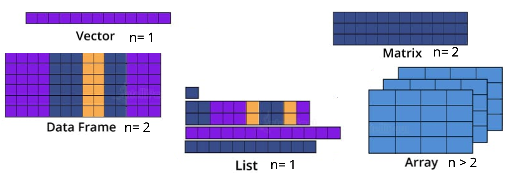
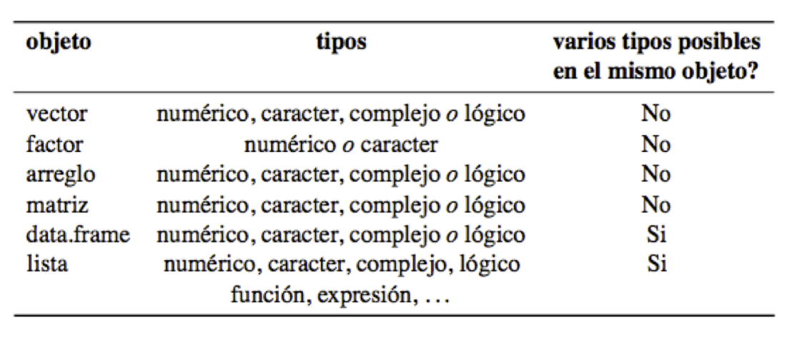

# Fundamentos de programación en R

## Unidad 2

---

#### [Versión extendida](../Unidad_02/U2_2_Estructuras_datos_version_ext.md)

---

## 2.2 Estructuras de datos

- [Presentación](https://docs.google.com/presentation/d/e/2PACX-1vQw4Yy6iZP5lUw238gcODPyiUBbpRDzETNL1PAGfx9LvtF3ad_WR3fm68RBUeUuHA/pub?start=false&loop=false&delayms=60000)

- [Script U2_2_Estructura_datos.R](../../bin/U2_2_Estructura_datos.R) de esta unidad en la carpeta **bin**

---

### Aspectos básicos



Las **estructuras de datos en R** son fundamentalmente formas de **organizar, almacenar y manipular datos**.

Cada tipo de estructura de datos tiene sus propias características y se utiliza en diferentes contextos según las necesidades de análisis y procesamiento de datos.

Entre los principales tipos de estructuras de datos que se utilizan en R están:

- **1. Los Vectores** son estructuras de datos **unidimensionales** que pueden contener elementos del **mismo tipo**, como números, caracteres o valores lógicos. Los vectores pueden ser simples (de longitud uno) o múltiples (de longitud mayor a uno)

    - **Los Factores** son **vectores** que representan datos categóricos, donde cada elemento tiene un nivel específico. Aunque internamente se almacenan como enteros, los factores tienen un **atributo de nivel** que especifica las etiquetas de categoría asociadas.

- **2. Las Matrices** son arreglos **bidimensionales** que contienen elementos del **mismo tipo**. Tienen **filas y columnas**, lo que significa que son útiles para organizar datos en una tabla de dos dimensiones.

    - **Los _Arrays_** son estructuras de datos **multidimensionales** que pueden contener elementos del mismo tipo. A diferencia de las matrices, los arrays pueden tener **más de dos dimensiones**, lo que los hace útiles para almacenar y manipular datos con múltiples índices.

- **3. Los _Data frames_** son estructuras de datos **bidimensionales** similares a las matrices, pero cada **columna** puede contener un **tipo diferente** de datos. Se utilizan para representar conjuntos de datos tabulares, donde las **filas** representan **observaciones** y las **columnas** representan **variables**.

- **4. Las Listas** son **colecciones** ordenadas de **objetos** que pueden ser de **diferentes tipos**. Las listas pueden ser unidimensionales, pero **cada elemento** de la lista puede contener **cualquier estructura de datos**, lo que proporciona flexibilidad en la organización de datos complejos.

A continuación, vamos a enfocarnos en **tres principales estructuras** que utilizaremos en las siguientes unidades: los **vectores**, las **matrices** y los **_data.frame_**.

Si quieres explorar más sobre las otras estructuras previamente mencionadas puedes consultar la versión [extendida](../Unidad_02/U2_3_Manipulacion_dato_version_ext.md).

---

## 2.2.1 Vectores 

### Vectores

Son la estructura más sencilla de R, contiene una fila de valores del mismo tipo (numérico o cadena de texto)

Se construye con la función `c()`, que va a combinar valores en un vector o lista.

```R
# Construye un vector con los valores 5,10,15 y 20:
mi_vector <- c(5,10,15,20) 
#Revisa que elementos contiene "mi_vector"
mi_vector

# ¿Puedes hacer operaciones con este vector?
# Suma 1 a cada elemento del vector "mi_vector"
mi_vector + 1

#Crea un nuevo vector y guarda elementos de tipo caracter, es decir, letras
letras <- c("a","b","c","d") 

#Los elementos en el vector se referencian con corchetes `[i]`

#Veamos el primer elemento del vector "letras"
letras[1]

#Para un rango de elementos utiliza :
#letras[1:3]
#Para seleccionar elementos específicos usa un vector c(,)
#letras[c(1,4)]
```

#### Usos

Los vectores numéricos son útiles para cálculos sencillos:

- `mean()`: Calcula el valor medio (promedio) de un vector numérico.
- `sd()`: Calcula la desviación estándar de un vector numérico, que indica la dispersión de los datos con respecto a la media.
- `max()`: Devuelve el valor máximo de un vector numérico.
- `min()`: Devuelve el valor mínimo de un vector numérico.
- `length()`: Devuelve la longitud (cantidad de elementos) de un vector o lista en R.

#### Ejercicio

```R
#Considera los vectores x y y:
x <- c(4,6,5,7,10,9,4,15) 
y <- c(0,10,1,8,2,3,4,1)

# Realiza algunas operaciones con estos vectores. Por ejemplo:

#Suma los dos vectores
x+y

# ¿Puedes saber si el vector x es mayor a 7?
x >7

# Averigua cuántos elementos contienen los vectores creados
length(x)
length(y)
```

#### Extra:

```R
# ¿Qué pasa si uno de los vectores tiene datos faltantes? NA
# Vectores con valores NA
x_na <- c(4, 6, NA, 7, 10, 9, 4, 15)
y_na <- c(0, 10, 1, 8, NA, 3, 4, 1)

# Suma de vectores con NA
x_na + y_na

# Dónde hay un NA el resultado también es NA
```

---

### 2.2.1 Fuentes de información

- [6.1 Vectores](https://bookdown.org/jboscomendoza/r-principiantes4/vectores.html)

---

## 2.2.2 Matrices 

Son estructuras que pueden contener información del mismo tipo (numérica o cadenas de texto) en dos (**matrices**) o más dimensiones (***arrays*** o **arreglos**).

### Matrices

Una matriz es una estructura de datos **bidimensional** que contiene elementos del mismo tipo (por ejemplo, números). 

Se puede pensar en una matriz como una **tabla rectangular** de datos donde cada **fila** representa una **observación** y cada **columna** representa una **variable**.

 Se construyen con la función `matrix ( )`

Puedes acceder a la documentación de la función:

```R
#Puedes acceder a la documentación de la función para crear matrices
?matrix
```

Elementos en la matriz se referencian usando corchetes y comas: `[i,j]`

**Ejemplo**

Para crear una matriz podemos indicar la forma en que se asignaran los valores

```R
# Creación de una matriz donde los valores se llenan por columnas
# 1:12 indica que habrá valores desde el número 1 hasta el 12
# ncol indica que la matriz tendrá 3 columnas
matriz_columnas <- matrix(1:12, ncol = 3)
matriz_columnas

# Creación de una matriz donde los valores se llenan por filas
# byrow indica que los valores del 1:12 se distribuirán por filas 
matriz_filas <- matrix(1:12, ncol = 3, byrow = TRUE)
matriz_filas
```

Para acceder a un elemento específico de la matriz usamos **[ , ]**.
En **[f,c]** el primer elemento (**f**) indica la **fila**, y el segundo (**c**) la **columna**.

```R
# [1,3] representa el elemento de la fila 1 y columna 3
matriz_filas[1, 3]

# Intenta la siguiente línea:
matriz_filas[3, 4] 
# ¿Qué pasó? 
```

`matriz_filas[3, 4]` intenta acceder al valor en la tercera fila y cuarta columna. Sin embargo, esta línea de código generaría un error porque `matriz_filas` solo tiene 3 columnas (ya que se creó con `ncol = 3`), por lo que **no hay una cuarta columna**.

Para ver **todos los elementos de una columna** se deja **vacío el primer elemento** **[,c]** que indica las **filas** (**f**).
Caso contrario si queremos todos los elementos de una fila **[f,]**

```R
# Todos los elementos de la columna 3
matriz_filas[, 3] 
# Todos los elementos de la fila 4
matriz_filas[4, ] 
```

Podemos hacer operaciones aritméticas sencillas con los valores de la matriz.

```R
# Suma 1 a cada elemento:
matriz_filas + 1 
# Suma a cada elemento su valor correspondiente
matriz_filas + matriz_filas

# Revisa la matriz original:
matriz_filas
```

Y también operaciones estadísticas

```R
# Suma de todos los elementos en la matriz
sum(matriz_filas)  
# Media de todos los elementos en la matriz
mean(matriz_filas)  
# Desviación estándar de todos los elementos en la matriz
sd(matriz_filas)  
```


#### Otras funciones para manejar matrices:

Para revisar las dimensiones de la matriz recuerda utilizar la función `dim()`

```R
# Revisa la matriz original:
matriz_filas
# Revisa las dimensiones de las matrices:
dim(matriz_filas)

``` 


#### Ejercicio 

- ¿Cómo puedes crear un vector con 12 enteros del 1 al 12 y qué función puedes utilizar para convertir este vector en una matriz de 4 filas y 3 columnas?

- ¿Cuál es la función para cambiar los nombres de las columnas y filas de una matriz en R?

- ¿Cómo puedes obtener una submatriz de 3x3 de una matriz existente?

- ¿Qué función te permite obtener las dimensiones (número de filas y columnas) de una matriz en R?

#### Solución

```R
# Crea un vector con 12 enteros y conviértelo en una matriz de 4*3
m <- matrix(1:12, nrow = 4)
m

# Cambia los nombres de las columnas y filas
colnames(m) <- c("x", "y", "z")
rownames(m) <- c("a", "b", "c", "d")
m

# Obtiene una matriz de 3*3
m_submatriz <- m[1:3, 1:3]
m_submatriz

# Dimensiones de m
dim(m)

```

**Extra**: Podrías generar una matriz de 4x4 a partir de la matriz de 4x3?

```R
# Agrega una nueva columna adicional a la matriz m para obtener una matriz de 4x4
# Para ello usamos la función cbind()
m_4x4 <- cbind(m, c(13, 14, 15, 16))
m_4x4
```

### 2.2.2 Fuentes de información

- [Matrices y arrays](https://bookdown.org/jboscomendoza/r-principiantes4/matrices-y-arrays.html)
- [Data structure types](http://venus.ifca.unican.es/Rintro/dataStruct.html)

---

## 2.2.3 Data.frames (marcos de datos)

Los **Data Frames** o **Marcos de Datos** son estructuras que pueden **combinar argumentos numéricos** y de **cadena de texto** dentro de la misma entidad.

Para construir un **data frame** necesitas la función `data.frame()`

Para obtener solo una columna específica del data frame puedes usar corchetes **[ ]** como en caso de las matrices, o el operador compacto `$`.


#### Ejemplo

Primero vamos a crear un data frame con dos columnas llamadas "distance" y "condition".


```R
data_frame_dist_cond <- data.frame(distance=c(4,4,4,7,8,5), condition=c("a","a","a","b","b","b"))

#Visualiza el data frame
data_frame_dist_cond
```

> También puedes visualizar el **data frame** desde el panel de **Environment**. Solo da **click** sobre el nombre del data frame creado. Inténtalo!

Para ver un elemento en específico dentro del data frame:

```R
#Para seleccionar la primera columna
data_frame_dist_cond[1]

#Otra forma de seleccionar una columna es por el nombre de la misma:

data_frame_dist_cond["distance"]

#Si queremos el primer elemento de la columna "distance" usando los [ ]
#Primero selecciona la columna como un vector y accesa al primer elemento
data_frame_dist_cond[["distance"]][1]


# Otra forma de seleccionar una columna es con el operador compacto $

data_frame_dist_cond$condition
data_frame_dist_cond$condition[1]

#Puedes explorar las primeras y últimas 3 filas del data frame 
head(data_frame_dist_cond, 3)
tail(data_frame_dist_cond, 3)

```

#### Usos:

- Muy similar a una hoja de cálculo estándar

- Se pueden modificar los nombres de filas y columnas

- Se pueden unir dos o más data frames con: `cbind ()` y `rbind ()`

#### Ejercicio:

Crea un data frame con los siguientes datos:

```R
#Crea los vectores: edad, nombres y genero
edad <- c(22, 25, 18, 15, 20)
edad
nombres <- c("Jaime", "Mateo", "Olivia", "Javier","Sandra") 
nombres
genero <- c("M", "M", "F", "M", "F")
genero
#Puedes usar la función print() para ver las variables generadas
print(edad)
print(nombres)
print(genero)
```

- Ordena los valores por edad.

> _tip_: función `order()`


#### Soluciones data.frame:

- Crea un data frame (df)

```R
# Puedes asignarle otro nombre a las columnas que aparecerán en tu df
# Renombra las columnas
df_age_name_gen <- data.frame(edades=edad, names_df=nombres, genero=genero)

df_age_name_gen
```

- Para ordenar los valores por edad usa la función `order()`

```R
# ordernar por edades
df_age_name_gen[order(df_age_name_gen$edades),]
```

**Pregunta extra:** ¿Cómo los ordenarías por nombres de forma descendente?

```R
#Extra: ordernar por nombres, en forma descendente
df_age_name_gen[order(df_age_name_gen$names_df, decreasing = T),]

#Extra: ordenar múltiples columnas, NOMBRES y EDAD, de forma descendente: 
df_age_name_gen[order(df_age_name_gen$names_df, df_age_name_gen$edades, decreasing = T), ]

```

### Extra:

```R
# Ver la estructura del data frame
str(df)

# Resumen estadístico del data frame
summary(df)

# Cambiar los nombres de las columnas
names(df) <- c("Edad", "Nombre", "Género")

# Cambiar el nombre de una sola columna con la función names()
names(df)[names(df) == "Edad"] <- "age"

# Añadir una nueva columna
df$height <- c(180, 165, 170, 175)

# Eliminar una columna
df$height <- NULL
```

### 2.2.3 Fuentes de información
- [Data frames](https://bookdown.org/jboscomendoza/r-principiantes4/data-frames.html)

- [Función data.frame](https://www.rdocumentation.org/packages/base/versions/3.6.2/topics/data.frame)

---

### Fuentes de información

- [Listas](https://bookdown.org/jboscomendoza/r-principiantes4/listas.html)
- [Listas - GitLab - Blog](https://soka.gitlab.io/blog/post/2019-03-11-r-listas/)

---

### Estructuras de Datos: Resumen



---

### Siguiente tema: [2.3 Manipulación de datos](../Unidad_02/U2_3_Manipulacion_datos.md)