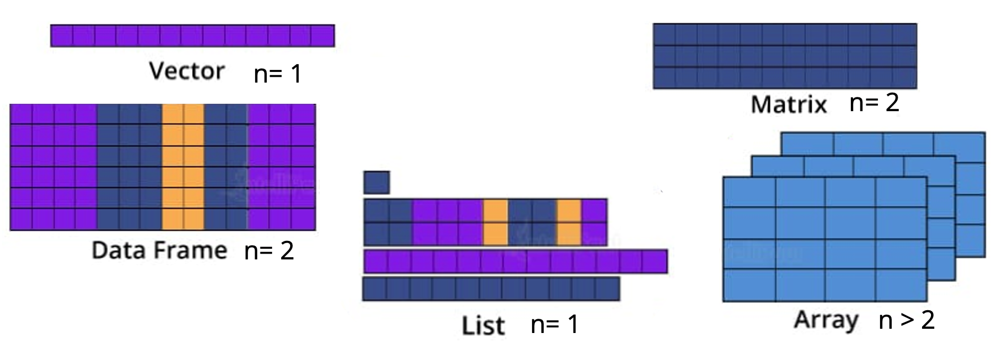

# Fundamentos de programación en R

## Unidad 2

---

#### [Versión extendida](../Unidad_02/U2_2_Estructuras_datos_version_ext.md)

---

## 2.2 Estructuras de datos: vectores y data frames

- [Presentación](https://docs.google.com/presentation/d/e/2PACX-1vSB3Md124uOGccszAAuw5HToGG-yD8cNnB_DKTXxN5_aS492SpRHTr9Da4NphY98g/pub?start=false&loop=false&delayms=60000)

## Objetivo

Distinguir entre vectores y data frames, reconocer qué tipo de información puede guardar cada estructura y practicar formas básicas de explorar filas, columnas y dimensiones.

## Material de apoyo

Durante esta unidad trabajaremos con un script general de práctica:

* [Script de práctica general Unidad 2](../../bin/U2_practica_general.R)

Durante la sesión iremos ejecutando solo los bloques indicados por la instructora.

---

## 1. ¿Qué son las estructuras de datos?

Las **estructuras de datos** son formas de organizar, almacenar y manipular información en R.



En R existen distintos tipos de estructuras de datos. Algunas de las más comunes son:

* **Vectores:** guardan una secuencia de valores del mismo tipo, por ejemplo, solo números o solo texto.
* **Factores:** representan datos categóricos, como tratamientos, grupos, especies o condiciones experimentales.
* **Matrices:** organizan datos en filas y columnas, pero todos sus elementos deben ser del mismo tipo.
* **Arrays:** son estructuras con más de dos dimensiones; pueden pensarse como matrices multidimensionales.
* **Data frames:** organizan datos en filas y columnas; cada columna puede tener un tipo de dato diferente.
* **Listas:** pueden guardar objetos de distintos tipos y tamaños dentro de una misma estructura.

En este tema nos centraremos en dos estructuras que usaremos constantemente durante el curso:

* **vectores**, porque son la base de muchas operaciones en R;
* **data frames**, porque nos permiten trabajar con datos tabulares, como metadatos de muestras o resultados de análisis.

También veremos una cápsula breve sobre **matrices**, porque más adelante pueden aparecer como matrices de conteos en análisis transcriptómicos.

> Si quieres revisar con más detalle factores, matrices, arrays o listas, puedes consultar la [versión extendida](../Unidad_02/U2_2_Estructuras_datos_version_ext.md) de este tema.

---

## 2. Vectores

Los **vectores** son una de las estructuras más sencillas de R.

Un vector guarda una secuencia de valores del mismo tipo. Por ejemplo, un vector puede contener números, texto o valores lógicos (`TRUE` / `FALSE`), pero no mezcla tipos de datos de manera ideal.

Los vectores se crean con la función `c()`, que significa “combinar”.

```r
# Construye un vector con valores numéricos
mi_vector <- c(5, 10, 15, 20)

# Revisa qué contiene mi_vector
mi_vector
```

Podemos hacer operaciones con vectores numéricos:

```r
# Suma 1 a cada elemento del vector
mi_vector + 1

# Multiplica cada elemento por 2
mi_vector * 2
```

También podemos crear vectores de texto:

```r
# Crea un vector con letras
letras <- c("a", "b", "c", "d")

# Revisa qué contiene letras
letras
```

### Acceder a elementos de un vector

Los elementos de un vector se pueden consultar usando corchetes `[ ]`.

```r
# Primer elemento del vector
letras[1]

# Elementos del 1 al 3
letras[1:3]

# Elementos 1 y 4
letras[c(1, 4)]
```

Recuerda que en R la numeración empieza en `1`.

---

## 3. Operaciones básicas con vectores

Los vectores numéricos son útiles para hacer cálculos sencillos.

Algunas funciones útiles son:

* `mean()`: calcula el promedio.
* `sd()`: calcula la desviación estándar.
* `max()`: devuelve el valor máximo.
* `min()`: devuelve el valor mínimo.
* `length()`: indica cuántos elementos tiene el vector.

### Ejercicio

Considera los siguientes vectores:

```r
x <- c(4, 6, 5, 7, 10, 9, 4, 15) 
y <- c(0, 10, 1, 8, 2, 3, 4, 1)
```

Realiza las siguientes operaciones:

```r
# Suma los dos vectores
x + y

# Revisa si los valores de x son mayores a 7
x > 7

# Calcula el promedio de x
mean(x)

# Obtén el valor máximo de y
max(y)

# Averigua cuántos elementos tiene cada vector
length(x)
length(y)
```

---

## 4. Data frames

Los **data frames** son estructuras de datos en forma de tabla.

En un data frame:

* las **filas** suelen representar observaciones;
* las **columnas** suelen representar variables;
* cada columna puede tener un tipo de dato distinto.

Por ejemplo, una columna puede contener nombres de muestras, otra puede contener condiciones experimentales y otra puede contener valores numéricos.

### Caso de estudio hipotético

Imagina que estamos preparando un análisis transcriptómico sencillo. Antes de analizar la expresión de genes, necesitamos organizar los **metadatos** de las muestras.

En este ejemplo hipotético, tenemos seis muestras de tejido vegetal. Para cada muestra conocemos:

* su identificador;
* la condición experimental;
* el tejido analizado;
* el número aproximado de lecturas de secuenciación, en millones.

Vamos a crear esta información como un data frame.

```r
metadata <- data.frame(
  sample_id = c("S01", "S02", "S03", "S04", "S05", "S06"),
  condition = c("control", "control", "stress", "stress", "control", "stress"),
  tissue = c("leaf", "leaf", "leaf", "root", "root", "root"),
  reads_million = c(18.5, 21.2, 19.8, 25.1, 20.4, 17.9)
)

metadata
```

Este data frame tiene información tabular similar a la que podríamos encontrar en un archivo de metadatos para análisis de transcriptomas.

---

## 5. Explorar un data frame

Antes de modificar o analizar una tabla, necesitamos revisar su estructura.

Algunas funciones útiles son:

```r
# Ver las primeras filas
head(metadata)

# Ver las dimensiones: número de filas y columnas
dim(metadata)

# Ver los nombres de las columnas
names(metadata)

# Ver la estructura del data frame
str(metadata)

# Obtener un resumen general
summary(metadata)
```

Estas funciones nos ayudan a responder preguntas básicas:

* ¿Cuántas muestras hay?
* ¿Cuántas variables tenemos?
* ¿Cómo se llaman las columnas?
* ¿Qué tipo de datos contiene cada columna?
* ¿Hay algo inesperado en la tabla?

---

## 6. Acceder a columnas y elementos de un data frame

Podemos acceder a columnas de un data frame de varias formas.

### Usando `$`

```r
# Acceder a la columna condition
metadata$condition

# Acceder a la columna reads_million
metadata$reads_million
```

### Usando corchetes `[ ]`

```r
# Seleccionar una columna como data frame
metadata["condition"]

# Seleccionar una columna como vector
metadata[["condition"]]
```

### Acceder a un elemento específico

En un data frame también podemos usar la lógica de filas y columnas:

```r
# Elemento de la fila 1, columna 1
metadata[1, 1]

# Elemento de la fila 3, columna 2
metadata[3, 2]

# Toda la fila 1
metadata[1, ]

# Toda la columna 2
metadata[, 2]
```

---

## 7. Cápsula breve: matrices

Una **matriz** también organiza datos en filas y columnas, pero a diferencia de un data frame, todos sus elementos deben ser del mismo tipo.

En análisis transcriptómico, podemos encontrar matrices de conteos donde:

* las filas representan genes;
* las columnas representan muestras;
* los valores representan conteos de lecturas.

Por ahora solo revisaremos un ejemplo mínimo:

```r
conteos <- matrix(1:12, nrow = 4)

conteos
dim(conteos)

# Elemento de la fila 1, columna 2
conteos[1, 2]
```

Retomaremos esta idea más adelante cuando trabajemos con datos de expresión.

---

## 8. Ejercicio integrador breve

Usa el data frame `metadata` para responder:

```r
# ¿Cuántas filas y columnas tiene metadata?
dim(metadata)

# ¿Cómo se llaman sus columnas?
names(metadata)

# ¿Qué tipo de datos contiene cada columna?
str(metadata)

# ¿Cuál es el promedio de lecturas en millones?
mean(metadata$reads_million)

# ¿Qué muestras pertenecen a la condición control?
metadata[metadata$condition == "control", ]

# ¿Qué muestras pertenecen al tejido root?
metadata[metadata$tissue == "root", ]
```

### Preguntas

* ¿Qué representa cada fila del data frame?
* ¿Qué representa cada columna?
* ¿Qué columna contiene texto?
* ¿Qué columna contiene valores numéricos?
* ¿Por qué este tipo de estructura es útil para organizar metadatos?

---

## Para seguir explorando

Los siguientes ejemplos no forman parte del núcleo principal de la sesión, pero pueden ayudarte a practicar o profundizar después.

El código complementario está dividido en dos scripts:

* `bin/U2_para_seguir_explorando.R`: incluye ejemplos adicionales sobre reciclaje de vectores, valores faltantes, matrices, factores, listas y arrays.

### Reciclaje de vectores

R puede realizar operaciones con vectores de distinta longitud usando una regla llamada **reciclaje**. Esto significa que, si un vector es más corto, R puede repetir sus valores para completar la operación.

```r
x_long <- c(4, 6, 5, 7, 10, 9, 4, 15)
y_short <- c(0, 10, 1, 8)

x_long + y_short
```

En este caso, `y_short` se recicla para tener la misma longitud que `x_long`.

Esto puede ser útil, pero también puede causar errores difíciles de detectar si no revisamos bien la longitud de nuestros vectores.

```r
length(x_long)
length(y_short)
```

### Valores faltantes en vectores

En R, `NA` representa un dato faltante.

```r
x_na <- c(4, 6, NA, 7, 10, 9, 4, 15)

x_na
mean(x_na)
mean(x_na, na.rm = TRUE)
```

Cuando hay valores faltantes, muchas funciones devuelven `NA` a menos que indiquemos cómo manejarlos.

### Matrices

Una matriz se construye con la función `matrix()`.

```r
# Crear una matriz con valores del 1 al 12
matriz_filas <- matrix(1:12, ncol = 3, byrow = TRUE)

matriz_filas
```

Para acceder a un elemento específico usamos `[fila, columna]`.

```r
# Elemento de la fila 1 y columna 3
matriz_filas[1, 3]

# Todos los elementos de la columna 3
matriz_filas[, 3]

# Todos los elementos de la fila 4
matriz_filas[4, ]
```

Podemos revisar sus dimensiones:

```r
dim(matriz_filas)
```

También podemos asignar nombres a filas y columnas:

```r
colnames(matriz_filas) <- c("col1", "col2", "col3")
rownames(matriz_filas) <- c("fila1", "fila2", "fila3", "fila4")

matriz_filas
```

Algunas funciones útiles para matrices son:

```r
# Suma por filas
rowSums(matriz_filas)

# Promedio por filas
rowMeans(matriz_filas)

# Suma por columnas
colSums(matriz_filas)

# Promedio por columnas
colMeans(matriz_filas)
```

### Factores

Los factores representan datos categóricos, como tratamientos, grupos o especies.

```r
condiciones <- c("control", "stress", "control", "stress")
condiciones_factor <- factor(condiciones)

condiciones_factor
table(condiciones_factor)
```

### Listas

Las listas pueden guardar objetos de distintos tipos y tamaños.

```r
mi_lista <- list(
  muestra = "S01",
  lecturas = 15000,
  metadata = metadata
)

mi_lista
str(mi_lista)
```

### Arrays

Los arrays son estructuras multidimensionales.

```r
array_3d <- array(1:27, dim = c(3, 3, 3))

array_3d
```

---

## Fuentes de información

* [6.1 Vectores](https://bookdown.org/jboscomendoza/r-principiantes4/vectores.html)
* [Data frames](https://bookdown.org/jboscomendoza/r-principiantes4/data-frames.html)
* [Matrices y arrays](https://bookdown.org/jboscomendoza/r-principiantes4/matrices-y-arrays.html)
* [Listas](https://bookdown.org/jboscomendoza/r-principiantes4/listas.html)

---

### Siguiente tema: [2.3 Manipulación de datos](../Unidad_02/U2_3_Manipulacion_datos.md)
