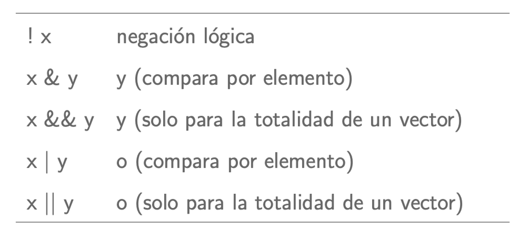

# Fundamentos de programación en R

## Unidad 2

---

## 2.3 Manipulación de datos

---

### Aspectos básicos

1. Funciones Básicas de Manipulación de Datos

- `t()`

La función `t()` se utiliza para **transponer** una matriz o un data frame, intercambiando filas y columnas.

#### Ejemplo de `t()`

```R
# Crea una matriz de ejemplo
matrix_example <- matrix(1:9, nrow = 3, ncol = 3)
matrix_example

# Vamos a transponer la matriz
transposed_matrix <- t(matrix_example)
transposed_matrix
```

- `lapply()`

La función `lapply()` aplica **una función a cada elemento de una lista** y devuelve una **lista** de la misma longitud.

#### Ejemplo de `lapply()`

```R
# Crea una lista de vectores numéricos
list_example <- list(a = 1:5, b = 6:10)
list_example

# Aplica la función sum() a cada elemento de la lista
lapply_result <- lapply(list_example, sum)
# Observa los resultados
lapply_result
```

- `sapply()`

La función `sapply()` es similar a `lapply()`, pero intenta **simplificar el resultado en un vector o matriz**.

#### Ejemplo de `sapply()`

```R
# Aplica la función sum() a cada elemento de la lista y simplificar el resultado
sapply_result <- sapply(list_example, sum)
#Observa los resultados con sapply
sapply_result
```

- `do.call()`

La función `do.call()` ejecuta una **función con una lista de argumentos**.

#### Ejemplo de `do.call()`

```R
# Crea una lista de argumentos
args_list <- list(1:5, 6:10)

# Usa do.call() para aplicar rbind() - otra función - a la lista de argumentos

do_call_result <- do.call(rbind, args_list)
#¿Qué obtuviste?
do_call_result
```

- **Operadores Lógicos**

Los **operadores lógicos** se utilizan para realizar **operaciones lógicas** y obtener **resultados booleanos** (TRUE o FALSE).



#### Ejemplo de operadores lógicos

```R
# Crea vectores de ejemplo
x <- 1:10
y <- 5:14

# Operadores lógicos
x > 5
x == y
x != y
x & (y < 10)
x | (y < 10)
```

- `is.na()`

La función `is.na()` se utiliza para **identificar valores NA** (faltantes) en un vector o data frame.

Otros caracteres especiales:


#### Ejemplo de `is.na()`

```R
# Crea un vector con valores NA
vector_with_na <- c(1, 2, NA, 4, NA, 6)

# Identifica valores NA
is.na(vector_with_na)

```

- `subset()`

La función `subset()` se utiliza para **extraer subconjuntos** de un **data frame** según condiciones específicas.

#### Ejemplo de `subset()`

```R
# Crea un data frame de ejemplo
df_example <- data.frame(
  id = 1:10,
  age = c(23, 25, 30, 22, 28, 32, 35, 40, 45, 50),
  gender = c("M", "F", "M", "F", "M", "F", "M", "F", "M", "F")
)

# Separa un subconjunto de filas donde la edad es mayor a 30
subset_result <- subset(df_example, age > 30)
subset_result
```

- `aggregate()`

La función `aggregate()` se utiliza para **aplicar funciones de resumen** a **subconjuntos** de un data frame.

#### Ejemplo de `aggregate()`

```R
# Crea un data frame de ejemplo
df_example2 <- data.frame(
  group = c("A", "A", "B", "B", "B"),
  value = c(10, 15, 20, 25, 30)
)

# Calcula la media de 'value' para cada grupo
aggregate_result <- aggregate(value ~ group, data = df_example2, FUN = mean)
print(aggregate_result)
```

**2. Diferencias entre formatos ancho (Wide) y largo (Long)**

En el formato **wide**, **cada variable se extiende en columnas diferentes**. Este formato es útil para **visualizaciones** y algunas operaciones estadísticas.

En el formato **long**, las observaciones se registran en **filas adicionales**, lo que **facilita** la **manipulación** y **análisis** de datos longitudinales.


### Fuentes de información

- [base R Cheat Sheet](https://iqss.github.io/dss-workshops/R/Rintro/base-r-cheat-sheet.pdf)
- [Data wrangling Cheat Sheet](https://www.rstudio.com/wp-content/uploads/2015/02/data-wrangling-cheatsheet.pdf)
- [Getting started R](https://www.datacamp.com/cheat-sheet/getting-started-r)

---

## 2.3.1 reshape2


### 2.3.1 Fuentes de información

---


## 2.3.2 tidyr

### 2.3.2 Fuentes de información

---


## 2.3.3 dplyr

### 2.3.3 Fuentes de información

---


## 2.3.4 magrittr

### 2.3.4 Fuentes de información

