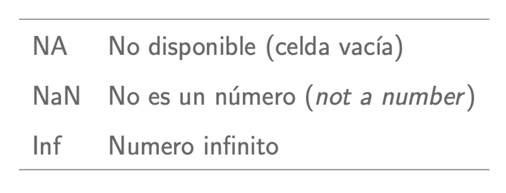
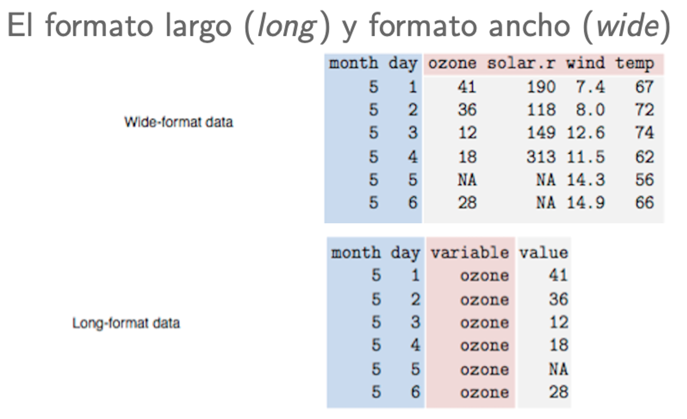
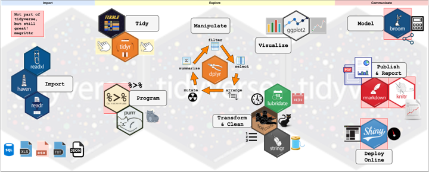
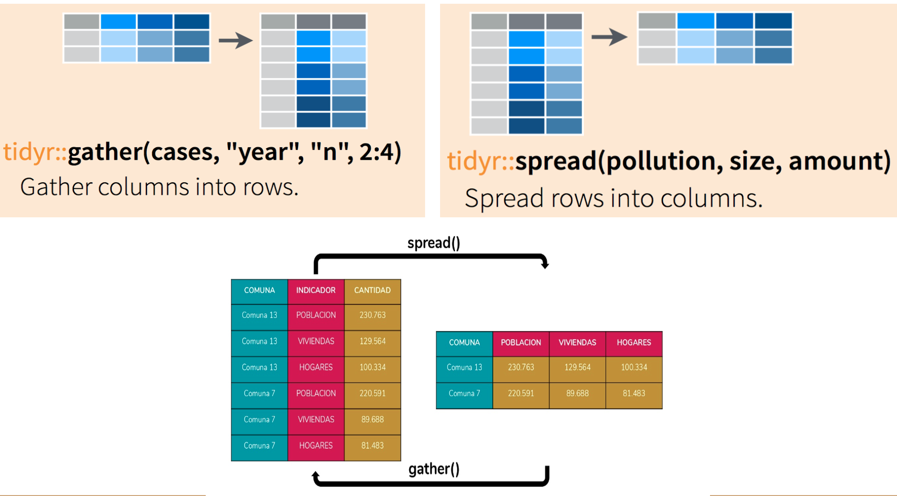
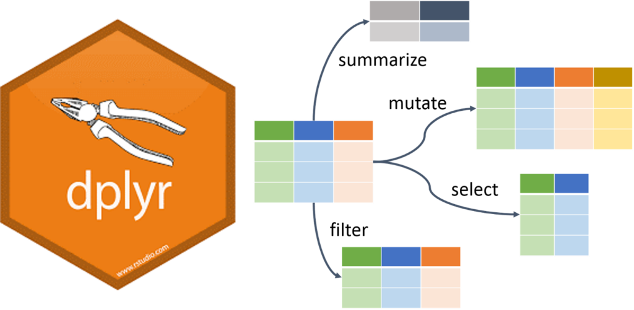
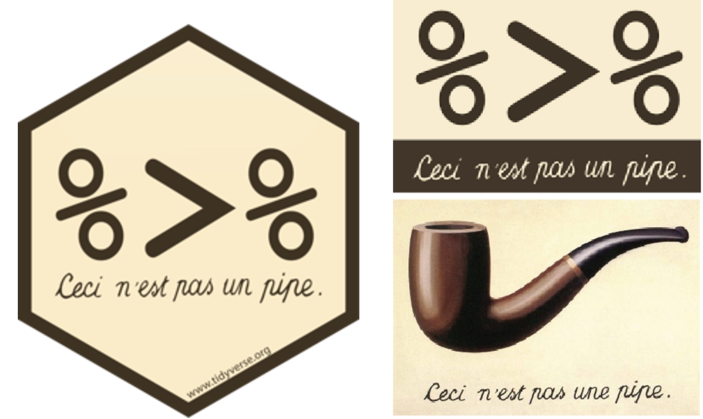
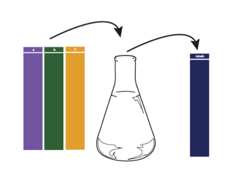
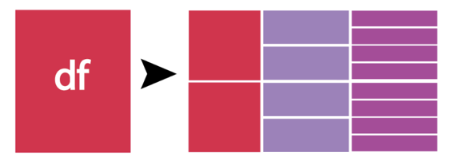
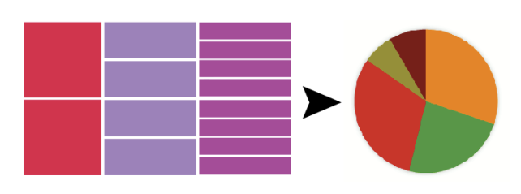
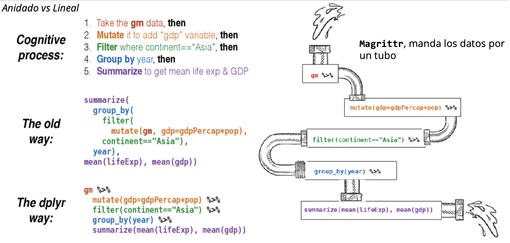

# Fundamentos de programación en R

## Unidad 2

---

## 2.3 Manipulación de datos

---

### Aspectos básicos

1. Funciones Básicas de Manipulación de Datos


# Operadores lógicos

```
x > 5
x == y
x != y
x & (y < 10)
x | (y < 10)
```

- `is.na()`

La función `is.na()` se utiliza para **identificar valores NA** (faltantes) en un vector o data frame.

Otros caracteres especiales:


#### Ejemplo de `is.na()`

```R
# Crea un vector con valores NA
vector_with_na <- c(1, 2, NA, 4, NA, 6)

# Identifica valores NA
is.na(vector_with_na)

```


**2. Diferencias entre formatos ancho (Wide) y largo (Long)**

En el formato **wide**, **cada variable se extiende en columnas diferentes**. Este formato es útil para **visualizaciones** y algunas operaciones estadísticas.

En el formato **long**, las observaciones se registran en **filas adicionales**, lo que **facilita** la **manipulación** y **análisis** de datos longitudinales.



### Fuentes de información

- [base R Cheat Sheet](https://iqss.github.io/dss-workshops/R/Rintro/base-r-cheat-sheet.pdf)
- [Data wrangling Cheat Sheet](https://www.rstudio.com/wp-content/uploads/2015/02/data-wrangling-cheatsheet.pdf)
- [Getting started R](https://www.datacamp.com/cheat-sheet/getting-started-r)

---

Las funciones y conceptos anteriores proporcionan una base para la manipulación de datos en R. Ahora vamos a continuar con los paquetes especializados para la manipulación de datos en R:

- **reshape2**: Para transformar y reorganizar data frames.

- **tidyr**: Para cambiar entre formatos wide y long.

- **dplyr**: Para la manipulación eficiente de data frames.

- **magrittr**: Para mejorar la legibilidad del código utilizando tuberías (%>%).


---

## 2.3.2 tidyr

El paquete **tidyr** es parte del ecosistema de **tidyverse** en R, fue diseñado para ayudar a limpiar y estructurar datos de una manera que facilite su análisis. Su desarrollador es [Hadley Wickham](https://twitter.com/hadleywickham), un conocido científico de datos y autor de varios paquetes populares en R (`ggplot2`, `dplyr`, `readr`, entre otros).



El nombre **tidyr** proviene de la combinación de las palabras "tidy" (ordenado) y "R". El objetivo del paquete es **transformar los datos en un formato ordenado**.

### ¿Qué Son los Datos Ordenados?

En **tidyverse**, los **datos ordenados** son aquellos en los que **cada variable se guarda en una columna**, cada **observación** se guarda en una **fila** y cada tipo de **unidad observacional** forma una **tabla**. Este formato facilita el análisis y la visualización de datos.

### Funciones principales en tidyr

- `gather()`: convierte datos de formato wide a long.
- `spread()`: convierte datos de formato long a wide.
- `separate()`: divide una columna en varias columnas.
- `unite()`: combina varias columnas en una sola.

`pivot_longer()` y `pivot_wider()` son **versiones mejoradas** de `gather()` y `spread()`, respectivamente, introducidas en versiones más recientes de **tidyr**.

- `pivot_longer()` convierte datos de formato wide a long de una manera más intuitiva y flexible.
- `pivot_wider()` convierte datos de formato long a wide.

#### Diferencias entre gather()/spread() y pivot_longer()/pivot_wider()

- `gather()`/`spread()`:

Son funciones más antiguas y menos intuitivas en algunos casos.
Requieren especificar manualmente todas las columnas que se deben transformar.

- `pivot_longer()`/`pivot_wider()`:

Son más recientes y ofrecen una sintaxis más intuitiva y flexible.
Permiten usar patrones para seleccionar columnas, lo que simplifica la transformación de datos.

#### Ejemplos con la base de datos "Iris"

```R
# Carga la base de datos iris
data("iris")
head(iris)
dim(iris)
```

La base de datos iris contiene las siguientes columnas:

- Sepal.Length: Longitud del sépalo.
- Sepal.Width: Anchura del sépalo.
- Petal.Length: Longitud del pétalo.
- Petal.Width: Anchura del pétalo.
- Species: Especie de la flor.

```R
#Carga tidyr
library(tidyr)

#Si no tienes instalado el paquete usa:
#install.packages("tidyr")

# Añadir un identificador único a las filas de iris
iris$ID <- 1:nrow(iris)

# Convertir a formato long usando gather
iris_long <- gather(iris, key = "Measurement", value = "Value", -Species, -ID)

# Ver el data frame en formato long
head(iris_long)

# Convertir de vuelta a formato wide usando spread
iris_wide_again <- spread(iris_long, key = "Measurement", value = "Value")

# Ver el data frame en formato wide
head(iris_wide_again)

```



Con `unite()` vamos a crear una columna que combine la especie y la longitud del sépalo, luego con `separate()` la separaremos en dos columnas

```R
# Crea una nueva columna combinada
iris_combined <- unite(iris, col = "Species_SepalLength", Species, Sepal.Length, sep = "_")
head(iris_combined)
dim(iris_combined)

# Usa separate() para dividir la columna combinada
iris_separated <- separate(iris_combined, col = "Species_SepalLength", into = c("Species", "Sepal.Length"), sep = "_")
head(iris_separated)
dim(iris_separated)
```


#### EXTRA: pivot_longer() y pivot_wider()

```R
# Usar pivot_longer() para convertir de wide a long
iris_long_pivot <- pivot_longer(iris, cols = starts_with("Sepal") | starts_with("Petal"), names_to = "Measurement", values_to = "Value")
head(iris_long_pivot)
dim(iris_long_pivot)

# Usar pivot_wider() para convertir de long a wide
iris_wide_pivot <- pivot_wider(iris_long_pivot, names_from = "Measurement", values_from = "Value")
head(iris_wide_pivot)
dim(iris_wide_pivot)

```

Ambos paquetes, **reshape2** y **tidyr**, son herramientas poderosas para la **manipulación y transformación de datos** en R. La elección entre ellos puede depender de la familiaridad del usuario con tidyverse y la necesidad de funcionalidad y flexibilidad adicionales proporcionadas por **tidyr**. Para la mayoría de los usuarios nuevos y aquellos que trabajan extensivamente con el **ecosistema tidyverse**, tidyr con **pivot_longer()** y **pivot_wider()** es la opción preferida.

### 2.3.2 Fuentes de información

- [The tidy tools manifesto](https://cran.rstudio.com/web/packages/tidyverse/vignettes/manifesto.html)
- [Introducción a tidyr: Datos ordenados en R](https://rpubs.com/jaortega/151936)

---

## 2.3.3 dplyr y magrittr

### Introducción a dplyr

El paquete **dplyr** es una herramienta **esencial** para la **manipulación de datos tabulares** en R, proporcionando una gramática clara y eficiente para operaciones comunes. Su nombre proviene de "**d**" (de **data**) y "**plyr**" (de **pliers o alicates**, y en referencia al paquete **plyr**, un precursor de **dplyr**).

Las **principales funciones** de **dplyr** incluyen:

- `mutate()`: se utiliza para crear nuevas variables o modificar las existentes.
- `filter()`: selecciona filas de un data frame según ciertas condiciones.
- `group_by()`: agrupa datos por una o más variables.
- `summarize()`: calcula estadísticas resumidas, como medias o desviaciones estándar, para cada grupo de datos.



### Introducción a magrittr

A menudo, junto a **dplyr** se utiliza el paquete **magrittr**, que introduce el **operador de tubería** (**%>%**), permitiendo encadenar múltiples operaciones de manera más legible y concisa. Este operador **toma la salida** de una función y la pasa **como entrada** a la siguiente, permitiendo escribir código más limpio y entendible.



#### Ejemplo básico de magrittr

```R
#Carga el paquete de magrittr
library(magrittr)

#Si no lo tienes instalado:
#install.package("magrittr")

# Ejemplo simple usando %>%
#Crea un vector que contenga valores de 1 a 10, suma todo y obtén el cuadrado de esa suma total

result <- 1:10 %>% 
  sum() %>% 
  sqrt()

result
# Output: 7.416198
```

---

Ahora, comenzaremos a usar **dplyr** y veremos las diferencias entre usar o no el **pipe** de **magrittr**. Seguiremos usando la base de datos de Iris:


#### Ejemplo de mutate()



```R
# Cargar la base de datos iris y el paquete dplyr
#data("iris")
#Carga el paquete dplyr
#Si no lo tienes instalado usa install.package()
library(dplyr)
#Revisa nuevamente la base iris
head(iris)

# Crea nuevas columnas que son el doble de Sepal.Length y la relación Sepal.Length/Sepal.Width

mutated_iris <- mutate(
  iris,
  double_sepal_length = Sepal.Length * 2,
  sepal_ratio = Sepal.Length / Sepal.Width)

#Revisa el nuevo df con las nuevas columnas
head(mutated_iris)
```

Ahora, veamos el código si incorporamos **%>%**:

```R
# Carga la base de datos iris y los paquetes dplyr y magrittr
#data("iris")
#library(dplyr)
library(magrittr)
#Revisa nuevamente la base iris
head(iris)

# Crea nuevas columnas que son el doble de Sepal.Length y la relación Sepal.Length/Sepal.Width

mutated_iris_pipe <- iris %>%
  mutate(
    double_sepal_length = Sepal.Length * 2,
    sepal_ratio = Sepal.Length / Sepal.Width)

#Revisa el nuevo df con las nuevas columnas
head(mutated_iris_pipe)

```

#### Ejemplo de filter()

```R
# Filtra filas donde Sepal.Length es mayor a 5 y Species es "setosa"

filtered_iris <- filter(iris, Sepal.Length > 5, Species == "setosa")
#Revisa el nuevo df
filtered_iris
```

Con **%>%**:

```R
# Filtra filas donde Sepal.Length es mayor a 5 y Species es "setosa"

filtered_iris_pipe <- iris %>%
  filter(Sepal.Length > 5, Species == "setosa")
#Revisa el nuevo df
filtered_iris_pipe

```

#### Ejemplo de group_by()



```R
# Agrupa por Species
iris_grouped <- group_by(iris, Species)

# Muestra los datos agrupados
iris_grouped
```

Con **%>%**:

```R
# Agrupa por Species usando %>%
iris_grouped_pipe <- iris %>% group_by(Species)

# Muestra los datos agrupados
iris_grouped_pipe
```

#### Ejemplo de summarize()



```R
# Calcula la media y desviación estándar de Sepal.Length por especie

summar_iris <- summarize(
  group_by(iris, Species),
  mean_sepal_length = mean(Sepal.Length),
  sd_sepal_length = sd(Sepal.Length))
#Revisa los resultados:
summar_iris

```

Ahora, con **%>%**:

```R
# Calcula la media y desviación estándar de Sepal.Length por especie

summar_iris_pipe <- iris %>%
  group_by(Species) %>%
  summarize(
    mean_sepal_length = mean(Sepal.Length),
    sd_sepal_length = sd(Sepal.Length))
#Revisa los resultados:
summar_iris_pipe

```

### ¿Es posible tener las cuatro funciones en una sola línea de código (chunk)?



Probemos en R cómo sería con y sin **pipe**.

```R
# Cargar la base de datos iris y el paquete dplyr
data("iris")
library(dplyr)

# Manipulación de datos en una sola línea sin usar %>%
summary_iris <- summarize(group_by(filter(mutate(iris, double_sepal_length = Sepal.Length * 2), Sepal.Length > 5), Species), mean_sepal_length = mean(Sepal.Length), sd_sepal_length = sd(Sepal.Length), mean_double_sepal_length = mean(double_sepal_length), sd_double_sepal_length = sd(double_sepal_length))

# Imprimir el resumen
summary_iris

```

Con **%>%**:

```R
# Cargar la base de datos iris y los paquetes necesarios
data("iris")
library(dplyr)

# Manipulación de datos en un solo chunk usando %>%
summary_iris_pipe <- iris %>%
  # Crear una nueva columna que es el doble de Sepal.Length
  mutate(double_sepal_length = Sepal.Length * 2) %>%
  # Filtrar filas donde Sepal.Length es mayor a 5
  filter(Sepal.Length > 5) %>%
  # Agrupar por Species
  group_by(Species) %>%
  # Calcular la media y la desviación estándar de Sepal.Length y double_sepal_length
  summarize(
    mean_sepal_length = mean(Sepal.Length),
    sd_sepal_length = sd(Sepal.Length),
    mean_double_sepal_length = mean(double_sepal_length),
    sd_double_sepal_length = sd(double_sepal_length)
  )

# Imprimir el resumen
print(summary_iris)

```

Después de ver esta diferencias, ¿qué opinas, vale la pena intentar usar **%>%**?


### 2.3.3 Fuentes de información

- [Data transformations - Cheat Sheets](https://github.com/rstudio/cheatsheets/blob/main/data-transformation.pdf)
- [dplyr - tidyverse](https://dplyr.tidyverse.org/)
- [Pipe](https://magrittr.tidyverse.org/reference/pipe.html)

---

La **manipulación de datos** es una habilidad **esencial** en el análisis de datos. Los paquetes `reshape2`, `tidyr`, `dplyr` y `magrittr` proporcionan herramientas fundamentales para **transformar, limpiar y analizar** datos de manera eficiente. 

Otros paquetes como `ggplot2`, `readr`, `data.table`, `vegan`, `phyloseq` y `ape` permiten profundizar en el manejo y analisis de datos en contextos más específicos (filogenético, evolutivo, ecológico, diversidad, etc.)

---

### Siguiente tema: [3.1 Gráficos en R](../Unidad_03/U3_notebook.pdf)
