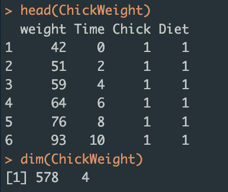

# Fundamentos de programación en R

## Unidad 2

---

## 2.3 Manipulación de datos

---

### Aspectos básicos

1. Funciones Básicas de Manipulación de Datos

- `t()`

La función `t()` se utiliza para **transponer** una matriz o un data frame, intercambiando filas y columnas.

#### Ejemplo de `t()`

```R
# Crea una matriz de ejemplo
matrix_example <- matrix(1:9, nrow = 3, ncol = 3)
matrix_example

# Vamos a transponer la matriz
transposed_matrix <- t(matrix_example)
transposed_matrix
```

- `lapply()`

La función `lapply()` aplica **una función a cada elemento de una lista** y devuelve una **lista** de la misma longitud.

#### Ejemplo de `lapply()`

```R
# Crea una lista de vectores numéricos
list_example <- list(a = 1:5, b = 6:10)
list_example

# Aplica la función sum() a cada elemento de la lista
lapply_result <- lapply(list_example, sum)
# Observa los resultados
lapply_result
```

- `sapply()`

La función `sapply()` es similar a `lapply()`, pero intenta **simplificar el resultado en un vector o matriz**.

#### Ejemplo de `sapply()`

```R
# Aplica la función sum() a cada elemento de la lista y simplificar el resultado
sapply_result <- sapply(list_example, sum)
#Observa los resultados con sapply
sapply_result
```

- `do.call()`

La función `do.call()` ejecuta una **función con una lista de argumentos**.

#### Ejemplo de `do.call()`

```R
# Crea una lista de argumentos
args_list <- list(1:5, 6:10)

# Usa do.call() para aplicar rbind() - otra función - a la lista de argumentos

do_call_result <- do.call(rbind, args_list)
#¿Qué obtuviste?
do_call_result
```

- **Operadores Lógicos**

Los **operadores lógicos** se utilizan para realizar **operaciones lógicas** y obtener **resultados booleanos** (TRUE o FALSE).


#### Ejemplo de operadores lógicos

```R
# Crea vectores de ejemplo
x <- 1:10
y <- 5:14

# Operadores lógicos
x > 5
x == y
x != y
x & (y < 10)
x | (y < 10)
```

- `is.na()`

La función `is.na()` se utiliza para **identificar valores NA** (faltantes) en un vector o data frame.

Otros caracteres especiales:


#### Ejemplo de `is.na()`

```R
# Crea un vector con valores NA
vector_with_na <- c(1, 2, NA, 4, NA, 6)

# Identifica valores NA
is.na(vector_with_na)

```

- `subset()`

La función `subset()` se utiliza para **extraer subconjuntos** de un **data frame** según condiciones específicas.

#### Ejemplo de `subset()`

```R
# Crea un data frame de ejemplo
df_example <- data.frame(
  id = 1:10,
  age = c(23, 25, 30, 22, 28, 32, 35, 40, 45, 50),
  gender = c("M", "F", "M", "F", "M", "F", "M", "F", "M", "F")
)

# Separa un subconjunto de filas donde la edad es mayor a 30
subset_result <- subset(df_example, age > 30)
subset_result
```

- `aggregate()`

La función `aggregate()` se utiliza para **aplicar funciones de resumen** a **subconjuntos** de un data frame.

#### Ejemplo de `aggregate()`

```R
# Crea un data frame de ejemplo
df_example2 <- data.frame(
  group = c("A", "A", "B", "B", "B"),
  value = c(10, 15, 20, 25, 30)
)

# Calcula la media de 'value' para cada grupo
aggregate_result <- aggregate(value ~ group, data = df_example2, FUN = mean)
print(aggregate_result)
```

**2. Diferencias entre formatos ancho (Wide) y largo (Long)**

En el formato **wide**, **cada variable se extiende en columnas diferentes**. Este formato es útil para **visualizaciones** y algunas operaciones estadísticas.

En el formato **long**, las observaciones se registran en **filas adicionales**, lo que **facilita** la **manipulación** y **análisis** de datos longitudinales.


### Fuentes de información

- [base R Cheat Sheet](https://iqss.github.io/dss-workshops/R/Rintro/base-r-cheat-sheet.pdf)
- [Data wrangling Cheat Sheet](https://www.rstudio.com/wp-content/uploads/2015/02/data-wrangling-cheatsheet.pdf)
- [Getting started R](https://www.datacamp.com/cheat-sheet/getting-started-r)

---

Las funciones y conceptos anteriores proporcionan una base para la manipulación de datos en R. Ahora vamos a continuar con los paquetes especializados para la manipulación de datos en R:

- **reshape2**: Para transformar y reorganizar data frames.

- **tidyr**: Para cambiar entre formatos wide y long.

- **dplyr**: Para la manipulación eficiente de data frames.

- **magrittr**: Para mejorar la legibilidad del código utilizando tuberías (%>%).

## 2.3.1 reshape2

El paquete **reshape2** es una herramienta esencial para **transformar y reorganizar data frames**, especialmente cuando se necesita cambiar entre los **formatos "wide" y "long"**. Estos formatos son cruciales en la manipulación de datos, ya que ciertos análisis y visualizaciones requieren datos en un formato específico.

**¿Por qué usar reshape2?**

**Flexibilidad**: Permite cambiar entre formatos de datos con facilidad.
**Eficiencia**: Realiza transformaciones complejas de datos de manera concisa y eficiente.
**Compatibilidad**: Se integra bien con otros paquetes de R, facilitando su uso en flujos de trabajo de análisis de datos.

**Reshape2** tiene **dos funciones principales**:

`dcast()`: Convierte un data frame del formato long al formato wide.

`melt()`: Convierte un data frame del formato wide al formato long.

### Ejemplos con dcast() y melt()

Para estos ejemplos, utilizaremos la base de datos **ChickWeight** que está incluida en R y tiene relación con el **crecimiento de pollos bajo diferentes dietas y en diferentes tiempos**.



```R
# Cargar la base de datos ChickWeight
data("ChickWeight")
#Explora la base de datos con head o completa
head(ChickWeight)

# Carga el paquete reshape2 
#Si no lo tienes instalado, usa la siguiente línea:
#install.packages("reshape2")
library(reshape2)

# Crea un data frame de ejemplo en formato wide (ancho)
#Vamos a usar dcast()
wide_chick <- dcast(ChickWeight, Diet + Chick ~ Time, value.var = "weight")
#Revisa si cambio el formato
head(wide_chick)
dim(wide_chick)

# Usa melt() para convertirlo a formato long (largo)
long_chick <- melt(wide_chick, id.vars = c("Diet", "Chick"), variable.name = "Time", value.name = "Weight")
#Revisa si cambio el formato
head(long_chick)
dim(long_chick)

```

La función `dcast()` convierte el data frame de formato **long a wide**. 

- La **fórmula** (Diet + Chick ~ Time) define cómo se deben agrupar y distribuir los datos, en este caso manteniendo las columnas Diet y Chick, y asignando los valores de Time como variables separadas en columnas. 

- **value.var** es la columna que contiene los valores a distribuir en el formato wide, en este caso fue **weight**.

Con `melt()` se convierte el data frame de formato wide a long.

- **id.vars** con las columnas que permanecerán como identificadores. En este caso, como son dos se utiliza la función `c()`, **c("Diet", "Chick")**.

- **variable.name** es el nombre de la columna que contendrá los nombres de las columnas variables. En este caso, fue **Time**.

- **value.name** es el nombre de la columna que contendrá los valores. En este caso, **Weight**.

### 2.3.1 Fuentes de información

- [Una introducción a Reshape2](https://rpubs.com/enralvar/ReShape2)
- [Melting & Casting](https://ademos.people.uic.edu/Chapter8.html)

---

## 2.3.2 tidyr

El paquete **tidyr** es parte del ecosistema de **tidyverse** en R, fue diseñado para ayudar a limpiar y estructurar datos de una manera que facilite su análisis. Su desarrollador es [Hadley Wickham](https://twitter.com/hadleywickham), un conocido científico de datos y autor de varios paquetes populares en R (`ggplot2`, `dplyr`, `readr`, entre otros).


El nombre **tidyr** proviene de la combinación de las palabras "tidy" (ordenado) y "R". El objetivo del paquete es **transformar los datos en un formato ordenado**.

### ¿Qué Son los Datos Ordenados?

En **tidyverse**, los **datos ordenados** son aquellos en los que **cada variable se guarda en una columna**, cada **observación** se guarda en una **fila** y cada tipo de **unidad observacional** forma una **tabla**. Este formato facilita el análisis y la visualización de datos.

### Funciones principales en tidyr

- `gather()`: convierte datos de formato wide a long.
- `spread()`: convierte datos de formato long a wide.
- `separate()`: divide una columna en varias columnas.
- `unite()`: combina varias columnas en una sola.

`pivot_longer()` y `pivot_wider()` son **versiones mejoradas** de `gather()` y `spread()`, respectivamente, introducidas en versiones más recientes de **tidyr**.

- `pivot_longer()` convierte datos de formato wide a long de una manera más intuitiva y flexible.
- `pivot_wider()` convierte datos de formato long a wide.

#### Diferencias entre gather()/spread() y pivot_longer()/pivot_wider()

- `gather()`/`spread()`:

Son funciones más antiguas y menos intuitivas en algunos casos.
Requieren especificar manualmente todas las columnas que se deben transformar.

- `pivot_longer()`/`pivot_wider()`:

Son más recientes y ofrecen una sintaxis más intuitiva y flexible.
Permiten usar patrones para seleccionar columnas, lo que simplifica la transformación de datos.

#### Ejemplos con la base de datos "Iris"

```R
# Carga la base de datos iris
data("iris")
head(iris)
dim(iris)
```

La base de datos iris contiene las siguientes columnas:

- Sepal.Length: Longitud del sépalo.
- Sepal.Width: Anchura del sépalo.
- Petal.Length: Longitud del pétalo.
- Petal.Width: Anchura del pétalo.
- Species: Especie de la flor.

```R
#Carga tidyr
library(tidyr)

#Si no tienes instalado el paquete usa:
#install.packages("tidyr")

# Usar gather() para convertir a formato long
iris_long <- gather(iris, key = "Measurement", value = "Value", -Species)
head(iris_long)
dim(iris_long)


# Usar spread() para convertir de nuevo a formato wide
iris_wide_again <- spread(iris_long, key = "Measurement", value = "Value")
head(iris_wide_again)
dim(iris_wide_again)

```

Con `unite()` vamos a crear una columna que combine la especie y la longitud del sépalo, luego con `separate()` la separaremos en dos columnas

```R
# Crea una nueva columna combinada
iris_combined <- unite(iris, col = "Species_SepalLength", Species, Sepal.Length, sep = "_")
head(iris_combined)
dim(iris_combined)

# Usa separate() para dividir la columna combinada
iris_separated <- separate(iris_combined, col = "Species_SepalLength", into = c("Species", "Sepal.Length"), sep = "_")
head(iris_separated)
dim(iris_separated)
```

#### EXTRA: pivot_longer() y pivot_wider()

```R
# Usar pivot_longer() para convertir de wide a long
iris_long_pivot <- pivot_longer(iris, cols = starts_with("Sepal") | starts_with("Petal"), names_to = "Measurement", values_to = "Value")
head(iris_long_pivot)
dim(iris_long_pivot)

# Usar pivot_wider() para convertir de long a wide
iris_wide_pivot <- pivot_wider(iris_long_pivot, names_from = "Measurement", values_from = "Value")
head(iris_wide_pivot)
dim(iris_wide_pivot)

```

Ambos paquetes, **reshape2** y **tidyr**, son herramientas poderosas para la **manipulación y transformación de datos** en R. La elección entre ellos puede depender de la familiaridad del usuario con tidyverse y la necesidad de funcionalidad y flexibilidad adicionales proporcionadas por **tidyr**. Para la mayoría de los usuarios nuevos y aquellos que trabajan extensivamente con el **ecosistema tidyverse**, tidyr con **pivot_longer()** y **pivot_wider()** es la opción preferida.

### 2.3.2 Fuentes de información

- [The tidy tools manifesto](https://cran.rstudio.com/web/packages/tidyverse/vignettes/manifesto.html)
- [Introducción a tidyr: Datos ordenados en R](https://rpubs.com/jaortega/151936)

---

## 2.3.3 dplyr y magrittr

### Introducción a dplyr

El paquete **dplyr** es una herramienta **esencial** para la **manipulación de datos tabulares** en R, proporcionando una gramática clara y eficiente para operaciones comunes. Su nombre proviene de "**d**" (de **data**) y "**plyr**" (de **pliers o alicates**, y en referencia al paquete **plyr**, un precursor de **dplyr**).

Las **principales funciones** de **dplyr** incluyen:

- `mutate()`: se utiliza para crear nuevas variables o modificar las existentes.
- `filter()`: selecciona filas de un data frame según ciertas condiciones.
- `group_by()`: agrupa datos por una o más variables.
- `summarize()`: calcula estadísticas resumidas, como medias o desviaciones estándar, para cada grupo de datos.


### Introducción a magrittr

A menudo, junto a **dplyr** se utiliza el paquete **magrittr**, que introduce el **operador de tubería** (**%>%**), permitiendo encadenar múltiples operaciones de manera más legible y concisa. Este operador **toma la salida** de una función y la pasa **como entrada** a la siguiente, permitiendo escribir código más limpio y entendible.


#### Ejemplo básico de magrittr

```R
#Carga el paquete de magrittr
library(magrittr)

#Si no lo tienes instalado:
#install.package("magrittr")

# Ejemplo simple usando %>%
#Crea un vector que contenga valores de 1 a 10, suma todo y obtén el cuadrado de esa suma total

result <- 1:10 %>% 
  sum() %>% 
  sqrt()

result
# Output: 7.416198
```

---

Ahora, comenzaremos a usar **dplyr** y veremos las diferencias entre usar o no el **pipe** de **magrittr**. Seguiremos usando la base de datos de Iris:


#### Ejemplo de mutate()

```R
# Cargar la base de datos iris y el paquete dplyr
#data("iris")
#Carga el paquete dplyr
#Si no lo tienes instalado usa install.package()
library(dplyr)
#Revisa nuevamente la base iris
head(iris)

# Crea nuevas columnas que son el doble de Sepal.Length y la relación Sepal.Length/Sepal.Width

mutated_iris <- mutate(
  iris,
  double_sepal_length = Sepal.Length * 2,
  sepal_ratio = Sepal.Length / Sepal.Width)

#Revisa el nuevo df con las nuevas columnas
head(mutated_iris)
```

Ahora, veamos el código si incorporamos **%>%**:

```R
# Carga la base de datos iris y los paquetes dplyr y magrittr
#data("iris")
#library(dplyr)
library(magrittr)
#Revisa nuevamente la base iris
head(iris)

# Crea nuevas columnas que son el doble de Sepal.Length y la relación Sepal.Length/Sepal.Width

mutated_iris_pipe <- iris %>%
  mutate(
    double_sepal_length = Sepal.Length * 2,
    sepal_ratio = Sepal.Length / Sepal.Width)

#Revisa el nuevo df con las nuevas columnas
head(mutated_iris_pipe)

```

#### Ejemplo de filter()

```R
# Filtra filas donde Sepal.Length es mayor a 5 y Species es "setosa"

filtered_iris <- filter(iris, Sepal.Length > 5, Species == "setosa")
#Revisa el nuevo df
filtered_iris
```

Con **%>%**:

```R
# Filtra filas donde Sepal.Length es mayor a 5 y Species es "setosa"

filtered_iris_pipe <- iris %>%
  filter(Sepal.Length > 5, Species == "setosa")
#Revisa el nuevo df
filtered_iris_pipe

```

#### Ejemplo de group_by()

```R
# Agrupa por Species
iris_grouped <- group_by(iris, Species)

# Muestra los datos agrupados
iris_grouped
```

Con **%>%**:

```R
# Agrupa por Species usando %>%
iris_grouped_pipe <- iris %>% group_by(Species)

# Muestra los datos agrupados
iris_grouped_pipe
```

#### Ejemplo de summarize()

```R
# Calcula la media y desviación estándar de Sepal.Length por especie

summar_iris <- summarize(
  group_by(iris, Species),
  mean_sepal_length = mean(Sepal.Length),
  sd_sepal_length = sd(Sepal.Length))
#Revisa los resultados:
summar_iris

```

Ahora, con **%>%**:

```R
# Calcula la media y desviación estándar de Sepal.Length por especie

summar_iris_pipe <- iris %>%
  group_by(Species) %>%
  summarize(
    mean_sepal_length = mean(Sepal.Length),
    sd_sepal_length = sd(Sepal.Length))
#Revisa los resultados:
summar_iris_pipe

```

### ¿Es posible tener las cuatro funciones en una sola línea de código (chunk)?


Probemos en R cómo sería con y sin **pipe**.

```R
# Cargar la base de datos iris y el paquete dplyr
data("iris")
library(dplyr)

# Manipulación de datos en una sola línea sin usar %>%
summary_iris <- summarize(group_by(filter(mutate(iris, double_sepal_length = Sepal.Length * 2), Sepal.Length > 5), Species), mean_sepal_length = mean(Sepal.Length), sd_sepal_length = sd(Sepal.Length), mean_double_sepal_length = mean(double_sepal_length), sd_double_sepal_length = sd(double_sepal_length))

# Imprimir el resumen
summary_iris

```

Con **%>%**:

```R
# Cargar la base de datos iris y los paquetes necesarios
data("iris")
library(dplyr)

# Manipulación de datos en un solo chunk usando %>%
summary_iris_pipe <- iris %>%
  # Crear una nueva columna que es el doble de Sepal.Length
  mutate(double_sepal_length = Sepal.Length * 2) %>%
  # Filtrar filas donde Sepal.Length es mayor a 5
  filter(Sepal.Length > 5) %>%
  # Agrupar por Species
  group_by(Species) %>%
  # Calcular la media y la desviación estándar de Sepal.Length y double_sepal_length
  summarize(
    mean_sepal_length = mean(Sepal.Length),
    sd_sepal_length = sd(Sepal.Length),
    mean_double_sepal_length = mean(double_sepal_length),
    sd_double_sepal_length = sd(double_sepal_length)
  )

# Imprimir el resumen
print(summary_iris)

```

Después de ver esta diferencias, ¿qué opinas, vale la pena intentar usar **%>%**?


### 2.3.3 Fuentes de información

- [Data transformations - Cheat Sheets](https://github.com/rstudio/cheatsheets/blob/main/data-transformation.pdf)
- [dplyr - tidyverse](https://dplyr.tidyverse.org/)
- [Pipe](https://magrittr.tidyverse.org/reference/pipe.html)

---

La **manipulación de datos** es una habilidad **esencial** en el análisis de datos. Los paquetes `reshape2`, `tidyr`, `dplyr` y `magrittr` proporcionan herramientas fundamentales para **transformar, limpiar y analizar** datos de manera eficiente. 

Otros paquetes como `ggplot2`, `readr`, `data.table`, `vegan`, `phyloseq` y `ape` permiten profundizar en el manejo y analisis de datos en contextos más específicos (filogenético, evolutivo, ecológico, diversidad, etc.)

---

### Siguiente tema: [2.4 Leer y guardar archivos](../Unidad_02/U2_4_Leer_guardar_archivos.md)

