# Fundamentos de programación en R

## Unidad 3

---

## 3.1 Visualización de datos con R y `ggplot2`

## Objetivo

Construir, interpretar y exportar figuras reproducibles en R, usando funciones gráficas base y `ggplot2`, seleccionando el tipo de gráfica según la pregunta de análisis y el tipo de datos disponibles.

* [Presentación](#)
* [Descargar materiales de la sesión](#)

**Recuerda**: los scripts van en la carpeta `bin/`, los datos en `data/`, los documentos `.md` en `doc/Unidad_03/` y los resultados generados durante la práctica en `results/`.

## Material de apoyo

Para la práctica principal de esta unidad usaremos:

* [Script de práctica general Unidad 3](../../bin/U3_practica_general_comentado.R)

Archivos de datos:

* `data/U3_1.csv`
* `data/U3_2.csv`
* `data/U3_actividad.csv`

El script complementario para seguir explorando se indica al final de esta guía, en la sección correspondiente.

---

## 1. ¿Por qué visualizar datos?

Visualizar datos no significa solamente “hacer una gráfica bonita”. Una figura puede ayudarnos a:

* explorar patrones;
* detectar valores inesperados;
* comparar grupos;
* observar relaciones entre variables;
* comunicar resultados;
* revisar si los datos tienen sentido.

En análisis de datos, una gráfica puede ser parte del razonamiento. Por eso no elegimos una gráfica solo porque se vea atractiva, sino porque ayuda a responder una pregunta.

Una forma sencilla de pensar esta unidad es:

```text
Datos → Pregunta → Variables → Gráfica → Interpretación → Exportación
```

En esta sesión construiremos la base para entender esa ruta. Más adelante, durante la segunda semana del curso, esta misma lógica se retomará en visualizaciones más específicas de análisis transcriptómico, como heatmaps, volcano plots y gráficas asociadas a reducción de dimensiones.


---

## 2. Una figura no es solo una imagen

Una figura es una representación visual de datos. Para que sea útil, debe poder explicarse y verificarse.

Antes de aceptar una gráfica como resultado, conviene preguntarnos:

* ¿qué representa cada punto, barra, caja o línea?
* ¿qué variable está en el eje x?
* ¿qué variable está en el eje y?
* ¿qué representan los colores, formas o facetas?
* ¿la gráfica responde la pregunta que quiero contestar?
* ¿la figura muestra los datos crudos, datos resumidos o ambos?
* ¿el código que la genera puede ejecutarse nuevamente?

Una figura reproducible no depende de mover objetos manualmente ni de recordar pasos hechos con clics. Depende de un script que pueda volver a ejecutarse.

---

## 3. Preparar el ambiente de trabajo

Para esta unidad usaremos `tidyverse`.

```r
# Si no tienes instalado tidyverse, ejecuta esta línea una sola vez:
# install.packages("tidyverse")

library(tidyverse)
```

`tidyverse` carga varios paquetes que usaremos durante la práctica:

* `readr`: para leer archivos `.csv` con `read_csv()`.
* `dplyr`: para revisar, agrupar y resumir datos.
* `ggplot2`: para construir gráficas.
* `tibble`: para trabajar con tablas más legibles en consola.

También crearemos la carpeta `results/` si no existe.

La carpeta `results/` guardará las figuras exportadas durante la sesión.

---

## 4. Nombrar objetos de forma descriptiva

En la Unidad 2 revisamos que es mejor usar nombres claros para los objetos que creamos en R. En esta unidad mantendremos esa práctica.

| Objeto | Significado |
|---|---|
| `datos_genes_manual` | tabla pequeña creada manualmente para practicar una gráfica de barras con genes y valores de expresión |
| `datos_genes_archivo` | datos leídos desde `U3_1.csv` |
| `datos_expresion` | tabla principal leída desde `U3_2.csv` |
| `resumen_tar_etapas` | resumen de TAR por etapa |
| `figura_final` | figura final reproducible |

La idea es que el nombre del objeto nos ayude a recordar qué contiene.

---

## 5. Crear un data frame pequeño

Primero crearemos un data frame pequeño con valores de expresión de cuatro genes.

```r
datos_genes_manual <- data.frame(
  gen = c("ARF", "CO", "PIN", "IAA"),
  expresion = c(2, 10, 10, 15)
)

datos_genes_manual
```

En este ejemplo:

* cada fila representa un gen;
* la columna `gen` contiene nombres de genes;
* la columna `expresion` contiene valores numéricos.

---

## 6. Primer gráfico con R base: `plot()`

`plot()` es una función gráfica de R base. Si le damos un vector numérico, dibuja los valores en el orden en que aparecen.

```r
plot(datos_genes_manual$expresion)
```

Ahora agregamos título y etiquetas.

```r
plot(
  datos_genes_manual$expresion,
  main = "Etapa 1",
  xlab = "Gen",
  ylab = "Expresión"
)
```

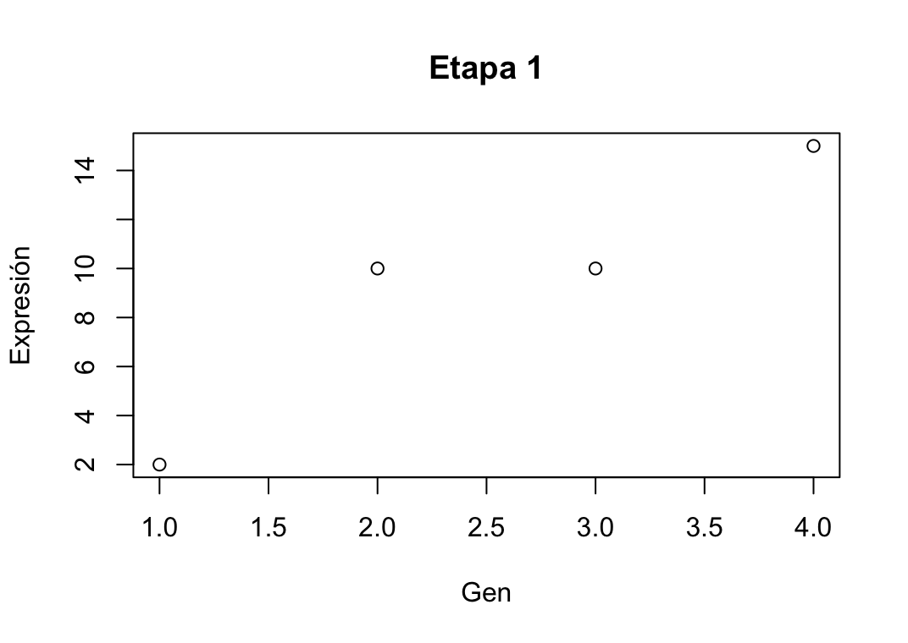

Preguntas:

* ¿este gráfico permite identificar fácilmente qué valor pertenece a cada gen?
* ¿qué información falta en el eje x?
* ¿sería mejor otra gráfica para estos datos?

Aunque el gráfico muestra los valores, no vemos directamente los nombres de los genes. Para este ejemplo, una gráfica de barras puede ser más clara.

---

## 7. Gráfico de barras con R base: `barplot()`

`barplot()` sirve para construir gráficas de barras. Es útil cuando ya tenemos valores numéricos asociados a categorías.

```r
barplot(
  datos_genes_manual$expresion,
  names.arg = datos_genes_manual$gen,
  main = "Etapa 1",
  xlab = "Gen",
  ylab = "Expresión",
  ylim = c(0, max(datos_genes_manual$expresion) + 2)
)
```

Podemos agregar color y borde.

```r
barplot(
  datos_genes_manual$expresion,
  names.arg = datos_genes_manual$gen,
  main = "Etapa 1",
  xlab = "Gen",
  ylab = "Expresión",
  col = "skyblue",
  border = "black",
  ylim = c(0, max(datos_genes_manual$expresion) + 2)
)
```

En este caso:

* las categorías son los genes;
* la altura de las barras representa la expresión;
* `names.arg` coloca los nombres de los genes en el eje x.

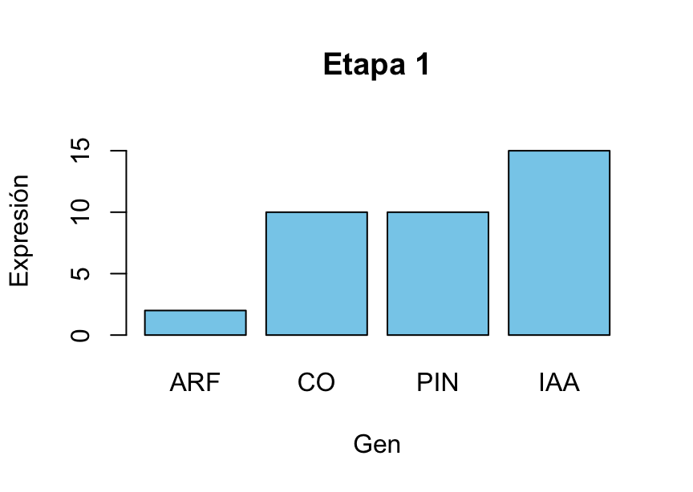

---

## 8. Leer datos desde un archivo `.csv`

Ahora leeremos un archivo externo.

En scripts anteriores del curso usamos `read.csv()`, que pertenece a R base. En esta unidad usaremos `read_csv()`, del paquete `readr`, que forma parte de `tidyverse`.

Ambas funciones sirven para leer archivos `.csv`, pero devuelven objetos ligeramente distintos.

| Función      | Paquete               | Resultado    |
| ------------ | --------------------- | ------------ |
| `read.csv()` | R base                | `data.frame` |
| `read_csv()` | `readr` / `tidyverse` | `tibble`     |

En la Unidad 2 revisamos distintas estructuras de datos, entre ellas los **data frames**. Un data frame es una tabla con filas y columnas, donde cada columna puede contener un tipo de dato diferente.

Entonces puede surgir una pregunta natural:

> Si ya vimos data frames, ¿qué es un `tibble`?

Un `tibble` no debe pensarse como una estructura completamente distinta. Es más útil entenderlo como una **versión moderna de un data frame**, con algunos ajustes que facilitan la exploración de datos dentro del flujo de `tidyverse`.

Un `tibble`:

* sigue funcionando como una tabla;
* conserva filas y columnas;
* puede tener columnas de distintos tipos;
* se imprime de forma más ordenada en consola;
* muestra información útil sobre el tipo de dato de cada columna;
* evita imprimir tablas enormes completas por accidente;
* se integra muy bien con funciones como `select()`, `filter()`, `mutate()`, `summarise()` y `ggplot()`.

En esta unidad aprovecharemos para explorar el uso de `tibble`, porque trabajaremos con `tidyverse`, `dplyr` y `ggplot2`. Sin embargo, es importante conocer ambos formatos, porque en R encontrarán tanto `data.frame` como `tibble` en scripts, tutoriales, paquetes y materiales de análisis.

Ahora leamos el archivo `U3_1.csv`:

```r
datos_genes_archivo <- read_csv(
  "data/U3_1.csv",
  show_col_types = FALSE
)

datos_genes_archivo
```

> **Nota:** `show_col_types = FALSE` evita que `read_csv()` imprima el mensaje automático donde informa qué tipo de dato detectó en cada columna. Ese mensaje no es un error; solo es información sobre cómo R leyó el archivo.

Podemos revisar qué tipo de objeto obtuvimos con:

```r
class(datos_genes_archivo)
```

Probablemente veremos algo parecido a:

```r
"spec_tbl_df" "tbl_df" "tbl" "data.frame"
```

La parte importante es que al final aparece `"data.frame"`. Esto significa que el objeto es un `tibble`, pero también mantiene compatibilidad con muchas funciones que trabajan con data frames.

En resumen: no estamos reemplazando lo aprendido sobre data frames. Estamos usando una versión más cómoda de tabla para trabajar dentro del flujo de `tidyverse`.

Revisamos ahora la estructura con `glimpse()`.

```r
glimpse(datos_genes_archivo)
```

`glimpse()` nos muestra:

* número de filas;
* número de columnas;
* nombres de columnas;
* tipo de dato de cada columna;
* algunos valores de ejemplo.

Esto nos permite confirmar, antes de graficar, que las columnas se leyeron correctamente. En este caso esperamos que `Gen` sea una variable de texto y `ED` sea una variable numérica.

---

## 9. Gráfico de barras con datos importados

En el archivo `U3_1.csv`:

* `Gen` es una variable categórica;
* `ED` es una variable numérica.

Para R base, accedemos a las columnas usando `$`.

```r
barplot(
  datos_genes_archivo$ED,
  names.arg = datos_genes_archivo$Gen,
  main = "Etapa 2",
  xlab = "Gen",
  ylab = "Expresión",
  col = "purple",
  border = "black",
  ylim = c(0, max(datos_genes_archivo$ED) + 2)
)
```

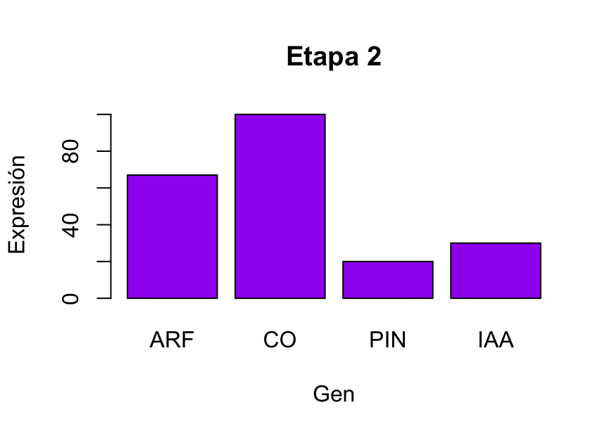

Preguntas de interpretación:

* ¿qué gen tiene mayor expresión?
* ¿qué gen tiene menor expresión?
* ¿qué representa la altura de cada barra?
* ¿la gráfica muestra datos crudos o valores ya resumidos?

---

## 10. Leer la base principal de expresión

El archivo `U3_2.csv` contiene varias variables numéricas y una variable categórica llamada `Etapas`.

```r
datos_expresion <- read_csv(
  "data/U3_2.csv",
  show_col_types = FALSE
)
```

Revisamos la tabla antes de graficar.

```r
head(datos_expresion)
glimpse(datos_expresion)
summary(datos_expresion)
names(datos_expresion)
table(datos_expresion$Etapas)
```

Estas funciones ayudan a responder:

* ¿cómo se llaman las columnas?
* ¿qué tipo de dato contiene cada columna?
* ¿cuántas observaciones hay por etapa?
* ¿las variables numéricas se leyeron como números?
* ¿la variable `Etapas` se leyó como texto o categoría?

---

## 11. Tipos de variables

El tipo de variable influye directamente en el tipo de gráfica que podemos usar.

En la base `U3_2.csv` tenemos variables numéricas y una variable categórica.

| Variable | Tipo | Uso posible |
|---|---|---|
| `TAR` | Numérica | distribución, comparación entre grupos |
| `ARF` | Numérica | distribución |
| `CO` | Numérica | relación entre variables |
| `GA` | Numérica | relación entre variables |
| `Etapas` | Categórica | grupos, color, relleno, facetas |

Una variable **numérica** puede usarse para calcular promedios, desviaciones estándar, rangos o distribuciones.

Una variable **categórica** permite separar observaciones en grupos, por ejemplo etapas, tratamientos, sitios, condiciones o tejidos.

---

## 12. Primero la pregunta, después la gráfica

No partimos de “quiero hacer un histograma” o “quiero hacer una gráfica bonita”. Primero planteamos una pregunta.

| Pregunta | Variables necesarias | Gráfica sugerida |
|---|---|---|
| ¿Cómo se distribuye una variable? | Una variable numérica | Histograma |
| ¿Cómo se comparan grupos? | Una numérica + una categórica | Boxplot |
| ¿Cómo se relacionan dos variables? | Dos variables numéricas | Dispersión |
| ¿Cómo resumo valores por grupo? | Una categórica + resumen numérico | Barras |
| ¿Cómo separo grupos sin encimarlos? | Una variable categórica adicional | Facetas |
| ¿Cómo cambia algo en el tiempo u orden? | Tiempo/orden + numérica | Línea |

Esta lógica será importante durante todo el curso.

---

## 13. Histograma con R base

Un histograma permite explorar la distribución de una variable numérica.

```r
hist(
  datos_expresion$ARF,
  main = "Histograma de expresión de ARF",
  xlab = "Expresión de ARF",
  ylab = "Frecuencia",
  col = "yellow"
)
```

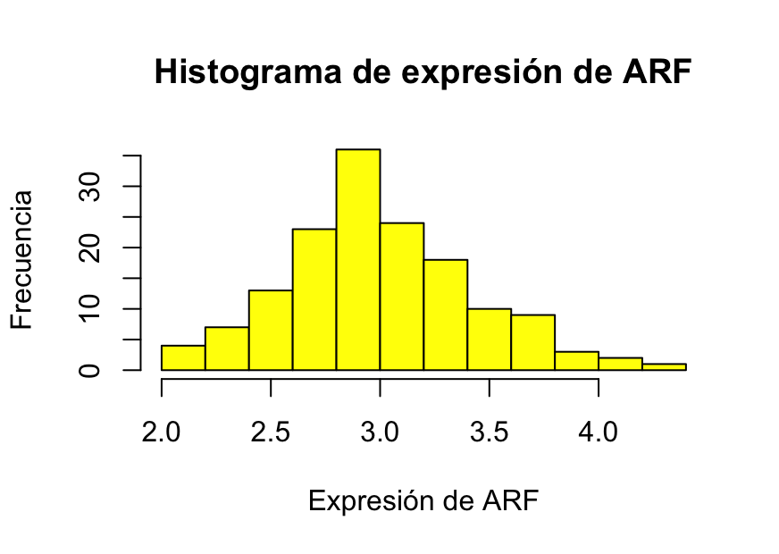

Preguntas de interpretación:

* ¿dónde se concentran la mayoría de los valores?
* ¿hay valores extremos?
* ¿la distribución parece simétrica?
* ¿qué significa la frecuencia en el eje y?

---

## 14. Boxplot con R base

Un boxplot resume la distribución de una variable numérica.

Primero usaremos un vector pequeño para observar la forma general del diagrama de caja y bigote.

```r
tar_ejemplo <- c(
  8, 5, 14, -9, 19, 12, 3, 9, 7, 4,
  4, 6, 8, 12, -8, 2, 0, -1, 5, 3
)

boxplot(
  tar_ejemplo,
  horizontal = TRUE,
  main = "Boxplot de TAR",
  xlab = "Expresión"
)
```

Ahora construiremos un boxplot por grupos usando una fórmula.

```r
boxplot(datos_expresion$TAR ~ datos_expresion$Etapas)
```

La forma general es:

```r
variable_numérica ~ variable_categórica
```

Esto significa: graficar la variable numérica agrupada por la variable categórica.

Con títulos y color:

```r
boxplot(
  datos_expresion$TAR ~ datos_expresion$Etapas,
  main = "Expresión de TAR por etapa",
  xlab = "Etapa",
  ylab = "Expresión de TAR",
  col = c("#1699B5", "#1F5FAF", "#E8B84A")
)
```

Elementos básicos de un boxplot:

* la línea central representa la mediana;
* la caja representa el rango intercuartílico;
* los bigotes muestran la dispersión de los valores;
* los puntos, cuando aparecen, pueden indicar valores extremos.

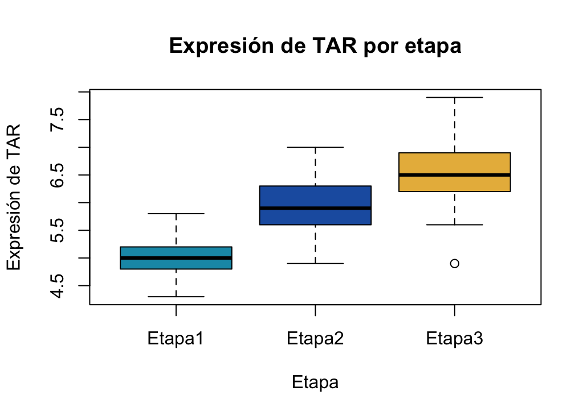

---

## 15. ¿Por qué usar `ggplot2`?

`ggplot2` es un paquete especializado en visualización de datos. Forma parte de `tidyverse` y permite construir gráficas usando una gramática visual basada en capas.

La idea central es que una figura se construye combinando:

* datos;
* estética;
* geometría;
* etiquetas;
* tema;
* escalas;
* facetas.

Estructura básica:

```r
ggplot(data = datos, aes(x = variable_x, y = variable_y)) +
  geom_tipo()
```

Esta estructura puede parecer más larga que una función base, pero tiene una ventaja importante: podemos modificar, reutilizar y extender la figura de manera organizada.

---

## 16. Gráfico de barras con `ggplot2`

Usamos `geom_col()` cuando la altura de la barra ya está en una columna numérica.

```r
ggplot(datos_genes_archivo, aes(x = Gen, y = ED)) +
  geom_col()
```

Con color fijo y un tema:

```r
ggplot(datos_genes_archivo, aes(x = Gen, y = ED)) +
  geom_col(fill = "purple3", alpha = 0.7) +
  theme_classic()
```

Con colores manuales:

```r
colores_genes <- c("#1699B5", "#1F5FAF", "#E8B84A", "#7B63C9")

ggplot(datos_genes_archivo, aes(x = Gen, y = ED, fill = Gen)) +
  geom_col(alpha = 0.7, width = 0.5) +
  scale_fill_manual(values = colores_genes) +
  theme_classic()
```

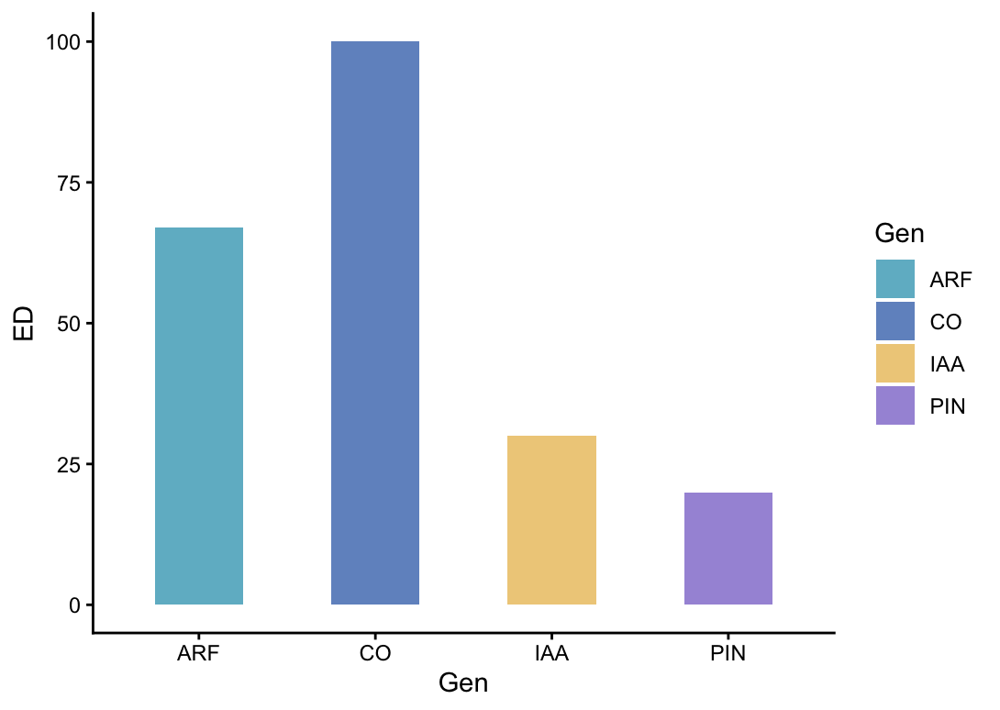

Barras horizontales:

```r
ggplot(datos_genes_archivo, aes(x = ED, y = Gen, fill = Gen)) +
  geom_col(alpha = 0.7, width = 0.4) +
  scale_fill_manual(values = colores_genes) +
  theme_classic()
```

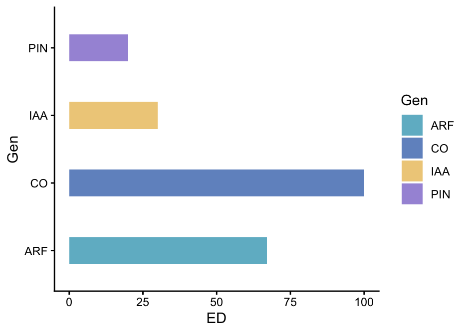

> `geom_col()` es preferible a `geom_bar(stat = "identity")` para principiantes, porque indica directamente que se usará una columna numérica como altura de la barra.

---

## 17. Histograma con `ggplot2`

```r
ggplot(datos_expresion, aes(x = TAR)) +
  geom_histogram(fill = "#1699B5", bins = 20, alpha = 0.7) +
  labs(
    x = "TAR",
    y = "Frecuencia"
  ) +
  theme_minimal()
```

Un histograma responde preguntas como:

* ¿cómo se distribuyen los valores?
* ¿dónde se concentra la mayoría de observaciones?
* ¿hay valores raros o extremos?

El argumento `bins` controla cuántos intervalos tendrá el histograma. Cambiarlo puede modificar la apariencia de la distribución.

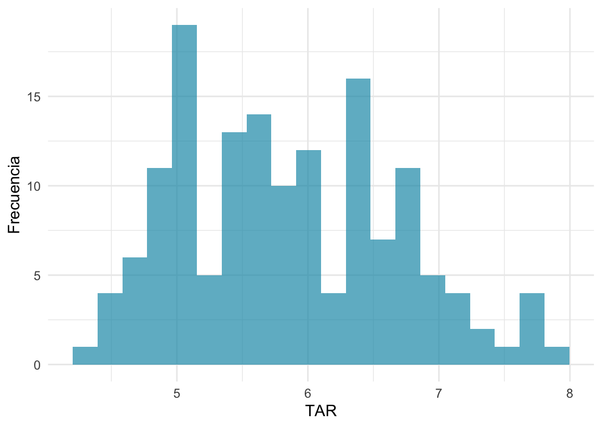

---

## 18. Histograma por grupos

Podemos agregar una variable categórica al relleno de las barras.

```r
ggplot(datos_expresion, aes(x = TAR, fill = Etapas)) +
  geom_histogram(bins = 20, alpha = 0.7) +
  labs(
    x = "TAR",
    y = "Frecuencia",
    fill = "Etapa"
  ) +
  theme_minimal()
```

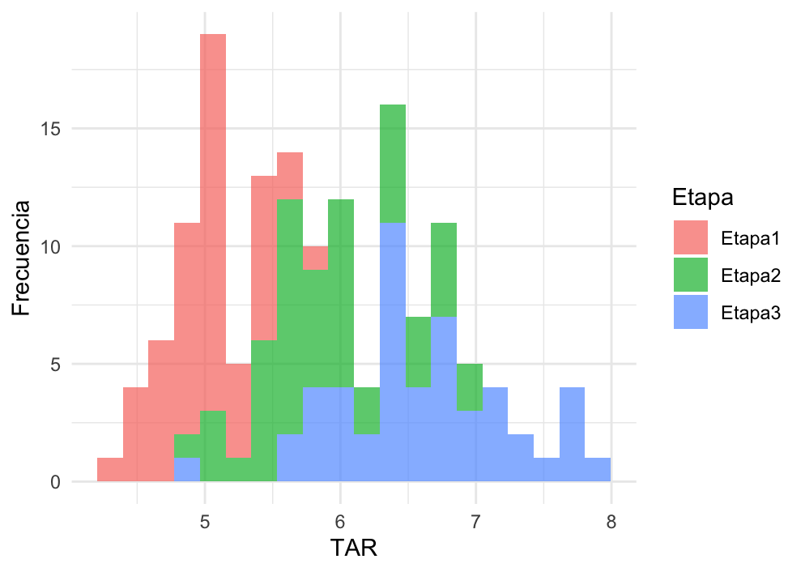

Cuando se enciman varios grupos, puede ser difícil interpretar la figura. En esos casos podemos usar facetas.

---

## 19. Facetas

Las facetas permiten separar una gráfica en varios paneles según una variable categórica.

```r
ggplot(datos_expresion, aes(x = TAR, fill = Etapas)) +
  geom_histogram(bins = 15, alpha = 0.7) +
  facet_wrap(~ Etapas) +
  scale_fill_manual(values = c("#1699B5", "#1F5FAF", "#E8B84A")) +
  labs(
    x = "TAR",
    y = "Frecuencia",
    fill = "Etapa"
  ) +
  theme_light()
```

`facet_wrap(~ Etapas)` significa: construir un panel por cada valor de la variable `Etapas`.

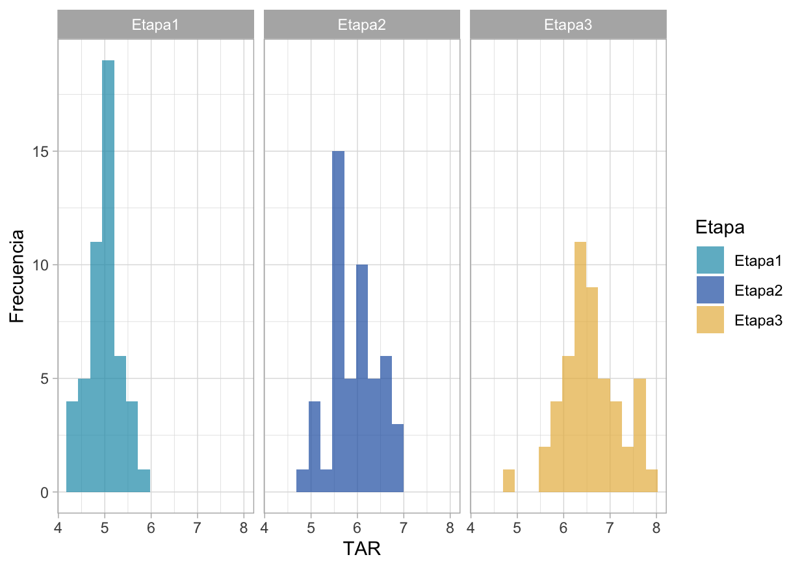

Preguntas de interpretación:

* ¿qué cambia entre los paneles?
* ¿cada panel usa la misma variable?
* ¿qué variable se usa para separar los paneles?
* ¿la separación ayuda a interpretar mejor la figura?

---

## 20. Boxplot con `ggplot2`

```r
ggplot(datos_expresion, aes(x = Etapas, y = TAR, fill = Etapas)) +
  geom_boxplot(alpha = 0.7) +
  scale_fill_manual(values = c("#1699B5", "#1F5FAF", "#E8B84A")) +
  labs(
    x = "Etapa",
    y = "Expresión de TAR",
    fill = "Etapa"
  ) +
  theme_minimal()
```

Este tipo de gráfica permite comparar la distribución de una variable numérica entre grupos.

---

## 21. Boxplot + puntos

Una buena práctica es combinar el resumen del boxplot con los datos individuales.

```r
ggplot(datos_expresion, aes(x = Etapas, y = TAR, fill = Etapas)) +
  geom_boxplot(alpha = 0.7, outlier.shape = NA) +
  geom_jitter(width = 0.15, alpha = 0.4) +
  scale_fill_manual(values = c("#1699B5", "#1F5FAF", "#E8B84A")) +
  labs(
    x = "Etapa",
    y = "Expresión de TAR",
    fill = "Etapa"
  ) +
  theme_minimal()
```

El boxplot resume los datos, mientras que los puntos muestran las observaciones individuales.

Este tipo de figura puede ser más informativa que una barra con promedio, especialmente cuando queremos mostrar variabilidad dentro de cada grupo.

---

## 22. Relación entre variables: dispersión

Una gráfica de dispersión permite explorar la relación entre dos variables numéricas.

```r
ggplot(datos_expresion, aes(x = CO, y = GA)) +
  geom_point(aes(color = Etapas), alpha = 0.8) +
  scale_color_manual(values = c("#1699B5", "#1F5FAF", "#E8B84A")) +
  labs(
    x = "CO",
    y = "GA",
    color = "Etapa"
  ) +
  theme_classic()
```

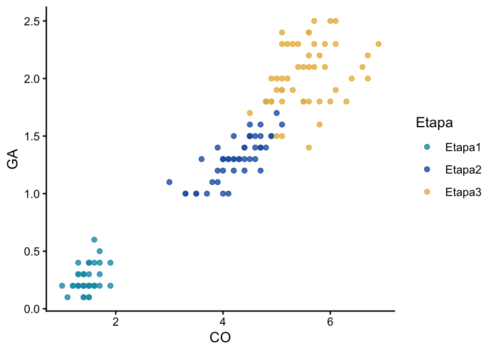

Preguntas de interpretación:

* ¿los valores de una variable aumentan con la otra?
* ¿se forman grupos?
* ¿hay valores extremos?
* ¿el color ayuda a interpretar mejor los datos?

---

## 23. Línea de tendencia

Podemos agregar una línea de tendencia visual con `geom_smooth()`.

```r
ggplot(datos_expresion, aes(x = CO, y = GA)) +
  geom_point(aes(color = Etapas), alpha = 0.8) +
  geom_smooth(method = "lm") +
  scale_color_manual(values = c("#1699B5", "#1F5FAF", "#E8B84A")) +
  labs(
    x = "CO",
    y = "GA",
    color = "Etapa"
  ) +
  theme_classic()
```

> En esta unidad usamos la línea de tendencia como apoyo visual. La interpretación estadística formal de modelos, pruebas e inferencia se retomará en la Unidad 4.

También podemos separar por facetas.

```r
ggplot(datos_expresion, aes(x = CO, y = GA)) +
  geom_point(aes(color = Etapas), alpha = 0.8) +
  geom_smooth(method = "lm") +
  facet_wrap(~ Etapas) +
  scale_color_manual(values = c("#1699B5", "#1F5FAF", "#E8B84A")) +
  labs(
    x = "CO",
    y = "GA",
    color = "Etapa"
  ) +
  theme_bw()
```

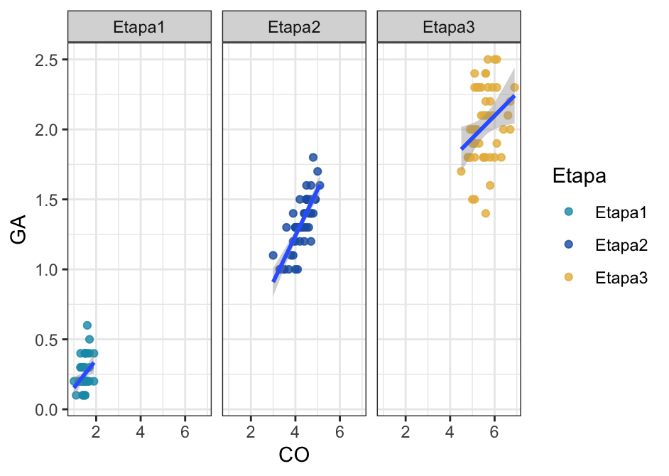

---

## 24. Resumir antes de graficar

Algunas gráficas usan datos crudos. Otras requieren resumir datos antes de graficar.

Aquí calcularemos:

* promedio de `TAR` por etapa;
* desviación estándar de `TAR` por etapa;
* número de observaciones por etapa.

```r
resumen_tar_etapas <- datos_expresion %>%
  group_by(Etapas) %>%
  summarise(
    expresion_promedio = mean(TAR, na.rm = TRUE),
    desviacion_estandar = sd(TAR, na.rm = TRUE),
    n_observaciones = n(),
    .groups = "drop"
  )

resumen_tar_etapas
```

Esto conecta con la Unidad 2, donde usamos `group_by()` y `summarise()` para resumir información.

---

## 25. Barras con desviación estándar

```r
ggplot(
  resumen_tar_etapas,
  aes(x = Etapas, y = expresion_promedio, fill = Etapas)
) +
  geom_col(alpha = 0.7, width = 0.5) +
  geom_errorbar(
    aes(
      ymin = expresion_promedio - desviacion_estandar,
      ymax = expresion_promedio + desviacion_estandar
    ),
    width = 0.1,
    color = "black",
    linewidth = 0.5
  ) +
  scale_fill_manual(values = c("#1699B5", "#1F5FAF", "#E8B84A")) +
  labs(
    x = "Etapa",
    y = "Expresión promedio de TAR",
    fill = "Etapa"
  ) +
  theme_classic()
```

> Las barras de error muestran variabilidad, pero no sustituyen un análisis estadístico.

---

## 26. Figura reproducible

Una figura reproducible debe tener:

* datos cargados desde una ruta relativa;
* código claro;
* figura guardada como objeto;
* tema visual definido;
* exportación con tamaño y resolución;
* salida en la carpeta `results/`.

Guardar una figura como objeto permite:

* imprimirla de nuevo;
* modificarla después;
* exportarla en distintos formatos.

---

## 27. Script reproducible para una figura tipo artículo

Podemos guardar un tema visual para reutilizarlo.

```r
tema_articulo <- theme_classic(base_size = 12) +
  theme(
    plot.title = element_text(face = "bold", size = 14),
    plot.subtitle = element_text(size = 11),
    axis.title = element_text(face = "bold"),
    legend.title = element_text(face = "bold"),
    legend.position = "right"
  )
```

Ahora construimos una figura y la guardamos como objeto.

```r
figura_final <- ggplot(
  datos_expresion,
  aes(x = Etapas, y = TAR, fill = Etapas)
) +
  geom_boxplot(
    alpha = 0.7,
    width = 0.55,
    outlier.shape = NA
  ) +
  geom_jitter(
    width = 0.12,
    alpha = 0.45,
    size = 1.8
  ) +
  scale_fill_manual(values = c("#1699B5", "#1F5FAF", "#E8B84A")) +
  labs(
    title = "Expresión de TAR por etapa",
    subtitle = "Distribución de valores individuales por grupo",
    x = "Etapa",
    y = "Expresión relativa de TAR",
    fill = "Etapa"
  ) +
  tema_articulo

figura_final
```

---

## 28. Exportar figuras con `ggsave()`

```r
ggsave(
  filename = "results/figura_final_TAR_etapas.png",
  plot = figura_final,
  width = 7,
  height = 5,
  units = "in",
  dpi = 300
)
```

También podemos exportar en formato vectorial.

```r
ggsave(
  filename = "results/figura_final_TAR_etapas.pdf",
  plot = figura_final,
  width = 7,
  height = 5,
  units = "in"
)
```

Formatos comunes:

* `.png`: útil para presentaciones y documentos.
* `.pdf`: útil para edición y figuras vectoriales.
* `.tiff`: solicitado por algunas revistas.
* `dpi = 300`: resolución común para impresión.

### Resultado esperado

Cuando ejecutes el script de práctica general, se generará la figura:

```text
results/figura_final_TAR_etapas.png
```

Si decides incluir la imagen en este `.md`, puedes copiarla desde `results/` o enlazarla directamente.

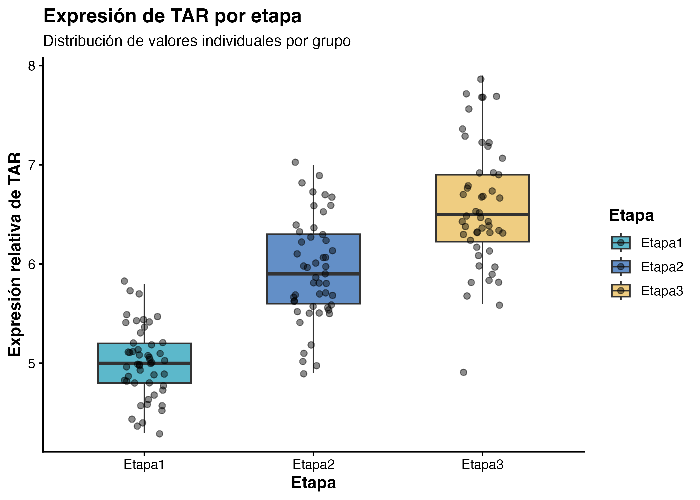

> Si esta imagen no se ve en GitHub, probablemente todavía no se ha generado o no se ha subido la carpeta `results/`. Otra opción es copiarla a `doc/Unidad_03/img/` y ajustar la ruta.

---

## 29. Errores frecuentes

### No cargar el paquete

```r
Error in ggplot(...): could not find function "ggplot"
```

Solución:

```r
library(tidyverse)
```

### Escribir mal una columna

```r
object 'Etapa' not found
```

Solución:

```r
names(datos_expresion)
```

### Olvidar el `+`

```r
ggplot(datos_expresion, aes(x = Etapas, y = TAR))
  geom_boxplot()
```

Debe ser:

```r
ggplot(datos_expresion, aes(x = Etapas, y = TAR)) +
  geom_boxplot()
```

### Confundir `color` y `fill`

* `color`: contorno, puntos o líneas.
* `fill`: relleno de barras, cajas o violines.

---

## Ejercicio integrador breve

Construye una figura que compare la expresión de `TAR` entre etapas.

### Instrucciones

1. Carga el archivo `U3_2.csv`.
2. Revisa la estructura de los datos.
3. Construye un boxplot de `TAR` por `Etapas`.
4. Agrega puntos individuales con `geom_jitter()`.
5. Agrega título y etiquetas.
6. Guarda la figura como objeto.
7. Exporta la figura en la carpeta `results/`.

Código guía:

```r
datos_expresion <- read_csv(
  "data/U3_2.csv",
  show_col_types = FALSE
)

figura_tar <- ggplot(
  datos_expresion,
  aes(x = Etapas, y = TAR, fill = Etapas)
) +
  geom_boxplot(alpha = 0.7, outlier.shape = NA) +
  geom_jitter(width = 0.15, alpha = 0.4) +
  labs(
    title = "Expresión de TAR por etapa",
    x = "Etapa",
    y = "Expresión de TAR",
    fill = "Etapa"
  ) +
  theme_minimal()

figura_tar

ggsave(
  filename = "results/figura_tar_etapas.png",
  plot = figura_tar,
  width = 7,
  height = 5,
  units = "in",
  dpi = 300
)
```

### Preguntas

* ¿Qué representa cada punto?
* ¿Qué resume el boxplot?
* ¿Qué variable define los grupos?
* ¿La figura responde una pregunta clara?
* ¿Dónde se guardó el archivo exportado?

---

## Transición hacia la actividad final

Hasta este punto ya construimos figuras con R base y con `ggplot2`, revisamos variables, exploramos tipos de gráficas y exportamos resultados.

La actividad con IA se trabajará en el archivo siguiente:

* [Actividad final: de una pregunta a una figura con apoyo de IA](../Unidad_03/U3_2_Actividad_graficos_IA.md)

La idea es usar la IA solo después de haber elegido una pregunta, las variables necesarias y una gráfica adecuada. Así evitamos pedirle código sin brújula y podemos verificar mejor sus respuestas en R.

---

## Para seguir explorando

Los siguientes temas no forman parte del núcleo principal de la sesión, pero pueden ayudarte a practicar o profundizar después.

El código complementario está en:

* [Script para seguir explorando](../../bin/U3_para_seguir_explorando_comentado.R)

### 1. Violin plots

Los violin plots permiten comparar distribuciones entre grupos mostrando la forma de la distribución.

```r
figura_violin_tar <- ggplot(
  datos_expresion,
  aes(x = Etapas, y = TAR, fill = Etapas)
) +
  geom_violin(alpha = 0.7, trim = FALSE) +
  geom_boxplot(width = 0.15, alpha = 0.6, outlier.shape = NA) +
  scale_fill_manual(values = c("#1699B5", "#1F5FAF", "#E8B84A")) +
  theme_minimal()

figura_violin_tar
```

Resultado esperado si ejecutas el script complementario:

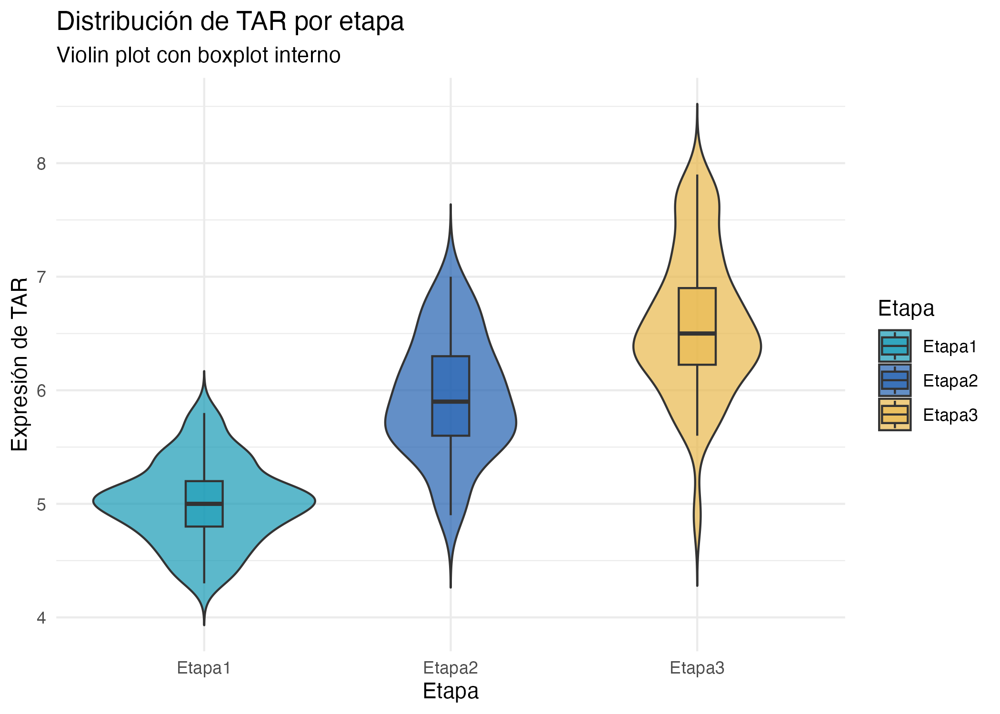

### 2. Paletas accesibles

En figuras científicas conviene usar paletas legibles y accesibles para personas con deficiencias en la visión del color.

Ejemplo de paleta tipo Okabe-Ito:

```r
paleta_okabe_ito <- c(
  "#E69F00", "#56B4E9", "#009E73",
  "#F0E442", "#0072B2", "#D55E00",
  "#CC79A7"
)
```

También puedes explorar el paquete `viridis`, que ofrece paletas continuas con buena legibilidad.

### 3. Personalizar temas

El script complementario incluye un ejemplo con fondo oscuro y tipografía serif.

Resultado esperado:

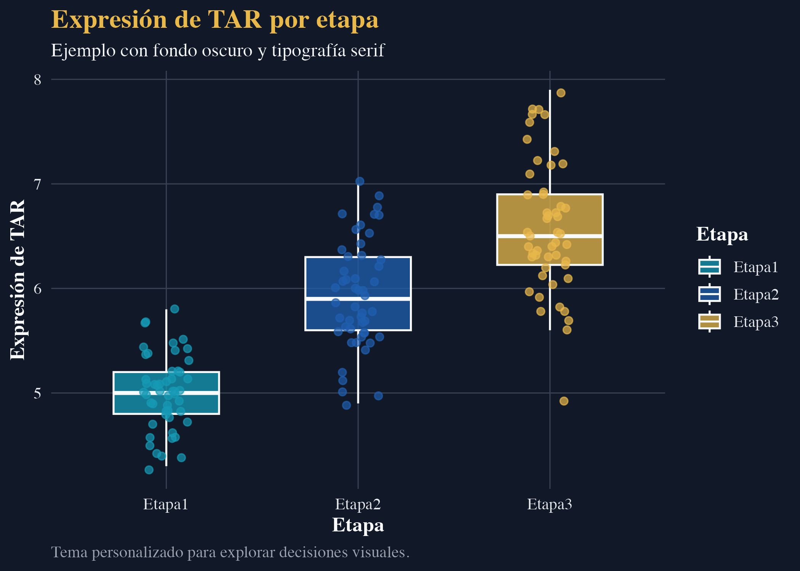

También incluye una versión con facetas, fondo blanco y estilo limpio.

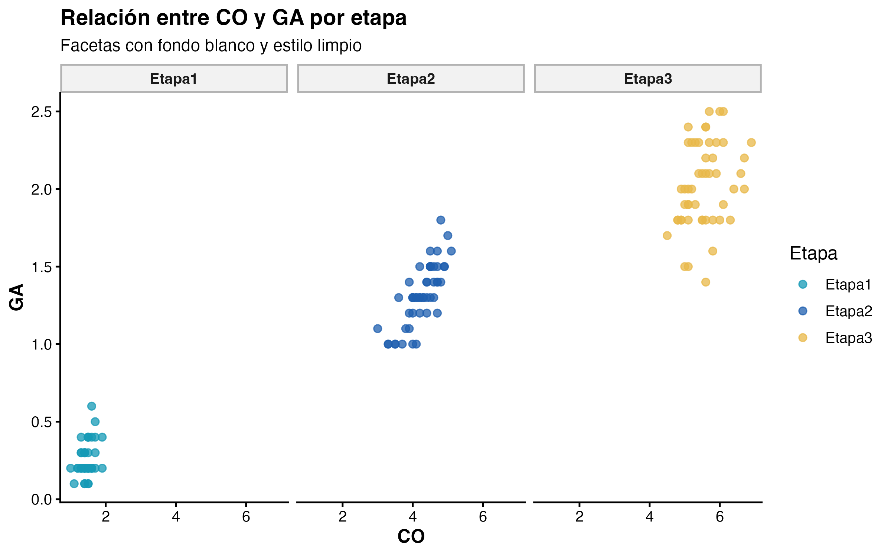

### 4. Figuras multipanel

Para combinar varias figuras en una sola composición, pueden explorarse paquetes como:

* `patchwork`
* `cowplot`

Estas herramientas son útiles para construir figuras tipo artículo con paneles A, B, C.

Resultado esperado si `patchwork` está instalado:

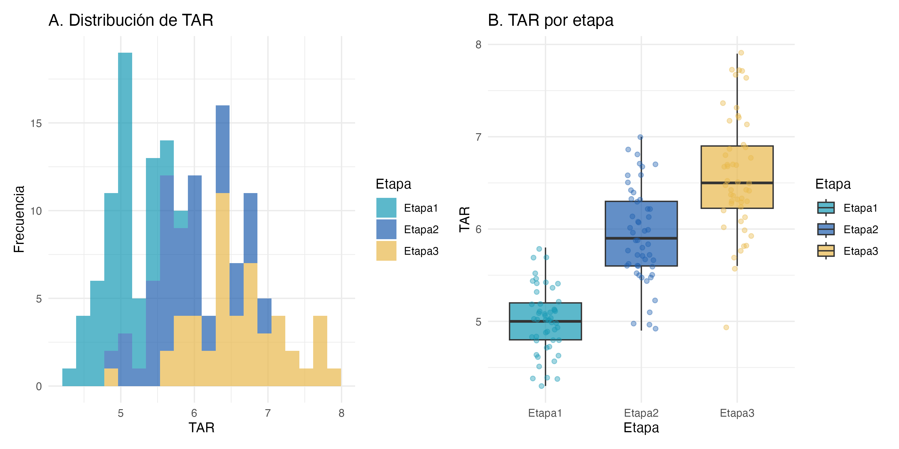

### 5. Gráficos 3D

Los gráficos 3D pueden llamar la atención, pero no siempre facilitan la interpretación. En muchos casos una figura 2D bien construida comunica mejor los datos.

Pueden ser útiles en contextos específicos, por ejemplo visualizaciones interactivas o exploraciones de PCA, pero no serán parte central de esta unidad.

### 6. Aprender de figuras publicadas

A veces vemos una figura en un artículo y queremos hacer algo similar con nuestros datos.

Buenas prácticas:

* buscar si el artículo publicó scripts;
* revisar si los datos y código tienen licencia;
* adaptar la idea visual, no copiar la figura;
* citar el trabajo si la estructura visual inspiró el análisis;
* documentar los cambios realizados;
* no reutilizar imágenes publicadas sin permiso.

### 7. Datos `starwars`

La base `starwars`, incluida en `dplyr`, puede usarse para practicar visualización en un contexto más ligero.

```r
datos_starwars_limpios <- starwars %>%
  select(name, species, height, mass, gender) %>%
  filter(!is.na(height), !is.na(mass))

ggplot(
  datos_starwars_limpios,
  aes(x = height, y = mass)
) +
  geom_point(aes(color = gender), alpha = 0.7) +
  theme_minimal()
```

Este ejemplo permite practicar:

* selección de columnas;
* filtrado de valores faltantes;
* dispersión;
* color por grupo;
* problemas de leyendas saturadas.

---

## Fuentes de información

* [ggplot2](https://ggplot2.tidyverse.org/)
* [ggplot2: `facet_wrap()`](https://ggplot2.tidyverse.org/reference/facet_wrap.html)
* [ggplot2: `ggsave()`](https://ggplot2.tidyverse.org/reference/ggsave.html)
* [R Graph Gallery](https://r-graph-gallery.com/)
* [R Graph Gallery: ggplot2](https://r-graph-gallery.com/ggplot2-package.html)
* [From Data to Viz](https://www.data-to-viz.com/)
* [Datawrapper: A friendly guide to choosing a chart type](https://www.datawrapper.de/blog/chart-types-guide)
* [The Data Visualisation Catalogue](https://datavizcatalogue.com/)
* [Data visualization cheat sheet en español](https://rstudio.github.io/cheatsheets/translations/spanish/data-visualization_es.pdf)

---

### Actividad para seleccionar gráfico + IA

* [Actividad final: de una pregunta a una figura con apoyo de IA](../Unidad_03/U3_2_Actividad_graficos_IA.md)

---

### Siguiente tema: [Unidad 4](../Unidad_04/U4_1_limpieza_datos.pdf)
