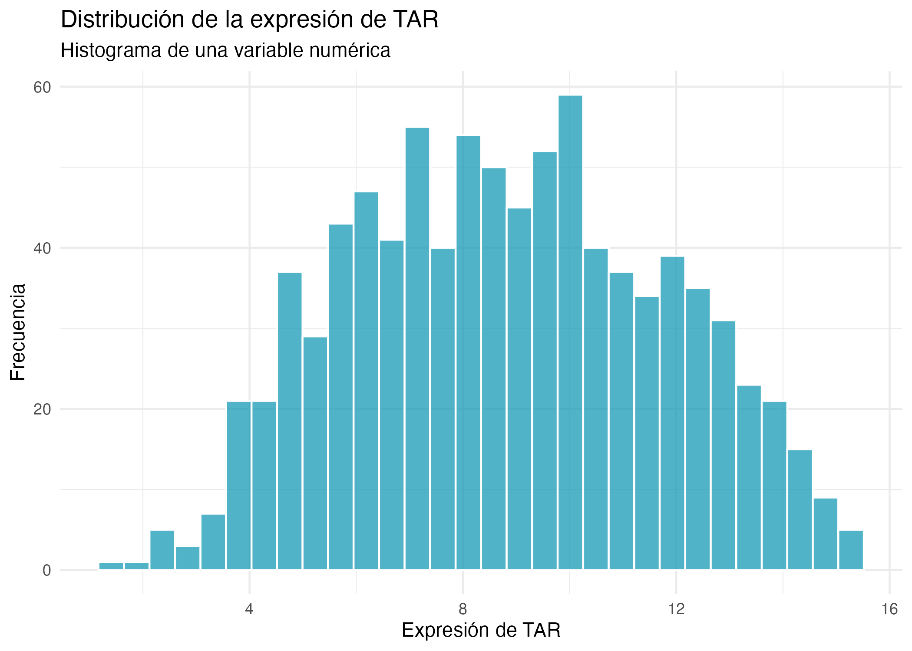
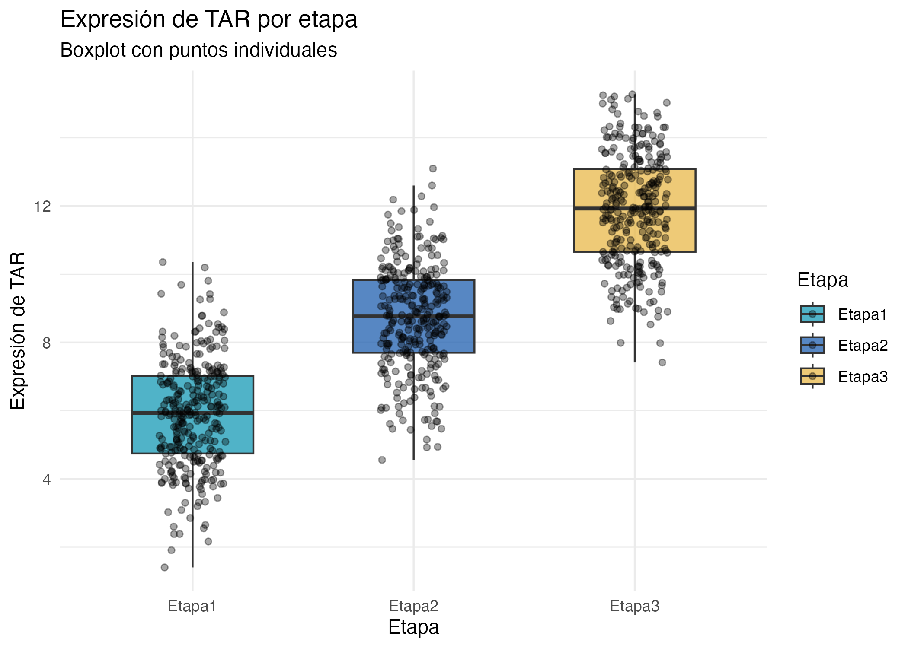
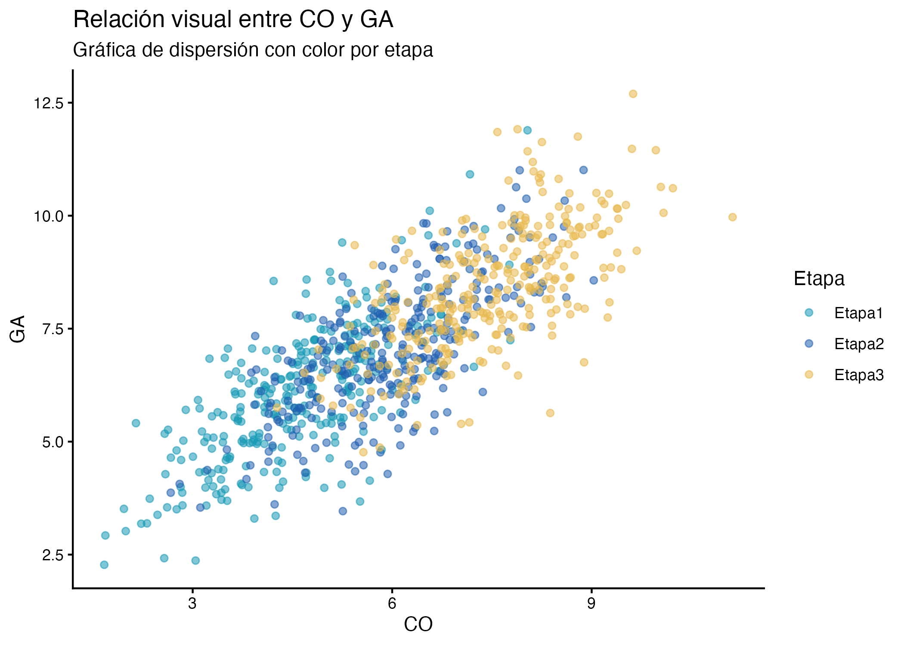
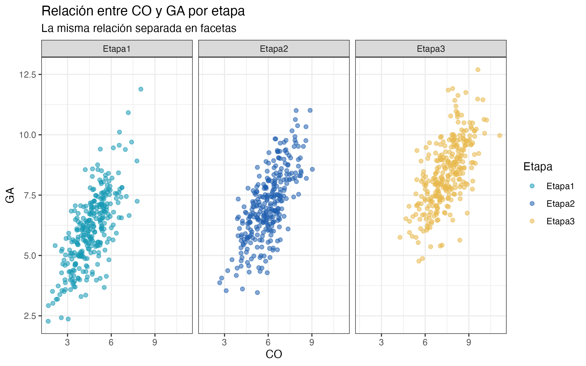
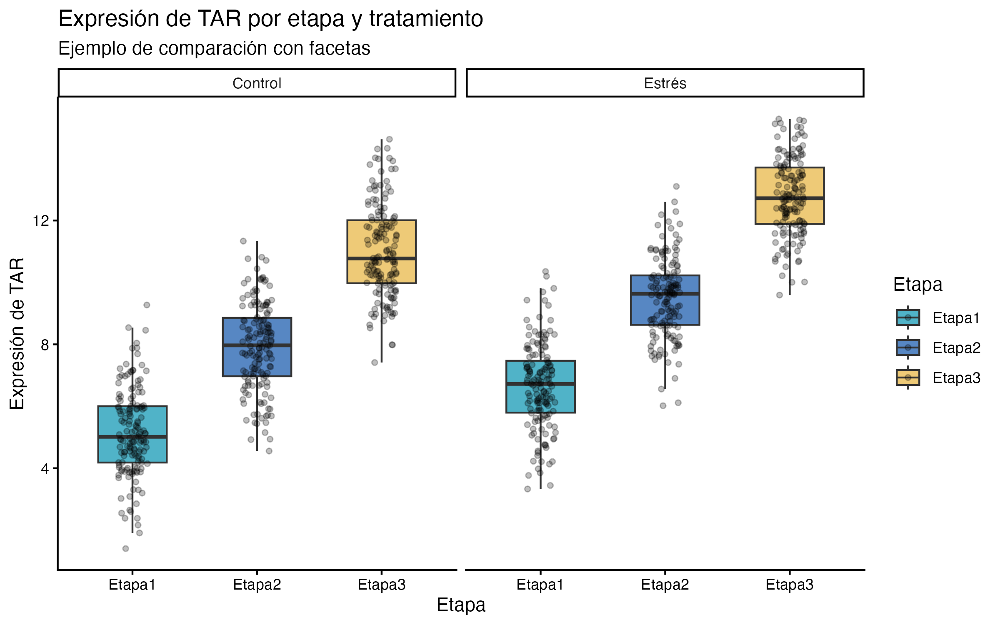

# Fundamentos de programación en R

## Unidad 3

---

## 3.2 Actividad final: de una pregunta a una figura con apoyo de IA

## Objetivo

Seleccionar variables de una base de datos amplia, identificar el tipo de datos, elegir una gráfica adecuada según una pregunta de análisis y construir un prompt para pedir apoyo con código en `ggplot2` sin subir la base de datos completa.

* [Presentación](#)
* [Guía principal de Unidad 3](../Unidad_03/U3_1_Graficos_R.md)
* [Script de práctica general Unidad 3](../../bin/U3_practica_general_comentado.R)


---

## 1. Idea general de la actividad

En un proyecto real, normalmente no tenemos una base distinta para cada gráfica. Lo más común es tener una tabla amplia con varias columnas y decidir qué variables necesitamos según la pregunta que queremos responder.

La ruta de esta actividad será:

```text
Base de datos
↓
Pregunta
↓
Variables necesarias
↓
Tipo de datos
↓
Gráfica adecuada
↓
Cheat sheet / documentación
↓
Prompt para IA
↓
Verificación en R
↓
Exportación
```

La idea central es:

> No elegimos columnas al azar para ver qué sale. Elegimos variables porque tenemos una pregunta.

---

## 2. Cargar la base de actividad

La actividad usará una sola base de datos:

```text
data/U3_actividad.csv
```

Esta base tiene más observaciones que `U3_2.csv`, para que los gráficos de dispersión tengan más puntos y permitan observar mejor patrones, ruido y agrupamientos.

```r
library(tidyverse)

datos_actividad <- read_csv(
  "data/U3_actividad.csv",
  show_col_types = FALSE
)

glimpse(datos_actividad)
```

Revisa los nombres de las columnas.

```r
names(datos_actividad)
```

La base contiene variables como:

| Variable | Descripción |
|---|---|
| `Muestra` | Identificador de muestra |
| `Etapa` | Grupo o etapa |
| `Tratamiento` | Condición experimental |
| `Sitio` | Sitio o grupo espacial |
| `TAR` | Variable numérica |
| `ARF` | Variable numérica |
| `CO` | Variable numérica |
| `GA` | Variable numérica |

También puedes revisar cuántas observaciones hay por grupo.

```r
table(datos_actividad$Etapa)
table(datos_actividad$Tratamiento)
table(datos_actividad$Sitio)

datos_actividad %>%
  count(Etapa, Tratamiento, Sitio)
```

---

## 3. Caso 1: distribución de una variable

### Pregunta

> ¿Cómo se distribuye la expresión de TAR?

### Variables necesarias

Para responder esta pregunta necesitamos una variable numérica.

```r
datos_caso_1_distribucion <- datos_actividad %>%
  select(Muestra, TAR)
```

### Tipo de datos

| Variable | Tipo |
|---|---|
| `Muestra` | Identificador |
| `TAR` | Numérica |

### Gráficas posibles

* Histograma.
* Densidad.
* Boxplot simple.

### Gráfica sugerida

Un histograma es adecuado porque queremos observar la distribución de una variable numérica.

```r
figura_caso_1_histograma <- ggplot(
  datos_caso_1_distribucion,
  aes(x = TAR)
) +
  geom_histogram(
    bins = 30,
    fill = "#1699B5",
    alpha = 0.75,
    color = "white"
  ) +
  labs(
    title = "Distribución de la expresión de TAR",
    subtitle = "Histograma de una variable numérica",
    x = "Expresión de TAR",
    y = "Frecuencia"
  ) +
  theme_minimal()

figura_caso_1_histograma
```

### Preguntas de interpretación

* ¿Dónde se concentran la mayoría de los valores?
* ¿Hay valores extremos?
* ¿La distribución parece simétrica o sesgada?
* ¿Qué representa la frecuencia?

### Resultado esperado

La guía contestada exporta esta figura como:

```text
results/actividad_caso_1_distribucion_TAR.png
```



> Si no quieres mostrar la respuesta visual desde el inicio, puedes dejar esta imagen fuera y agregarla después de la actividad.

---

## 4. Caso 2: comparación entre grupos

### Pregunta

> ¿La expresión de TAR cambia entre etapas?

### Variables necesarias

Para responder esta pregunta necesitamos una variable numérica y una variable categórica.

```r
datos_caso_2_comparacion <- datos_actividad %>%
  select(Muestra, Etapa, TAR)
```

### Tipo de datos

| Variable | Tipo |
|---|---|
| `Muestra` | Identificador |
| `Etapa` | Categórica |
| `TAR` | Numérica |

### Gráficas posibles

* Boxplot.
* Boxplot + puntos.
* Violin plot como exploración adicional.

### Gráfica sugerida

```r
figura_caso_2_boxplot <- ggplot(
  datos_caso_2_comparacion,
  aes(x = Etapa, y = TAR, fill = Etapa)
) +
  geom_boxplot(
    alpha = 0.75,
    width = 0.55,
    outlier.shape = NA
  ) +
  geom_jitter(
    width = 0.15,
    alpha = 0.35,
    size = 1.4
  ) +
  scale_fill_manual(values = c("#1699B5", "#1F5FAF", "#E8B84A")) +
  labs(
    title = "Expresión de TAR por etapa",
    subtitle = "Boxplot con puntos individuales",
    x = "Etapa",
    y = "Expresión de TAR",
    fill = "Etapa"
  ) +
  theme_minimal()

figura_caso_2_boxplot
```

### ¿Por qué esta gráfica?

El boxplot resume la distribución de `TAR` en cada etapa, mientras que los puntos muestran las observaciones individuales.

### Preguntas de interpretación

* ¿Qué etapa parece tener valores más altos?
* ¿Qué etapa muestra mayor variabilidad?
* ¿Hay valores extremos?
* ¿La gráfica prueba diferencias estadísticas?

> Recuerda: una gráfica puede sugerir patrones, pero no sustituye un análisis estadístico.

### Resultado esperado

```text
results/actividad_caso_2_TAR_por_etapa.png
```



---

## 5. Caso 3: relación entre variables

### Pregunta

> ¿Existe relación visual entre CO y GA?

### Variables necesarias

Para responder esta pregunta necesitamos dos variables numéricas. También podemos conservar una variable categórica para colorear o separar grupos.

```r
datos_caso_3_relacion <- datos_actividad %>%
  select(Muestra, Etapa, CO, GA)
```

### Tipo de datos

| Variable | Tipo |
|---|---|
| `Muestra` | Identificador |
| `Etapa` | Categórica |
| `CO` | Numérica |
| `GA` | Numérica |

### Gráficas posibles

* Dispersión.
* Dispersión con color por etapa.
* Facetas por etapa.

### Gráfica sugerida

```r
figura_caso_3_dispersion <- ggplot(
  datos_caso_3_relacion,
  aes(x = CO, y = GA, color = Etapa)
) +
  geom_point(
    alpha = 0.55,
    size = 1.6
  ) +
  scale_color_manual(values = c("#1699B5", "#1F5FAF", "#E8B84A")) +
  labs(
    title = "Relación visual entre CO y GA",
    subtitle = "Gráfica de dispersión con color por etapa",
    x = "CO",
    y = "GA",
    color = "Etapa"
  ) +
  theme_classic()

figura_caso_3_dispersion
```

### Preguntas de interpretación

* ¿Parece haber una relación positiva, negativa o poco clara?
* ¿Los grupos se mezclan o se separan?
* ¿Hay puntos alejados del resto?
* ¿El color ayuda a distinguir etapas?

### Resultado esperado

```text
results/actividad_caso_3_CO_GA_dispersion.png
```



---

## 6. Caso 3, variante con facetas

Cuando hay muchos puntos o varios grupos, las facetas pueden ayudar.

```r
figura_caso_3_facetas <- ggplot(
  datos_caso_3_relacion,
  aes(x = CO, y = GA, color = Etapa)
) +
  geom_point(
    alpha = 0.55,
    size = 1.6
  ) +
  facet_wrap(~ Etapa) +
  scale_color_manual(values = c("#1699B5", "#1F5FAF", "#E8B84A")) +
  labs(
    title = "Relación entre CO y GA por etapa",
    subtitle = "La misma relación separada en facetas",
    x = "CO",
    y = "GA",
    color = "Etapa"
  ) +
  theme_bw()

figura_caso_3_facetas
```

Preguntas:

* ¿Las facetas facilitan la comparación?
* ¿La relación entre CO y GA parece similar en todas las etapas?
* ¿Qué se gana y qué se pierde al separar los datos en paneles?

Resultado esperado:



---

## 7. Caso extra: comparación con dos variables categóricas

Este caso puede usarse si el grupo avanza rápido o como ejemplo para la guía contestada.

### Pregunta

> ¿Cómo se distribuye TAR por etapa y tratamiento?

Para responder esta pregunta necesitamos:

* una variable numérica: `TAR`;
* dos variables categóricas: `Etapa` y `Tratamiento`.

```r
datos_caso_extra_tratamiento <- datos_actividad %>%
  select(Muestra, Etapa, Tratamiento, TAR)
```

Gráfica sugerida:

```r
figura_caso_extra_tratamiento <- ggplot(
  datos_caso_extra_tratamiento,
  aes(x = Etapa, y = TAR, fill = Etapa)
) +
  geom_boxplot(
    alpha = 0.75,
    width = 0.55,
    outlier.shape = NA
  ) +
  geom_jitter(
    width = 0.12,
    alpha = 0.25,
    size = 1.2
  ) +
  facet_wrap(~ Tratamiento) +
  scale_fill_manual(values = c("#1699B5", "#1F5FAF", "#E8B84A")) +
  labs(
    title = "Expresión de TAR por etapa y tratamiento",
    subtitle = "Ejemplo de comparación con facetas",
    x = "Etapa",
    y = "Expresión de TAR",
    fill = "Etapa"
  ) +
  theme_classic()

figura_caso_extra_tratamiento
```

Resultado esperado:



---

## 8. Recursos para elegir la gráfica

Antes de pedir ayuda a IA, revisa al menos una fuente de apoyo.

* [From Data to Viz](https://www.data-to-viz.com/): ayuda a elegir gráficos según el tipo de datos.
* [R Graph Gallery](https://r-graph-gallery.com/): muestra ejemplos con código reproducible en R.
* [R Graph Gallery: ggplot2](https://r-graph-gallery.com/ggplot2-package.html): ejemplos específicos con `ggplot2`.
* [Datawrapper: guía para elegir gráficos](https://www.datawrapper.de/blog/chart-types-guide): guía amigable para comunicación visual.
* [The Data Visualisation Catalogue](https://datavizcatalogue.com/): catálogo visual de tipos de gráficas.
* [Cheat sheet de ggplot2 en español](https://rstudio.github.io/cheatsheets/translations/spanish/data-visualization_es.pdf): referencia rápida de geometrías, facetas, temas, escalas y exportación.

---

## 9. Construir un prompt para IA

Después de elegir una pregunta, variables y tipo de gráfica, puedes usar IA para pedir apoyo con el código.

La idea no es subir la base completa. Basta con describir su estructura.

### Plantilla de prompt

```text
Estoy aprendiendo a hacer gráficas en R con ggplot2.

No voy a subir mi base de datos, pero te describo su estructura:

- Mi base se llama: datos_actividad
- Cada fila representa: [qué representa cada fila]
- Variables numéricas: [lista]
- Variables categóricas: [lista]
- La pregunta que quiero responder es: [pregunta]
- Elegí hacer un gráfico tipo: [tipo de gráfico]
- Quiero usar:
  - eje x: [variable]
  - eje y: [variable]
  - color o fill: [variable, si aplica]
  - facetas: [variable, si aplica]

Ayúdame a escribir un código base en ggplot2 para construir esa figura.

Condiciones:
1. No inventes nombres de columnas distintos a los que te di.
2. Incluye comentarios breves en el código.
3. Guarda la figura como objeto.
4. Incluye ggsave() con width, height, units y dpi = 300.
5. Al final dime qué debo verificar en mis datos antes de interpretar la figura.

No inventes conclusiones biológicas.
```

---

## 10. Ejemplo de prompt completo

```text
Estoy aprendiendo a hacer gráficas en R con ggplot2.

No voy a subir mi base de datos, pero te describo su estructura:

- Mi base se llama: datos_actividad
- Cada fila representa una muestra.
- Variables numéricas: TAR, ARF, CO, GA
- Variables categóricas: Etapa, Tratamiento, Sitio
- La pregunta que quiero responder es: ¿la expresión de TAR cambia entre etapas?
- Elegí hacer un boxplot con puntos individuales.
- Quiero usar:
  - eje x: Etapa
  - eje y: TAR
  - fill: Etapa
  - facetas: no

Ayúdame a escribir un código base en ggplot2 para construir esa figura.

Condiciones:
1. No inventes nombres de columnas distintos a los que te di.
2. Incluye comentarios breves en el código.
3. Guarda la figura como objeto.
4. Incluye ggsave() con width, height, units y dpi = 300.
5. Al final dime qué debo verificar en mis datos antes de interpretar la figura.

No inventes conclusiones biológicas.
```

---

## 11. Verificación en R

Antes de confiar en el código generado por IA, verifica:

```r
names(datos_actividad)
glimpse(datos_actividad)
summary(datos_actividad)
```

Si trabajaste con `datos_caso_2_comparacion`, por ejemplo:

```r
names(datos_caso_2_comparacion)
table(datos_caso_2_comparacion$Etapa)
summary(datos_caso_2_comparacion$TAR)
```

También verifica que la figura responda realmente la pregunta:

* ¿la variable del eje x es la correcta?
* ¿la variable del eje y es la correcta?
* ¿los colores o rellenos representan grupos adecuados?
* ¿la figura muestra datos crudos, datos resumidos o ambos?
* ¿la interpretación no va más allá de lo que se observa?

---

## 12. Exportar la figura

Una vez que la figura funcione, guárdala como objeto y expórtala.

```r
if (!dir.exists("results")) {
  dir.create("results")
}

ggsave(
  filename = "results/figura_caso_2_TAR_etapa.png",
  plot = figura_caso_2_boxplot,
  width = 7,
  height = 5,
  units = "in",
  dpi = 300
)
```

---

## 13. Preguntas de cierre

* ¿Qué pregunta elegiste?
* ¿Qué variables necesitaste?
* ¿Qué tipo de datos eran?
* ¿Qué gráfica elegiste y por qué?
* ¿El código generado por IA fue correcto?
* ¿Qué tuviste que corregir o verificar?
* ¿Qué aprendiste sobre la relación entre pregunta, datos y gráfica?

---

## 14. Nota sobre uso responsable de IA

La IA puede ayudar a escribir, explicar o depurar código, pero no debe reemplazar la interpretación crítica.

Antes de aceptar una respuesta de IA:

* verifica el código en R;
* revisa que las columnas existan;
* confirma que la gráfica responda la pregunta;
* consulta documentación cuando sea necesario;
* evita subir datos sensibles, privados o sin autorización;
* no aceptes conclusiones biológicas no sustentadas por los datos.

---

## 15. Guía contestada

La guía contestada de esta actividad está en:

* [bin/U3_actividad_graficos_IA.R](bin/U3_actividad_graficos_IA.R)

---

### Regresar a: [3.1 Visualización de datos con R y ggplot2](doc/Unidad_03/U3_1_Graficos_R_2026.md)
