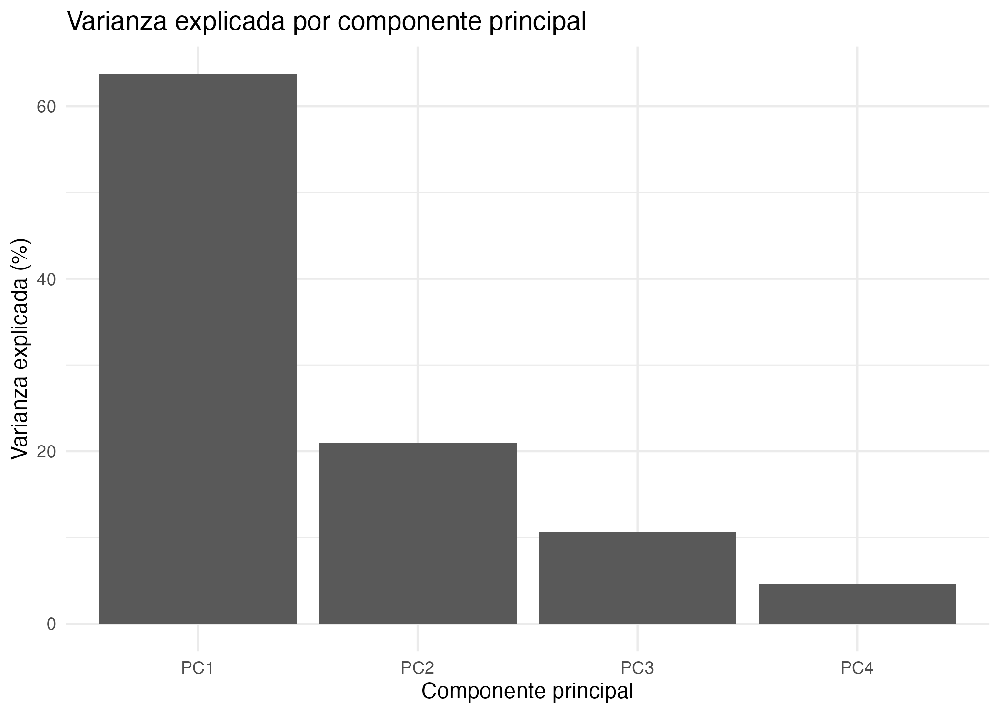
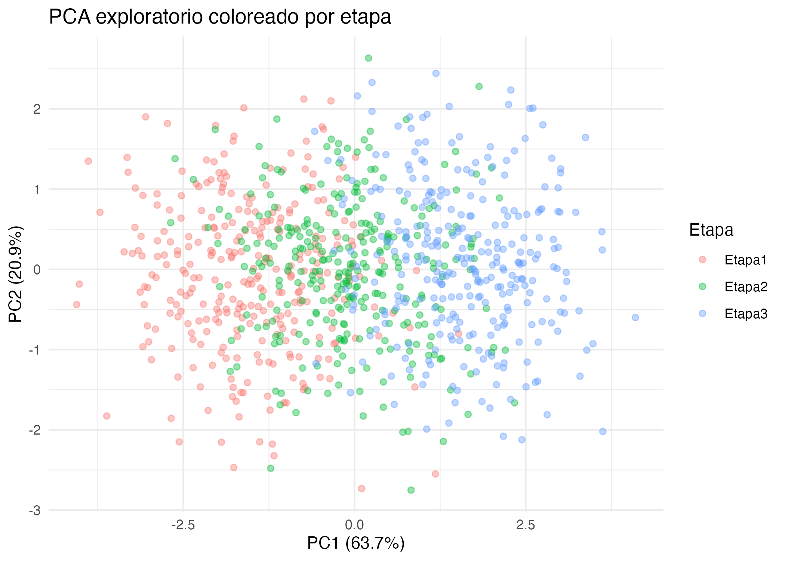
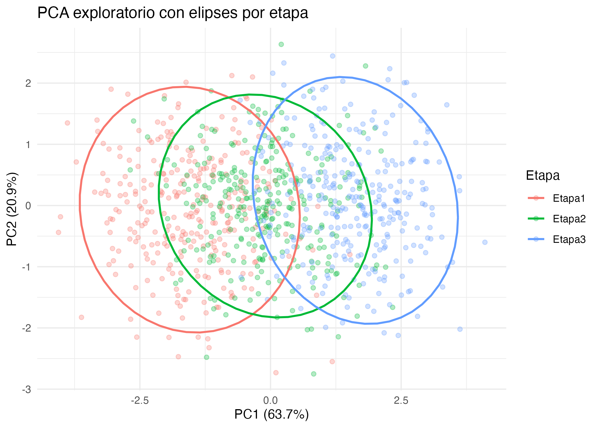
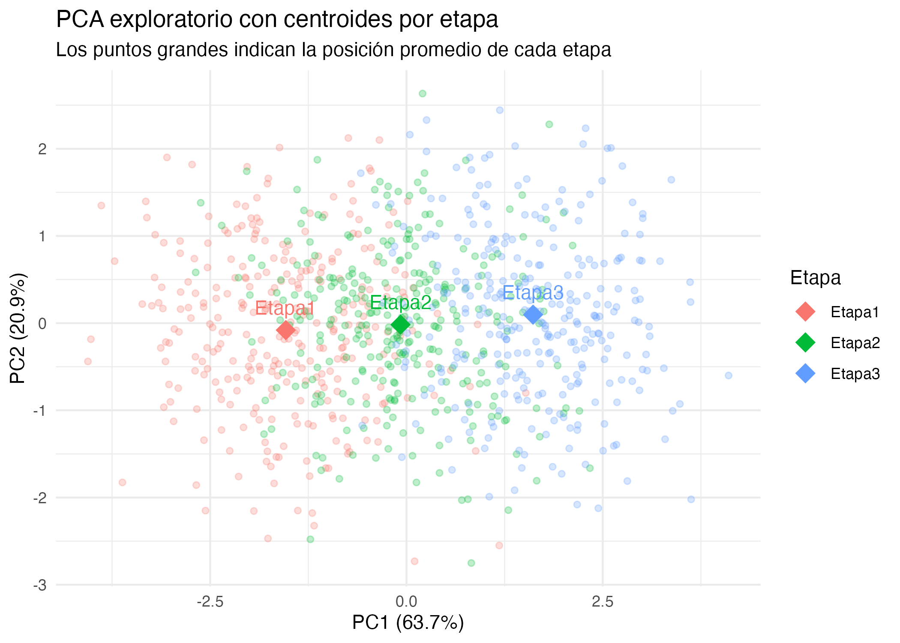
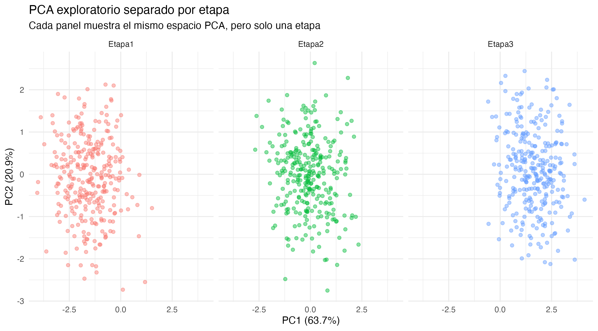
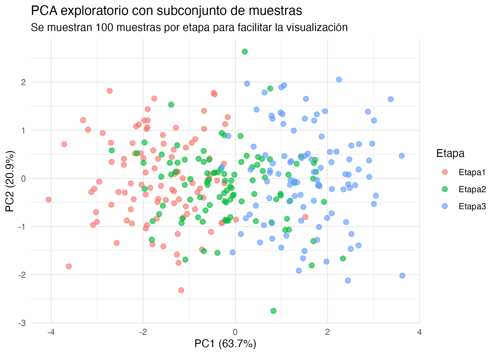
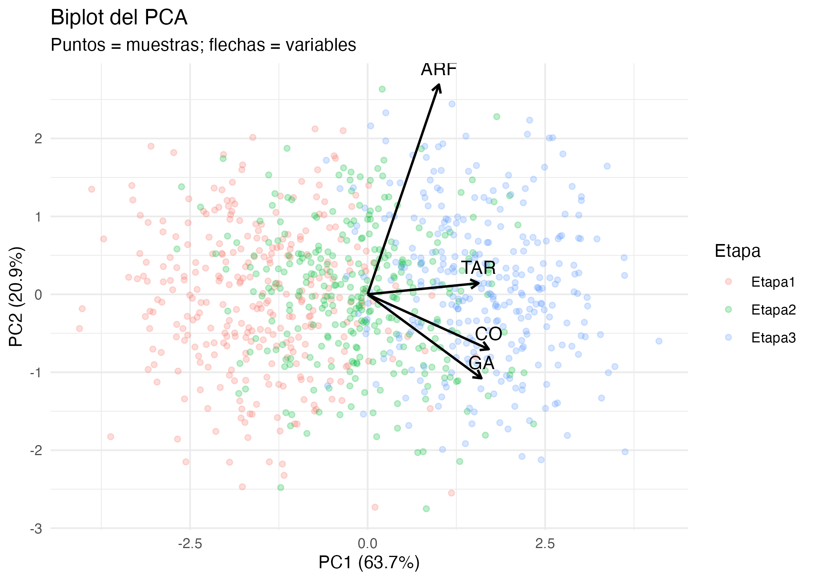
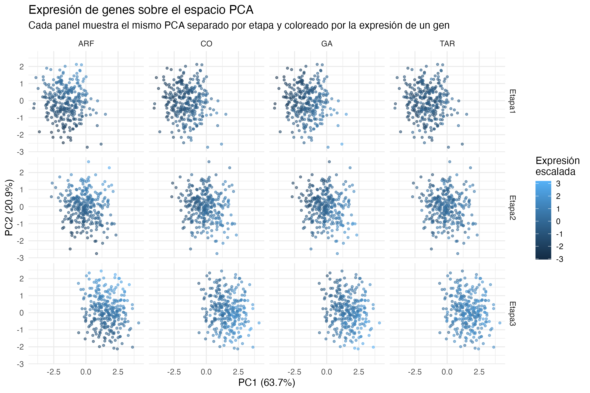

# Fundamentos de programación en R

## Unidad 6

---

#### [Material extra: análisis de agrupamiento y PCA avanzado](../Unidad_06/U6_3_Material_extra_agrupamiento_y_PCA.md)

---

## 6.1 Análisis de Componentes Principales

* [Presentación](ENLACE_PRESENTACION_UNIDAD_6)

## Objetivo

Aplicar un Análisis de Componentes Principales en R para explorar patrones en datos biológicos multivariados, visualizar la distribución de muestras o individuos e interpretar los componentes principales de forma cuidadosa.

En esta unidad conectaremos varios elementos que ya hemos trabajado durante el curso: importar datos, revisar tablas, distinguir metadatos y variables numéricas, visualizar resultados con `ggplot2`, exportar figuras y preparar el análisis para documentarlo después en un reporte reproducible.

## Material de apoyo

Durante esta unidad trabajaremos con un script general de práctica:

* [Script de práctica general Unidad 6](../../bin/U6_1_PCA_practica_general.R)

También estarán disponibles:

* [Datos de práctica](../../data/U6_datos_pca.xlsx)
* [Material extra: agrupamiento y PCA avanzado](../Unidad_06/U6_3_Material_extra_agrupamiento_y_PCA.md)

Durante la sesión iremos ejecutando solo los bloques indicados por la instructora.

> **Nota sobre rutas:** el código del script está pensado para ejecutarse desde la raíz del proyecto en RStudio. Por eso, aunque este documento está dentro de `doc/Unidad_06/`, las rutas del script apuntan a carpetas como `data/` y `results/`.

---

## 1. ¿Por qué usar PCA?

En muchos análisis biológicos trabajamos con tablas que tienen varias variables medidas para las mismas muestras, individuos, sitios o condiciones.

Por ejemplo, podríamos tener:

* genes medidos en distintas muestras;
* variables ambientales registradas en varios sitios;
* rasgos morfológicos de individuos;
* metabolitos cuantificados bajo diferentes tratamientos;
* SNPs o marcadores genéticos resumidos por individuo o población.

Cuando tenemos muchas variables, puede ser difícil explorar los patrones generales de los datos usando una variable a la vez.

El **Análisis de Componentes Principales** o **PCA** ayuda a resumir la variación de un conjunto de variables numéricas en nuevos ejes llamados **componentes principales**.

En términos sencillos:

> Un PCA busca nuevas direcciones de variación en los datos.  
> La primera componente principal, PC1, resume la mayor variación posible.  
> La segunda componente principal, PC2, resume otra parte importante de la variación, independiente de PC1.

Esto permite representar datos multivariados en una figura bidimensional, por ejemplo, usando PC1 en el eje X y PC2 en el eje Y.


---

## 2. ¿Qué pregunta responde un PCA?

Un PCA no responde una sola pregunta biológica de manera definitiva. Más bien, ayuda a explorar patrones.

Algunas preguntas que podemos hacer con un PCA son:

* ¿Las muestras se agrupan de acuerdo con una condición experimental?
* ¿Los individuos de distintas poblaciones aparecen separados?
* ¿Hay muestras que se comportan de forma distinta al resto?
* ¿Los tratamientos parecen generar patrones diferentes?
* ¿Podría existir un efecto de lote, tejido, sitio o etapa?
* ¿Qué tanta variación resumen las primeras componentes principales?

En análisis transcriptómicos, el PCA se usa con frecuencia para explorar si las muestras se separan por condición, tratamiento, tejido, etapa de desarrollo o posibles efectos técnicos.

También puede ser útil en otros contextos de datos biológicos, por ejemplo:

* datos ambientales, para explorar gradientes entre sitios;
* datos morfológicos, para comparar individuos o especies;
* datos fisiológicos, para revisar respuestas a estrés;
* datos genéticos, para explorar patrones de similitud entre individuos o poblaciones.

> **Importante:** un PCA es un análisis exploratorio. Si dos grupos se ven separados en un PCA, eso no significa automáticamente que haya una diferencia estadísticamente significativa.

---

## 3. ¿Qué tipo de datos necesita un PCA?

Para realizar un PCA necesitamos una tabla con variables numéricas.

En una tabla preparada para PCA:

* las **filas** suelen representar muestras, individuos u observaciones;
* las **columnas numéricas** representan variables medidas;
* las **columnas categóricas** pueden usarse como metadatos para interpretar o colorear las figuras.

En esta práctica usaremos una tabla con metadatos y cuatro variables numéricas que representan genes o variables biológicas simuladas.

| muestra | etapa | tratamiento | sitio | TAR | ARF | CO | GA |
| ------- | ----- | ----------- | ----- | --- | --- | -- | -- |
| M001    | Etapa1 | control     | Norte | 4.9 | 6.7 | 3.8 | 5.1 |
| M002    | Etapa1 | control     | Norte | 4.7 | 6.2 | 3.2 | 4.1 |
| M003    | Etapa1 | control     | Norte | 4.8 | 5.6 | 3.7 | 5.5 |

En este ejemplo:

* `muestra`, `etapa`, `tratamiento` y `sitio` son metadatos;
* `TAR`, `ARF`, `CO` y `GA` son variables numéricas;
* el PCA se calculará con las columnas numéricas;
* los metadatos se usarán después para colorear o interpretar las figuras.

---

## 4. Preparar el entorno de trabajo

Primero cargaremos los paquetes necesarios.

```r
# Cargar paquetes
library(readxl)
library(dplyr)
library(tidyr)
library(ggplot2)
```

En esta práctica usaremos principalmente:

* `readxl`, para importar datos desde un archivo de Excel;
* `dplyr`, para revisar y seleccionar columnas;
* `tidyr`, para reorganizar datos a formato largo;
* `ggplot2`, para construir las figuras del PCA.

---

## 5. Importar y explorar los datos

En esta práctica usaremos un archivo de Excel. Este formato es común en contextos de investigación y docencia, por lo que conviene reconocer cómo importarlo desde R.

Primero guardamos la ruta del archivo en un objeto:

```r
# Ruta del archivo de datos
ruta_datos <- "data/U6_datos_pca.xlsx"
```

Podemos revisar las hojas disponibles en el archivo:

```r
# Revisar hojas del archivo Excel
excel_sheets(ruta_datos)
```

Después importamos la primera hoja del archivo:

```r
# Importar datos desde Excel
datos <- read_excel(ruta_datos, sheet = 1)

# Revisar las primeras filas
head(datos)
```

Revisamos su estructura:

```r
# Revisar dimensiones
dim(datos)

# Revisar nombres de columnas
names(datos)

# Revisar estructura general
str(datos)

# Resumen general
summary(datos)
```

Estas funciones nos ayudan a responder:

* ¿Cuántas muestras tenemos?
* ¿Cuántas variables hay?
* ¿Qué columnas son numéricas?
* ¿Qué columnas corresponden a metadatos?
* ¿La tabla se importó correctamente?

También revisamos cuántas muestras hay por `etapa`, `tratamiento` y `sitio`.

```r
# Conteo de muestras por metadato
datos %>% count(etapa)
datos %>% count(tratamiento)
datos %>% count(sitio)
```

Estos metadatos no entran al cálculo del PCA, pero serán útiles para interpretar las figuras.

---

## 6. Separar metadatos y variables numéricas

Antes de hacer el PCA, necesitamos separar las columnas que usaremos para el análisis de las columnas que solo servirán para describir o colorear las muestras.

```r
# Separar metadatos
metadatos <- datos %>%
  select(muestra, etapa, tratamiento, sitio) %>%
  mutate(
    etapa = as.factor(etapa),
    tratamiento = as.factor(tratamiento),
    sitio = as.factor(sitio)
  )

# Seleccionar variables numéricas para el PCA
datos_pca <- datos %>%
  select(TAR, ARF, CO, GA)
```

Revisamos los objetos creados:

```r
head(metadatos)
head(datos_pca)

dim(metadatos)
dim(datos_pca)
```

En este paso es importante verificar que `datos_pca` contenga solo variables numéricas.

```r
# Comprobar que las columnas sean numéricas
sapply(datos_pca, is.numeric)

# Revisar valores faltantes
colSums(is.na(datos_pca))
```

> **Nota:** en este archivo, las variables numéricas son `TAR`, `ARF`, `CO` y `GA`. En otros datos reales podría haber columnas numéricas que sean identificadores o metadatos. En esos casos conviene seleccionar explícitamente las columnas que sí deben entrar al PCA.

---

## 7. Escalamiento de variables

El PCA se basa en la variación de las variables. Si las variables están en escalas muy diferentes, algunas pueden dominar el análisis solo porque tienen valores más grandes.

Por eso, muchas veces es recomendable centrar y escalar las variables.

Con `prcomp()` podemos hacerlo usando:

```r
center = TRUE
scale. = TRUE
```

Esto indica que las variables serán centradas y escaladas antes de calcular el PCA.

En esta práctica usaremos ambas opciones porque queremos comparar variables numéricas en una escala común.

---

## 8. Ejecutar PCA con `prcomp()`

Ahora realizamos el PCA.

```r
# Ejecutar PCA
pca_resultado <- prcomp(
  datos_pca,
  center = TRUE,
  scale. = TRUE
)
```

El objeto `pca_resultado` contiene varios elementos del análisis.

```r
# Revisar estructura del objeto PCA
str(pca_resultado)
```

Algunos componentes importantes son:

* `pca_resultado$x`: coordenadas de las muestras en los componentes principales;
* `pca_resultado$sdev`: desviación estándar asociada a cada componente;
* `pca_resultado$rotation`: relación entre variables originales y componentes principales.

---

## 9. Varianza explicada

Para interpretar un PCA es importante saber cuánta variación explica cada componente principal.

```r
# Calcular proporción de varianza explicada
varianza <- pca_resultado$sdev^2
varianza_explicada <- varianza / sum(varianza)

# Crear tabla de varianza explicada
tabla_varianza <- data.frame(
  componente = paste0("PC", seq_along(varianza_explicada)),
  varianza_explicada = varianza_explicada,
  porcentaje = varianza_explicada * 100
)

tabla_varianza
```

La columna `porcentaje` indica qué porcentaje de la variación total explica cada componente.

También guardamos los porcentajes de PC1, PC2 y PC3 en objetos para usarlos en las etiquetas de las figuras.

```r
pc1 <- round(tabla_varianza$porcentaje[1], 1)
pc2 <- round(tabla_varianza$porcentaje[2], 1)
pc3 <- round(tabla_varianza$porcentaje[3], 1)
```

Por ejemplo, si PC1 explica 63.7% y PC2 explica 20.9%, entonces juntas explican 84.6% de la variación observada en los datos.

---

## 10. Scree plot

Un **scree plot** permite visualizar cuánta variación explica cada componente principal.

```r
# Scree plot
scree_plot <- ggplot(tabla_varianza, aes(x = componente, y = porcentaje)) +
  geom_col() +
  labs(
    title = "Varianza explicada por componente principal",
    x = "Componente principal",
    y = "Varianza explicada (%)"
  ) +
  theme_minimal()

scree_plot
```

Esta figura nos ayuda a identificar si las primeras componentes resumen una proporción importante de la variación.



En este ejemplo, PC1 resume la mayor parte de la variación, mientras que PC2 y PC3 aportan proporciones menores. Esto sugiere que el patrón principal de variación puede observarse principalmente sobre PC1.

---

## 11. Coordenadas de muestras o individuos

Para graficar el PCA necesitamos convertir las coordenadas de las muestras en un data frame.

```r
# Extraer coordenadas de las muestras
pca_scores <- as.data.frame(pca_resultado$x)

# Agregar metadatos
pca_scores <- bind_cols(metadatos, pca_scores)

head(pca_scores)
```

Ahora `pca_scores` contiene:

* los metadatos de cada muestra;
* las coordenadas en PC1, PC2, PC3, etc.

Cada fila sigue representando una muestra. Lo que cambió es que ahora cada muestra tiene nuevas coordenadas dentro del espacio del PCA.

---

## 12. Visualizar el PCA con `ggplot2`

Graficaremos PC1 contra PC2 y colorearemos las muestras por `etapa`.

```r
# Gráfico de PCA coloreado por etapa
pca_etapa <- ggplot(pca_scores, aes(x = PC1, y = PC2, color = etapa)) +
  geom_point(size = 1.6, alpha = 0.40) +
  labs(
    title = "PCA exploratorio coloreado por etapa",
    x = paste0("PC1 (", pc1, "%)"),
    y = paste0("PC2 (", pc2, "%)"),
    color = "Etapa"
  ) +
  theme_minimal()

pca_etapa
```

En esta figura:

* cada punto representa una muestra;
* el eje X representa PC1;
* el eje Y representa PC2;
* el color permite identificar las etapas definidas en los metadatos;
* el tamaño pequeño y la transparencia ayudan a reducir la saturación visual cuando hay muchas muestras.



---

## 13. ¿Qué podemos interpretar del gráfico de individuos o muestras?

El gráfico de individuos o muestras ayuda a explorar si las observaciones se agrupan o separan en el espacio definido por PC1 y PC2.

Podemos preguntarnos:

* ¿Las muestras de la misma etapa aparecen cerca entre sí?
* ¿Los grupos se separan principalmente sobre PC1 o sobre PC2?
* ¿Hay muestras alejadas de su grupo?
* ¿La separación visual es clara o hay mucho traslape?
* ¿Qué porcentaje de variación explican PC1 y PC2?

En este ejemplo puede observarse un patrón general asociado con la etapa: `Etapa1` tiende hacia valores negativos de PC1, `Etapa3` hacia valores positivos y `Etapa2` ocupa una posición más intermedia. Sin embargo, también hay traslape entre etapas, por lo que la interpretación debe ser cuidadosa.

Este tipo de gráfico puede ser útil en diferentes contextos biológicos:

* en transcriptómica, para revisar si las muestras se agrupan por tratamiento, tejido o etapa;
* en genética de poblaciones, para explorar si los individuos se separan por población o región;
* en ecología, para observar patrones asociados a variables ambientales;
* en morfometría, para explorar diferencias entre individuos o especies a partir de rasgos medidos.

---

## 14. Agregar elipses por etapa

Las elipses pueden ayudar a visualizar la dispersión general de cada grupo.

```r
# PCA con elipses por etapa
pca_etapa_elipses <- ggplot(pca_scores, aes(x = PC1, y = PC2, color = etapa)) +
  geom_point(size = 1.5, alpha = 0.30) +
  stat_ellipse(linewidth = 0.8) +
  labs(
    title = "PCA exploratorio con elipses por etapa",
    x = paste0("PC1 (", pc1, "%)"),
    y = paste0("PC2 (", pc2, "%)"),
    color = "Etapa"
  ) +
  theme_minimal()

pca_etapa_elipses
```

Las elipses son una ayuda visual, pero deben interpretarse con cuidado.

> Una elipse no prueba que los grupos sean estadísticamente diferentes. Solo resume visualmente la distribución de los puntos de cada grupo en el espacio del PCA.



En este ejemplo, las elipses ayudan a ver que hay un gradiente entre etapas, pero también muestran que existe traslape entre los grupos.

---

## 15. Agregar centroides por etapa

Cuando hay muchas muestras, puede ser difícil ver el patrón general. Una estrategia útil es calcular el centro promedio de cada grupo dentro del espacio del PCA.

```r
# Calcular centroides por etapa
centroides_etapa <- pca_scores %>%
  group_by(etapa) %>%
  summarise(
    PC1 = mean(PC1),
    PC2 = mean(PC2),
    n_muestras = n(),
    .groups = "drop"
  )

centroides_etapa
```

Los centroides no reemplazan a los datos completos. Solo ayudan a visualizar la tendencia general de cada grupo.

```r
# PCA con centroides por etapa
pca_etapa_centroides <- ggplot(pca_scores, aes(x = PC1, y = PC2, color = etapa)) +
  geom_point(size = 1.4, alpha = 0.25) +
  geom_point(
    data = centroides_etapa,
    aes(x = PC1, y = PC2, color = etapa),
    size = 5,
    shape = 18
  ) +
  geom_text(
    data = centroides_etapa,
    aes(x = PC1, y = PC2, label = etapa),
    vjust = -1.1,
    show.legend = FALSE
  ) +
  labs(
    title = "PCA exploratorio con centroides por etapa",
    subtitle = "Los puntos grandes indican la posición promedio de cada etapa",
    x = paste0("PC1 (", pc1, "%)"),
    y = paste0("PC2 (", pc2, "%)"),
    color = "Etapa"
  ) +
  theme_minimal()

pca_etapa_centroides
```



Esta figura ayuda a leer el patrón general sin ocultar el traslape. Una interpretación cuidadosa sería:

> Aunque hay traslape entre muestras, los centroides sugieren un gradiente entre etapas a lo largo de PC1.

---

## 16. Separar el PCA por facetas de etapa

Otra forma de reducir la saturación visual es separar el mismo PCA en paneles o facetas.

```r
# PCA separado por etapa
pca_etapa_facetas <- ggplot(pca_scores, aes(x = PC1, y = PC2, color = etapa)) +
  geom_point(size = 1.5, alpha = 0.45) +
  facet_wrap(~ etapa) +
  labs(
    title = "PCA exploratorio separado por etapa",
    subtitle = "Cada panel muestra el mismo espacio PCA, pero solo una etapa",
    x = paste0("PC1 (", pc1, "%)"),
    y = paste0("PC2 (", pc2, "%)"),
    color = "Etapa"
  ) +
  theme_minimal() +
  theme(legend.position = "none")

pca_etapa_facetas
```



> **Importante:** el PCA es el mismo. No estamos calculando un PCA distinto para cada etapa. Solo estamos mostrando cada etapa en un panel separado.

Esta visualización ayuda a preguntar:

* ¿En qué zona del PCA se concentra cada etapa?
* ¿La etapa intermedia aparece realmente entre las otras dos?
* ¿Qué se observa mejor al separar en facetas que en la figura completa?

---

## 17. Usar un subconjunto solo para visualizar

Si hay muchos puntos, también podemos mostrar un subconjunto balanceado. Esto puede facilitar la lectura de la figura sin cambiar el análisis.

```r
# Tomar un subconjunto balanceado solo para visualización
set.seed(123)

pca_scores_sub <- pca_scores %>%
  group_by(etapa) %>%
  slice_sample(n = 100) %>%
  ungroup()

# PCA con subconjunto de muestras
pca_etapa_subconjunto <- ggplot(pca_scores_sub, aes(x = PC1, y = PC2, color = etapa)) +
  geom_point(size = 2.2, alpha = 0.65) +
  labs(
    title = "PCA exploratorio con subconjunto de muestras",
    subtitle = "Se muestran 100 muestras por etapa para facilitar la visualización",
    x = paste0("PC1 (", pc1, "%)"),
    y = paste0("PC2 (", pc2, "%)"),
    color = "Etapa"
  ) +
  theme_minimal()

pca_etapa_subconjunto
```



> **Importante:** el PCA no se recalcula con el subconjunto. El PCA se calculó con todas las muestras. El subconjunto solo se usa para hacer una figura más legible.

---

## 18. Explorar otros metadatos

Una ventaja de conservar los metadatos es que podemos colorear la misma figura de distintas formas.

Por ejemplo, podemos colorear por tratamiento:

```r
# PCA coloreado por tratamiento
pca_tratamiento <- ggplot(pca_scores, aes(x = PC1, y = PC2, color = tratamiento)) +
  geom_point(size = 1.6, alpha = 0.40) +
  labs(
    title = "PCA exploratorio coloreado por tratamiento",
    x = paste0("PC1 (", pc1, "%)"),
    y = paste0("PC2 (", pc2, "%)"),
    color = "Tratamiento"
  ) +
  theme_minimal()

pca_tratamiento
```

También podemos colorear por sitio:

```r
# PCA coloreado por sitio
pca_sitio <- ggplot(pca_scores, aes(x = PC1, y = PC2, color = sitio)) +
  geom_point(size = 1.6, alpha = 0.40) +
  labs(
    title = "PCA exploratorio coloreado por sitio",
    x = paste0("PC1 (", pc1, "%)"),
    y = paste0("PC2 (", pc2, "%)"),
    color = "Sitio"
  ) +
  theme_minimal()

pca_sitio
```

Comparar estas figuras permite discutir qué metadato parece estar más relacionado con los patrones observados en el PCA.

> Colorear por un metadato ayuda a interpretar el PCA, pero no significa que ese metadato haya sido usado para calcular los componentes principales.

---

## 19. Biplot: muestras y variables en una misma figura

Un **biplot** muestra al mismo tiempo las observaciones y la dirección de las variables originales.

Esta visualización puede ser útil cuando tenemos pocas variables y queremos explorar cuáles podrían estar asociadas con la separación de las muestras.

En un biplot:

* los puntos representan muestras o individuos;
* las flechas representan variables;
* la dirección de una flecha indica hacia dónde aumenta esa variable;
* flechas cercanas entre sí sugieren variables positivamente correlacionadas;
* flechas en direcciones opuestas sugieren variables negativamente correlacionadas.

Primero extraemos la información de las variables:

```r
# Extraer cargas de las variables
pca_loadings <- as.data.frame(pca_resultado$rotation[, 1:2])
pca_loadings$variable <- rownames(pca_loadings)

pca_loadings
```

Después ajustamos la escala de las flechas para que puedan visualizarse sobre el gráfico de muestras.

```r
# Calcular rangos de scores y loadings
rango_scores_pc1 <- max(pca_scores$PC1) - min(pca_scores$PC1)
rango_scores_pc2 <- max(pca_scores$PC2) - min(pca_scores$PC2)

rango_loadings_pc1 <- max(pca_loadings$PC1) - min(pca_loadings$PC1)
rango_loadings_pc2 <- max(pca_loadings$PC2) - min(pca_loadings$PC2)

# Factor de escala para visualizar las flechas
factor_escala <- min(
  rango_scores_pc1 / rango_loadings_pc1,
  rango_scores_pc2 / rango_loadings_pc2
) * 0.7

pca_loadings <- pca_loadings %>%
  mutate(
    PC1_esc = PC1 * factor_escala,
    PC2_esc = PC2 * factor_escala
  )

pca_loadings
```

Ahora generamos el biplot:

```r
# Biplot con ggplot2
pca_biplot <- ggplot(pca_scores, aes(x = PC1, y = PC2, color = etapa)) +
  geom_point(size = 1.4, alpha = 0.25) +
  geom_segment(
    data = pca_loadings,
    aes(x = 0, y = 0, xend = PC1_esc, yend = PC2_esc),
    inherit.aes = FALSE,
    arrow = arrow(length = grid::unit(0.2, "cm")),
    linewidth = 0.7
  ) +
  geom_text(
    data = pca_loadings,
    aes(x = PC1_esc, y = PC2_esc, label = variable),
    inherit.aes = FALSE,
    vjust = -0.7,
    size = 4
  ) +
  labs(
    title = "Biplot del PCA",
    subtitle = "Puntos = muestras; flechas = variables",
    x = paste0("PC1 (", pc1, "%)"),
    y = paste0("PC2 (", pc2, "%)"),
    color = "Etapa"
  ) +
  theme_minimal()

pca_biplot
```



El biplot puede ser especialmente útil con:

* variables ambientales, como temperatura, precipitación, pH o nutrientes;
* rasgos morfológicos, como altura, diámetro, área foliar o biomasa;
* variables fisiológicas, como conductancia estomática, clorofila o contenido hídrico;
* metabolitos o marcadores resumidos;
* conjuntos pequeños de genes seleccionados.

> En análisis transcriptómicos reales puede haber miles de genes. Por eso, aunque el biplot es útil con pocas variables biológicas, ambientales, morfológicas o fisiológicas, no siempre es práctico mostrar todas las variables como flechas cuando se trabaja con matrices de expresión de alta dimensión.

---

## 20. Visualizar genes sobre el espacio PCA

Hasta ahora coloreamos las muestras usando metadatos, como `etapa`, `tratamiento` o `sitio`.

Otra forma útil de explorar el PCA es colorear las mismas muestras según el valor de expresión de cada gen.

Primero unimos las coordenadas del PCA con las variables originales y reorganizamos los datos a formato largo.

```r
# Unir coordenadas del PCA con variables originales
pca_scores_genes <- bind_cols(pca_scores, datos_pca)

# Convertir a formato largo
pca_genes_largo <- pca_scores_genes %>%
  select(muestra, etapa, tratamiento, sitio, PC1, PC2, TAR, ARF, CO, GA) %>%
  pivot_longer(
    cols = c(TAR, ARF, CO, GA),
    names_to = "gen",
    values_to = "expresion"
  )
```

Después estandarizamos la expresión dentro de cada gen. Esto permite comparar patrones visuales entre genes, aunque sus valores originales estén en escalas distintas.

```r
# Estandarizar expresión dentro de cada gen
pca_genes_largo <- pca_genes_largo %>%
  group_by(gen) %>%
  mutate(expresion_escalada = as.numeric(scale(expresion))) %>%
  ungroup()
```

Finalmente graficamos el mismo espacio del PCA, pero separado por gen y etapa.

```r
# Expresión de genes sobre el espacio PCA, separada por gen y etapa
pca_genes_facetas <- ggplot(
  pca_genes_largo,
  aes(x = PC1, y = PC2, color = expresion_escalada)
) +
  geom_point(size = 0.9, alpha = 0.55) +
  facet_grid(etapa ~ gen) +
  labs(
    title = "Expresión de genes sobre el espacio PCA",
    subtitle = "Cada panel muestra el mismo PCA separado por etapa y coloreado por la expresión de un gen",
    x = paste0("PC1 (", pc1, "%)"),
    y = paste0("PC2 (", pc2, "%)"),
    color = "Expresión\nescalada"
  ) +
  theme_minimal()

pca_genes_facetas
```



Esta figura permite hacer una pregunta distinta:

> ¿En qué zona del PCA se concentran las muestras con mayor expresión de cada gen y cómo cambia ese patrón entre etapas?

También ayuda a conectar el PCA con el análisis transcriptómico. Sin embargo, debe interpretarse con cuidado.

> Esta visualización no prueba expresión diferencial. Solo permite explorar si los valores de algunos genes parecen asociarse con regiones del espacio del PCA.

---

## 21. Guardar figuras y resultados

Una buena práctica es guardar los productos principales del análisis.

En este curso guardaremos las figuras en `results/`, para que puedan reutilizarse después en presentaciones, reportes o tareas. La carpeta `results/` debe existir dentro del proyecto.

```r
# Guardar scree plot
ggsave(
  filename = "results/U6_pca_scree_plot.png",
  plot = scree_plot,
  width = 7,
  height = 5,
  dpi = 300
)

# Guardar PCA coloreado por etapa
ggsave(
  filename = "results/U6_pca_etapa.png",
  plot = pca_etapa,
  width = 7,
  height = 5,
  dpi = 300
)

# Guardar PCA con elipses
ggsave(
  filename = "results/U6_pca_etapa_elipses.png",
  plot = pca_etapa_elipses,
  width = 7,
  height = 5,
  dpi = 300
)

# Guardar PCA con centroides
ggsave(
  filename = "results/U6_pca_etapa_centroides.png",
  plot = pca_etapa_centroides,
  width = 7,
  height = 5,
  dpi = 300
)

# Guardar PCA por facetas de etapa
ggsave(
  filename = "results/U6_pca_etapa_facetas.png",
  plot = pca_etapa_facetas,
  width = 9,
  height = 5,
  dpi = 300
)

# Guardar PCA con subconjunto de muestras
ggsave(
  filename = "results/U6_pca_etapa_subconjunto.png",
  plot = pca_etapa_subconjunto,
  width = 7,
  height = 5,
  dpi = 300
)

# Guardar biplot
ggsave(
  filename = "results/U6_pca_biplot.png",
  plot = pca_biplot,
  width = 7,
  height = 5,
  dpi = 300
)

# Guardar facetas de genes
ggsave(
  filename = "results/U6_pca_genes_facetas.png",
  plot = pca_genes_facetas,
  width = 11,
  height = 7,
  dpi = 300
)
```

También podemos guardar tablas útiles del análisis.

```r
# Guardar tabla de varianza explicada
write.csv(
  tabla_varianza,
  file = "results/U6_pca_varianza_explicada.csv",
  row.names = FALSE
)

# Guardar coordenadas de las muestras
write.csv(
  pca_scores,
  file = "results/U6_pca_scores.csv",
  row.names = FALSE
)

# Guardar cargas de las variables
write.csv(
  pca_loadings,
  file = "results/U6_pca_loadings.csv",
  row.names = FALSE
)

# Guardar centroides por etapa
write.csv(
  centroides_etapa,
  file = "results/U6_pca_centroides_etapa.csv",
  row.names = FALSE
)
```

Guardar resultados permite reutilizarlos en reportes, presentaciones o análisis posteriores.

---

## 22. Errores frecuentes al interpretar PCA

El PCA es una herramienta poderosa, pero también puede malinterpretarse. Algunas precauciones importantes son:

* El PCA es exploratorio, no una prueba estadística.
* La separación visual entre grupos no demuestra por sí sola que exista una diferencia significativa.
* PC1 y PC2 no siempre representan directamente la variable biológica de interés.
* Los patrones pueden deberse a efectos técnicos, como lote, calidad de muestra o profundidad de secuenciación.
* Los valores extremos pueden influir fuertemente en la orientación de los componentes.
* Si las variables tienen escalas muy distintas y no se escalan, algunas variables pueden dominar el análisis.
* Los metadatos pueden ayudar a interpretar la figura, pero no siempre deben incluirse en el cálculo del PCA.
* En transcriptómica, antes del PCA suelen requerirse pasos de normalización o transformación de los datos.
* Un biplot puede ser útil con pocas variables, pero puede volverse ilegible o poco informativo con cientos o miles de variables.
* Una figura por facetas puede mejorar la lectura, pero no cambia el análisis ni convierte el PCA en una prueba estadística.

Una interpretación cuidadosa podría escribirse así:

> En este PCA se observa una separación parcial entre las etapas sobre PC1. PC1 y PC2 explican una proporción importante de la variación total. Sin embargo, como el PCA es un análisis exploratorio, este patrón debe interpretarse con cautela y complementarse con análisis estadísticos o biológicos adicionales.

---

## 23. Ejercicio breve de interpretación

Observa las figuras generadas durante la práctica y responde:

1. ¿Qué representa cada punto en el PCA?
2. ¿Qué variable se usó para colorear la figura principal?
3. ¿Qué porcentaje de variación explican PC1 y PC2?
4. ¿Los grupos parecen separarse, traslaparse o mezclarse?
5. ¿Qué aporta la figura con centroides?
6. ¿Qué cambia al separar la figura por facetas de etapa?
7. ¿Qué información agrega el biplot?
8. ¿Qué se observa al colorear el PCA por expresión de genes?
9. ¿La figura de expresión por gen prueba expresión diferencial?
10. ¿Qué interpretación cuidadosa podrías escribir en dos o tres líneas?

---

## Para seguir explorando

Los siguientes temas complementan esta sesión, pero no forman parte del flujo indispensable de la práctica.

Puedes consultarlos en el material extra:

* [Material extra: agrupamiento y PCA avanzado](../Unidad_06/U6_3_Material_extra_agrupamiento_y_PCA.md)

Ahí encontrarás:

* análisis de agrupamiento;
* k-means;
* métodos para elegir número de clusters;
* clustering jerárquico;
* distancia de Gower;
* PCA con `FactoMineR`;
* visualización con `factoextra`;
* círculo de correlación;
* cos2;
* contribución de variables;
* tipos de elipses;
* biplots avanzados;
* PCA en 3D como visualización opcional;
* otros métodos multivariados relacionados.

---

## Fuentes de información

* [readxl: Read Excel Files](https://readxl.tidyverse.org/)
* [tidyr: `pivot_longer()`](https://tidyr.tidyverse.org/reference/pivot_longer.html)
* [stats::prcomp](https://stat.ethz.ch/R-manual/R-devel/library/stats/html/prcomp.html)
* [ggplot2: Elegant Graphics for Data Analysis](https://ggplot2-book.org/)
* [Principal Component Analysis explained visually](https://setosa.io/ev/principal-component-analysis/)
* [StatQuest: Principal Component Analysis, step-by-step](https://www.youtube.com/watch?v=FgakZw6K1QQ)
* [Principal Component Analysis in R: `prcomp` vs `princomp`](http://www.sthda.com/english/articles/31-principal-component-methods-in-r-practical-guide/118-principal-component-analysis-in-r-prcomp-vs-princomp/)

---

### Siguiente tema: [6.2 Reportes reproducibles con Quarto](../Unidad_06/U6_2_Reportes_reproducibles_con_Quarto.md)
