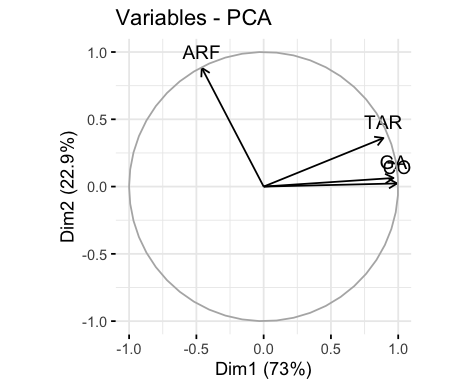

# Fundamentos de programación en R

## Unidad 6

- [Presentación](https://docs.google.com/presentation/d/e/2PACX-1vRz4W_GUQChrKUkOWPMqGID4mjiJwLa9kym7ikm1qqOEmGyjpqLUwVLrGbSsj15Qu5IqWwSHf8_scYq/pub?start=false&loop=false&delayms=10000)

---

## [EXTRA: 6.0 Análisis de Agrupamiento](../Unidad_06/U6_0_Analisis_agrupamiento.md)

---

## 6.1 Análisis de Componentes Principales

- [Script U6_1_PCA.R](../../bin/U6_1_PCA.R) de esta unidad en la carpeta **bin**

---

### ¿Qué es un PCA (Principal Component Analysis)?

El Análisis de Componentes Principales (PCA, por sus siglas en inglés) es una técnica utilizada en estadística y análisis de datos para simplificar la información contenida en un conjunto de variables correlacionadas, reduciendo la dimensionalidad de los datos.

En términos simples, PCA encuentra una nueva representación de los datos donde la mayor parte de la variabilidad se explica por un pequeño número de componentes principales. Estos componentes son combinaciones lineales de las variables originales y son ortogonales entre sí.

Un ejemplo de PCA sería considerar un conjunto de datos con múltiples características, como la altura, el peso, la edad y la presión arterial de diferentes individuos. El PCA podría ayudarnos a identificar patrones y relaciones entre estas variables, y reducir la dimensionalidad de los datos para resumir la información en un conjunto más pequeño de componentes principales que capturan la mayor parte de la variabilidad en los datos. Esto facilitaría la visualización y comprensión de la estructura subyacente de los datos.


Para mayor información, te recomiendo el video de [StatQuest: Análisis de componentes principales (PCA), paso a paso](https://www.youtube.com/watch?v=FgakZw6K1QQ).

---

En R se dispone de varias funciones de diferentes paquetes para calcular un PCA. Vamos a empezar con la función `prcomp`, la cuál es una _función base de R_ que se encuentra en el paquete `stats`. Este paquete ya viene preinstalado con R, por lo que no requiere la instalación de paquetes adicionales.


```R
# Empecemos un ejemplo sencillo de un PCA con la base de datos de iris

# Cargar bibliotecas
library(ggplot2)
library(dplyr)

# Cargar el conjunto de datos iris
data(iris)

# Seleccionar solo las variables numéricas
datos <- iris[, 1:4]

# Realizar el PCA con la función prcomp del paquete Stats

pca_resultado <- prcomp(datos, scale. = TRUE)

# Obtener las coordenadas de los componentes principales
coordenadas_pca <- as.data.frame(pca_resultado$x)

# Añadir la especie como variable para el color
coordenadas_pca$especie <- iris$Species

# Crear un gráfico de dispersión de los componentes principales
ggplot(coordenadas_pca, aes(x = PC1, y = PC2, color = especie)) +
  geom_point() +
  labs(x = "PC1", y = "PC2", title = "PCA de conjunto de datos iris")

```

¿Qué puedes interpretar del gráfico que se generó a partir del análisis de componentes principales


- Cada punto en el gráfico representa una observación en el conjunto de datos iris.
- Los ejes X e Y representan las dos primeras componentes principales (PC1 y PC2) obtenidas del PCA.
- Los puntos están coloreados según la especie de flor iris a la que pertenecen.
- El gráfico muestra cómo las observaciones se distribuyen en el espacio definido por las dos primeras componentes principales, lo que puede ayudar a visualizar la separación o agrupación de las observaciones según la especie de flor iris.

---

Vamos a continuar con el paquete `FactoMineR` y la función `PCA`. Este paquete se enfoca en técnicas de análisis multivariado y minería de datos, a diferencia del paquete anterior, `stats`. Para utilizar `FactoMineR`, debe ser instalado previamente desde CRAN.

Algunas de las principales diferencias entre los dos paquetes:

- Funcionalidad adicional:

  - `FactoMineR::PCA()` proporciona una gama más amplia de herramientas para análisis exploratorio de datos, incluyendo gráficos de resultados, pruebas de significancia, análisis de contribuciones de variables, entre otros.
  - `stats::prcomp()` se centra principalmente en calcular las componentes principales y no incluye funcionalidades adicionales para el análisis exploratorio.

- Salida de resultados:

  - La salida de `stats::prcomp()` es un objeto de clase "prcomp", que contiene los valores propios, los vectores propios (componentes principales) y otros resultados del PCA.
  - La salida de `FactoMineR::PCA()` es un objeto de clase "PCA" que también incluye información adicional como valores propios, coordenadas de variables y contribuciones de variables.

En resumen, `stats::prcomp()` es una función básica de R que proporciona los cálculos básicos de PCA, mientras que `FactoMineR::PCA()` es más completa y ofrece una gama más amplia de herramientas para análisis exploratorio de datos multivariados. La elección entre una u otra depende de las necesidades específicas de análisis y visualización de los datos.

---

Continuemos con un ejercicio. Vamos a utilizar los conjuntos de datos de demostración `decathlon2` del paquete `factoextra`. Los datos utilizados aquí describen el rendimiento de los atletas durante dos eventos deportivos (Desctar y OlympicG). Contiene **27 individuos** (atletas) descritos por **13 variables**.

```R
#Carga las bibliotecas:
library(FactoMineR) # Análisis de PCA
library(factoextra) # Base de datos
library(ggplot2) # Para graficar resultados
# Carga la base de datos decathlon2
data(decathlon2)
#Explora la base de datos; recuerda otras funciones además de head()?
head(decathlon2)
```

Comenzamos por obtener un subconjunto de individuos y variables para el análisis de componentes principales.

```R
#Subconjunto que consiste en las primeras 23 filas y las primeras 10 columnas del conjunto de datos decathlon2
decathlon2.active <- decathlon2[1:23, 1:10]
#Para ver las primeras 4 filas y las primeras 6 columnas 
head(decathlon2.active[, 1:6], 4)
```

Vamos a utilizar la función `PCA()`.

```R
# PCA con FactoMineR
res.pca <- PCA(decathlon2.active, graph = FALSE)
#¿Qué pasa si cambias el parámetro graph de False a True?

```


> En esta gráfica se muestra la representación de las variables en el espacio definido por los componentes principales obtenidos mediante el PCA. 
Cada variable del conjunto de datos se representa como un vector, su dirección y longitud representan la contribución de la variable y su importancia relativa en la estructura de los datos.

> Este tipo de gráfico es útil para visualizar cómo las variables están relacionadas entre sí y cómo contribuyen a la variabilidad observada en el conjunto de datos. 
También puede ayudar a identificar patrones y estructuras en los datos, así como a identificar posibles correlaciones o agrupaciones entre las variables.


Vamos a examinar _eigenvalores_ o también llamados _valores propios_ para determinar el número de componentes principales que hay que considerar. Los valores propios y la proporción de varianza retenida por los componentes principales PC pueden extraerse utilizando la función `get_eigenvalue()`

Los _eigenvalores_ miden la cantidad de variación de cada componente principal. Los valores propios son grandes para los primeros componentes principales (PC) y pequeños para los siguientes PC. 

```R
#Obten los eigenvalores que resultaron del análisis PCA
eig.val <- get_eigenvalue(res.pca)

eig.val
```

La suma de todos los valores propios da una varianza total de 10. La proporción de la variación explicada por cada valor propio se indica en la segunda columna. Por ejemplo, 4.124 dividido por 10 es igual a 0.4124, es decir, alrededor del 41.24% de la variación se explica por este primer valor propio.

En nuestro análisis, los tres primeros componentes principales explican el 72% de la variación. Este es un porcentaje aceptablemente grande. Un método alternativo para determinar el número de componentes principales es observar un Scree Plot usando `fviz_eig()`, que es el gráfico de los valores propios ordenados de mayor a menor.


```R
# Visualización con factoextra de los eigenvalores

fviz_eig(res.pca, addlabels = TRUE, ylim = c(0, 50))
``` 


Este gráfico muestra la magnitud de los eigenvalores en orden descendente y ayuda a identificar los componentes principales más importantes al observar la curva de los eigenvalores, buscando un punto donde la pendiente de la curva se aplane, lo que indica el número potencial de componentes a retener en el análisis.

Un método sencillo para extraer los resultados, para las variables, de la salida de un PCA es utilizar la función `get_pca_var()`. Esta función proporciona una lista de matrices que contiene todos los resultados de las variables activas (coordenadas, correlación entre variables y ejes, coseno cuadrado y contribuciones)

```R
# Para extraer información sobre las variables

var <- get_pca_var(res.pca)

#Explora el objeto recien creado
var
```

Los componentes de `get_pca_var()` se pueden utilizar en el gráfico de variables como sigue:

- `var$coord`: coordenadas de las variables para crear un gráfico de dispersión

- `var$cos2`: representa la calidad de la representación de las variables en el mapa de factores. Se calcula como el cuadrado de las coordenadas: var.cos2 = var.coord var.coord.

- `var$contrib`: contiene las contribuciones (en porcentaje) de las variables a los componentes del principio. La contribución de una variable (var) a un componente principal determinado es (en porcentaje) : (var.cos2 100) / (cos2 total del componente).

```R
#Coordenadas de las variables
head(var$coord)

# Cos2: calidad en el mapa de factores
head(var$cos2)

# Contribuciones a los componentes principales
head(var$contrib)
```

**Circulo de correlacion**

La correlación entre una variable y una componente principal (PC) se utiliza como las coordenadas de la variable en el PC. La representación de las variables difiere del trazado de las observaciones: Las observaciones se representan por sus proyecciones, pero las variables están representadas por sus correlaciones.


```R
# Círculo de correlación
head(var$coord, 4) # volvemos a ver las coordenadas de las variables
fviz_pca_var(res.pca, col.var = "pink") #generamos el gráfico 

# Puedes cambiar el color de las variables a azul o verde?

```


El círculo de correlación proporciona información sobre cómo las variables originales están correlacionadas con los componentes principales en el análisis de PCA. Cada variable se representa como un vector desde el origen (0,0) hasta sus coordenadas en el plano factorial. La longitud del vector indica la correlación entre la variable y los ejes de los componentes principales, y la dirección del vector indica la dirección de la asociación entre la variable y los componentes principales.

**¿Las variables pueden tener colores diferentes?**

Es posible colorear las variables por sus valores de **cos2** usando el argumento `col.var = “cos2”`. Recuerda que **cos2** representa el cuadrado del coseno del ángulo entre cada variable y los ejes de los componentes principales, e indica la calidad de representación de cada variable en el espacio definido por los componentes principales. Es decir, valores cercanos a 1 indican que la variable está bien representada en el espacio de los componentes principales y contribuye significativamente a la variabilidad observada en los datos, por otro lado, valores cercano a 0 indican una baja representación y contribución.

En este caso, el argumento `gradient.cols` se puede utilizar para proporcionar un gradiente de color considerando que hay un intervalo de valores de  **cos2** para cada variable. Podemos establecer el gradiente de colores con `gradient.cols = c (“blanco”, “azul”, “rojo”)`.

```R
# Colores para valores de cos2
fviz_pca_var(res.pca, col.var = "cos2",
             gradient.cols = c("#00AFBB", "#E7B800", "#FC4E07"),
             repel = TRUE ) +
  ggtitle("Variables en el primer plano factorial")

#¿Puedes cambiar el gradiente de colores?
```

> "#00AFBB" es un código hexadecimal que representa un color en el sistema RGB. Este código se utiliza para especificar colores de manera precisa en diseño gráfico y programación. Cada par de caracteres en el código representa los componentes rojo, verde y azul, lo que permite elegir un color específico. Hay páginas donde puedes obtener estos códigos, por ejemplo [Color Hex Color Codes](https://www.color-hex.com/)


**Contribuciones de variables a PCs**

Al graficar las contribuciones de las variables podemos **identificar las variables más importantes**, es decir, aquellas que contribuyen más a la variabilidad total de los datos. Además, nos permite **evaluar la calidad del PCA** y hacer una **selección de variables** para análisis posteriores. 

```R
# Contribuciones de variables a PCs
# Las variables mas importantes son subrayadas en correlacion con la siguiente funcion.
fviz_pca_var(res.pca, col.var = "contrib",
             
             gradient.cols = c("#00AFBB", "#E7B800", "#FC4E07"))

```


**Gráfico de individuos**

Los resultados para individuos se pueden extraer usando la función `get_pca_ind ()`. De manera similar a `get_pca_var ()`, la función `get_pca_ind ()` proporciona una lista de matrices que contiene todos los resultados de los individuos (coordenadas, correlación entre variables y ejes, coseno cuadrado y contribuciones)

```R
# PCA con individuos (muestras/observaciones/filas)
ind <- get_pca_ind(res.pca)
ind

# Graficos: Calidad y contribucion
fviz_pca_ind(res.pca)

# ¿Recuerdas como era la base de datos con la que se hizo el PCA?

```


**¿Qué puedes observar en este gráfico?**

- **Distribución de las observaciones:** Cada punto en el gráfico representa una observación, muestra o individuo, en el conjunto de datos. La posición de cada punto en el espacio bidimensional se determina por sus valores en los componentes principales.

- **Dispersión y proximidad:** La dispersión de los puntos en refleja la variabilidad de las observaciones. Los puntos que están cerca entre sí son de aquellos individuos que tienen perfiles de variables similares, mientras que los puntos que están más separados tienen perfiles de variables más diferentes.

- **Patrones y agrupaciones:** Al observar la distribución de los puntos, se pueden identificar patrones y agrupaciones. Por ejemplo, si hay un grupo de puntos que están cerca entre sí, esto puede indicar la presencia de un grupo o cluster de observaciones similares.

**¿Podemos agregar otros estadísticos que generó el PCA al mismo gráfico?** Por ejemplo, su calidad de representación (cos2) y su contribución (contrib).

```R
# Agregamos colores y puntos
fviz_pca_ind(res.pca, col.ind = "cos2", pointsize = "contrib",
             gradient.cols = c("#00AFBB", "#E7B800", "#FC4E07"),
             repel = TRUE )
```


Este gráfico nos ayuda a visualizar la distribución de las observaciones/individuos/muestras en el espacio de los dos primeros componentes principales, considerando tanto su calidad de representación (cos2) como su contribución a la estructura de los datos (tamaño del punto).

---

### Ejercicio:

A continuación vamos a hacer un PCA con los datos de la sesión 3 (U3_2.csv), recuerda que los datos se encuentran en la carpeta _data_.

```R
####################
### Vamos a hacer un PCA con los datos del curso U3_2.csv

# Primero hay que cargar los datos csv en R
data_expresion <- read.csv("../data/U3_2.csv", header = T, sep = ",")

#Verifica que los datos se hayan cargado correctamente
data_expresion

# Para ver las primeras filas
head(data_expresion)

```
¿Qué comandos utilizarías para ver la **dimensión** del objeto `data_expresion`? 
¿Y para saber la **clase** del objeto?

----

Hemos visto dos paquetes para hacer un PCA, por ahora prueba con la función `PCA`, del paquete `FactoMineR`.

```R
# Realiza un PCA con el paquete FactoMineR
# Guarda los resultados del PCA en un objeto (expresion.pca)

expresion.pca <- PCA(data_expresion[,-5], graph = F)

#¿Qué pasa si cambias el argumento graph a True?
```


Ahora vamos a graficar el PCA pero a nivel de los individuos/muestras/observaciones, con la función `fviz_pca_ind`.

Además, utiliza el argumento `col.ind` para especificar el factor variable para colorear los datos individuales por grupos, en este caso, el factor variable serán las **Etapas**. 

También, agrega una elipse de concentración alrededor de cada grupo con el argumento `addEllipses=TRUE`.

```R
 
fviz_pca_ind(expresion.pca, geom.ind = "point", # muestra solo los puntos (pero sin "texto")
             col.ind = data_expresion$Etapas, # colorea por grupos
             palette = c("#FF6666", "#3399FF", "#99FF99"),
             addEllipses = T, # Elipses de concentración
             legend.title = "Groups")

head(data_expresion)
```


Vamos a seguir explorando las opciones para agregar elipses, ahora con el argumento `ellipse.type`.

```R
# Añadir elipses de confianza
fviz_pca_ind(expresion.pca, geom.ind = "point", 
             col.ind = data_expresion$Etapas,
             palette = c("#6666FF", "#CC0099", "#00CCCC"),
             addEllipses = TRUE, ellipse.type = "confidence",
             legend.title = "Groups")
```


El argumento `ellipse.type = "confidence"` indica que se deben dibujar elipses de confianza alrededor de los grupos definidos, en este caso por las Etapas. Estas elipses de confianza se calculan utilizando intervalos de confianza para los componentes principales.

- Elipses pequeñas: Indican que los datos asociados tienen poca variabilidad en el espacio de los componentes principales. Esto puede interpretarse como una alta confianza en la precisión de las estimaciones de los componentes principales y una alta coherencia entre los individuos o variables representadas por esos puntos.

- Elipses grandes: Indican mayor variabilidad en el espacio de los componentes principales, lo que sugiere una menor confianza en las estimaciones de los componentes principales y una mayor dispersión de los individuos o variables representadas por esos puntos.

---

¿Qué ocurre si cambias **"confidence"** por **"t"**?


Cuando `ellipse.type = "t"`, las elipses representadas son **elipses t** (t-distribution). Estas elipses están basadas en la distribución t-Student y se calculan utilizando intervalos de confianza t para la posición estimada de las observaciones en el espacio de los componentes principales. Estas elipses pueden ser útiles en situaciones donde las distribuciones de las variables originales no son normales.

---

¿A qué se debe el cambio en el tamaño de las elipses?

Cuando se utiliza ellipse.type = "confidence", las elipses muestran el nivel de confianza en la distribución de los datos alrededor de los centroides de los grupos, indicando la dispersión de los datos con cierto nivel de confianza.

Por otro lado, ellipse.type = "t" utiliza intervalos de confianza basados en la distribución t de Student. Estos intervalos pueden ser más amplios, especialmente en conjuntos de datos pequeños, lo que puede hacer que las elipses sean más grandes debido a la mayor incertidumbre en la estimación de los parámetros.

En resumen, la diferencia en el tamaño de las elipses entre ellipse.type = "confidence" y ellipse.type = "t" se debe a las diferentes formas de calcular e interpretar los intervalos de confianza.

---- Cómo podemos saber si estos datos tienen una distribución es normal? Revisa el siguiente [script en R](https://github.com/NellyJazminPC/Fun-R-transcript/blob/main/bin/U6_Extra_Pruebas_Normalidad.R) si quieres más información.

---

Vamos a visualizar las etiquetas de cada individuo

```R
# Cambiar la paleta de colores y agrega las etiquetas de los individuos
fviz_pca_ind(expresion.pca,label = "all", # muestra todas las etiquetas individuales
             col.ind = data_expresion$Etapas, # colorea por grupo
             addEllipses = TRUE, 
             palette = "jco")
```


El argumento `label = "all"` indica que todas las etiquetas de los individuos se mostrarán en el gráfico. Esto permite identificar cada muestra individualmente.

Esto es útil para detectar muestras específicas que puedan estar alejadas de su grupo (posibles outliers) o para analizar muestras de interés particular.

---

¿Que otros tipos de elipses hay?

```R
fviz_pca_ind(expresion.pca, geom.ind = "point",
             
             col.ind = data_expresion$Etapas, # color by groups
             palette = c("#00AFBB", "#E7B800", "#FC4E07"),
             addEllipses = TRUE, ellipse.type = "convex",
             legend.title = "Groups")
```


Con `addEllipses = TRUE, ellipse.type = "convex"`, se agregarán elipses alrededor de los puntos para cada grupo, y el tipo de elipse será convexo. La elipse convexa no necesariamente tiene que ser una elipse en el sentido geométrico tradicional. En este contexto, "elipse" se utiliza de manera genérica para referirse a una forma que encierra los puntos del grupo. La envolvente convexa será más ajustada a la forma real de la distribución de los puntos que una elipse tradicional (como una elipse basada en una distribución gaussiana). 

Una elipse de tipo convexo en este gráfico de PCA ayuda a visualizar mejor la distribución y la extensión real de los puntos en cada grupo, sin asumir una forma específica para la agrupación de datos.

---
¿Podemos incorporar las variables y los individuos/muestras/observaciones en un solo gráfico?

Si, con la función `fviz_pca_biplot`.

```R
# Primero recurda como era el gráfico de PCA de las Variables
 fviz_pca_var(expresion.pca, axes.linetype = "blank")

# Biplot de las variables y las muestras/observaciones/individuos
fviz_pca_biplot(expresion.pca, repel = TRUE,col.var = "#FF0000",col.ind = "#696969" )

```





- Variables (Flechas Rojas): Las flechas representan las variables originales en el espacio de los componentes principales. Flechas más largas sugieren que la variable tiene una mayor contribución a la variabilidad en esos componentes.

- Observaciones (Puntos Grises): Cada punto representa una **muestra o individuo**. La posición de cada punto muestra cómo se proyecta la observación en los componentes principales.

- Relación entre Variables y Observaciones: La proximidad de un punto (observación) a una flecha (variable) sugiere que la observación tiene un valor alto para esa variable.
Las **observaciones que se agrupan cerca** de la misma región del gráfico tienen **perfiles similares** en términos de las variables originales.

- Ángulos entre Flechas: Los ángulos entre las flechas de las variables indican la correlación entre las variables.
  - Flechas que están próximas entre sí sugieren que las variables están positivamente correlacionadas.
  - Flechas que están aproximadamente a 180 grados entre sí sugieren que las variables están negativamente correlacionadas.
  - Flechas que están aproximadamente a 90 grados entre sí sugieren que las variables no están correlacionadas

Observaciones del gráfico:

Una flecha roja que apunta hacia la derecha en el gráfico podría representar una variable que tiene una alta carga en el primer componente principal.

Otra flecha roja que apunta hacia arriba podría representar una variable que tiene una alta carga en el segundo componente principal.
Observaciones:

Puntos grises que se encuentran cerca de la flecha que apunta hacia la derecha tienen altos valores en la variable representada por esa flecha.

Puntos grises que se encuentran cerca de la flecha que apunta hacia arriba tienen altos valores en la variable representada por esa flecha.


```R
#Cambia el color de los individuos por grupos: col.ind = iris $ Species
#mostrar solo las etiquetas de las variables: label = “var” o usar geom.ind = “point”

fviz_pca_biplot(expresion.pca,col.ind = data_expresion$Etapas, palette = "jco",
                addEllipses = TRUE, label = "var",
                col.var = "black", repel = TRUE,
                legend.title = "Etapas")
```


La coloración por grupos, la adición de elipses, y la representación de las variables y observaciones facilitan la identificación de patrones, diferencias entre grupos y la comprensión de las contribuciones de las variables a la variabilidad total de los datos.

- Flechas negras que indican las direcciones de las variables originales.
- Los puntos están coloreados según los grupos definidos en `data_expresion$Etapas`.
- Los puntos de cada grupo están rodeados por elipses de colores diferentes.
- Si los puntos de diferentes grupos están claramente separados en el espacio de los componentes principales, indica que los grupos son distintos en términos de las variables originales.
- Si las elipses de los grupos se superponen, puede haber similitudes entre los grupos en las dimensiones representadas por los componentes principales.

```R
# Agrega más argumentos para personalizar tu gráfico
fviz_pca_biplot(expresion.pca, 
                geom.ind = "point", # colorea los puntos por grupos
                pointshape = 21,
                pointsize = 2.5,
                fill.ind = data_expresion$Etapas,
                col.ind = "black",
                # Color de las variables por grupo.
                col.var = factor(c("TAR", "ARF", "CO", "GA")),
                legend.title = list(fill = "Etapas", color = "Genes"),
                repel = TRUE) + # Evite el trazado excesivo de etiquetas
ggpubr::fill_palette("jco") + # Color individual de relleno
ggpubr::color_palette("npg")
```


Las personalizaciones añadidas (como el color de los puntos y flechas, la forma y tamaño de los puntos, y la disposición de las etiquetas) facilitan la interpretación y mejoran la legibilidad del gráfico

**¿Qué más puedes interpretar de estos análisis?**

---

### Extra: otros métodos inspirados o relacionados con los PCA 

#### FA (Factorial Analysis)

El Análisis Factorial (AF) es una técnica estadística utilizada para identificar patrones subyacentes en un conjunto de variables observadas y para modelar las relaciones entre estas variables y un conjunto más pequeño de factores latentes no observados. 

Aunque el AF y el PCA son técnicas relacionadas que comparten algunos conceptos y objetivos, difieren en su enfoque y aplicación específicos. Por ejemplo, ambos buscan reducir la dimensionalidad de los datos; sin embargo, el PCA se centra en la variabilidad de las variables observadas, mientras que el AF se centra en modelar las relaciones entre las variables observadas y los factores latentes

El AF es comúnmente utilizado en psicometría y ciencias sociales para investigar la estructura interna de constructos teóricos como la personalidad, la inteligencia, la actitud, entre otros. También se utiliza en otras disciplinas, como la biología, la economía y la salud, para explorar y modelar relaciones entre variables observadas.

Para mayor información puedes revisar este [tutorial](https://bookdown.org/jsalinas/tecnicas_multivariadas/af.html) que muestra paso a paso como realizar un Análisis Factorial en R.


#### DAPC (Discriminant Analysis of Principal Components)

El Análisis Discriminante de Componentes Principales (DAPC) es una técnica estadística utilizada para analizar datos de genética de poblaciones y ecología, entre otras disciplinas. Es una extensión del Análisis de Componentes Principales (PCA) que incorpora el análisis discriminante para mejorar la capacidad de discriminación entre grupos o poblaciones en los datos. 

Para más información puedes revisar el manual del [paquete `adegenet` en R](https://adegenet.r-forge.r-project.org/files/tutorial-dapc.pdf) que tiene la función para realizar el DAPC.

#### MCA (Multiple Correspondence Analysis)

El Análisis de Múltiples Correspondencias (MCA) es una técnica similar al PCA, pero diseñada específicamente para el análisis de datos categóricos o nominales, a diferencia del PCA que se utiliza principalmente para datos cuantitativos continuos.

Este método utiliza una matriz de frecuencias de ocurrencia de categorías para calcular los componentes principales y reducir la dimensionalidad de los datos.

Para mayor información puedes consultar el siguiente [tutoral de MCA en R](https://rpubs.com/gaston/MCA), que muestra los pasos para ejecutar este análisis con el paquete FactoMineR que ya hemos explorado en esta sesión y con otros cuatro paquetes.

> Importante: no hay que confundir el MCA con el CA (Análisis de Correspondencias), la principal diferencia entre ambos esta en la cantidad de variables categóricas que se analizan simultáneamente.

#### CA (Correspondence Analysis)

El Análisis de Correspondencias (CA), es una técnica útil para analizar la asociación entre variables categóricas y para visualizar la estructura de asociación en un espacio de dimensiones reducidas. Es similar al Análisis de Componentes Principales (PCA), pero está diseñado específicamente para datos categóricos o nominales.

Es ampliamente utilizado en campos como la sociología, la investigación de mercado, la biología, la ecología y muchas otras disciplinas donde las variables categóricas son comunes.

Para mayor información puedes revisar el siguiente tutorial de [Análisis de Correspondencia Simple en R](https://bookdown.org/jsalinas/tecnicas_multivariadas/intro.html).

#### rPCs (regional Principal Components)

Otros método que se inspira en los Componentes Principales (PCA) es el método de Componentes Principales Regionales (rPC), que también reducen la dimensionalidad de los datos conservando la mayor cantidad posible de información, y es utilizada en conjuntos de datos multivariados y espaciales.

En análisis espacial, los datos suelen tener una estructura geográfica, lo que significa que las observaciones están relacionadas debido a su proximidad geográfica. Los métodos tradicionales de PCA no consideran esta estructura, lo que puede resultar en la pérdida de información.

Los rPC abordan este problema al considerar la estructura espacial. Utilizan una matriz de ponderación espacial para reflejar la proximidad entre las observaciones en el cálculo de los componentes principales. Esto permite capturar mejor la variabilidad espacial y proporcionar una representación más precisa de la estructura de los datos.

Para mayor información puedes revisar el pre-print de [Galván y colaboradores (2024)](https://www.biorxiv.org/content/10.1101/2024.05.01.590171v1), y en la descripción de su [paquete en R](https://www.bioconductor.org/packages/release/bioc/html/regionalpcs.html) que se encuentra en desarrollo.

### Fuentes de información

- [Types of Ordination Methods](https://uw.pressbooks.pub/appliedmultivariatestatistics/chapter/types-of-ordination-methods/)
- [Principal Component Analysis in R: prcomp vs princomp](http://www.sthda.com/english/articles/31-principal-component-methods-in-r-practical-guide/118-principal-component-analysis-in-r-prcomp-vs-princomp/#google_vignette)
- Artículo de rPCs. [Galván, S. C., Martínez-Salazar, M., Galván, V. M., Méndez, R., Díaz-Contreras, G. T., Alvarado-Hermida, M., ... & García-Carrancá, A. (2011). Analysis of CpG methylation sites and CGI among human papillomavirus DNA genomes. BMC genomics, 12, 1-11.](https://www.biorxiv.org/content/10.1101/2024.05.01.590171v1.full.pdf)

-----

## Extra: [Análisis de Agrupamiento](../U6_0_Analisis_agrupamiento.md)
------

## Siguiente tema: [6.2 Generación de reportes con Rmarkdown](../Unidad_06/U6_2_Rmarkdown.md)
