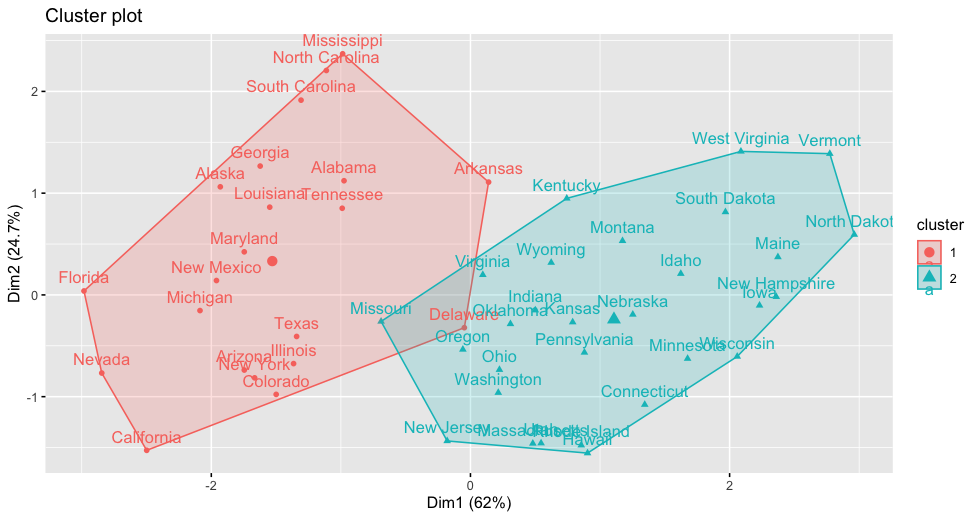
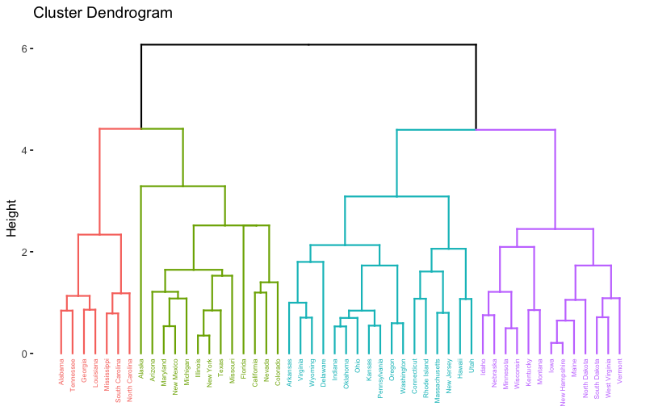

# Fundamentos de programación en R

## Unidad 6

[Presentación](https://docs.google.com/presentation/d/e/2PACX-1vRz4W_GUQChrKUkOWPMqGID4mjiJwLa9kym7ikm1qqOEmGyjpqLUwVLrGbSsj15Qu5IqWwSHf8_scYq/pub?start=false&loop=false&delayms=3000)

---

## 6.1 Análisis de Agrupamiento

---

### ¿Qué es un análisis de agrupamiento?

El análisis de agrupamiento, también conocido como **clustering**, es una técnica de [aprendizaje no supervisado](https://www.linkedin.com/pulse/aprendizaje-supervizado-somosdicsys/) que se utiliza para **identificar grupos** naturales o **patrones** intrínsecos en un conjunto de datos.

El objetivo es **agrupar objetos similares** entre sí en clusters o grupos, mientras que objetos diferentes se asignan a diferentes clusters. Esto se hace **sin tener información previa** sobre las **etiquetas de clase** de los datos, es decir, el algoritmo de agrupamiento busca estructuras subyacentes en los datos sin la necesidad de tener ejemplos previamente etiquetados.

Por ejemplo, en un conjunto de datos de expresión génica de células, el análisis de agrupamiento se puede utilizar para identificar subpoblaciones de células que tienen perfiles de expresión génica similares. Esto puede ayudar a comprender mejor la heterogeneidad celular y a identificar células con funciones similares o estados celulares específicos.

**Ejemplo:**
Vamos a usar el conjunto de datos "iris", que contiene mediciones de diferentes especies de flores iris

```R
# Cargar el conjunto de datos iris
data(iris)
```
Exploremos la base de datos `iris`. ¿Cuáles son las variables que midieron para generar esas base? ¿Qué hay en las filas?


```R

# Seleccionar solo las variables numéricas
datos <- iris[, 1:4]

# Realizar análisis de agrupamiento utilizando el algoritmo de k-means
set.seed(123) # Fijar semilla para reproducibilidad
clusters <- kmeans(datos, centers = 3) # ¿Por qué usamos una k = 3 ?

# Mostrar los resultados
print(clusters)

# Visualizar los grupos
plot(datos, col = clusters$cluster, pch = 20, main = "Clustering de flores iris")

```


El algoritmo K-means se basa en calcular distancias entre puntos de datos en un espacio multidimensional y agruparlos en función de su similitud. Utiliza una técnica iterativa para ajustar los centroides de los clusters y minimizar la suma de las distancias al cuadrado de los puntos de datos a los centroides asignados.

La visualización de los resultados del K-means en gráficos comparando pares de variables es una herramienta útil para comprender la estructura de los datos y cómo se agrupan en el espacio de características, pero no es parte del proceso de agrupamiento en sí mismo.

### Métodos más usados para los análisis de agrupamiento:

---

### K-means

En el ejemplo anterior, como habrás notado usamos la función `kmeans`, pero **¿qué es el método k-Means?**

El k-Means Clustering es una técnica de agrupamiento que divide un conjunto de datos en k clusters, donde cada cluster contiene objetos similares entre sí y diferentes de los objetos en otros clusters.

El objetivo del algoritmo K-means es minimizar la suma de las distancias al cuadrado de cada punto de datos al centroide de su grupo asignado. Esto significa que los puntos dentro de un mismo grupo son similares entre sí, mientras que los puntos en grupos diferentes son diferentes.

El algoritmo de K-means es rápido y eficiente, pero su resultado final puede depender de la inicialización aleatoria de los centroides y puede converger a un mínimo local subóptimo. Por lo tanto, es común ejecutar el algoritmo varias veces con diferentes inicializaciones aleatorias y seleccionar la solución que minimice la función objetivo.

> En el algoritmo de K-means, los **centroides** se definen como los puntos medios de los grupos formados por los datos asignados a cada cluster. Durante la inicialización, se eligen k centroides de manera aleatoria. Después de asignar cada punto al centroide más cercano, los centroides se actualizan como el promedio de todas las coordenadas de los puntos asignados al cluster correspondiente. Este proceso se repite hasta que los centroides ya no cambian significativamente o se alcanza un criterio de convergencia.


A continuación vamos a profundizar en este método con R

```R
#Cargamos las siguientes bibliotecas
library(cluster)     ## Funciones para el análisis de agrupamiento
library(factoextra)  ## Funciones para la visualización de los agrupamientos
library(tidyr)       ## Manipulación de datos
library(dplyr)       ## Manipulación de datos
```

Vamos a trabajar con la base de datos de arrestos en los EUA `USArrests`.

```R
#Describir la base de datos:
head(USArrests)
#¿Cómo podemos ver las dimensiones de la base de datos?
dim(USArrests)
#¿Cómo podemos ver el tipo de objeto que es USArrests?
class(USArrests)
```

Con la función `kmeans` podemos agrupar los estados de los datos de USArrests en dos clusters.

```R
 k2 <- kmeans(USArrests, centers = 2, nstart = 20)
 ```

El argumento `centers` describe el número de grupos (clusters) que queremos (es decir, k), mientras que `nstart` describe cuántos conjuntos aleatorios deben elegirse, en otras palabras especifica el número de veces que se debe ejecutar el algoritmo de K-means con diferentes centroides iniciales.

El valor predeterminado de  `nstart` es 1, lo que significa que el algoritmo de K-means se ejecutará una vez. Sin embargo, es común establecer un valor más alto, como 10 o 20, para aumentar las posibilidades de encontrar una solución óptima.

El resultado final de la función `kmeans` será el resultado del mejor de los `nstart` ajustes, es decir, el ajuste que produzca el valor más bajo de la suma de las distancias al cuadrado entre los puntos de datos y sus centroides asignados.

Podemos visualizar estos clusters usando `fviz_cluster`, que muestra los clusters utilizando un gráfico de dispersión donde las dos primeras puntuaciones de componentes principales definen las coordenadas X-Y de cada observación. 

```R
fviz_cluster(k2, data = USArrests)
 ```



Nota que la función `fviz_cluster` etiqueta cada punto. Esa etiqueta viene definida por default como el nombres de las filas (rownames) pero puedes cambiarlas con la función `rownames`. Además, si no quieres que las etiquetas de los nombres se sobrelapen en el gráfico puedes usar `repel = TRUE`.

```R
fviz_cluster(k2, data = USArrests, repel = TRUE)
```


¿Que observas en este gráfico? ¿Considerar que hay dos grupos en este conjunto de datos?

**Ejercicio:** Cambia el valor de K a 3 y 4 y vuelve a ejecutar las lineas de código. ¿Cambio algo?

---

#### Estandarización

Por otro lado, ya que las variables de la base de datos USArrests están en escalas diferentes, se recomienda la [estandarización de los datos](https://nicolasurrego.medium.com/transformando-datos-en-oro-c%C3%B3mo-la-estandarizaci%C3%B3n-y-normalizaci%C3%B3n-mejoran-tus-resultados-fbe0840d2b94#:~:text=Al%20estandarizar%20los%20datos%2C%20se,2022.) y esto lo puedes hacer con la función `scale` antes de la agrupación.

```R
# Estandarización
Std_USArrests <- scale(USArrests)
#Análisis de agrupamiento k-means
ks <- kmeans(Std_USArrests, centers = 2)
#Visualización del agrupamiento
fviz_cluster(ks, data = Std_USArrests)
```


La estandarización ayuda a que cada variable tenga la misma importancia a la hora de determinar los grupos. En muchos casos, estandarizar los datos es lo más recomendado, pero hay algunas situaciones en las que es mejor agrupar en clusters datos no estandarizados, más adelante veremos un ejemplo. 

Después del análisis de agrupamiento podemos revisar cada uno de los grupos generados mediante una breve descripción o un resumen de ellos, para esto podemos usar los centros de los clusters, que en este caso son los valores medios de cada miembro del cluster para cada variable.

```R
# Descripción o resumen de cada cluster
ks$centers 
#¿Notas diferencias entre el cluster 1 y el 2 (filas)?

```

- _centers_: contiene las coordenadas de los centroides finales de los clusters. Cada fila representa las coordenadas de un centroide en el espacio de características.
- _cluster_: indica a qué cluster pertenece cada punto de datos. Cada número entero representa un cluster diferente.

Después de ejecutar este código podrás ver que el primer _cluster_ contiene estados con bajos índices de delincuencia y menor urbanización, mientras que el segundo _cluster_ contiene estados con mayores índices de delincuencia y mayor urbanización.

Para interpretar los centros de los _clusters_ es importante considerar si los datos fueron estandarizados antes del análisis de agrupación. Para el ejemplo que acabamos de hacer incluimos la estandarización de los datos, por lo que los centros están en unidades estandarizadas y hay que describirlas e interpretarlas considerando esto.

### ¿Cuántos grupos (clusters) hay que elegir?

¿Para qué necesitamos saber el número de grupos? Como vimos anteriormente con el análisis _k-means_ se requiere especificar el número de grupos posibles (_k_) para poder ejecutar el análisis, sin embargo, si recién estamos explorando nuestros datos resultará complicado elegir el número óptimo de grupos (_k_). 

De manera general, se recomienda de _k_ sea lo suficientemente grande como para generar _clusters_ relativamente homogéneos, pero lo suficientemente pequeño como para limitar la complejidad innecesaria. Para resolver esta complicación se han empleado varias técnicas:

- El método Elbow (codo)
- El método Silhoutte
- El estadístico Gap

> **Extra:** Este problema de elegir el _k_ óptimo no es exclusivo del análisis k-means, y lo podemos encontrar en otros análisis de agrupamiento. Por ejemplo, para análisis de estructura genética los programas como [fastStructure](https://rajanil.github.io/fastStructure/) y [ADMIXTURE](https://dalexander.github.io/admixture/) necesitan que ingreses el número de grupos que crees que hay en tus datos (k).

#### El método Elbow (codo)

El algoritmo de _k-means_ minimiza el "Total withiness" (_wss_) y siempre va a disminuir conforme _k_ aumenta, pero llegará un punto en que la dismunición se estabilice aunque sigamos aumentando el valor de _k_.

Podemos visualizar esto con la función `fviz_nbclust`.

```R
fviz_nbclust(Std_USArrests, kmeans, method = "wss", k.max = 8)
```


El método Elbow sugiere que el número óptimo de _clusters_ debe elegirse en función del "codo" de este gráfico, es decir, el punto en el que la línea parece curvarse formando un codo.

En el ejemplo de USArrests, el método Elbow sugiere que 2 ó 3 grupos serían razonables, ya que más grupos no contribuyen mucho a reducir la wss.

#### El método Silhouette

Este método mide cuantitativamente la adecuación de cada punto del set de datos al cluster asignado en comparación con los clusters vecinos. Proporciona una "puntuación de silueta" (silhouette score) para cada punto del set de datos, que oscila entre -1 y 1, y representa la calidad de la solución de agrupación. Una puntuación más alta indica que ese punto de los datos se ajusta bien a su clúster, mientras que una puntuación más baja sugiere que podría pertenecer a un clúster diferente. El análisis de siluetas nos permite evaluar la estructura de agrupación y seleccionar el valor de _k_ que maximiza la puntuación media.

```R
fviz_nbclust(Std_USArrests, kmeans, method = "silhouette", k.max = 8)
```


Para los datos de USArrest, este método sugiere que _K = 2_ es óptima.
El método Silhouettes también se utiliza para comprender mejor la "pertenencia a un cluster" (cluster membership) de las observaciones individuales.

```R
k2 <- kmeans(USArrests, centers = 2, nstart = 25)
sil <- silhouette(k2$cluster, dist(USArrests), ordered = FALSE)
row.names(sil) <- row.names(USArrests) # Needed to use label option
fviz_silhouette(sil, label = TRUE)
```


En este ejemplo vemos que hay varios estados que no encajan muy bien en los grupos que se les han asignado, por lo que deberíamos tener precaución para evitar hacer demasiado hincapié en la pertenencia a grupos de estos estados a la hora de informar sobre las tendencias de los datos.

#### El método Gap

El estadístico de Gap compara el _wss_ que se consigue con una determinada elección de _k_ con lo que se esperaría para ese K si no hubiera relaciones reales entre las observaciones. El código siguiente calcula el estadístico de _Gap_ para K de 1 a 8:

```R
fviz_nbclust(Std_USArrests, kmeans, method = "gap", k.max = 8)
```


- Número de clusters vs. Gap statistic: El eje x mostrará el número de clusters considerados, mientras que el eje y mostrará el valor de la gap statistic para cada número de clusters. La gap statistic es una medida que compara la dispersión dentro de los clusters con la dispersión esperada si los datos se distribuyeran aleatoriamente.
- Barras de error: Para cada número de clusters, es probable que haya barras de error que indiquen la variabilidad de la gap statistic. Esto puede ayudar a determinar la estabilidad de la estimación del número óptimo de clusters.
- Puntos de inflexión: En la gráfica, es común buscar puntos de inflexión donde la gap statistic alcanza un máximo o comienza a disminuir de manera significativa. Estos puntos pueden sugerir el número óptimo de clusters.

---

En los ejemplos que hemos visto con la base de USArrests, cada método podría sugerir un número ligeramente diferente de _clusters_, esto es algo habitual, y el valor exacto suele depender de una decisión tomada por el analista. Se recomienda considerar el método de Elbow, Silhoutte, y Gap como herramientas para guiar su elección de k.

---

### PAM Clustering

Partición alrededor de medoides (_Partitioning Around Medoids_, PAM) es un enfoque alternativo de agrupación que busca puntos de datos llamados medoides, que sirven como centros de cluster. Los demás puntos de datos se asignan al cluster definido por el medoide más cercano.

> un medoide es un punto de datos dentro de un cluster que se utiliza como su representante central.

```R
pam_std <- pam(Std_USArrests, k = 3)
pam_std$medoids  ## Imprime los medoids
fviz_cluster(pam_std) ## Grafica los clusters
```


PAM resuelve muchos de los inconvenientes de k-means. Es más robusto a los valores atípicos (outliers), sus centros de cluster son los mismos puntos del conjunto de datos, haciendo los resultados más interpretables, además  PAM puede usarse para clusterizar datos con variables categóricas.

Estas ventajas no vienen sin debilidades, la mayor de ellas es la eficiencia computacional, PAM no se ejecuta bien con grandes conjuntos de datos. Además, PAM puede ser sensible a los medoides de partida, es decir, las configuraciones iniciales.

**Ejercicio:** Prueba ahora con K igual a 2 y 4, ¿cambio algo?

---

### Agrupación jerárquica (hierarchical clustering)

Tanto _k-means_ como PAM son algoritmos de partición que requieren un número predeterminado de _clusters_. En cambio, el clustering jerárquico agrega (o divide) los datos en una representación en forma de árbol conocida como dendrograma, que puede cortarse para definir el número deseado de clusters.
Existen dos categorías de enfoques para la agrupación jerárquica:

1. Los métodos aglomerativos o "ascendentes", que comienzan con cada punto de datos como su propio conglomerado, y luego proceden a agregar conglomerados hasta agrupar todas las observaciones.
2. Métodos divisivos o "de arriba abajo", que comienzan con todos los puntos de datos en un único conglomerado y, a continuación, proceden a dividir los conglomerados hasta que todas las observaciones constituyen su propio conglomerado.

Existen muchas implementaciones y algoritmos diferentes que se engloban en estos dos esquemas generales. El ejemplo siguiente ilustra la anidación aglomerativa (AGNES), un algoritmo aglomerativo, y el análisis divisivo (DIANA), un algoritmo divisivo.

```R
d <- get_dist(scale(USArrests))  ## Hierarchical Clustering requires a distance matrix
ag <- agnes(d)  ## AGNES
fviz_dend(ag, cex = 0.4, k = 4)
```


```R
di <- diana(d)  ## DIANA
fviz_dend(di, cex = 0.4, k = 4)
```



Este ejemplo puede utilizarse para resaltar algunos aspectos clave de la agrupación jerárquica:

- El _eje y_ del dendrograma es una medida de proximidad entre puntos de datos/clusters, para nuestro ejemplo se basa en la distancia euclidiana, la medida de distancia por defecto utilizada por [`get_dist`](https://www.rdocumentation.org/packages/asbio/versions/0.3-42/topics/get.dist).

- En `fviz_dend`, el argumento _k_ = 4 se utiliza para cortar el dendrograma en un punto que produce 4 clusters.

**Ejercicio:** Prueba con k igual a 2 y a 5, ¿qué pasa?

- Los algoritmos de agrupación jerárquica son de tipo [_greedy_](https://en.wikipedia.org/wiki/Greedy_algorithm), por lo que los métodos divisivos y aglomerativos casi siempre producen dendrogramas muy diferentes.


### Variables categóricas y distancia de Gower

Hasta ahora hemos revisado solo conjuntos de datos con predictores numéricos, ya que los métodos de agrupación que hemos utilizado se basan en cálculos de distancia que no son aplicables a las categorías. 

Para extender el clustering a conjuntos de datos que incluyen predictores categóricos, necesitamos un enfoque alternativo para calcular la distancia.


La _distancia de Gower_ es una medida que permite calcular la distancia tanto para predictores numéricos como categóricos.


Utilizando la distancia de Gower, podemos crear una matriz de distancias que nos permita aplicar métodos de agrupación como PAM, AGNES y DIANA. La función `daisy` se puede emplear para generar esta matriz de distancias de Gower.

```R
# Ejemplo de https://remiller1450.github.io/s230f19/clustering.html
# Descargar la base de datos IowaCityHomeSales
homes <- read.csv("https://remiller1450.github.io/data/IowaCityHomeSales.csv")

# Seleccionamos un conjunto de variables numéricas y con caracteres
homes2 <- select(homes, style, built, bedrooms, bsmt, ac, area.living, area.lot)

D <- daisy(homes2, metric = "gower") ## Utiliza daisy para calcular la matriz de distancias
fviz_dist(D, show_labels = FALSE)  ## Podríamos ver la matriz de distancias
```


La distancia entre variables categóricas según el método Gower se calcula determinando si las categorías coinciden o no entre dos objetos. Se asigna un valor de 0 si las categorías son iguales y 1 si son diferentes. Luego, se calcula la fracción de categorías diferentes entre los dos objetos. Este enfoque permite comparar variables categóricas sin asumir un orden entre las categorías

La función de visualización puede ser útil para comprender la estructura de similitud o distancia entre las observaciones en un conjunto de datos, lo que puede proporcionar información sobre la agrupación natural o la distribución de los datos.

```R
pam_homes <- pam(D, k = 3)
homes2[pam_homes$medoids, ]  ## Muestra los medoides
```

La función `pam` toma como entrada una matriz de distancias y agrupa las observaciones en clusters utilizando el algoritmo _PAM_. Puedes especificar el número deseado de clusters (_k_) como argumento de la función.

---

Para muchas aplicaciones nos gustaría comprobar si el uso de clusters es apropiado. 

Lamentablemente, la función `fviz_nbclust` sólo acepta matrices de datos numéricos, pero podemos hacer unos ajustos manualmente. Además, el estadístico Gap no puede calcularse para datos no numéricos. Pero aún podemos utilizar la anchura media de la silueta (_average silhouette width_) y el método del codo (_Elbow_) con un poco de código adicional:

```R
### Anchura media de Silhouette
avg_sil = numeric(9) ## Configurar el objeto para almacenar el ancho medio de la silueta para cada posible k
for(k in 2:10){
  pam_homes <- pam(D, k = k)
  avg_sil[k-1] <- pam_homes$silinfo$avg.width
}
plot(x = 2:10, y = avg_sil, type = "b", xlab = "k", ylab = "Avg Silhouette")
 ```


```R
### Método Elbow 
elbow = numeric(9)
for(k in 2:10){
  pam_homes <- pam(D, k = k)
  elbow[k-1] <- pam_homes$objective[1]
}
plot(x = 2:10, y = elbow, type = "b", xlab = "k", ylab = "Objective")
```


**Ejercicio:**

```R
### Ejercicio: con la base datos de Iris que revisamos al inicio de la sesión ejecuta el método del codo para elegir el K óptimo.

fviz_nbclust(datos, kmeans, method = "wss", k.max = 8)

# Prueba con otros métodos para determinar el número óptimo de K

irisK <- kmeans(datos, centers = 2, nstart = 20)

# Visualización del agrupamiento

fviz_cluster(irisK, data = datos)

# Para que las etiquetas no se sobrelapen
fviz_cluster(irisK, data = datos, repel = TRUE)
```

### Fuentes de información

- [Introduction to Clustering](https://remiller1450.github.io/s230f19/clustering.html)

- [K-means Clustering: Choosing Optimal K, Process, and Evaluation Methods](https://medium.com/@nirmalsankalana/k-means-clustering-choosing-optimal-k-process-and-evaluation-methods-2c69377a7ee4#:~:text=Elbow%20Method,like%20shape%20in%20the%20plot.)

- [Gower, J.C. (1971). "A General Coefficient of Similarity and Some of its Properties". Biometrics, 27(4), 857–871.](https://www.jstor.org/stable/2528823?casa_token=_lIKNqCrt8sAAAAA%3APC-WkPkGbM8dJ0hjnVnk6EXz8-Tk8vmx6y_uuQ8IwOOgjAyxWDFZcJqQMIoP9-2RDggBIw09SNvL3xYS2FjES8dV94p0os79nAiPD5EQFWDVa2ECX8_jTQ&seq=5)
- [Hastie, T., Tibshirani, R., & Friedman, J. (2009). "The Elements of Statistical Learning: Data Mining, Inference, and Prediction". Springer.](https://link.springer.com/book/10.1007/978-0-387-21606-5)

# Siguiente tema: 

[6.2 Análisis de Componentes Principales](../Unidad_06/U6_2_Analisis_Componentes_Principales.md)