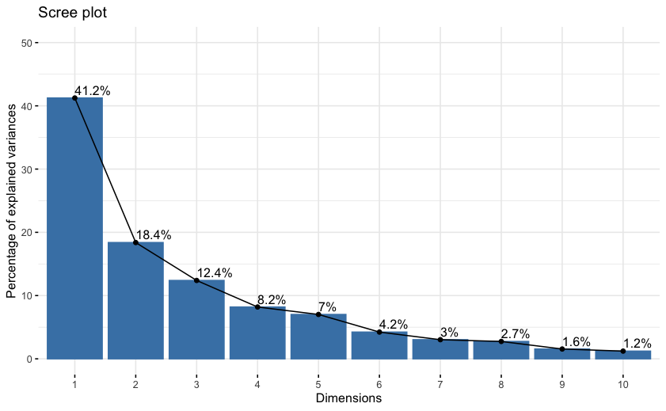
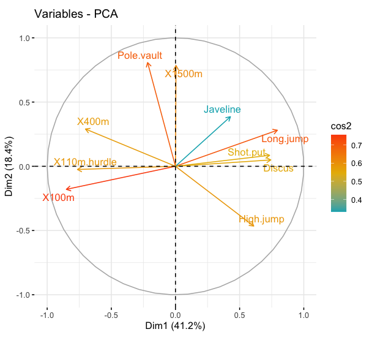
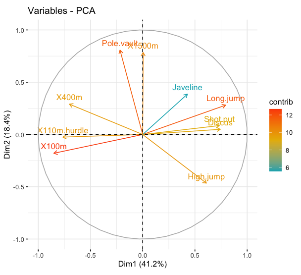

# Fundamentos de programación en R

## Unidad 6

---

## 6.2 Análisis de Componentes Principales

---

### ¿Qué es un PCA (Principal Component Analysis)?

El Análisis de Componentes Principales (PCA, por sus siglas en inglés) es una técnica utilizada en estadística y análisis de datos para simplificar la información contenida en un conjunto de variables correlacionadas, reduciendo la dimensionalidad de los datos.

En términos simples, PCA encuentra una nueva representación de los datos donde la mayor parte de la variabilidad se explica por un pequeño número de componentes principales. Estos componentes son combinaciones lineales de las variables originales y son ortogonales entre sí.

Un ejemplo de PCA sería considerar un conjunto de datos con múltiples características, como la altura, el peso, la edad y la presión arterial de diferentes individuos. PCA podría ayudarnos a identificar patrones y relaciones entre estas variables, y reducir la dimensionalidad de los datos para resumir la información en un conjunto más pequeño de componentes principales que capturan la mayor parte de la variabilidad en los datos. Esto facilitaría la visualización y comprensión de la estructura subyacente de los datos.


En R se dispone de varias funciones de diferentes paquetes para calcular un PCA

```R
library(FactoMineR) 
library(factoextra)
library(ggplot2) # Para graficar resultados
```

Para el ejemplo, vamos a utilizar los conjuntos de datos de demostración `decathlon2` del paquete `factoextra`. Los datos utilizados aquí describen el rendimiento de los atletas durante dos eventos deportivos (Desctar y OlympicG). Contiene **27 individuos** (atletas) descritos por **13 variables**.

```R
data(decathlon2)
head(decathlon2)
```
Comenzamos por obtener un subconjunto de los individuos activos y las variables activas para el análisis de componentes principales.

```R
decathlon2.active <- decathlon2[1:23, 1:10]
head(decathlon2.active[, 1:6], 4)
```

Se puede utilizar la función PCA() [paquete FactoMineR]

```R
# PCA con FactoMineR
res.pca <- PCA(decathlon2.active, graph = FALSE)
```
Los valores propios (_eigenvalores_) miden la cantidad de variación de cada componente principal. Los valores propios son grandes para los primeros componentes principales (PC) y pequeños para los siguientes PC. 

Vamos a examinar los valores propios para determinar el número de componentes principales que hay que considerar. Los valores propios y la proporción de varianza (es decir, la información) retenida por los componentes principales PC pueden extraerse utilizando la función `get_eigenvalue()`

```R
eig.val <- get_eigenvalue(res.pca)
eig.val
```
La suma de todos los valores propios da una varianza total de 10. La proporción de la variación explicada por cada valor propio se indica en la segunda columna. Por ejemplo, 4.124 dividido por 10 es igual a 0.4124, es decir, alrededor del 41.24% de la variación se explica por este primer valor propio.

En nuestro análisis, los tres primeros componentes principales explican el 72% de la variación. Este es un porcentaje aceptablemente grande. Un método alternativo para determinar el número de componentes principales es observar un Scree Plot usando `fviz_eig()`, que es el gráfico de los valores propios ordenados de mayor a menor.


```R
# Visualización con factoextra de los eigenvalues

fviz_eig(res.pca, addlabels = TRUE, ylim = c(0, 50))
``` 


Un método sencillo para extraer los resultados, para las variables, de la salida de un PCA es utilizar la función `get_pca_var()`. Esta función proporciona una lista de matrices que contiene todos los resultados de las variables activas (coordenadas, correlación entre variables y ejes, coseno cuadrado y contribuciones)

```R
# Graficar las variables

var <- get_pca_var(res.pca)
var
```

Los componentes de `get_pca_var()` se pueden utilizar en el gráfico de variables como sigue:

- `var$coord`: coordenadas de las variables para crear un gráfico de dispersión

- `var$cos2`: representa la calidad de la representación de las variables en el mapa de factores. Se calcula como el cuadrado de las coordenadas: var.cos2 = var.coord var.coord.

- `var$contrib`: contiene las contribuciones (en porcentaje) de las variables a los componentes del principio. La contribución de una variable (var) a un componente principal determinado es (en porcentaje) : (var.cos2 100) / (cos2 total del componente).

```R
#Coordenadas de las variables
head(var$coord)

# Cos2: calidad en el mapa de factores
head(var$cos2)

# Contribuciones a los componentes principales
head(var$contrib)
```


**Circulo de correlacion** 

La correlación entre una variable y una componente principal (PC) se utiliza como las coordenadas de la variable en el PC. La representación de las variables difiere del trazado de las observaciones: Las observaciones se representan por sus proyecciones, pero las variables están representadas por sus correlaciones.


```R
# Círculo de correlación
head(var$coord, 4)
fviz_pca_var(res.pca, col.var = "pink")
```


Es posible colorear las variables por sus valores de cos2 usando el argumento col.var = “cos2”. Esto produce un degradado de colores. En este caso, el argumento gradient.cols se puede utilizar para proporcione un color personalizado. Por ejemplo, gradient.cols = c (“blanco”, “azul”, “rojo”).

```R
# Colores para valores de cos2
fviz_pca_var(res.pca, col.var = "cos2",
             
             gradient.cols = c("#00AFBB", "#E7B800", "#FC4E07"),
             repel = TRUE )
```


**Contribuciones de variables a PCs**

Se analizara Las contribuciones de las variables en la contabilización de la variabilidad en una composición principal dada. Las variables que están correlacionadas con PC1 (es decir, Dim.1) y PC2 (es decir, Dim.2) son las más importante para explicar la variabilidad en el conjunto de datos. 
Las variables que no se correlacionan con ningún PC o correlacionan con las últimas dimensiones son variables con baja contribución

```R
# Contribuciones de variables a PCs
# Las variables mas importantes son subrayadas en correlacion con la siguiente funcion.
fviz_pca_var(res.pca, col.var = "contrib",
             
             gradient.cols = c("#00AFBB", "#E7B800", "#FC4E07"))

```




**Gráfico de individuos**

Los resultados para individuos, se pueden extraer usando la función `get_pca_ind ()` [paquete factoextra]. De manera similar a `get_pca_var ()`, la función `get_pca_ind ()` proporciona una lista de matrices que contiene todos los resultados de los individuos (coordenadas, correlación entre variables y ejes, coseno cuadrado y contribuciones)

```R
ind <- get_pca_ind(res.pca)
ind

# Gráfico de individuos
# Graficos: Calidad y contribucion
fviz_pca_ind(res.pca)
```


```R
# Agregamos colores y puntos
fviz_pca_ind(res.pca, col.ind = "cos2", pointsize = "cos2",
             gradient.cols = c("#00AFBB", "#E7B800", "#FC4E07"),
             repel = TRUE )
```


Puedes notar que los individuos que son similares son agrupados juntos

A continuación vamos a hacer un PCA con los datos de la sesión 3 (U3_2.csv), recuerda que los datos se encuentran en la carpeta _data_.

```R
####################
### Vamos a hacer un PCA con los datos del curso U3_2.csv

# Primero hay que cargar los datos csv en R
data_expresion <- read.csv("../data/U3_2.csv", header = T, sep = ",")

#Verifica que los datos esten bien
data_expresion
# Para ver las primeras filas
head(data_expresion)

# Realiza un PCA con el paquete FactoMineR

expresion.pca <- PCA(data_expresion[,-5], graph=T)

# se utilizara el argumento ’col.ind´ para especificar el factor variable para colorear los datos individuales por grupos. 
# Para añadir una elipse de concentración alrededor de cada grupo, especifique el argumento ’addEllipses=TRUE´

fviz_pca_ind(expresion.pca, geom.ind = "point", # show points only (but not "text")
             col.ind = data_expresion$Etapas, # color by groups
             palette = c("#FF6666", "#3399FF", "#99FF99"),
             addEllipses = TRUE, # Concentration ellipses
             legend.title = "Groups")
head(data_expresion)


# Añadir elipses de confianza
fviz_pca_ind(expresion.pca, geom.ind = "point", 
             col.ind = data_expresion$Etapas,
             palette = c("#6666FF", "#CC0099", "#00CCCC"),
             addEllipses = TRUE, ellipse.type = "confidence",
             legend.title = "Groups")


fviz_pca_ind(expresion.pca,label = "all", # hide individual labels
             col.ind = data_expresion$Etapas, # color by groups
             addEllipses = TRUE, # Concentration ellipses
             palette = "jco")

fviz_pca_ind(expresion.pca, geom.ind = "point",
             
             col.ind = data_expresion$Etapas, # color by groups
             palette = c("#00AFBB", "#E7B800", "#FC4E07"),
             addEllipses = TRUE, ellipse.type = "confidence",
             legend.title = "Groups"
)


fviz_pca_ind(expresion.pca, geom.ind = "point",
             
             col.ind = data_expresion$Etapas, # color by groups
             palette = c("#00AFBB", "#E7B800", "#FC4E07"),
             addEllipses = TRUE, ellipse.type = "convex",
             legend.title = "Groups"
)


fviz_pca_var(expresion.pca, axes.linetype = "blank")

#Revisar:
#fviz_pca_biplot(expresion.pca, repel = TRUE,col.var = "#FF0000",col.ind = "#696969" )


#hacer una biplot de individuos y variables
#cambiar el color de los individuos por grupos: col.ind = iris $ Species
#mostrar solo las etiquetas de las variables: label = “var” o usar geom.ind = “point”

fviz_pca_biplot(expresion.pca,col.ind = data_expresion$Etapas, palette = "jco",
                addEllipses = TRUE, label = "var",
                col.var = "black", repel = TRUE,
                legend.title = "Species")


head(data_expresion)
fviz_pca_biplot(expresion.pca, 
                geom.ind = "point", # relleno indivual por grupos
                pointshape = 21,
                pointsize = 2.5,
                fill.ind = data_expresion$Etapas,
                col.ind = "black",
                # Color de las variables por grupo.
                col.var = factor(c("TAR", "ARF", "CO", "GA")),
                legend.title = list(fill = "Etapas", color = "Genes"),
                repel = TRUE) + # Evite el trazado excesivo de etiquetas
ggpubr::fill_palette("jco") + # Color individual de relleno
ggpubr::color_palette("npg")

```

¿Qué observaste en estos análisis?

### Fuentes de información

- [Types of Ordination Methods](https://uw.pressbooks.pub/appliedmultivariatestatistics/chapter/types-of-ordination-methods/)
- [Principal Component Analysis in R: prcomp vs princomp](http://www.sthda.com/english/articles/31-principal-component-methods-in-r-practical-guide/118-principal-component-analysis-in-r-prcomp-vs-princomp/#google_vignette)
