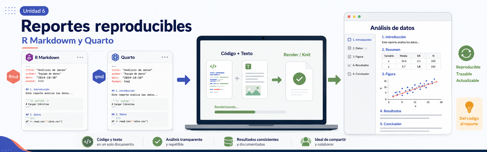

# Fundamentos de programación en R

## Unidad 6

---

#### [Material extra: análisis de agrupamiento y PCA avanzado](U6_3_Material_extra_agrupamiento_y_PCA.md)

---

## 6.2 Reportes reproducibles con Quarto

* [Presentación](https://docs.google.com/presentation/d/e/2PACX-1vQU8VcZ5-ekl8pOHomXSAGDdQOd7aeJjJabDHOdEVqzsJ8ONekC5Xwvf1PnUp_mxw/pub?start=false&loop=false&delayms=60000)



## Objetivo

Reconocer la utilidad de los reportes reproducibles y construir un reporte sencillo en Quarto a partir del análisis de PCA trabajado previamente en R.

En esta parte de la unidad vamos a pasar de un **script que ejecuta un análisis** a un **documento que explica, ejecuta y comunica ese análisis**.

> El script nos ayuda a correr el análisis.  
> El reporte reproducible nos ayuda a contar cómo se hizo, qué resultados produjo y cómo los interpretamos.

## Material de apoyo

Durante esta parte trabajaremos con:

* [Script para ejercicio de reporte](../../bin/U6_2_PCA_para_reporte.R)
* [Plantilla Quarto](../../bin/U6_reporte_pca_plantilla.qmd)
* [Datos de práctica](../../data/U6_datos_pca.xlsx)
* [Material extra: agrupamiento y PCA avanzado](U6_3_Material_extra_agrupamiento_y_PCA.md)

Durante la sesión iremos organizando el análisis de PCA dentro de un archivo `.qmd`.

> **Nota importante:** para este ejercicio, el archivo `.qmd` estará guardado en la carpeta `bin/`, junto con los scripts de trabajo. Al dar clic en **Render**, Quarto generará el archivo `.html` en esa misma carpeta. Al finalizar, moveremos manualmente el `.html` a la carpeta `results/`.

---

## 1. ¿Por qué hacer reportes reproducibles?

En un análisis de datos no solo importa obtener una figura o una tabla. También es importante poder responder:

* ¿Qué datos se usaron?
* ¿Qué paquetes se cargaron?
* ¿Qué pasos se siguieron?
* ¿Qué código generó cada resultado?
* ¿Dónde se guardaron las figuras?
* ¿Cómo se interpretaron los resultados?
* ¿Otra persona podría repetir el análisis?

Un **reporte reproducible** combina texto, código, resultados, figuras e interpretación en un mismo documento.

Esto es especialmente útil en análisis biológicos porque los resultados suelen depender de varios pasos: lectura de datos, limpieza, transformación, análisis, visualización e interpretación.

Por ejemplo, en un análisis transcriptómico no basta con mostrar una figura de PCA. También necesitamos documentar:

* qué matriz o tabla usamos;
* qué muestras incluye;
* qué variables entraron al análisis;
* si los datos fueron transformados o escalados;
* qué representa cada punto en la figura;
* qué limitaciones tiene la interpretación.

---

## 2. Del script al reporte

Hasta ahora hemos trabajado principalmente con scripts de R.

Un script permite escribir y ejecutar código paso a paso:

```r
# Cargar paquetes
library(readxl)
library(dplyr)
library(ggplot2)
```

Pero un reporte reproducible permite combinar ese código con explicaciones:

````markdown
## Cargar paquetes

Primero cargamos los paquetes necesarios para importar datos desde Excel,
manipular tablas y construir figuras.

```{r}
library(readxl)
library(dplyr)
library(ggplot2)
```
````

La diferencia no está solo en el formato. La diferencia está en la intención:

| Archivo | Función principal |
| ------- | ----------------- |
| `.R`    | Ejecutar código y desarrollar el análisis |
| `.qmd`  | Explicar, ejecutar y comunicar el análisis |
| `.html` | Compartir el reporte generado |

En esta sesión usaremos Quarto para documentar el PCA de la primera parte de la unidad.

---

## 3. R Markdown como antecedente

Antes de Quarto, una herramienta muy usada para crear reportes reproducibles en R era **R Markdown**.

R Markdown usa archivos con extensión `.Rmd`, donde se combinan:

* texto en Markdown;
* bloques de código de R;
* resultados;
* figuras;
* opciones de salida como HTML, Word o PDF.

Quarto conserva esta idea general, pero amplía y moderniza el flujo de trabajo. En este curso usaremos **Quarto** porque permite crear documentos reproducibles con una sintaxis clara y se integra bien con RStudio.

No es necesario dominar todas sus opciones. Para esta sesión basta con entender tres ideas:

1. Un archivo `.qmd` puede tener texto y código.
2. Al renderizarlo, Quarto ejecuta el código y genera un documento final.
3. El documento final puede ser HTML y compartirse como reporte.

---

## 4. ¿Qué es Quarto?

**Quarto** es un sistema para crear documentos reproducibles a partir de texto, código y resultados.

Con Quarto podemos generar distintos tipos de documentos, por ejemplo:

* reportes HTML;
* documentos Word;
* documentos PDF;
* presentaciones;
* sitios web;
* libros o materiales largos.

En esta unidad nos concentraremos solo en reportes **HTML**, porque son fáciles de generar, abrir y compartir.

---

## 5. Estructura básica de un archivo `.qmd`

Un archivo Quarto puede contener tres elementos principales:

1. Un encabezado YAML.
2. Texto escrito en Markdown.
3. Bloques de código, también llamados *chunks*.

La estructura mínima se ve así:

````markdown
---
title: "Reporte PCA reproducible"
author: "Nombre de la persona"
format: html
---

## Introducción

Este reporte presenta un análisis exploratorio de PCA.

```{r}
# Código de R
summary(cars)
```
````

---

## 6. Encabezado YAML

El encabezado YAML se escribe al inicio del archivo y queda delimitado por tres guiones:

```yaml
---
title: "Reporte PCA reproducible"
author: "Nombre de la persona"
format:
  html:
    toc: true
    embed-resources: true
editor: visual
---
```

En esta práctica usaremos:

* `title`: título del reporte.
* `author`: nombre de quien elabora el reporte.
* `format: html`: indica que generaremos un archivo HTML.
* `toc: true`: agrega una tabla de contenido.
* `embed-resources: true`: incrusta recursos como imágenes dentro del HTML.
* `editor: visual`: permite trabajar con el editor visual de RStudio, si está disponible.

La opción `embed-resources: true` será útil porque permite generar un HTML autocontenido. Es decir, un archivo HTML que se puede compartir sin adjuntar una carpeta adicional de imágenes o recursos.

---

## 7. Texto en Markdown

En Quarto podemos escribir texto usando Markdown.

Algunos elementos básicos son:

```markdown
# Encabezado de nivel 1
## Encabezado de nivel 2
### Encabezado de nivel 3

Texto normal.

**Texto en negritas**

*Texto en cursivas*

- Elemento de lista
- Otro elemento de lista

[Texto del enlace](https://quarto.org/)
```

En un reporte de análisis, el texto es tan importante como el código porque permite explicar qué se está haciendo y por qué.

Por ejemplo:

```markdown
## Preparación de datos

En esta sección importamos la tabla de datos y separamos los metadatos de las variables numéricas. Los metadatos se usarán para interpretar las figuras, mientras que las variables numéricas se usarán para calcular el PCA.
```

---

## 8. Bloques de código o chunks

Los bloques de código permiten ejecutar instrucciones de R dentro del documento.

Un chunk básico se escribe así:

````markdown
```{r}
# Código de R
head(datos)
```
````

También podemos dar nombre al chunk:

````markdown
```{r importar-datos}
datos <- readxl::read_excel("../data/U6_datos_pca.xlsx")
head(datos)
```
````

Nombrar los chunks ayuda a organizar el reporte y facilita identificar errores si algo falla al renderizar.

---

## 9. Opciones comunes de chunks

Los chunks pueden tener opciones para controlar qué se muestra en el reporte.

Algunas opciones frecuentes son:

| Opción | Significado |
| ------ | ----------- |
| `echo` | Muestra u oculta el código |
| `eval` | Ejecuta o no ejecuta el código |
| `message` | Muestra u oculta mensajes |
| `warning` | Muestra u oculta advertencias |
| `fig-width` | Controla el ancho de la figura |
| `fig-height` | Controla la altura de la figura |

Por ejemplo:

````markdown
```{r}
#| label: cargar-paquetes
#| message: false
#| warning: false

library(readxl)
library(dplyr)
library(ggplot2)
```
````

En este caso, el chunk sí se ejecuta, pero no muestra mensajes ni advertencias generadas al cargar los paquetes.

Otro ejemplo:

````markdown
```{r}
#| label: figura-pca
#| fig-width: 7
#| fig-height: 5

pca_etapa
```
````

Aquí se controla el tamaño de la figura dentro del reporte.

---

## 10. Renderizar el reporte

**Renderizar** significa ejecutar el archivo `.qmd` completo para generar el documento final.

En RStudio puedes hacerlo con el botón **Render**.

Al renderizar, Quarto:

1. lee el archivo `.qmd`;
2. ejecuta los bloques de código;
3. inserta resultados y figuras;
4. genera un archivo HTML.

Si el reporte incluye figuras generadas por código, Quarto las incorpora automáticamente en el HTML. Si usamos `embed-resources: true`, el HTML puede compartirse como un solo archivo.

> **Nota sobre el archivo HTML:**  
> Como el `.qmd` estará guardado en `bin/`, al dar clic en **Render** el archivo `.html` se generará también en `bin/`. Esto es normal. Al terminar, mueve manualmente el archivo `.html` a la carpeta `results/`.

---

## 11. Rutas dentro del reporte

En esta práctica, el archivo `.qmd` estará guardado dentro de la carpeta:

```text
bin/
```

Por eso, las rutas dentro del código del `.qmd` se escribirán desde `bin/`.

La estructura del proyecto será:

```text
Fun-R-transcript/
├── bin/
├── data/
├── doc/
└── results/
```

Como el archivo `.qmd` estará en `bin/`, para leer los datos usaremos:

```r
datos <- readxl::read_excel("../data/U6_datos_pca.xlsx")
```

Esto significa:

```text
Desde bin/
sube un nivel hasta la raíz del proyecto
entra a data/
lee U6_datos_pca.xlsx
```

Para guardar una figura en la carpeta `results/`, usaremos:

```r
ggsave(
  filename = "../results/U6_pca_etapa_reporte.png",
  plot = pca_etapa,
  width = 7,
  height = 5,
  dpi = 300
)
```

Esto significa:

```text
Desde bin/
sube un nivel hasta la raíz del proyecto
entra a results/
guarda la figura
```

Esta organización mantiene la lógica general del repositorio:

* `bin/`: archivos de trabajo con código, como `.R` y `.qmd`;
* `data/`: datos de entrada;
* `results/`: productos generados, como figuras, tablas y reportes HTML;
* `doc/`: guías y materiales de apoyo del curso.

> Si al ejecutar un chunk aparece un error de ruta, revisa con `getwd()` desde qué carpeta se está ejecutando el código. Para este ejercicio, lo ideal es que el `.qmd` se ejecute desde `bin/`.

---

## 12. Ejercicio: del script al reporte reproducible

En este ejercicio vamos a convertir un script de PCA en un reporte Quarto.

El objetivo no es copiar todo el script sin pensar, sino identificar qué hace cada bloque y organizarlo en secciones claras.

### Instrucciones

1. Abre el archivo:

```text
bin/U6_2_PCA_para_reporte.R
```

2. Abre la plantilla:

```text
bin/U6_reporte_pca_plantilla.qmd
```

3. Identifica en el script los bloques principales del análisis:

* cargar paquetes;
* importar datos;
* explorar la tabla;
* separar metadatos y variables numéricas;
* ejecutar PCA;
* calcular varianza explicada;
* construir una figura;
* guardar la figura;
* escribir una interpretación breve.

4. Copia cada bloque de código en la sección correspondiente del archivo `.qmd`.

5. Antes o después de cada bloque, escribe una explicación breve.

6. Renderiza el reporte a HTML con el botón **Render**.

7. Revisa si el reporte se genera correctamente.

8. Mueve el archivo `.html` generado desde `bin/` hacia `results/`.

---

## 13. Estructura sugerida del reporte

Tu reporte puede tener una estructura como esta:

```markdown
# Introducción

# Datos utilizados

# Preparación de datos

# Análisis de Componentes Principales

# Visualización del PCA

# Interpretación

# Limitaciones
```

Cada sección debe tener una función clara.

Por ejemplo, en la sección de interpretación puedes escribir algo como:

> El PCA muestra una separación parcial de las muestras por etapa, principalmente a lo largo de PC1. PC1 y PC2 explican una proporción importante de la variación total. Sin embargo, este patrón debe interpretarse como exploratorio y no como una prueba estadística de diferencia entre etapas.

---

## 14. ¿Qué debe incluir el reporte?

Al finalizar, el reporte debe incluir:

* título y nombre de la persona;
* breve introducción;
* código para cargar paquetes;
* código para importar los datos;
* revisión básica de la tabla;
* separación de metadatos y variables numéricas;
* PCA con `prcomp()`;
* tabla o explicación de varianza explicada;
* figura de PCA;
* interpretación breve;
* una limitación del PCA.

No es necesario incluir todas las figuras del script general. Para este ejercicio basta con documentar una figura principal y explicar qué muestra.

---

## 15. Checklist antes de terminar

Antes de considerar terminado el reporte, revisa:

* ¿El archivo `.qmd` renderiza sin errores?
* ¿El HTML se abre correctamente en el navegador?
* ¿El título y autor aparecen bien?
* ¿El texto explica qué se hizo?
* ¿El código está organizado en secciones?
* ¿La figura aparece dentro del HTML?
* ¿El archivo `.html` se movió a `results/`?

---

## 16. Errores frecuentes al renderizar

Algunos errores comunes son:

### Error por ruta incorrecta

Puede ocurrir si Quarto no encuentra el archivo de datos.

```text
Error: path does not exist
```

Revisa si la ruta apunta correctamente al archivo:

```r
"../data/U6_datos_pca.xlsx"
```

Si el archivo `.qmd` está guardado en `bin/`, esta ruta debería encontrar el archivo de datos.

### Error por paquete no cargado

Puede ocurrir si usamos una función antes de cargar su paquete.

Por ejemplo:

```text
could not find function "read_excel"
```

En ese caso, revisa que el chunk de paquetes incluya:

```r
library(readxl)
```

### Error porque un objeto no existe

Puede ocurrir si intentamos graficar un objeto antes de crearlo.

```text
object 'pca_scores' not found
```

En ese caso, revisa el orden de los chunks. El objeto debe crearse antes de usarse.

### Error por nombres de columnas

Puede ocurrir si escribimos mal el nombre de una columna.

Por ejemplo, si la columna se llama `etapa`, pero escribimos `Etapa`, R lo interpreta como nombres diferentes.

---

## 17. Cierre de la actividad

Al terminar, cada persona debería tener:

* un archivo `.qmd` con el reporte reproducible;
* un archivo `.html` generado al renderizar;
* una figura guardada en `results/`;
* una explicación breve del PCA;
* una interpretación cuidadosa del resultado.

Preguntas de cierre:

1. ¿Qué diferencia hay entre un script y un reporte reproducible?
2. ¿Qué parte del análisis fue más fácil de pasar al reporte?
3. ¿Qué parte necesitó más explicación escrita?
4. ¿Qué error apareció al renderizar y cómo se resolvió?
5. ¿Por qué conviene interpretar el PCA con cautela?

---

## Para seguir explorando

Los siguientes temas no forman parte del núcleo de la sesión, pero pueden revisarse después.

### Generar reportes en Word

Quarto también puede generar archivos de Word (`.docx`). Esto puede ser útil cuando necesitamos entregar un informe editable, compartirlo con alguien que hará comentarios en Word o integrar el reporte a un documento institucional.

Un ejemplo mínimo de encabezado YAML para generar Word sería:

```yaml
---
title: "Reporte PCA reproducible"
author: "Nombre de la persona"
format:
  docx:
    toc: true
    number-sections: true
---
```

En este caso:

* `format: docx` indica que la salida será un documento de Word;
* `toc: true` agrega una tabla de contenido;
* `number-sections: true` numera las secciones del reporte.

También es posible usar una plantilla de Word como documento de referencia. Esto permite conservar estilos institucionales, como encabezados, tipos de letra o formato de títulos.

```yaml
---
title: "Reporte PCA reproducible"
format:
  docx:
    reference-doc: plantilla_curso.docx
---
```

Esta opción puede ser útil si más adelante se quiere preparar un formato de reporte común para el curso o para un grupo de trabajo.

### Generar reportes en PDF

El formato PDF es útil cuando queremos compartir un reporte final que no se va a editar, por ejemplo, para entrega, archivo o difusión.

Un ejemplo mínimo de YAML para PDF sería:

```yaml
---
title: "Reporte PCA reproducible"
author: "Nombre de la persona"
format:
  pdf:
    toc: true
    number-sections: true
---
```

Sin embargo, para generar PDF puede ser necesario tener instalada una herramienta adicional, como LaTeX. Por eso, en esta sesión trabajaremos con HTML, que es más directo y menos propenso a errores de instalación.

Una forma sencilla de explicar esta diferencia es:

> HTML es ideal para practicar y compartir rápidamente.  
> PDF es útil para documentos finales, pero puede requerir configuración adicional.

### Usar temas visuales para HTML

Los temas visuales permiten cambiar la apariencia del reporte HTML sin modificar el análisis.

Por ejemplo, podemos usar un tema llamado `cosmo`:

```yaml
---
title: "Reporte PCA reproducible"
format:
  html:
    toc: true
    embed-resources: true
    theme: cosmo
---
```

También se pueden probar otros temas:

```yaml
format:
  html:
    theme: flatly
```

```yaml
format:
  html:
    theme: journal
```

```yaml
format:
  html:
    theme: minty
```

Los temas pueden ayudar a generar reportes más limpios, materiales didácticos más atractivos o documentos con una identidad visual más cercana al curso.

### Otras opciones para explorar

Además de cambiar el formato o el tema visual, Quarto permite explorar otras posibilidades:

* ocultar o mostrar código con opciones de chunk;
* agregar bibliografía;
* usar parámetros en reportes;
* crear reportes más largos como sitios, libros o manuales;
* generar presentaciones;
* combinar R con otros lenguajes;
* publicar reportes HTML en línea.

Estas opciones pueden revisarse después, una vez que el flujo básico esté claro:

```text
datos + código + texto + figura + interpretación
↓
reporte reproducible
```

---

## Fuentes de información

* [Quarto: Get Started](https://quarto.org/docs/get-started/)
* [Quarto: HTML Basics](https://quarto.org/docs/output-formats/html-basics.html)
* [Quarto: HTML Options](https://quarto.org/docs/reference/formats/html.html)
* [Quarto: Markdown Basics](https://quarto.org/docs/authoring/markdown-basics.html)
* [R Markdown: The Definitive Guide](https://bookdown.org/yihui/rmarkdown/)

---

### Siguiente tema: [7.1 Enfoque de Transcriptómica](../Unidad_07/)
