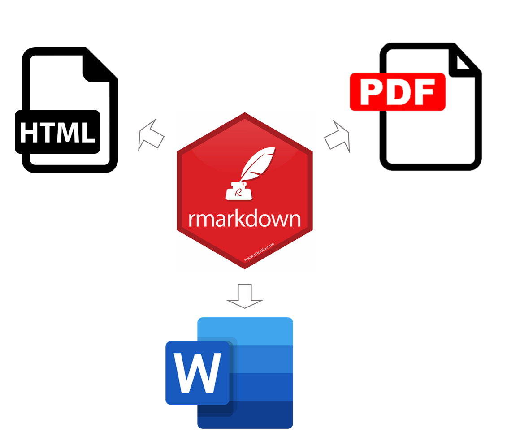
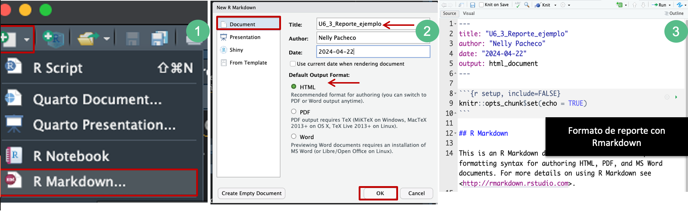
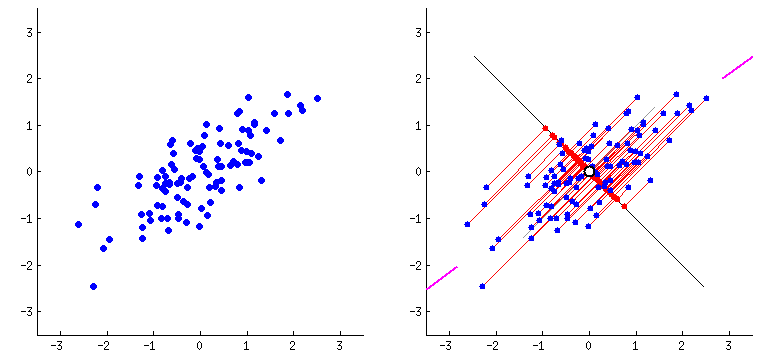

# Fundamentos de programación en R

## Unidad 6

- [Presentación](https://docs.google.com/presentation/d/e/2PACX-1vRz4W_GUQChrKUkOWPMqGID4mjiJwLa9kym7ikm1qqOEmGyjpqLUwVLrGbSsj15Qu5IqWwSHf8_scYq/pub?start=false&loop=false&delayms=10000)

- [Script U6_2_Reporte_ejemplo.Rmd](../../bin/U6_2_Reporte_ejemplo.Rmd) de esta unidad en la carpeta **bin**

---

## 6.2 Generación de reportes con Rmarkdown

---

### ¿Qué es Rmarkdown?

Rmarkdown es una herramienta que permite combinar texto, código y resultados en un solo documento. Se utiliza para crear informes dinámicos y reproducibles que integran análisis de datos con explicaciones detalladas.



### ¿Por qué usar Rmarkdown?

Con Rmarkdown, podemos escribir texto explicativo utilizando formato [Markdown](https://markdown.es/), incrustar código R para realizar análisis de datos y generar gráficos, y luego incorporar los resultados directamente en el mismo documento. Esto nos permite crear informes que son completamente reproducibles, lo que significa que otras personas pueden volver a ejecutar el código y obtener los mismos resultados.

Además, Rmarkdown nos permite generar informes en diferentes formatos de salida, como HTML, PDF, Word, presentaciones de diapositivas, entre otros. Esto nos da flexibilidad para compartir nuestros resultados en el formato que consideremos más adecuado.

---

### ¿Que hacemos primero?

Hay que crear un nuevo archivo con el formato de Rmarkdown. 



> Para generar este archivo R necesita los paquetes `rmarkdown`y `knitr`, pero **por lo general no hace falta** cargarlos personalmente porque RStudio realiza esto automáticamente cuando es generamos un nuevo archivo **R Markdown**, en especial cuando son las versiones más recientes de R y RStudio.

---

#### Extensión .Rmd

Cuando abrimos un archivo `.Rmd`, obtenemos una interfaz de **notebook** (cuaderno), donde el código y los resultados se encuentran intercalados. Por ejemplo, en lugar de que los gráficos generados sólo aparezcan en el panel de Plots los podemos tener en un mismo documento junto con el código que lo generó y otras anotaciones como posibles discusiones u observaciones.

#### Knit - generar el reporte

Para producir un reporte completo que contenga todo el texto, código y resultados, podemos dar click en `Knit` o presionar Ctrl + Shift + K. Esto mostrará el reporte en el panel Viewer y creará un archivo HTML independiente que podremos compartir con otros.

> Si el reporte no aparece en el panel de Viewer, puedes configurarlo haciendo click en el símbolo de una tuerca que está del lado izquierdo de `Knit`.

#### Ejecutar el código por bloques

Los bloques de código se pueden ejecutar haciendo click en el ícono ejecutar (el botón de Play en la parte superior/derecha del bloque), o presionando Ctrl + Shift + Enter. 

RStudio ejecuta el código y muestra los resultados incrustados en el código.

> Con las actualizaciones de Posit, ahora podemos incorporar bloques de código también de otros lenguajes de programación (por ejemplo, Python, SQL, Bash, etc) en un mismo reporte.

#### Tipos de documentos de salida

Para este ejemplo, nos vamos a concentrar en R Markdown para producir documentos HTML:

 ```R
- - - -
output: html_document
- - - -
```

Sin embargo, existen una gran variedad de outputs para generar diferentes tipos de documentos:

- pdf_document: crea un PDF con LaTeX (un sistema de código abierto de composición de textos), que necesitarás instalar. RStudio te notificará si no lo tienes.

- word_document: para documentos de Microsoft Word (.docx).

- odt_document para documentos de texto OpenDocument (.odt).

Entre otros.

---



### Notebooks o cuadernos

Un **notebook** o **html_notebook** (“cuaderno” en español), es una variación de un **html_document**. Las salidas de los dos documentos son muy similares, pero tienen propósitos distintos. 

Un **html_document** está enfocado en la comunicación con los encargados de la toma de decisiones, mientras que un **notebook** está enfocado en colaborar con otros científicos de datos. Estos propósitos diferentes llevan a usar la salida HTML de diferentes maneras. Ambas salidas HTML contendrán la salida renderizada, pero el notebook también contendrá el código fuente completo. Esto significa que podemos usar el archivo .nb.html generado por el notebook de dos maneras:

1. Podemos verlo en un navegador web, y ver la salida generada. A diferencia del html_document, esta renderización siempre incluye una copia incrustada del código fuente que lo generó.

2. Podemos editarlo en RStudio. Cuando abramos un archivo .nb.html, RStudio automáticamente recreará el archivo `.Rmd` que lo creó.

El archivo creado tendrá una extensión `.Rmd`. Hay tres tipos importantes de contenido en su estructura (ve la imagen anterior en el número 3):

1. Un encabezado rodeado de - - - .

2. Bloques de código de R rodeado de ``` 

3. Texto, al que se le puede dar distintos formatos

### 1. Encabezados - YAML Header

Para sobrescribir los parámetros predeterminados se necesita usar un campo de output extendido. Por ejemplo, si queremos generar un html_document con una tabla de contenido flotante, usamos:

El YAML header es esencial para configurar y personalizar los reportes generados con Rmarkdown, permitiendo definir de manera sencilla y estructurada las principales características del documento. Se encuentra al principio del documento y está rodeado por líneas de tres guiones ---. Este encabezado contiene metadatos y configuraciones del documento

#### Ejemplo de la estructura del YAML Header

```markdown
---
title: "Título del Documento"
author: "Nombre del Autor"
date: "`r Sys.Date()`"
output: html_document
---
```

#### Componentes comunes:

- **title**: Define el título del documento.
- **author**: Nombre del autor o los autores.
- **date**: Fecha del documento, que puede ser fija o dinámica.
- **output**: Formato(s) de salida del documento. Puede ser html_document, pdf_document, word_document, entre otros.

#### Ejemplo con opciones adicionales:

```markdown
---
title: "Reporte de Análisis de Datos"
author: "Juan Pérez"
date: "`r Sys.Date()`"
output: 
  html_document:
    theme: cerulean
    toc: true
    toc_depth: 3
  pdf_document:
    fig_caption: true
    number_sections: true
    latex_engine: xelatex
---
```


Para los html_document otra opción es hacer que los fragmentos de código estén escondidos por defecto, pero visibles con un click:

```markdown
---
title: "Clase"
output:
  html_document:
    code_folding: hide
---
```

Puedes buscar otras opciones para personalizar los archivos [HTML con Rmarkdown](https://bookdown.org/yihui/rmarkdown/html-document.html) y de los [temas](https://bootswatch.com/3/).

### 2. Bloques de código

Como ya mencionamos, para ejecutar código dentro de un documento R Markdown, necesitamos insertar un bloque (_Chunk_). Hay tres maneras para hacerlo:

1. El atajo de teclado Ctrl + Alt + I
2. El icono “Insertar” en la barra de edición (Insert > R)
3. Tipear manualmente los delimitadores de bloque, que son tres acentos graves `` ` {r} y ```.

El código se puede seguir corriendo con `Ctrl` + `Enter` línea a línea. Sin embargo, los bloques de código tienen otro atajo de teclado: `Ctrl` + `Shift` + `Enter`, que ejecuta todo el código en el bloque.

> La salida de los bloques puede personalizarse con _options_, argumentos suministrados en el encabezado del bloque. `Knitr` provee casi 60 opciones para que puedas usar para personalizar tus bloques de código, la lista completa puede verse en http://yihui.name/knitr/options/.

#### Ejemplo de la estructura de un bloque de código de R

```markdown
``` {r nombre_del_chunk, opciones}
# Código R aquí
summary(cars)
` ` ` # estos acentos van juntos, sin espacios entre ellos
 ```

#### Opciones comunes de chunks:

- **echo**: Si es `TRUE` (valor predeterminado), muestra el código en el reporte.
- **eval**: Si es `TRUE` (valor predeterminado), evalúa el código.
- **include**: Si es `TRUE` (valor predeterminado), incluye tanto el código como el resultado en el reporte.
- **message** y **warning**: Controlan si se muestran mensajes y advertencias.
- **fig.width** y **fig.height**: Dimensiones de las figuras generadas por el código.

#### Ejemplo con opciones de chunk:

```markdown
```{r summary_chunk_2, echo=TRUE, eval=TRUE, fig.width=6, fig.height=4}
# Generar un resumen y un gráfico
summary(mtcars)
plot(mtcars$wt, mtcars$mpg)

`` ` 
```

Recuerda poner los tres acentos juntos al final

### 3. Texto - formato

El texto en los archivos `.Rmd` está escrito en **Markdown**, un lenguaje que permite dar formato a archivos de texto plano. Está diseñado para ser fácil de leer y fácil de escribir, siendo también muy fácil de aprender. 

Del Cheatsheet:


#### Elementos de formato comunes:

- **Encabezados**: Se crean con uno o más signos de número (`#`).

```markdown
  # Encabezado de nivel 1
  ## Encabezado de nivel 2
  ### Encabezado de nivel 3
```

- **Listas**: Se crean con asteriscos (*), guiones (-), o signos de más (+) para listas no ordenadas, y números seguidos de un punto (1.) para listas ordenadas.

```markdown
- Elemento 1
- Elemento 2

1. Primer elemento
2. Segundo elemento
```

- **Énfasis**: Texto en cursiva usando un asterisco o guion bajo alrededor del texto, y negrita usando dos asteriscos o guiones bajos.

```markdown
*Texto en cursiva*
**Texto en negrita**
```

- Enlaces: Se crean con corchetes para el texto y paréntesis para la URL.

```markdown
[Enlace a Google](https://www.google.com)
```

- Imágenes: Similar a los enlaces, pero precedido por un signo de exclamación.

```markdown

```

#### Ejemplo de un texto formateado en Markdown:

```markdown
# Análisis de Datos

Este reporte presenta un análisis detallado de los datos del **conjunto de datos mtcars**.

## Resumen

El resumen de las variables principales es el siguiente:

```{r summary_chunk, echo=FALSE}
summary(mtcars)
```


### Ejercicio:

Genera un reporte Rmarkdown copiando algunas líneas de código que hemos visto en sesiones pasadas, de preferencia aquellas que generan algún gráfico. Agrega tus notas, dentro y fuera de los bloques de código y guarda tu reporte en formato html.

> Puedes cambiar de `Source`a `Visual` para ver como se luce tu reporte final.

### Fuentes de información recomendadas:

- [Quarto or R Markdown?](https://www.jumpingrivers.com/blog/quarto-rmarkdown-comparison/)
- [Notebook format](https://bookdown.org/yihui/rmarkdown/notebook.html)

-----------

## Siguiente tema: [7.1 Enfoque de Transcriptómica](../Unidad_07/)
