# Fundamentos de programación en R

## Unidad 6

---

#### [Tema principal: Análisis de Componentes Principales](../Unidad_06/U6_1_Analisis_Componentes_Principales.md)

#### [Siguiente tema: Reportes reproducibles con Quarto](../Unidad_06/U6_2_Reportes_reproducibles_con_Quarto.md)

---

## 6.3 Material extra: análisis de agrupamiento y PCA avanzado

## Objetivo

Explorar métodos complementarios para analizar datos biológicos multivariados, incluyendo análisis de agrupamiento, selección del número de grupos, clustering jerárquico, distancia de Gower y visualizaciones avanzadas de PCA con `FactoMineR` y `factoextra`.

Este material no forma parte del flujo indispensable de la sesión. Está pensado como una guía de consulta para quienes quieran profundizar después de la práctica principal de PCA.

## Material de apoyo

En este material extra el código está incluido directamente en el archivo `.md`. No es necesario generar un script independiente para esta sección.

Para ejecutar todos los ejemplos se recomienda tener instalados los siguientes paquetes:

```r
install.packages(c("cluster", "factoextra", "FactoMineR", "dplyr", "tidyr", "readxl", "ggplot2", "ggpubr"))
```

Después, podemos cargarlos con:

```r
library(cluster)     # Funciones para análisis de agrupamiento
library(factoextra)  # Visualización de clustering y PCA
library(FactoMineR)  # PCA y otros métodos multivariados
library(dplyr)       # Manipulación de datos
library(tidyr)       # Reorganización de datos
library(readxl)      # Lectura de archivos Excel
library(ggplot2)     # Gráficos
```

---

# Parte A. Análisis de agrupamiento

## 1. ¿Qué es un análisis de agrupamiento?

El análisis de agrupamiento, también llamado **clustering**, es una estrategia de análisis exploratorio que busca identificar grupos de observaciones similares entre sí.

A diferencia de un análisis supervisado, en clustering no le indicamos al algoritmo cuáles son los grupos correctos. El algoritmo busca patrones en los datos a partir de la similitud o distancia entre observaciones.

En datos biológicos, el clustering puede ayudar a explorar preguntas como:

* ¿Hay muestras con perfiles de expresión similares?
* ¿Algunos individuos se parecen más entre sí según sus rasgos morfológicos?
* ¿Hay sitios con condiciones ambientales parecidas?
* ¿Podemos identificar posibles subgrupos antes de hacer análisis más específicos?

> **Precaución:** encontrar clusters no significa necesariamente que existan grupos biológicos reales. El resultado depende de las variables incluidas, la escala de los datos, la distancia utilizada y el método de agrupamiento.

---

## 2. Ejemplo inicial con `iris`

La base `iris` contiene mediciones morfológicas de flores de tres especies del género *Iris*.

```r
# Cargar el conjunto de datos iris
data(iris)

# Revisar las primeras filas
head(iris)

# Seleccionar solo las variables numéricas
datos <- iris[, 1:4]

# Realizar agrupamiento con k-means
set.seed(123)
clusters <- kmeans(datos, centers = 3)

# Revisar resultados
clusters
```

En este ejemplo usamos `centers = 3` porque sabemos que la base incluye tres especies. En datos reales no siempre conocemos el número de grupos de antemano.

Podemos hacer una visualización sencilla:

```r
plot(
  datos,
  col = clusters$cluster,
  pch = 20,
  main = "Clustering de flores iris"
)
```

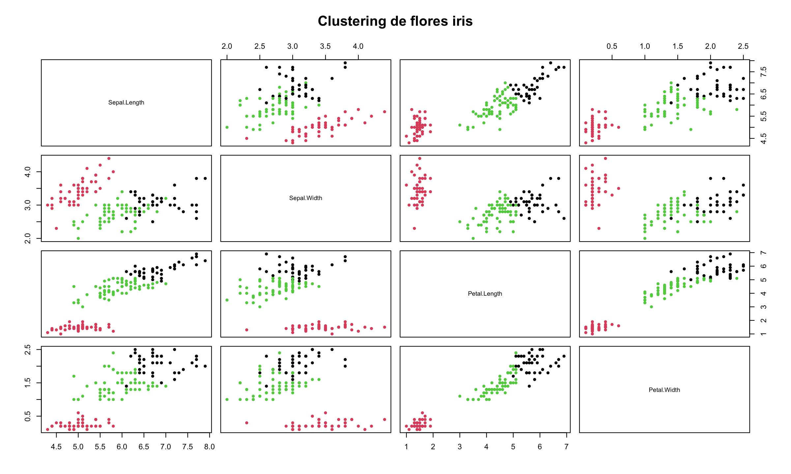

### Preguntas

* ¿Qué representa cada punto?
* ¿Qué variables se comparan en los paneles?
* ¿El resultado del clustering coincide completamente con las especies reales?
* ¿Qué ventaja y qué limitación tiene visualizar pares de variables?

---

## 3. K-means

El método **k-means** divide las observaciones en `k` grupos o clusters. Cada cluster tiene un centroide, que representa el centro promedio de las observaciones asignadas a ese grupo.

De manera simplificada, el algoritmo sigue estos pasos:

1. Se define un número de clusters `k`.
2. Se eligen centroides iniciales.
3. Cada observación se asigna al centroide más cercano.
4. Los centroides se actualizan.
5. El proceso se repite hasta que los grupos se estabilizan.

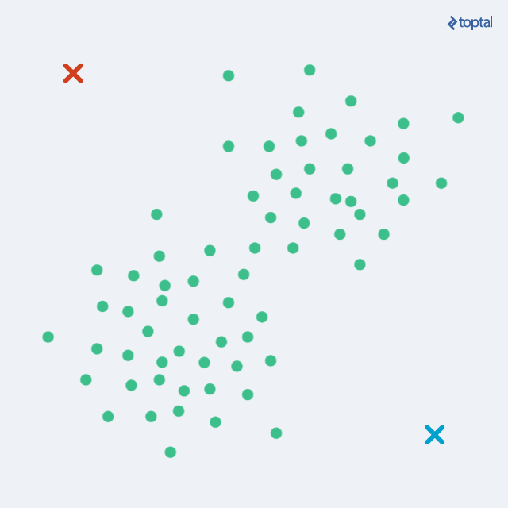

`k-means` es rápido y útil, pero tiene algunas limitaciones:

* requiere definir `k` antes del análisis;
* puede depender de la inicialización de los centroides;
* funciona mejor con variables numéricas;
* es sensible a la escala de las variables;
* puede ser sensible a valores extremos.

---

## 4. K-means con `USArrests`

La base `USArrests` viene incluida en R y contiene variables relacionadas con arrestos y urbanización en estados de Estados Unidos.

```r
# Explorar la base de datos
head(USArrests)
dim(USArrests)
class(USArrests)
```

Podemos hacer un clustering con dos grupos:

```r
set.seed(123)
k2 <- kmeans(USArrests, centers = 2, nstart = 20)

k2
```

El argumento `centers` indica el número de clusters. El argumento `nstart` indica cuántas inicializaciones aleatorias se prueban. Usar un valor mayor que 1 ayuda a encontrar una solución más estable.

Para visualizar:

```r
fviz_cluster(k2, data = USArrests)
```

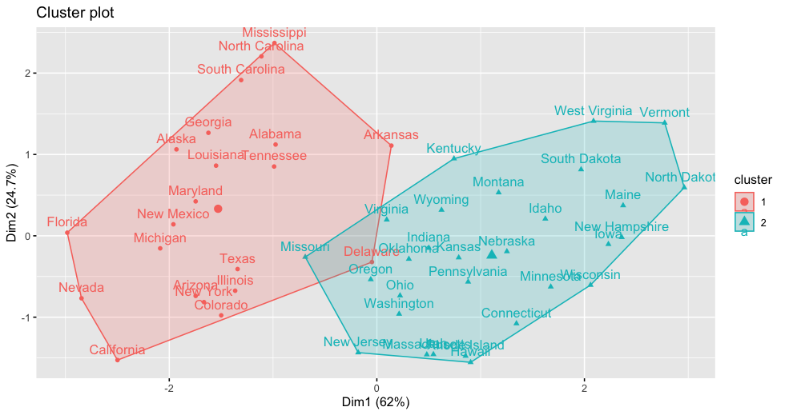

Podemos evitar el sobrelapamiento de etiquetas usando `repel = TRUE`:

```r
fviz_cluster(k2, data = USArrests, repel = TRUE)
```

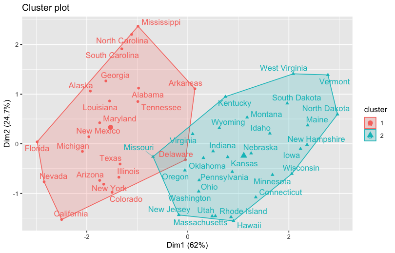

### Ejercicio

Cambia el valor de `centers` a 3 y 4.

```r
set.seed(123)
k3 <- kmeans(USArrests, centers = 3, nstart = 20)
fviz_cluster(k3, data = USArrests, repel = TRUE)

set.seed(123)
k4 <- kmeans(USArrests, centers = 4, nstart = 20)
fviz_cluster(k4, data = USArrests, repel = TRUE)
```

Preguntas:

* ¿Cambian mucho los grupos?
* ¿Qué estados quedan juntos?
* ¿Es fácil justificar biológicamente, ecológicamente o socialmente esos grupos?
* ¿Qué necesitaríamos para interpretar los clusters con cuidado?

---

## 5. Estandarización antes del clustering

Cuando las variables tienen escalas diferentes, algunas pueden dominar el cálculo de distancias. Por ejemplo, una variable con valores entre 0 y 1000 puede pesar más que una variable con valores entre 0 y 1.

Por eso, muchas veces conviene estandarizar los datos antes del clustering.

```r
# Estandarizar variables
Std_USArrests <- scale(USArrests)

# K-means con datos estandarizados
set.seed(123)
ks <- kmeans(Std_USArrests, centers = 2, nstart = 20)

# Visualización
fviz_cluster(ks, data = Std_USArrests, repel = TRUE)
```

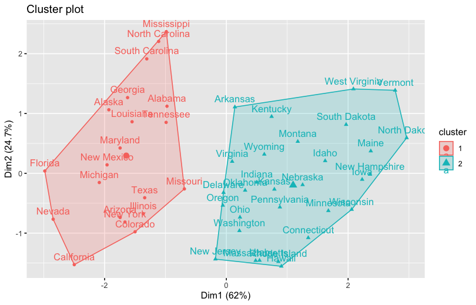

Después del clustering podemos revisar los centros de cada grupo:

```r
ks$centers
ks$cluster
```

Los centros indican el valor promedio de las variables en cada cluster. Si los datos fueron estandarizados, estos centros están en unidades estandarizadas.

### Preguntas

* ¿Qué variables parecen distinguir más a los clusters?
* ¿Cómo cambia la interpretación cuando los datos están estandarizados?
* ¿Por qué no conviene mezclar variables con escalas muy distintas sin revisarlas?

---

## 6. ¿Cuántos clusters elegir?

En k-means debemos indicar el número de clusters antes de ejecutar el análisis. Esto puede ser difícil cuando estamos explorando datos nuevos.

Algunas herramientas para elegir `k` son:

* método del codo o **Elbow**;
* método de **Silhouette**;
* estadístico **Gap**.

Estas herramientas no siempre coinciden. Por eso conviene usarlas como apoyo, no como receta automática.

---

## 7. Método del codo

El método del codo evalúa cómo cambia la variación dentro de los clusters conforme aumenta `k`.

```r
fviz_nbclust(Std_USArrests, kmeans, method = "wss", k.max = 8)
```

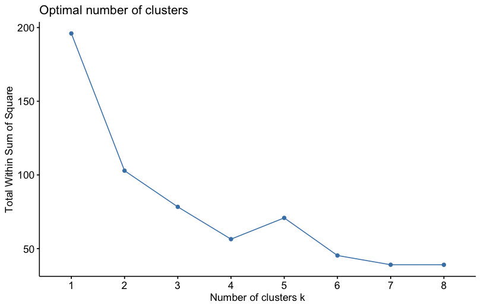

La idea es buscar un punto donde la reducción en la variación interna comienza a estabilizarse. Ese punto se interpreta como un posible valor razonable de `k`.

### Pregunta

¿En qué valor de `k` parece formarse el codo?

---

## 8. Método Silhouette

El método de silueta evalúa qué tan bien queda asignada cada observación a su cluster.

Los valores de silueta van de -1 a 1:

* valores cercanos a 1 indican que la observación está bien asignada;
* valores cercanos a 0 indican que la observación está entre dos clusters;
* valores negativos sugieren que la observación podría estar mejor en otro cluster.

```r
fviz_nbclust(Std_USArrests, kmeans, method = "silhouette", k.max = 8)
```

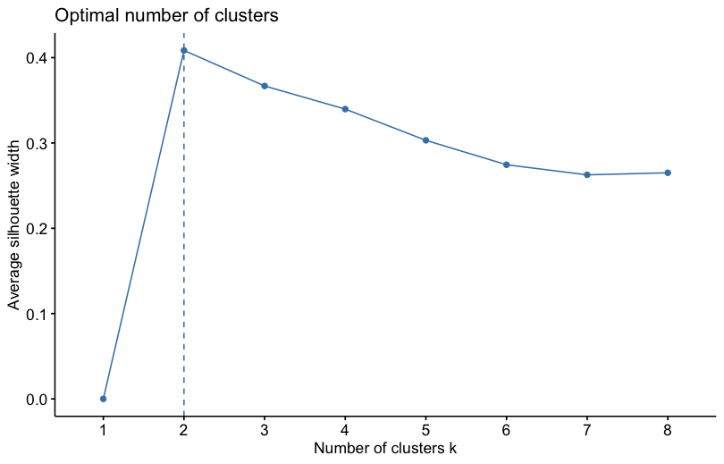

También podemos revisar la silueta de las observaciones individuales:

```r
set.seed(123)
k2 <- kmeans(USArrests, centers = 2, nstart = 25)

sil <- silhouette(k2$cluster, dist(USArrests), ordered = FALSE)
row.names(sil) <- row.names(USArrests)

fviz_silhouette(sil, label = TRUE)
```

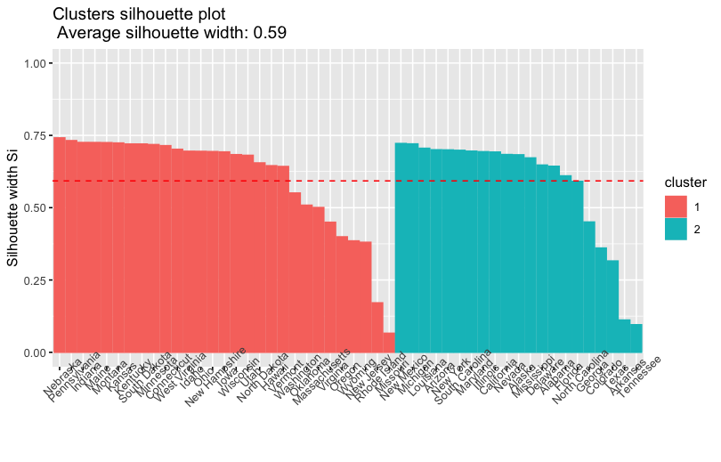

Este tipo de gráfico ayuda a identificar observaciones que no encajan tan bien en su cluster.

### Preguntas

* ¿Hay observaciones con silueta baja?
* ¿Qué implicaría reportar esos clusters sin advertir esa incertidumbre?
* ¿Por qué la silueta puede ayudar a evitar interpretaciones exageradas?

---

## 9. Estadístico Gap

El estadístico Gap compara la estructura observada con lo que se esperaría si los datos no tuvieran una estructura real de agrupamiento.

```r
fviz_nbclust(Std_USArrests, kmeans, method = "gap", k.max = 8)
```

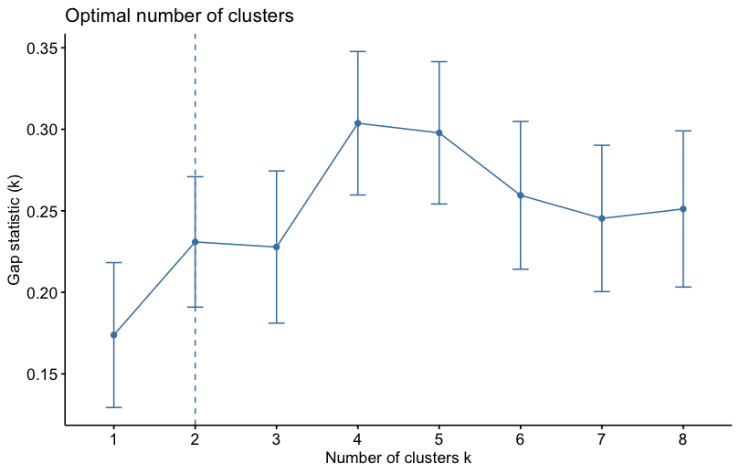

En este gráfico, los valores más altos pueden sugerir un número razonable de clusters. Las barras de error ayudan a evaluar la estabilidad de la estimación.

---

## 10. Comparar métodos para elegir `k`

Es común que el método del codo, Silhouette y Gap sugieran valores distintos de `k`.

Esto no significa que el análisis esté mal. Significa que la decisión sobre el número de clusters requiere criterio analítico.

Al decidir `k`, conviene considerar:

* la pregunta biológica;
* el tamaño del conjunto de datos;
* la estabilidad de los clusters;
* la interpretación de los grupos;
* si los clusters tienen sentido con la información disponible.

> En análisis de estructura genética ocurre algo parecido: herramientas como ADMIXTURE o fastStructure requieren explorar distintos valores de `k` y evaluar cuál es más razonable para los datos y la pregunta.

---

## 11. PAM clustering

PAM significa **Partitioning Around Medoids**. Es parecido a k-means, pero en lugar de usar centroides promedio, usa **medoides**.

Un medoide es una observación real del conjunto de datos que funciona como representante del cluster.

```r
pam_std <- pam(Std_USArrests, k = 3)

pam_std$medoids

fviz_cluster(pam_std)
```

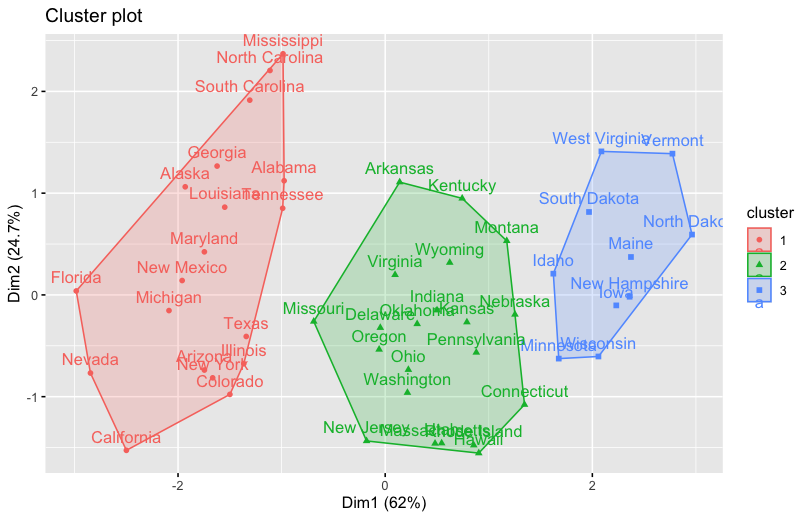

PAM puede ser más robusto que k-means ante valores extremos, porque sus centros son observaciones reales. Sin embargo, puede ser más costoso computacionalmente en bases grandes.

### Ejercicio

Prueba con `k = 2` y `k = 4`.

```r
pam_k2 <- pam(Std_USArrests, k = 2)
fviz_cluster(pam_k2)

pam_k4 <- pam(Std_USArrests, k = 4)
fviz_cluster(pam_k4)
```

¿Qué cambia?

---

## 12. Agrupamiento jerárquico

El agrupamiento jerárquico construye una representación en forma de árbol llamada **dendrograma**.

A diferencia de k-means o PAM, no necesitamos decidir `k` antes de construir el dendrograma. Podemos construir el árbol y después decidir dónde cortarlo.

Existen dos enfoques generales:

1. **Aglomerativo:** inicia con cada observación como un grupo y va uniendo grupos.
2. **Divisivo:** inicia con todas las observaciones en un grupo y va separando grupos.

Primero calculamos una matriz de distancias:

```r
d <- get_dist(scale(USArrests))
```

### AGNES

```r
ag <- agnes(d)
fviz_dend(ag, cex = 0.4, k = 4)
```

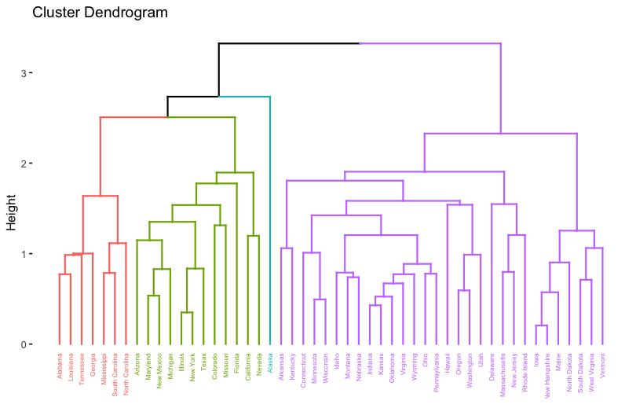

### DIANA

```r
di <- diana(d)
fviz_dend(di, cex = 0.4, k = 4)
```

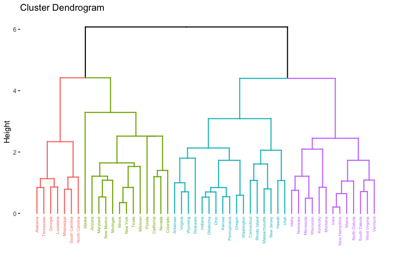

En un dendrograma, el eje vertical representa una medida de distancia o disimilitud entre grupos. Cortar el dendrograma en diferentes alturas genera distintos números de clusters.

### Ejercicio

Cambia el argumento `k` a 2 y 5.

```r
fviz_dend(ag, cex = 0.4, k = 2)
fviz_dend(ag, cex = 0.4, k = 5)
```

Preguntas:

* ¿Cómo cambia el número de grupos?
* ¿Qué ventaja tiene ver la estructura como árbol?
* ¿Qué limitaciones tendría interpretar un dendrograma con muchas observaciones?

---

## 13. Variables categóricas y distancia de Gower

Los ejemplos anteriores utilizan variables numéricas. Pero en biología es común tener bases mixtas, con variables numéricas y categóricas.

Por ejemplo:

* sitio: norte, centro, sur;
* tratamiento: control, estrés;
* tejido: hoja, raíz;
* variables numéricas: expresión, altura, pH, temperatura.

La **distancia de Gower** permite calcular distancias cuando tenemos variables numéricas y categóricas en la misma tabla.

El siguiente ejemplo usa una base externa. Requiere conexión a internet.

```r
# Ejemplo tomado de:
# https://remiller1450.github.io/s230f19/clustering.html

homes <- read.csv("https://remiller1450.github.io/data/IowaCityHomeSales.csv")

homes2 <- select(
  homes,
  style, built, bedrooms, bsmt, ac, area.living, area.lot
)

D <- daisy(homes2, metric = "gower")

fviz_dist(D, show_labels = FALSE)
```

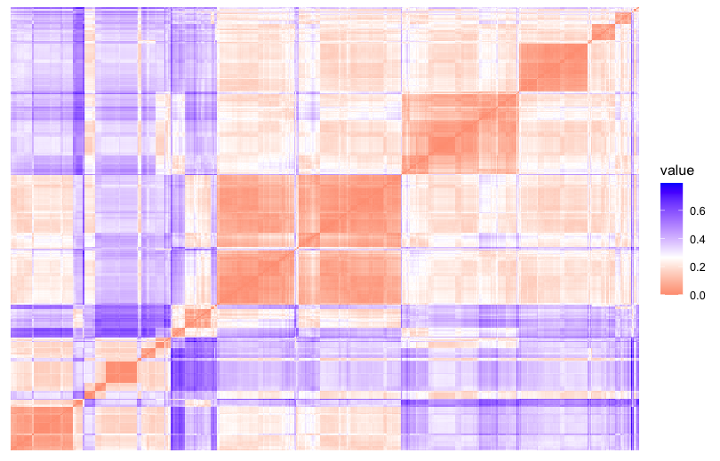

Después podemos usar esa matriz de distancias con PAM:

```r
pam_homes <- pam(D, k = 3)

homes2[pam_homes$medoids, ]
```

Para evaluar distintos valores de `k`, podemos calcular manualmente la anchura media de silueta:

```r
avg_sil <- numeric(9)

for(k in 2:10){
  pam_homes <- pam(D, k = k)
  avg_sil[k - 1] <- pam_homes$silinfo$avg.width
}

plot(
  x = 2:10,
  y = avg_sil,
  type = "b",
  xlab = "k",
  ylab = "Avg Silhouette"
)
```

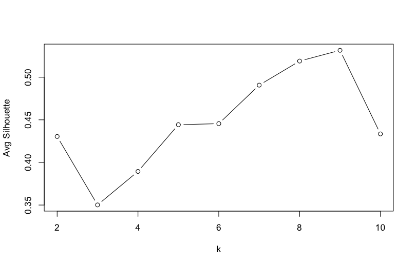

También podemos revisar una versión manual del método del codo:

```r
elbow <- numeric(9)

for(k in 2:10){
  pam_homes <- pam(D, k = k)
  elbow[k - 1] <- pam_homes$objective[1]
}

plot(
  x = 2:10,
  y = elbow,
  type = "b",
  xlab = "k",
  ylab = "Objective"
)
```

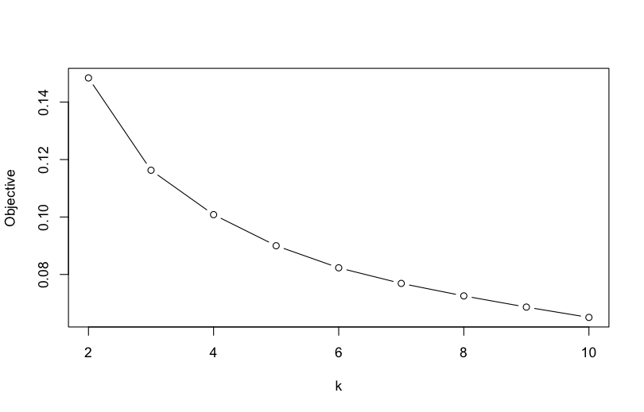

---

## 14. Ejercicio integrador de clustering

Regresa a la base `iris` y realiza lo siguiente:

1. Selecciona las variables numéricas.
2. Estandariza los datos.
3. Usa el método del codo para explorar valores de `k`.
4. Usa el método Silhouette.
5. Ejecuta k-means con el valor de `k` que consideres razonable.
6. Visualiza los clusters.
7. Compara los clusters con la columna `Species`.

Código guía:

```r
data(iris)

datos_iris <- iris[, 1:4]
datos_iris_std <- scale(datos_iris)

fviz_nbclust(datos_iris_std, kmeans, method = "wss", k.max = 8)
fviz_nbclust(datos_iris_std, kmeans, method = "silhouette", k.max = 8)

set.seed(123)
irisK <- kmeans(datos_iris_std, centers = 3, nstart = 20)

fviz_cluster(irisK, data = datos_iris_std)
fviz_cluster(irisK, data = datos_iris_std, repel = TRUE)
```

Preguntas de cierre:

* ¿El clustering recupera las especies de `iris`?
* ¿Qué especies se separan mejor?
* ¿Qué especie se traslapa más con otra?
* ¿Qué nos enseña este ejemplo sobre la interpretación de clusters?

---

# Parte B. PCA avanzado con `FactoMineR` y `factoextra`

## 15. ¿Por qué revisar PCA avanzado?

En el tema principal de la Unidad 6 usamos `prcomp()` y `ggplot2` para mantener un flujo claro y transparente. Sin embargo, existen paquetes especializados que facilitan la extracción y visualización de información adicional del PCA.

Dos paquetes muy usados son:

* `FactoMineR`, para ejecutar PCA y otros análisis multivariados;
* `factoextra`, para visualizar resultados de PCA, clustering y métodos relacionados.

Este material extra puede ser útil cuando queremos explorar:

* eigenvalores;
* contribuciones de variables;
* calidad de representación (`cos2`);
* círculo de correlación;
* gráficos de individuos;
* biplots avanzados;
* tipos de elipses.

---

## 16. PCA con `FactoMineR`

Usaremos la base `decathlon2`, incluida en `factoextra`. Esta base describe el rendimiento de atletas en distintas pruebas.

```r
library(FactoMineR)
library(factoextra)
library(ggplot2)

# Cargar datos
data(decathlon2)

# Explorar la base
head(decathlon2)
dim(decathlon2)
```

Seleccionamos las primeras 23 filas y las primeras 10 columnas como variables activas:

```r
decathlon2.active <- decathlon2[1:23, 1:10]

head(decathlon2.active[, 1:6], 4)
```

Ejecutamos el PCA:

```r
res.pca <- PCA(decathlon2.active, graph = FALSE)
```

Si cambiamos `graph = FALSE` por `graph = TRUE`, `FactoMineR` genera gráficos automáticamente.

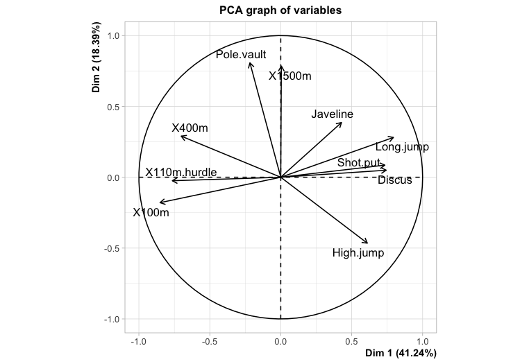

---

## 17. Eigenvalores y scree plot con `factoextra`

Los eigenvalores indican cuánta variación explica cada componente principal.

```r
eig.val <- get_eigenvalue(res.pca)

eig.val
```

Podemos visualizar la varianza explicada con:

```r
fviz_eig(res.pca, addlabels = TRUE, ylim = c(0, 50))
```


Este gráfico ayuda a decidir cuántos componentes principales conviene revisar con más detalle.

---

## 18. Información de las variables: coordenadas, cos2 y contribuciones

Podemos extraer resultados para las variables usando `get_pca_var()`.

```r
var <- get_pca_var(res.pca)

var
```

Este objeto contiene:

* `var$coord`: coordenadas de las variables;
* `var$cos2`: calidad de representación de las variables;
* `var$contrib`: contribución de cada variable a los componentes principales.

```r
head(var$coord)
head(var$cos2)
head(var$contrib)
```

---

## 19. Círculo de correlación

El círculo de correlación muestra cómo se relacionan las variables originales con los componentes principales.

```r
fviz_pca_var(res.pca, col.var = "pink")
```

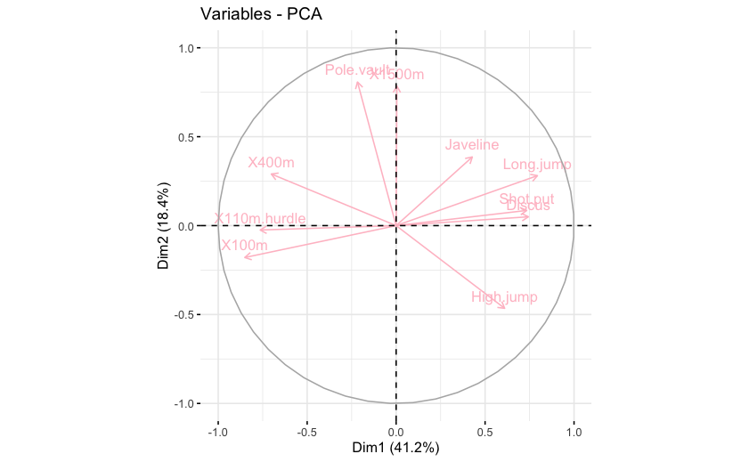

En este gráfico:

* cada flecha representa una variable;
* la dirección indica hacia dónde aumenta esa variable;
* la longitud indica qué tan bien se representa en el plano mostrado;
* flechas cercanas sugieren variables positivamente correlacionadas;
* flechas en direcciones opuestas sugieren variables negativamente correlacionadas.

### Colorear variables por `cos2`

El valor `cos2` indica la calidad de representación de una variable en el plano factorial.

```r
fviz_pca_var(
  res.pca,
  col.var = "cos2",
  gradient.cols = c("#00AFBB", "#E7B800", "#FC4E07"),
  repel = TRUE
) +
  ggtitle("Variables en el primer plano factorial")
```

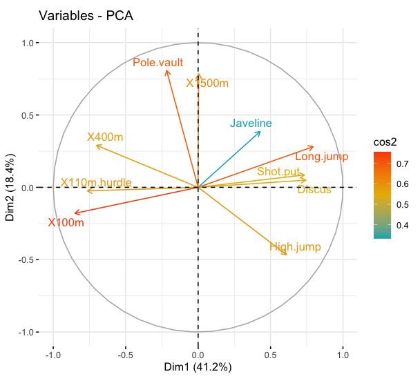

Valores altos de `cos2` indican que la variable está bien representada en el plano de componentes principales mostrado.

---

## 20. Contribución de variables

Las contribuciones ayudan a identificar qué variables influyen más en la construcción de los componentes principales.

```r
fviz_pca_var(
  res.pca,
  col.var = "contrib",
  gradient.cols = c("#00AFBB", "#E7B800", "#FC4E07")
)
```

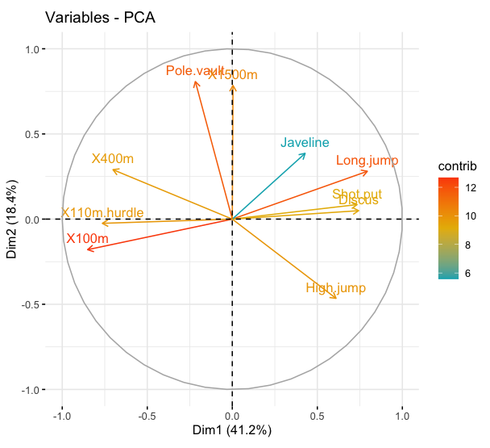

Este gráfico puede ayudar a responder:

* ¿Qué variables contribuyen más a PC1?
* ¿Qué variables contribuyen más a PC2?
* ¿Las variables que separan a los individuos tienen sentido biológico?
* ¿Hay variables que dominan el análisis?

---

## 21. Gráfico de individuos

Podemos extraer resultados para individuos con `get_pca_ind()`.

```r
ind <- get_pca_ind(res.pca)

ind
```

Un gráfico básico de individuos se obtiene con:

```r
fviz_pca_ind(res.pca)
```

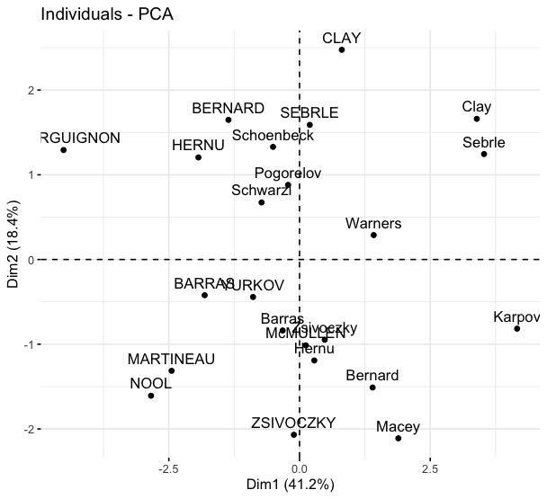

Cada punto representa una observación. La cercanía entre puntos sugiere perfiles similares de variables.

También podemos representar calidad de ajuste y contribución:

```r
fviz_pca_ind(
  res.pca,
  col.ind = "cos2",
  pointsize = "contrib",
  gradient.cols = c("#00AFBB", "#E7B800", "#FC4E07"),
  repel = TRUE
)
```

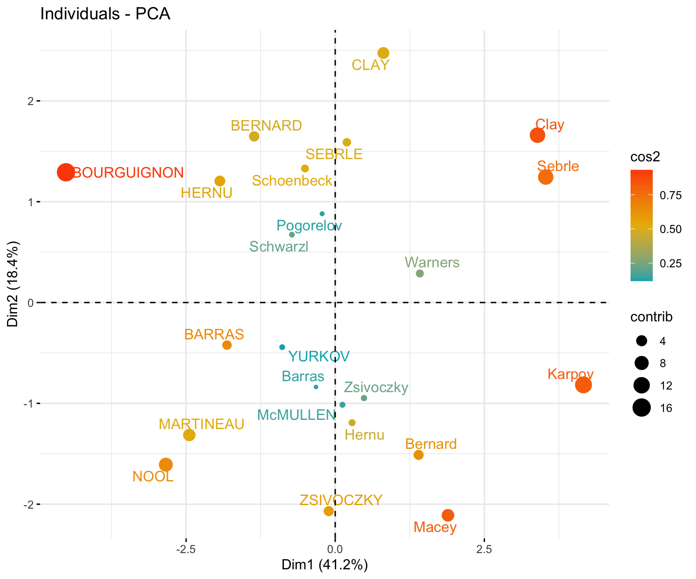

Este gráfico permite identificar observaciones que están bien representadas en el plano y que contribuyen más a la estructura del PCA.

---

## 22. PCA avanzado con los datos de la Unidad 6

También podemos usar `FactoMineR` con los datos de práctica de esta unidad.

```r
# Cargar datos desde Excel
datos_u6 <- read_excel("../../data/U6_datos_pca.xlsx")

head(datos_u6)
dim(datos_u6)
```

Seleccionamos solo las variables numéricas que entrarán al PCA:

```r
variables_u6 <- datos_u6 %>%
  select(TAR, ARF, CO, GA)
```

Ejecutamos el PCA:

```r
expresion.pca <- PCA(variables_u6, graph = FALSE)
```

Podemos revisar la varianza explicada:

```r
get_eigenvalue(expresion.pca)
```

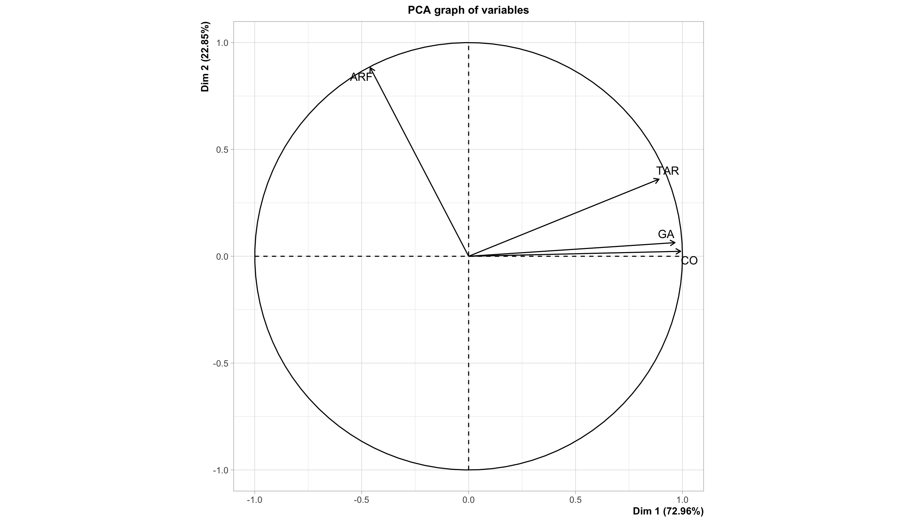

---

## 23. Individuos coloreados por etapa y elipses

Con `factoextra` podemos colorear individuos según un metadato externo. En este caso usamos `etapa`.

```r
fviz_pca_ind(
  expresion.pca,
  geom.ind = "point",
  col.ind = datos_u6$etapa,
  palette = c("#FF6666", "#3399FF", "#99FF99"),
  addEllipses = TRUE,
  legend.title = "Etapa"
)
```

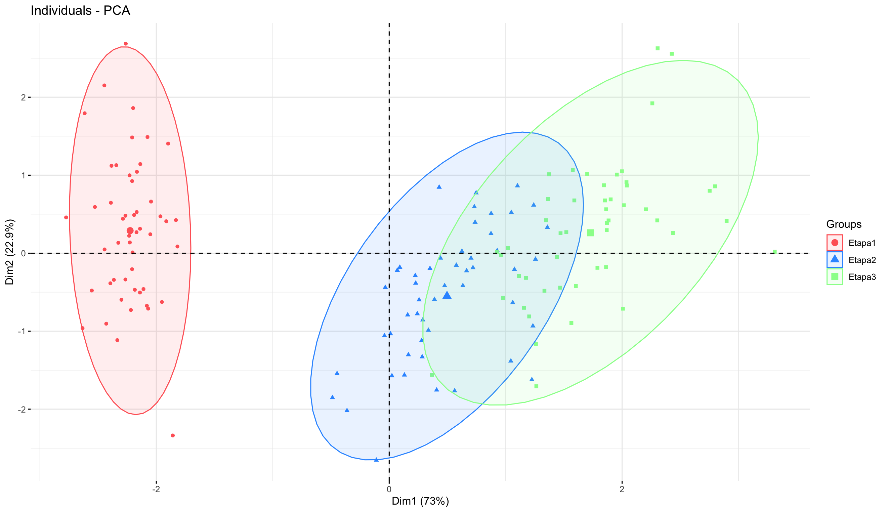

Las elipses ayudan a resumir la distribución de los grupos, pero no deben interpretarse como prueba estadística de diferencia entre etapas.

---

## 24. Tipos de elipses

`factoextra` permite cambiar el tipo de elipse con el argumento `ellipse.type`.

### Elipse de confianza

```r
fviz_pca_ind(
  expresion.pca,
  geom.ind = "point",
  col.ind = datos_u6$etapa,
  palette = c("#6666FF", "#CC0099", "#00CCCC"),
  addEllipses = TRUE,
  ellipse.type = "confidence",
  legend.title = "Etapa"
)
```

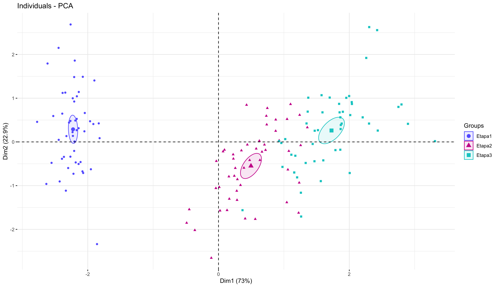

La elipse de confianza resume una región esperada para el grupo bajo ciertos supuestos estadísticos.

### Elipse tipo `t`

```r
fviz_pca_ind(
  expresion.pca,
  geom.ind = "point",
  col.ind = datos_u6$etapa,
  palette = c("#6666FF", "#CC0099", "#00CCCC"),
  addEllipses = TRUE,
  ellipse.type = "t",
  legend.title = "Etapa"
)
```

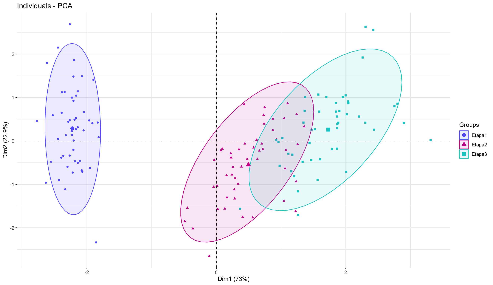

Las elipses tipo `t` pueden ser más amplias, especialmente cuando hay mayor incertidumbre.

### Etiquetas y elipses

```r
fviz_pca_ind(
  expresion.pca,
  label = "all",
  col.ind = datos_u6$etapa,
  addEllipses = TRUE,
  palette = "jco"
)
```

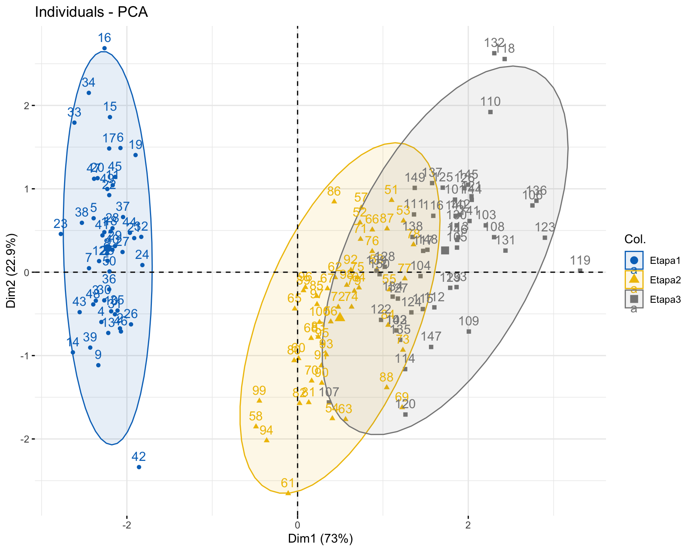

En bases con muchas muestras, mostrar todas las etiquetas puede saturar la figura. Por eso suele ser mejor mostrar solo puntos o usar etiquetas en subconjuntos.

### Elipse convexa

```r
fviz_pca_ind(
  expresion.pca,
  geom.ind = "point",
  col.ind = datos_u6$etapa,
  palette = c("#00AFBB", "#E7B800", "#FC4E07"),
  addEllipses = TRUE,
  ellipse.type = "convex",
  legend.title = "Etapa"
)
```

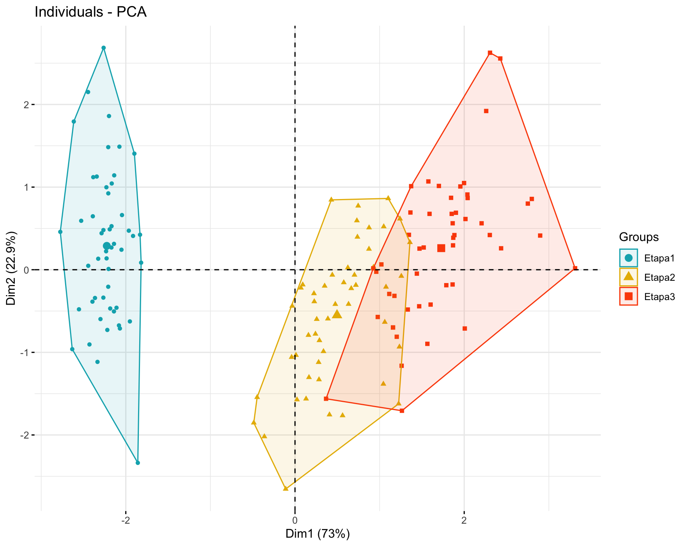

La elipse convexa encierra los puntos externos de cada grupo. Puede ayudar a visualizar la extensión del grupo, pero también puede verse muy influida por valores extremos.

### Preguntas

* ¿Qué tipo de elipse muestra más traslape?
* ¿Qué tipo de elipse parece más ajustada a los puntos?
* ¿Por qué no debemos usar una elipse como prueba estadística?
* ¿Cómo cambiaría la figura si hubiera pocas muestras por grupo?

---

## 25. Biplots avanzados

Un biplot muestra individuos y variables en la misma figura.

Primero podemos revisar el gráfico de variables:

```r
fviz_pca_var(expresion.pca, axes.linetype = "blank")
```

Después generamos un biplot básico:

```r
fviz_pca_biplot(
  expresion.pca,
  repel = TRUE,
  col.var = "#FF0000",
  col.ind = "#696969"
)
```

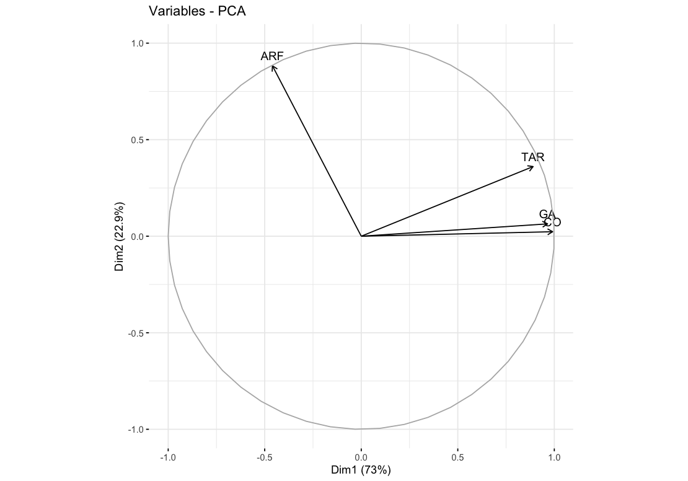

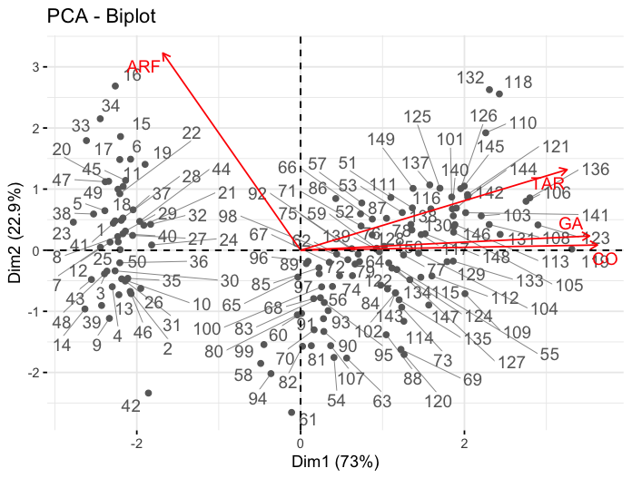

Podemos colorear los individuos por etapa y mostrar solo las etiquetas de las variables:

```r
fviz_pca_biplot(
  expresion.pca,
  col.ind = datos_u6$etapa,
  palette = "jco",
  addEllipses = TRUE,
  label = "var",
  col.var = "black",
  repel = TRUE,
  legend.title = "Etapa"
)
```

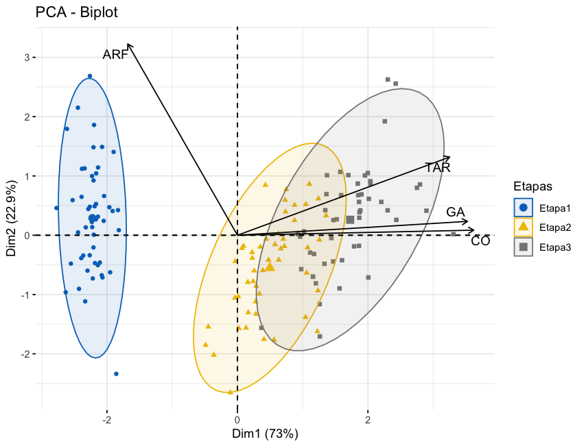

También podemos personalizar puntos, rellenos y colores de variables:

```r
fviz_pca_biplot(
  expresion.pca,
  geom.ind = "point",
  pointshape = 21,
  pointsize = 2.5,
  fill.ind = datos_u6$etapa,
  col.ind = "black",
  col.var = factor(c("TAR", "ARF", "CO", "GA")),
  legend.title = list(fill = "Etapa", color = "Genes"),
  repel = TRUE
) +
  ggpubr::fill_palette("jco") +
  ggpubr::color_palette("npg")
```

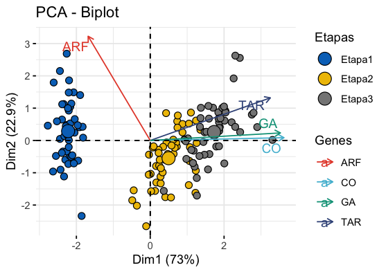

### Advertencia para transcriptómica

Los biplots son útiles cuando tenemos pocas variables. En transcriptómica real, donde puede haber miles de genes, mostrar todas las variables como flechas no suele ser práctico. En esos casos conviene seleccionar genes de interés, variables resumidas o usar otras visualizaciones complementarias.

---

## 26. Otros métodos relacionados con PCA

El PCA forma parte de una familia amplia de métodos multivariados. No los revisaremos en detalle en esta unidad, pero conviene reconocer cuándo podrían aparecer.

### Análisis factorial

El análisis factorial busca explicar las relaciones entre variables observadas mediante factores latentes. Está relacionado con PCA, pero tiene un enfoque distinto: PCA resume variación, mientras que el análisis factorial busca modelar estructuras subyacentes.

### DAPC

El **Discriminant Analysis of Principal Components** o DAPC combina reducción de dimensionalidad con análisis discriminante. Es común en genética de poblaciones porque permite explorar separación entre grupos o poblaciones.

Más información:

* [Tutorial de DAPC con `adegenet`](https://adegenet.r-forge.r-project.org/files/tutorial-dapc.pdf)

### MCA

El **Multiple Correspondence Analysis** o MCA es similar al PCA, pero se usa para variables categóricas. Puede ser útil cuando tenemos varias variables nominales.

Más información:

* [Tutorial de MCA en R](https://rpubs.com/gaston/MCA)

### CA

El **Correspondence Analysis** o CA permite explorar asociaciones entre categorías en tablas de contingencia.

### rPCs

Los **regional Principal Components** o rPCs son una extensión inspirada en PCA para datos con estructura espacial. Incorporan información de vecindad o proximidad geográfica.

---

## 27. Cierre del material extra

Este material amplía la Unidad 6 con dos ideas centrales:

1. El clustering permite explorar grupos potenciales, pero sus resultados dependen de decisiones como la escala, la distancia, el método y el número de clusters.
2. Los paquetes `FactoMineR` y `factoextra` permiten profundizar en el PCA mediante contribuciones, `cos2`, círculos de correlación, elipses y biplots.

En ambos casos, la interpretación debe ser cuidadosa. Estas herramientas ayudan a explorar patrones, no sustituyen la pregunta biológica, el diseño experimental ni análisis estadísticos posteriores.

---

## Fuentes de información

* [Introduction to Clustering](https://remiller1450.github.io/s230f19/clustering.html)
* [K-means Clustering: Choosing Optimal K, Process, and Evaluation Methods](https://medium.com/@nirmalsankalana/k-means-clustering-choosing-optimal-k-process-and-evaluation-methods-2c69377a7ee4)
* [Gower, J.C. (1971). A General Coefficient of Similarity and Some of its Properties. Biometrics, 27(4), 857–871.](https://www.jstor.org/stable/2528823)
* [Hastie, T., Tibshirani, R., & Friedman, J. (2009). The Elements of Statistical Learning. Springer.](https://link.springer.com/book/10.1007/978-0-387-21606-5)
* [FactoMineR: Exploratory Data Analysis and Data Mining](https://cran.r-project.org/package=FactoMineR)
* [factoextra: Extract and Visualize the Results of Multivariate Data Analyses](https://cran.r-project.org/package=factoextra)
* [Principal Component Analysis in R: prcomp vs princomp](http://www.sthda.com/english/articles/31-principal-component-methods-in-r-practical-guide/118-principal-component-analysis-in-r-prcomp-vs-princomp/)

---

### Regresar al tema principal: [6.1 Análisis de Componentes Principales](../Unidad_06/U6_1_Analisis_Componentes_Principales.md)

### Siguiente tema: [6.2 Reportes reproducibles con Quarto](../Unidad_06/U6_2_Reportes_reproducibles_con_Quarto.md)
