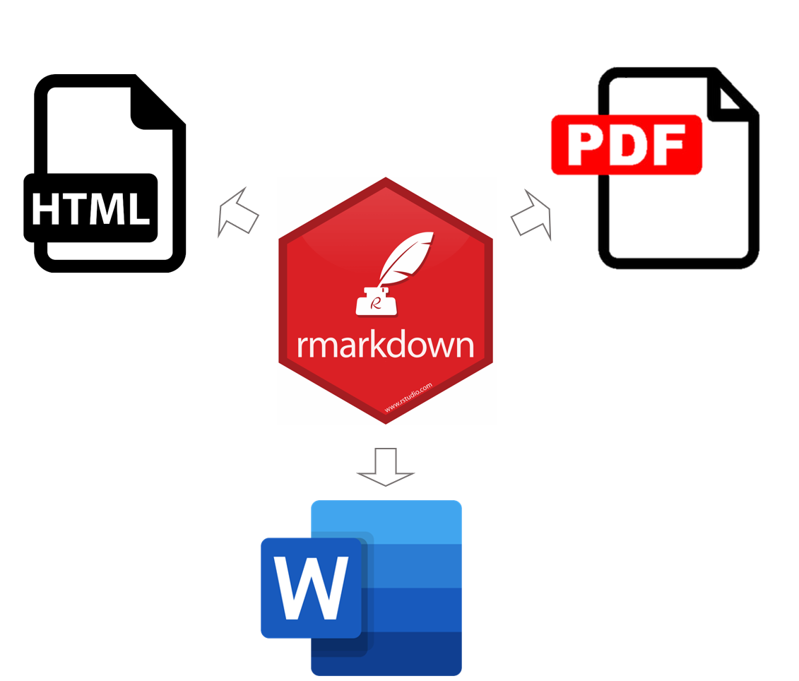

# Fundamentos de programación en R

## Unidad 6

---

## 6.3 Generación de reportes con Rmarkdown

---

### ¿Qué es Rmarkdown?

Rmarkdown es una herramienta que permite combinar texto, código y resultados en un solo documento. Se utiliza para crear informes dinámicos y reproducibles que integran análisis de datos con explicaciones detalladas.



### ¿Por qué usar Rmarkdown?

Con Rmarkdown, podemos escribir texto explicativo utilizando formato [Markdown](https://markdown.es/), incrustar código R para realizar análisis de datos y generar gráficos, y luego incorporar los resultados directamente en el mismo documento. Esto nos permite crear informes que son completamente reproducibles, lo que significa que otras personas pueden volver a ejecutar el código y obtener los mismos resultados.

Además, Rmarkdown nos permite generar informes en diferentes formatos de salida, como HTML, PDF, Word, presentaciones de diapositivas, entre otros. Esto nos da flexibilidad para compartir nuestros resultados en el formato más adecuado para nuestro público objetivo.

### ¿Que hacemos primero?

Hay que crear un nuevo archivo con el formato de Rmarkdown. 


> Necesitamos instalar y cargar los paquetes `rmarkdown`y `knitr`, pero por lo general no hace falta hacerlo explíticamente porque RStudio realiza esto automáticamente cuando es necesario, en especial cuando son las más recientes.

### Markdown básico

El archivo creado tendrá una extensión `.Rmd`

Contiene en su estructura tres tipos importantes de contenido:

1. Un encabezado rodeado de - - - como se observa en la anterior imagen en el círculo 3. 

2. Bloques de código de R rodeado de ``` 

3. Texto, al que se le puede dar distintos formatos

Cuando abrimos un archivo `.Rmd`, obtenemos una interfaz de _notebook_ (cuaderno) donde el código y los resultados se encuentran intercalados. Por ejemplo, en lugar de que los gráficos generados sólo aparezcan en el panel de Plots los podemos tener en un mismo documento junto con el código que lo generó y otras anotaciones como posibles discusiones o consideraciones.

Para producir un reporte completo que contenga todo el texto, código y resultados, podemos dar click en `Knit` o presionar Ctrl + Shift + K. Esto mostrará el reporte en el panel Viewer y creará un archivo HTML independiente que podremos compartir con otros.

> Si el reporte no aparece en el panel de Viewer, pudes configurarlo haciendo click en el símbolo de una turca que esta del lado izquiero de `Knit`.

Los bloques de código se pueden ejecutar haciendo click en el ícono ejecutar (el botón de Play en la parte superior/derecha del bloque), o presionando Ctrl + Shift + Enter. 

RStudio ejecuta el código y muestra los resultados incustrados en el código.

> Con las actualizaciones de Posit, ahora podemos incorporar bloques de código también de otros lenguajes de programación (por ejemplo, Python, SQL, Bash, etc) en un mismo reporte.

### Tipos de documentos de salida

Para este ejemplo, nos vamos a concentrar en R Markdown para producir documentos HTML:

 ```R
- - - -
output: html_document
- - - -
```

Sin embargo, existen una gran variedad de outputs para generar diferentes tipos de documentos:

- pdf_document: crea un PDF con LaTeX (un sistema de código abierto de composición de textos), que necesitarás instalar. RStudio te notificará si no lo tienes.

- word_document: para documentos de Microsoft Word (.docx).

- odt_document para documentos de texto OpenDocument (.odt).

Entre otros.

### Las Notebooks o cuadernos

Un _notebook_, html_notebook (“cuaderno” en español), es una variación de un html_document. Las salidas de los dos documentos son muy similares, pero tienen propósitos distintos. 

Un html_document está enfocado en la comunicación con los encargados de la toma de decisiones, mientras que un _notebook_ está enfocado en colaborar con otros científicos de datos. Estos propósitos diferentes llevan a usar la salida HTML de diferentes maneras. Ambas salidas HTML contendrán la salida renderizada, pero el notebook también contendrá el código fuente completo. Esto significa que podemos usar el archivo .nb.html generado por el notebook de dos maneras:

1. Podemos verlo en un navegador web, y ver la salida generada. A diferencia del html_document, esta renderización siempre incluye una copia incrustada del código fuente que lo generó.

2. Podemos editarlo en RStudio. Cuando abramos un archivo .nb.html, RStudio automáticamente recreará el archivo `.Rmd` que lo creó.

#### Otras especificaciones del encabezado

Para sobrescribir los parámetros predeterminados se necesita usar un campo de output extendido. Por ejemplo, si queremos generar un html_document con una tabla de contenido flotante, usamos:

```R
---
title: "Clase"
output:
  html_document:
    toc: true
    toc_float: true
---
```

Para los html_document otra opción es hacer que los fragmentos de código estén escondidos por defecto, pero visibles con un click:

```R
---
title: "Clase"
output:
  html_document:
    code_folding: hide
---
```

### Bloques de código

Como ya mencionamos, para ejecutar código dentro de un documento R Markdown, necesitamos insertar un bloque (_Chunk_). Hay tres maneras para hacerlo:

1. El atajo de teclado Ctrl + Alt + I
2. El icono “Insertar” en la barra de edición (Insert > R)
3. Tipear manualmente los delimitadores de bloque `` ` {r} y ```.

El código se puede seguir corriendo con `Ctrl` + `Enter` línea a línea. Sin embargo, los bloques de código tienen otro atajo de teclado: `Ctrl` + `Shift` + `Enter`, que ejecuta todo el código en el bloque.

> La salida de los bloques puede personalizarse con _options_, argumentos suministrados en el encabezado del bloque. `Knitr` provee casi 60 opciones para que puedas usar para personalizar tus bloques de código, la lista completa puede verse en http://yihui.name/knitr/options/.

### Formateo de texto

El texto en los archivos .Rmd está escrita en Markdown, un lenguaje de marcado ligero que permite dar formato a archivos de texto plano. 

Markdown está diseñado para ser fácil de leer y fácil de escribir, siendo también muy fácil de aprender. Del Cheatsheet:


### Ejercicio:

Genera un reporte Rmarkdown copiando algunas líneas de código que hemos visto en esta sesión y de preferencia aquellas que generan algún gráfico, agrega tus notas y guarda tu reporte en formato html.

> Puedes cambiar de `Source`a `Visual` para ver como se vería tu reporte final y si quieres cambiar otras cosas.


### Fuentes de información recomendadas:

- [Quarto or R Markdown?](https://www.jumpingrivers.com/blog/quarto-rmarkdown-comparison/)
- [Notebook format](https://bookdown.org/yihui/rmarkdown/notebook.html)